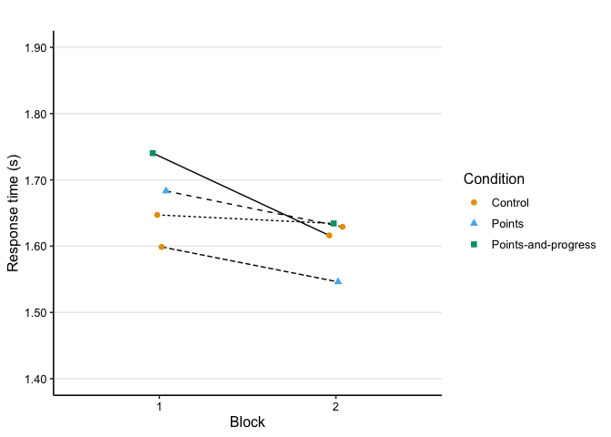
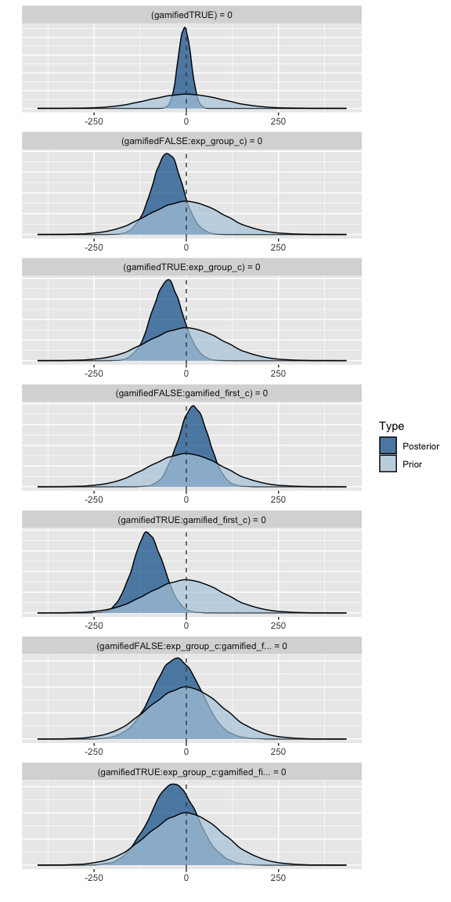

Analysis: learning session
================
Maarten van der Velde & Gesa van den Broek
Last updated: 2024-07-11

- [Setup](#setup)
- [Does gamification change performance during
  practice?](#does-gamification-change-performance-during-practice)
  - [Accuracy](#accuracy)
    - [Prepare data](#prepare-data)
    - [Visualise data](#visualise-data)
    - [Fit model](#fit-model)
    - [Fitted values](#fitted-values)
    - [Visualise fitted model](#visualise-fitted-model)
  - [Response time](#response-time)
    - [Prepare data](#prepare-data-1)
    - [Visualise data](#visualise-data-1)
    - [Fit model](#fit-model-1)
    - [Fitted values](#fitted-values-1)
    - [Visualise fitted model](#visualise-fitted-model-1)
  - [Total score](#total-score)
    - [Prepare data](#prepare-data-2)
    - [Visualise data](#visualise-data-2)
    - [Fit model](#fit-model-2)
    - [Fitted values](#fitted-values-2)
    - [Visualise fitted model](#visualise-fitted-model-2)
  - [Number of words practiced](#number-of-words-practiced)
    - [Prepare data](#prepare-data-3)
    - [Visualise data](#visualise-data-3)
    - [Fit model](#fit-model-3)
    - [Fitted values](#fitted-values-3)
    - [Visualise fitted model](#visualise-fitted-model-3)
  - [Completed trials](#completed-trials)
    - [Prepare data](#prepare-data-4)
    - [Visualise data](#visualise-data-4)
    - [Fit model](#fit-model-4)
    - [Fitted values](#fitted-values-4)
    - [Visualise fitted model](#visualise-fitted-model-4)
  - [Conclusions](#conclusions)
  - [Combined plot](#combined-plot)
- [Session info](#session-info)

# Setup

``` r
library(here)
library(dplyr)
library(ggplot2)
library(scales)
library(patchwork)
library(stringr)
library(tidyr)
library(lme4)
library(lmerTest)
```

Helper functions for plots and tables:

``` r
source(here("scripts", "00_visualisation_functions.R"))
```

Load processed data:

``` r
d_learn <- readRDS(here("data", "processed", "d_learn.rds"))
```

``` r
add_experiment_cols <- function (data) {
  data |>
    mutate(exp_order = case_when(
      gamified_first == 0 & exp_group == "score" ~ "Control—Score",
      gamified_first == 0 & exp_group == "both" ~ "Control—Both",
      gamified_first == 1 & exp_group == "score" ~ "Score—Control",
      gamified_first == 1 & exp_group == "both" ~ "Both—Control"
    )) |>
    mutate(type = ifelse(gamified, "Gamified", "Control"))
}
```

# Does gamification change performance during practice?

## Accuracy

### Prepare data

``` r
d_learn_acc <- d_learn |>
  filter(!study_trial) |>
  group_by(subject, exp_group, block, condition, gamified, gamified_first) |>
  summarise(accuracy = mean(correct))
```

    ## `summarise()` has grouped output by 'subject', 'exp_group', 'block',
    ## 'condition', 'gamified'. You can override using the `.groups` argument.

``` r
d_learn_acc_agg <- d_learn_acc |>
  group_by(block, condition, gamified, gamified_first, exp_group) |>
  summarise(acc = mean(accuracy, na.rm = T),
            acc_se = sd(accuracy, na.rm = T)/sqrt(n())) |>
  ungroup() |>
  add_experiment_cols()
```

    ## `summarise()` has grouped output by 'block', 'condition', 'gamified',
    ## 'gamified_first'. You can override using the `.groups` argument.

### Visualise data

``` r
p_learn_acc <- plot_data(d_learn_acc_agg, acc, acc_se, "Accuracy") +
  scale_y_continuous(limits = c(.725, .875), labels = scales::percent_format())

p_learn_acc
```

<!-- -->

### Fit model

Prepare data for modelling by mean-centering categorical predictors:

``` r
d_learn_m <- d_learn |>
  filter(!study_trial) |>
  mutate(exp_group_c = ifelse(exp_group == "score", 0, 1),
         exp_group_c = exp_group_c - mean(exp_group_c),
         gamified_first_c = gamified_first - mean(gamified_first))
```

``` r
m_learn_acc <- glmer(correct ~ gamified +
                       gamified:exp_group_c +
                       gamified:gamified_first_c +
                       gamified:gamified_first_c:exp_group_c +
                       (1 | subject) + (1 | fact),
                     family = "binomial",
                     data = d_learn_m)

summary(m_learn_acc)
```

    ## Generalized linear mixed model fit by maximum likelihood (Laplace
    ##   Approximation) [glmerMod]
    ##  Family: binomial  ( logit )
    ## Formula: 
    ## correct ~ gamified + gamified:exp_group_c + gamified:gamified_first_c +  
    ##     gamified:gamified_first_c:exp_group_c + (1 | subject) + (1 |      fact)
    ##    Data: d_learn_m
    ## 
    ##      AIC      BIC   logLik deviance df.resid 
    ##  38686.5  38772.8 -19333.3  38666.5    41479 
    ## 
    ## Scaled residuals: 
    ##     Min      1Q  Median      3Q     Max 
    ## -5.4230  0.2697  0.4166  0.5308  0.8948 
    ## 
    ## Random effects:
    ##  Groups  Name        Variance Std.Dev.
    ##  subject (Intercept) 0.2932   0.5415  
    ##  fact    (Intercept) 0.1178   0.3432  
    ## Number of obs: 41489, groups:  subject, 166; fact, 78
    ## 
    ## Fixed effects:
    ##                                             Estimate Std. Error z value
    ## (Intercept)                                 1.621184   0.060640  26.735
    ## gamifiedTRUE                               -0.007472   0.025932  -0.288
    ## gamifiedFALSE:exp_group_c                  -0.181824   0.092172  -1.973
    ## gamifiedTRUE:exp_group_c                   -0.160723   0.092242  -1.742
    ## gamifiedFALSE:gamified_first_c              0.069727   0.092386   0.755
    ## gamifiedTRUE:gamified_first_c              -0.079241   0.092419  -0.857
    ## gamifiedFALSE:exp_group_c:gamified_first_c -0.245058   0.185121  -1.324
    ## gamifiedTRUE:exp_group_c:gamified_first_c  -0.181772   0.185123  -0.982
    ##                                            Pr(>|z|)    
    ## (Intercept)                                  <2e-16 ***
    ## gamifiedTRUE                                 0.7732    
    ## gamifiedFALSE:exp_group_c                    0.0485 *  
    ## gamifiedTRUE:exp_group_c                     0.0814 .  
    ## gamifiedFALSE:gamified_first_c               0.4504    
    ## gamifiedTRUE:gamified_first_c                0.3912    
    ## gamifiedFALSE:exp_group_c:gamified_first_c   0.1856    
    ## gamifiedTRUE:exp_group_c:gamified_first_c    0.3261    
    ## ---
    ## Signif. codes:  0 '***' 0.001 '**' 0.01 '*' 0.05 '.' 0.1 ' ' 1
    ## 
    ## Correlation of Fixed Effects:
    ##               (Intr) gmTRUE gmfdFALSE:x__ gmfdTRUE:x__ gmfdFALSE:g__
    ## gamifidTRUE   -0.215                                                
    ## gmfdFALSE:x__ -0.014  0.017                                         
    ## gmfdTRUE:x__  -0.008 -0.012  0.841                                  
    ## gmfdFALSE:g__ -0.011  0.000 -0.010        -0.004                    
    ## gmfdTRUE:g__  -0.014  0.001 -0.004        -0.009        0.842       
    ## gFALSE:__:_   -0.008  0.011 -0.017        -0.016       -0.019       
    ## gTRUE:__:__   -0.003 -0.009 -0.016        -0.018       -0.010       
    ##               gmfdTRUE:g__ gFALSE:__:
    ## gamifidTRUE                          
    ## gmfdFALSE:x__                        
    ## gmfdTRUE:x__                         
    ## gmfdFALSE:g__                        
    ## gmfdTRUE:g__                         
    ## gFALSE:__:_   -0.010                 
    ## gTRUE:__:__   -0.016        0.842

``` r
print_model_table(m_learn_acc)
```


### Fitted values

``` r
d_model_fit <- crossing(
  gamified = FALSE, 
  exp_group_c = sort(unique(d_learn_m$exp_group_c)), 
  gamified_first_c = 0
)

d_model_fit$model_fit <- predict(m_learn_acc,
                                 newdata = d_model_fit,
                                 re.form = NA, 
                                 type = "response")

d_model_fit
```

    ## # A tibble: 2 × 4
    ##   gamified exp_group_c gamified_first_c model_fit
    ##   <lgl>          <dbl>            <dbl>     <dbl>
    ## 1 FALSE         -0.470                0     0.846
    ## 2 FALSE          0.530                0     0.821

### Visualise fitted model

``` r
p_learn_acc_m <- plot_model_fit(m_learn_acc, d_learn_m, y_lab = "Accuracy") +
  scale_y_continuous(limits = c(.75, .90), labels = scales::percent_format(accuracy = .1))
```

    ##   block    condition gamified gamified_first exp_group gamified_first_c
    ## 1     1      Control    FALSE          FALSE      both       -0.5320687
    ## 2     1      Control    FALSE          FALSE     score       -0.5320687
    ## 3     1       Points     TRUE           TRUE     score        0.4679313
    ## 4     1 Progress bar     TRUE           TRUE      both        0.4679313
    ## 5     2      Control    FALSE           TRUE      both        0.4679313
    ## 6     2      Control    FALSE           TRUE     score        0.4679313
    ## 7     2       Points     TRUE          FALSE     score       -0.5320687
    ## 8     2 Progress bar     TRUE          FALSE      both       -0.5320687
    ##   exp_group_c  pred_val     exp_order     type
    ## 1   0.5296826 0.8258994  Control—Both  Control
    ## 2  -0.4703174 0.8331719 Control—Score  Control
    ## 3  -0.4703174 0.8445168 Score—Control Gamified
    ## 4   0.5296826 0.8094510  Both—Control Gamified
    ## 5   0.5296826 0.8170913  Both—Control  Control
    ## 6  -0.4703174 0.8573262 Score—Control  Control
    ## 7  -0.4703174 0.8436944 Control—Score Gamified
    ## 8   0.5296826 0.8350666  Control—Both Gamified

    ## Scale for y is already present.
    ## Adding another scale for y, which will replace the existing scale.

``` r
p_learn_acc_m
```

<!-- -->

## Response time

Response time on correct answers only.

### Prepare data

To keep the visualisation of average response times by condition simple,
we calculate the median RT per participant, and then take the mean and
SD of these medians (which are themselves roughly normally distributed).

``` r
d_learn_rt <- d_learn |>
  filter(!study_trial) |>
  filter(correct) |>
  mutate(rt = rt / 1000) |>
  group_by(subject, exp_group, block, condition, gamified, gamified_first) |>
  summarise(rt_median = median(rt, na.rm = TRUE))
```

    ## `summarise()` has grouped output by 'subject', 'exp_group', 'block',
    ## 'condition', 'gamified'. You can override using the `.groups` argument.

``` r
d_learn_rt_agg <- d_learn_rt |>
  group_by(block, condition, gamified, gamified_first, exp_group) |>
  summarise(rt_mean = mean(rt_median, na.rm = T),
            rt_se = sd(rt_median, na.rm = T)/sqrt(n())) |>
  ungroup() |>
  add_experiment_cols()
```

    ## `summarise()` has grouped output by 'block', 'condition', 'gamified',
    ## 'gamified_first'. You can override using the `.groups` argument.

### Visualise data

``` r
p_learn_rt <- plot_data(d_learn_rt_agg, rt_mean, rt_se, "Response time (s)") +
  scale_y_continuous(limits = c(1.3, 1.8), labels = scales::comma_format())

p_learn_rt
```

<!-- -->

### Fit model

Since RT data is not normally distributed, we fit a lognormal model to
the response times. (See
<https://bbolker.github.io/mixedmodels-misc/glmmFAQ.html#gamma-glmms> .)
Prepare data for modelling by mean-centering categorical predictors:

``` r
d_learn_rt_m <- d_learn |>
  filter(!study_trial) |>
  filter(correct) |>
  mutate(log_rt = log(rt / 1000)) |>
  mutate(exp_group_c = ifelse(exp_group == "score", 0, 1),
         exp_group_c = exp_group_c - mean(exp_group_c),
         gamified_first_c = gamified_first - mean(gamified_first)
         )
```

``` r
m_learn_rt <- lmer(log_rt ~ gamified +
                      gamified:exp_group_c +
                      gamified:gamified_first_c +
                      gamified:gamified_first_c:exp_group_c +
                      (1 | subject) + (1 | fact),
                    data = d_learn_rt_m)

summary(m_learn_rt)
```

    ## Linear mixed model fit by REML. t-tests use Satterthwaite's method [
    ## lmerModLmerTest]
    ## Formula: 
    ## log_rt ~ gamified + gamified:exp_group_c + gamified:gamified_first_c +  
    ##     gamified:gamified_first_c:exp_group_c + (1 | subject) + (1 |      fact)
    ##    Data: d_learn_rt_m
    ## 
    ## REML criterion at convergence: 58081.7
    ## 
    ## Scaled residuals: 
    ##      Min       1Q   Median       3Q      Max 
    ## -15.6337  -0.5696  -0.1470   0.4864   4.8537 
    ## 
    ## Random effects:
    ##  Groups   Name        Variance Std.Dev.
    ##  subject  (Intercept) 0.03589  0.1895  
    ##  fact     (Intercept) 0.01190  0.1091  
    ##  Residual             0.32134  0.5669  
    ## Number of obs: 33657, groups:  subject, 166; fact, 78
    ## 
    ## Fixed effects:
    ##                                              Estimate Std. Error         df
    ## (Intercept)                                 4.837e-01  1.973e-02  2.287e+02
    ## gamifiedTRUE                                1.734e-02  6.240e-03  3.347e+04
    ## gamifiedFALSE:exp_group_c                   9.712e-03  3.077e-02  1.754e+02
    ## gamifiedTRUE:exp_group_c                    4.371e-02  3.078e-02  1.757e+02
    ## gamifiedFALSE:gamified_first_c              1.335e-03  3.084e-02  1.753e+02
    ## gamifiedTRUE:gamified_first_c               7.474e-02  3.085e-02  1.754e+02
    ## gamifiedFALSE:exp_group_c:gamified_first_c -3.774e-02  6.175e-02  1.755e+02
    ## gamifiedTRUE:exp_group_c:gamified_first_c  -2.206e-02  6.175e-02  1.754e+02
    ##                                            t value Pr(>|t|)    
    ## (Intercept)                                 24.522  < 2e-16 ***
    ## gamifiedTRUE                                 2.779  0.00546 ** 
    ## gamifiedFALSE:exp_group_c                    0.316  0.75264    
    ## gamifiedTRUE:exp_group_c                     1.420  0.15738    
    ## gamifiedFALSE:gamified_first_c               0.043  0.96553    
    ## gamifiedTRUE:gamified_first_c                2.423  0.01640 *  
    ## gamifiedFALSE:exp_group_c:gamified_first_c  -0.611  0.54185    
    ## gamifiedTRUE:exp_group_c:gamified_first_c   -0.357  0.72138    
    ## ---
    ## Signif. codes:  0 '***' 0.001 '**' 0.01 '*' 0.05 '.' 0.1 ' ' 1
    ## 
    ## Correlation of Fixed Effects:
    ##               (Intr) gmTRUE gmfdFALSE:x__ gmfdTRUE:x__ gmfdFALSE:g__
    ## gamifidTRUE   -0.158                                                
    ## gmfdFALSE:x__ -0.020  0.000                                         
    ## gmfdTRUE:x__  -0.020  0.000  0.917                                  
    ## gmfdFALSE:g__ -0.017  0.005 -0.003        -0.004                    
    ## gmfdTRUE:g__  -0.016  0.006 -0.004        -0.003        0.918       
    ## gFALSE:__:_   -0.002 -0.002 -0.022        -0.021       -0.025       
    ## gTRUE:__:__   -0.003  0.002 -0.021        -0.018       -0.025       
    ##               gmfdTRUE:g__ gFALSE:__:
    ## gamifidTRUE                          
    ## gmfdFALSE:x__                        
    ## gmfdTRUE:x__                         
    ## gmfdFALSE:g__                        
    ## gmfdTRUE:g__                         
    ## gFALSE:__:_   -0.025                 
    ## gTRUE:__:__   -0.025        0.917

``` r
print_model_table(m_learn_rt)
```


### Fitted values

``` r
d_model_fit <- crossing(
  gamified = c(FALSE, TRUE), 
  exp_group_c = 0, 
  gamified_first_c = 0
)

d_model_fit$model_fit <- predict(m_learn_rt,
                                 newdata = d_model_fit,
                                 re.form = NA, 
                                 type = "response") |>
  exp() # Transform logRT to RT

d_model_fit
```

    ## # A tibble: 2 × 4
    ##   gamified exp_group_c gamified_first_c model_fit
    ##   <lgl>          <dbl>            <dbl>     <dbl>
    ## 1 FALSE              0                0      1.62
    ## 2 TRUE               0                0      1.65

``` r
d_model_fit <- crossing(
  gamified = c(FALSE, TRUE), 
  exp_group_c = 0, 
  gamified_first_c = sort(unique(d_learn_rt_m$gamified_first_c))
)

d_model_fit$model_fit <- predict(m_learn_rt,
                                 newdata = d_model_fit,
                                 re.form = NA, 
                                 type = "response") |>
  exp() # Transform logRT to RT

d_model_fit
```

    ## # A tibble: 4 × 4
    ##   gamified exp_group_c gamified_first_c model_fit
    ##   <lgl>          <dbl>            <dbl>     <dbl>
    ## 1 FALSE              0           -0.531      1.62
    ## 2 FALSE              0            0.469      1.62
    ## 3 TRUE               0           -0.531      1.59
    ## 4 TRUE               0            0.469      1.71

### Visualise fitted model

``` r
p_learn_rt_m <- plot_model_fit(m_learn_rt, d_learn_rt_m, exp_trans = TRUE, y_lab = "Response time (s)") +
  scale_y_continuous(limits = c(1.4, 1.9), labels = scales::comma_format())
```

    ##   block    condition gamified gamified_first exp_group gamified_first_c
    ## 1     1      Control    FALSE          FALSE      both       -0.5311822
    ## 2     1      Control    FALSE          FALSE     score       -0.5311822
    ## 3     1       Points     TRUE           TRUE     score        0.4688178
    ## 4     1 Progress bar     TRUE           TRUE      both        0.4688178
    ## 5     2      Control    FALSE           TRUE      both        0.4688178
    ## 6     2      Control    FALSE           TRUE     score        0.4688178
    ## 7     2       Points     TRUE          FALSE     score       -0.5311822
    ## 8     2 Progress bar     TRUE          FALSE      both       -0.5311822
    ##   exp_group_c pred_val     exp_order     type
    ## 1   0.5378079 1.647124  Control—Both  Control
    ## 2  -0.4621921 1.598827 Control—Score  Control
    ## 3  -0.4621921 1.683192 Score—Control Gamified
    ## 4   0.5378079 1.740307  Both—Control Gamified
    ## 5   0.5378079 1.616182  Both—Control  Control
    ## 6  -0.4621921 1.629135 Score—Control  Control
    ## 7  -0.4621921 1.546128 Control—Score Gamified
    ## 8   0.5378079 1.634243  Control—Both Gamified

    ## Scale for y is already present.
    ## Adding another scale for y, which will replace the existing scale.

``` r
p_learn_rt_m
```

<!-- -->

## Total score

The total score is the number of points after the last trial in a block.

### Prepare data

``` r
d_learn_score <- d_learn |>
  group_by(subject, exp_group, block, condition, gamified, gamified_first) |>
  slice(n())

d_learn_score_agg <- d_learn_score |>
  group_by(block, condition, gamified, gamified_first, exp_group) |>
  summarise(feedback_score_mean = mean(feedback_score, na.rm = T),
            feedback_score_se = sd(feedback_score, na.rm = T)/sqrt(n())) |>
  ungroup() |>
  add_experiment_cols()
```

    ## `summarise()` has grouped output by 'block', 'condition', 'gamified',
    ## 'gamified_first'. You can override using the `.groups` argument.

### Visualise data

``` r
p_learn_score <- plot_data(d_learn_score_agg, feedback_score_mean, feedback_score_se, "Total score") +
  scale_y_continuous(limits = c(1000, 1400), labels = scales::comma_format())

p_learn_score
```

<!-- -->

Distribution of scores:

``` r
p_learn_score_dist <- ggplot(d_learn_score, aes(x = feedback_score, fill = condition)) +
  facet_grid(condition ~ .) +
  geom_histogram(aes(y=..density..), colour = "black", binwidth = 100) +
  geom_density(alpha = .5) +
  geom_vline(xintercept = c(1200, 1500), lty = 2) +
  scale_fill_manual(values = col_condition) +
  scale_colour_manual(values = col_condition) +
  guides(fill = "none",
         colour = "none") +
  labs(x = "Total score",
       y = "Density") +
  theme_paper

p_learn_score_dist
```

<!-- -->

### Fit model

Prepare data for modelling by mean-centering categorical predictors:

``` r
d_learn_score_m <- d_learn_score |>
  ungroup() |>
  mutate(exp_group_c = ifelse(exp_group == "score", 0, 1),
         exp_group_c = exp_group_c - mean(exp_group_c),
         gamified_first_c = gamified_first - mean(gamified_first))
```

``` r
m_learn_score <- lmer(feedback_score ~ gamified +
                       gamified:exp_group_c +
                       gamified:gamified_first_c +
                       gamified:gamified_first_c:exp_group_c +
                       (1 | subject),
                     data = d_learn_score_m)

summary(m_learn_score)
```

    ## Linear mixed model fit by REML. t-tests use Satterthwaite's method [
    ## lmerModLmerTest]
    ## Formula: 
    ## feedback_score ~ gamified + gamified:exp_group_c + gamified:gamified_first_c +  
    ##     gamified:gamified_first_c:exp_group_c + (1 | subject)
    ##    Data: d_learn_score_m
    ## 
    ## REML criterion at convergence: 4534.5
    ## 
    ## Scaled residuals: 
    ##      Min       1Q   Median       3Q      Max 
    ## -2.48749 -0.54087 -0.03256  0.49006  2.49651 
    ## 
    ## Random effects:
    ##  Groups   Name        Variance Std.Dev.
    ##  subject  (Intercept) 67352    259.5   
    ##  Residual             25509    159.7   
    ## Number of obs: 332, groups:  subject, 166
    ## 
    ## Fixed effects:
    ##                                            Estimate Std. Error       df t value
    ## (Intercept)                                1245.256     23.652  212.312  52.649
    ## gamifiedTRUE                                 -4.856     17.531  162.000  -0.277
    ## gamifiedFALSE:exp_group_c                   -72.770     47.359  212.312  -1.537
    ## gamifiedTRUE:exp_group_c                    -72.704     47.359  212.312  -1.535
    ## gamifiedFALSE:gamified_first_c                7.425     47.473  212.312   0.156
    ## gamifiedTRUE:gamified_first_c              -123.533     47.473  212.312  -2.602
    ## gamifiedFALSE:exp_group_c:gamified_first_c  -74.168     95.059  212.312  -0.780
    ## gamifiedTRUE:exp_group_c:gamified_first_c   -85.754     95.059  212.312  -0.902
    ##                                            Pr(>|t|)    
    ## (Intercept)                                 < 2e-16 ***
    ## gamifiedTRUE                                0.78215    
    ## gamifiedFALSE:exp_group_c                   0.12589    
    ## gamifiedTRUE:exp_group_c                    0.12623    
    ## gamifiedFALSE:gamified_first_c              0.87586    
    ## gamifiedTRUE:gamified_first_c               0.00992 ** 
    ## gamifiedFALSE:exp_group_c:gamified_first_c  0.43613    
    ## gamifiedTRUE:exp_group_c:gamified_first_c   0.36802    
    ## ---
    ## Signif. codes:  0 '***' 0.001 '**' 0.01 '*' 0.05 '.' 0.1 ' ' 1
    ## 
    ## Correlation of Fixed Effects:
    ##               (Intr) gmTRUE gmfdFALSE:x__ gmfdTRUE:x__ gmfdFALSE:g__
    ## gamifidTRUE   -0.371                                                
    ## gmfdFALSE:x__  0.000  0.000                                         
    ## gmfdTRUE:x__   0.000  0.000  0.725                                  
    ## gmfdFALSE:g__  0.000  0.000 -0.004        -0.003                    
    ## gmfdTRUE:g__   0.000  0.000 -0.003        -0.004        0.725       
    ## gFALSE:__:_   -0.004  0.002  0.000         0.000        0.001       
    ## gTRUE:__:__   -0.003 -0.002  0.000         0.000        0.001       
    ##               gmfdTRUE:g__ gFALSE:__:
    ## gamifidTRUE                          
    ## gmfdFALSE:x__                        
    ## gmfdTRUE:x__                         
    ## gmfdFALSE:g__                        
    ## gmfdTRUE:g__                         
    ## gFALSE:__:_    0.001                 
    ## gTRUE:__:__    0.001        0.725

``` r
print_model_table(m_learn_score)
```



### Fitted values

``` r
d_model_fit <- crossing(
  gamified = TRUE, 
  exp_group_c = 0,
  gamified_first_c = sort(unique(d_learn_score_m$gamified_first_c))
)

d_model_fit$model_fit <- predict(m_learn_score,
                                 newdata = d_model_fit,
                                 re.form = NA, 
                                 type = "response")

d_model_fit
```

    ## # A tibble: 2 × 4
    ##   gamified exp_group_c gamified_first_c model_fit
    ##   <lgl>          <dbl>            <dbl>     <dbl>
    ## 1 TRUE               0           -0.542     1307.
    ## 2 TRUE               0            0.458     1184.

### Visualise fitted model

``` r
p_learn_score_m <- plot_model_fit(m_learn_score, d_learn_score_m, y_lab = "Total score") +
  scale_y_continuous(limits = c(1000, 1500))
```

    ##   block    condition gamified gamified_first exp_group gamified_first_c
    ## 1     1      Control    FALSE          FALSE      both       -0.5421687
    ## 2     1      Control    FALSE          FALSE     score       -0.5421687
    ## 3     1       Points     TRUE           TRUE     score        0.4578313
    ## 4     1 Progress bar     TRUE           TRUE      both        0.4578313
    ## 5     2      Control    FALSE           TRUE      both        0.4578313
    ## 6     2      Control    FALSE           TRUE     score        0.4578313
    ## 7     2       Points     TRUE          FALSE     score       -0.5421687
    ## 8     2 Progress bar     TRUE          FALSE      both       -0.5421687
    ##   exp_group_c pred_val     exp_order     type
    ## 1   0.5240964 1224.167  Control—Both  Control
    ## 2  -0.4759036 1256.725 Control—Score  Control
    ## 3  -0.4759036 1237.128 Score—Control Gamified
    ## 4   0.5240964 1125.163  Both—Control Gamified
    ## 5   0.5240964 1192.721  Both—Control  Control
    ## 6  -0.4759036 1299.447 Score—Control  Control
    ## 7  -0.4759036 1319.850 Control—Score Gamified
    ## 8   0.5240964 1293.639  Control—Both Gamified

    ## Scale for y is already present.
    ## Adding another scale for y, which will replace the existing scale.

``` r
p_learn_score_m
```

<!-- -->

## Number of words practiced

### Prepare data

``` r
d_learn_words <- d_learn |>
  group_by(subject, exp_group, block, condition, gamified, gamified_first) |>
  summarise(words_seen = n_distinct(fact))
```

    ## `summarise()` has grouped output by 'subject', 'exp_group', 'block',
    ## 'condition', 'gamified'. You can override using the `.groups` argument.

``` r
d_learn_words_agg <- d_learn_words |>
  group_by(block, condition, gamified, gamified_first, exp_group) |>
  summarise(words_mean = mean(words_seen, na.rm = T),
            words_se = sd(words_seen, na.rm = T)/sqrt(n())) |>
  ungroup() |>
  add_experiment_cols()
```

    ## `summarise()` has grouped output by 'block', 'condition', 'gamified',
    ## 'gamified_first'. You can override using the `.groups` argument.

### Visualise data

``` r
p_learn_words <- plot_data(d_learn_words_agg, words_mean, words_se, "Words practiced") +
  scale_y_continuous(limits = c(20, 30))

p_learn_words
```

<!-- -->

### Fit model

Prepare data for modelling by mean-centering categorical predictors:

``` r
d_learn_words_m <- d_learn_words |>
  ungroup() |>
  mutate(exp_group_c = ifelse(exp_group == "score", 0, 1),
         exp_group_c = exp_group_c - mean(exp_group_c),
         gamified_first_c = gamified_first - mean(gamified_first))
```

``` r
m_learn_words <- lmer(words_seen ~ gamified +
                       gamified:exp_group_c +
                       gamified:gamified_first_c +
                       gamified:gamified_first_c:exp_group_c +
                       (1 | subject),
                     data = d_learn_words_m)

summary(m_learn_words)
```

    ## Linear mixed model fit by REML. t-tests use Satterthwaite's method [
    ## lmerModLmerTest]
    ## Formula: 
    ## words_seen ~ gamified + gamified:exp_group_c + gamified:gamified_first_c +  
    ##     gamified:gamified_first_c:exp_group_c + (1 | subject)
    ##    Data: d_learn_words_m
    ## 
    ## REML criterion at convergence: 2201.5
    ## 
    ## Scaled residuals: 
    ##      Min       1Q   Median       3Q      Max 
    ## -2.22686 -0.49906  0.05179  0.50386  2.35412 
    ## 
    ## Random effects:
    ##  Groups   Name        Variance Std.Dev.
    ##  subject  (Intercept) 57.91    7.610   
    ##  Residual             17.11    4.137   
    ## Number of obs: 332, groups:  subject, 166
    ## 
    ## Fixed effects:
    ##                                              Estimate Std. Error         df
    ## (Intercept)                                 25.725008   0.672290 203.027802
    ## gamifiedTRUE                                 0.002888   0.454075 162.000006
    ## gamifiedFALSE:exp_group_c                   -1.017908   1.346145 203.027801
    ## gamifiedTRUE:exp_group_c                    -1.655928   1.346145 203.027801
    ## gamifiedFALSE:gamified_first_c               0.317483   1.349388 203.027802
    ## gamifiedTRUE:gamified_first_c               -3.005740   1.349388 203.027802
    ## gamifiedFALSE:exp_group_c:gamified_first_c  -2.082412   2.702006 203.027802
    ## gamifiedTRUE:exp_group_c:gamified_first_c   -4.924329   2.702006 203.027802
    ##                                            t value Pr(>|t|)    
    ## (Intercept)                                 38.265   <2e-16 ***
    ## gamifiedTRUE                                 0.006   0.9949    
    ## gamifiedFALSE:exp_group_c                   -0.756   0.4504    
    ## gamifiedTRUE:exp_group_c                    -1.230   0.2201    
    ## gamifiedFALSE:gamified_first_c               0.235   0.8142    
    ## gamifiedTRUE:gamified_first_c               -2.227   0.0270 *  
    ## gamifiedFALSE:exp_group_c:gamified_first_c  -0.771   0.4418    
    ## gamifiedTRUE:exp_group_c:gamified_first_c   -1.822   0.0699 .  
    ## ---
    ## Signif. codes:  0 '***' 0.001 '**' 0.01 '*' 0.05 '.' 0.1 ' ' 1
    ## 
    ## Correlation of Fixed Effects:
    ##               (Intr) gmTRUE gmfdFALSE:x__ gmfdTRUE:x__ gmfdFALSE:g__
    ## gamifidTRUE   -0.338                                                
    ## gmfdFALSE:x__  0.000  0.000                                         
    ## gmfdTRUE:x__   0.000  0.000  0.772                                  
    ## gmfdFALSE:g__  0.000  0.000 -0.004        -0.003                    
    ## gmfdTRUE:g__   0.000  0.000 -0.003        -0.004        0.772       
    ## gFALSE:__:_   -0.004  0.001  0.000         0.000        0.001       
    ## gTRUE:__:__   -0.003 -0.001  0.000         0.000        0.001       
    ##               gmfdTRUE:g__ gFALSE:__:
    ## gamifidTRUE                          
    ## gmfdFALSE:x__                        
    ## gmfdTRUE:x__                         
    ## gmfdFALSE:g__                        
    ## gmfdTRUE:g__                         
    ## gFALSE:__:_    0.001                 
    ## gTRUE:__:__    0.001        0.772

``` r
print_model_table(m_learn_words)
```


### Fitted values

``` r
d_model_fit <- crossing(
  gamified = TRUE, 
  exp_group_c = 0,
  gamified_first_c = sort(unique(d_learn_words_m$gamified_first_c))
)

d_model_fit$model_fit <- predict(m_learn_words,
                                 newdata = d_model_fit,
                                 re.form = NA, 
                                 type = "response")

d_model_fit
```

    ## # A tibble: 2 × 4
    ##   gamified exp_group_c gamified_first_c model_fit
    ##   <lgl>          <dbl>            <dbl>     <dbl>
    ## 1 TRUE               0           -0.542      27.4
    ## 2 TRUE               0            0.458      24.4

### Visualise fitted model

``` r
p_learn_words_m <- plot_model_fit(m_learn_words, d_learn_words_m, y_lab = "Words practiced") +
  scale_y_continuous(limits = c(20, 30))
```

    ##   block    condition gamified gamified_first exp_group gamified_first_c
    ## 1     1      Control    FALSE          FALSE      both       -0.5421687
    ## 2     1      Control    FALSE          FALSE     score       -0.5421687
    ## 3     1       Points     TRUE           TRUE     score        0.4578313
    ## 4     1 Progress bar     TRUE           TRUE      both        0.4578313
    ## 5     2      Control    FALSE           TRUE      both        0.4578313
    ## 6     2      Control    FALSE           TRUE     score        0.4578313
    ## 7     2       Points     TRUE          FALSE     score       -0.5421687
    ## 8     2 Progress bar     TRUE          FALSE      both       -0.5421687
    ##   exp_group_c pred_val     exp_order     type
    ## 1   0.5240964 25.61111  Control—Both  Control
    ## 2  -0.4759036 25.50000 Control—Score  Control
    ## 3  -0.4759036 26.21277 Score—Control Gamified
    ## 4   0.5240964 22.30233  Both—Control Gamified
    ## 5   0.5240964 24.83721  Both—Control  Control
    ## 6  -0.4759036 26.80851 Score—Control  Control
    ## 7  -0.4759036 26.87500 Control—Score Gamified
    ## 8   0.5240964 27.88889  Control—Both Gamified

    ## Scale for y is already present.
    ## Adding another scale for y, which will replace the existing scale.

``` r
p_learn_words_m
```

<!-- -->

## Completed trials

### Prepare data

``` r
d_learn_trials <- d_learn |>
  group_by(subject, exp_group, block, condition, gamified, gamified_first) |>
  summarise(n_trials = n())
```

    ## `summarise()` has grouped output by 'subject', 'exp_group', 'block',
    ## 'condition', 'gamified'. You can override using the `.groups` argument.

``` r
d_learn_trials_agg <- d_learn_trials |>
  group_by(block, condition, gamified, gamified_first, exp_group) |>
  summarise(trials_mean = mean(n_trials, na.rm = T),
            trials_se = sd(n_trials, na.rm = T)/sqrt(n())) |>
  ungroup() |>
  add_experiment_cols()
```

    ## `summarise()` has grouped output by 'block', 'condition', 'gamified',
    ## 'gamified_first'. You can override using the `.groups` argument.

### Visualise data

``` r
p_learn_trials <- plot_data(d_learn_trials_agg, trials_mean, trials_se, "Completed trials") +
  scale_y_continuous(limits = c(130, 170))

p_learn_trials
```

<!-- -->

### Fit model

Prepare data for modelling by mean-centering categorical predictors:

``` r
d_learn_trials_m <- d_learn_trials |>
  ungroup() |>
  mutate(exp_group_c = ifelse(exp_group == "score", 0, 1),
         exp_group_c = exp_group_c - mean(exp_group_c),
         gamified_first_c = gamified_first - mean(gamified_first))
```

``` r
m_learn_trials <- lmer(n_trials ~ gamified +
                       gamified:exp_group_c +
                       gamified:gamified_first_c +
                       gamified:gamified_first_c:exp_group_c +
                       (1 | subject),
                     data = d_learn_trials_m)

summary(m_learn_trials)
```

    ## Linear mixed model fit by REML. t-tests use Satterthwaite's method [
    ## lmerModLmerTest]
    ## Formula: 
    ## n_trials ~ gamified + gamified:exp_group_c + gamified:gamified_first_c +  
    ##     gamified:gamified_first_c:exp_group_c + (1 | subject)
    ##    Data: d_learn_trials_m
    ## 
    ## REML criterion at convergence: 2932.7
    ## 
    ## Scaled residuals: 
    ##      Min       1Q   Median       3Q      Max 
    ## -2.34679 -0.49538 -0.03198  0.45220  2.45632 
    ## 
    ## Random effects:
    ##  Groups   Name        Variance Std.Dev.
    ##  subject  (Intercept) 586.6    24.22   
    ##  Residual             156.2    12.50   
    ## Number of obs: 332, groups:  subject, 166
    ## 
    ## Fixed effects:
    ##                                            Estimate Std. Error       df t value
    ## (Intercept)                                151.1115     2.1153 199.5462  71.439
    ## gamifiedTRUE                                -0.8356     1.3717 162.0000  -0.609
    ## gamifiedFALSE:exp_group_c                   -3.6333     4.2355 199.5462  -0.858
    ## gamifiedTRUE:exp_group_c                    -4.5968     4.2355 199.5462  -1.085
    ## gamifiedFALSE:gamified_first_c              -0.6598     4.2457 199.5462  -0.155
    ## gamifiedTRUE:gamified_first_c              -12.1755     4.2457 199.5462  -2.868
    ## gamifiedFALSE:exp_group_c:gamified_first_c  -2.9971     8.5015 199.5462  -0.353
    ## gamifiedTRUE:exp_group_c:gamified_first_c   -4.7077     8.5015 199.5462  -0.554
    ##                                            Pr(>|t|)    
    ## (Intercept)                                 < 2e-16 ***
    ## gamifiedTRUE                                0.54326    
    ## gamifiedFALSE:exp_group_c                   0.39202    
    ## gamifiedTRUE:exp_group_c                    0.27909    
    ## gamifiedFALSE:gamified_first_c              0.87665    
    ## gamifiedTRUE:gamified_first_c               0.00458 ** 
    ## gamifiedFALSE:exp_group_c:gamified_first_c  0.72481    
    ## gamifiedTRUE:exp_group_c:gamified_first_c   0.58037    
    ## ---
    ## Signif. codes:  0 '***' 0.001 '**' 0.01 '*' 0.05 '.' 0.1 ' ' 1
    ## 
    ## Correlation of Fixed Effects:
    ##               (Intr) gmTRUE gmfdFALSE:x__ gmfdTRUE:x__ gmfdFALSE:g__
    ## gamifidTRUE   -0.324                                                
    ## gmfdFALSE:x__  0.000  0.000                                         
    ## gmfdTRUE:x__   0.000  0.000  0.790                                  
    ## gmfdFALSE:g__  0.000  0.000 -0.004        -0.003                    
    ## gmfdTRUE:g__   0.000  0.000 -0.003        -0.004        0.790       
    ## gFALSE:__:_   -0.004  0.001  0.000         0.000        0.001       
    ## gTRUE:__:__   -0.003 -0.001  0.000         0.000        0.001       
    ##               gmfdTRUE:g__ gFALSE:__:
    ## gamifidTRUE                          
    ## gmfdFALSE:x__                        
    ## gmfdTRUE:x__                         
    ## gmfdFALSE:g__                        
    ## gmfdTRUE:g__                         
    ## gFALSE:__:_    0.001                 
    ## gTRUE:__:__    0.001        0.790

``` r
print_model_table(m_learn_trials)
```


### Fitted values

``` r
d_model_fit <- crossing(
  gamified = TRUE, 
  exp_group_c = 0,
  gamified_first_c = sort(unique(d_learn_trials_m$gamified_first_c))
)

d_model_fit$model_fit <- predict(m_learn_trials,
                                 newdata = d_model_fit,
                                 re.form = NA, 
                                 type = "response")

d_model_fit
```

    ## # A tibble: 2 × 4
    ##   gamified exp_group_c gamified_first_c model_fit
    ##   <lgl>          <dbl>            <dbl>     <dbl>
    ## 1 TRUE               0           -0.542      157.
    ## 2 TRUE               0            0.458      145.

### Visualise fitted model

``` r
p_learn_trials_m <- plot_model_fit(m_learn_trials, d_learn_trials_m, y_lab = "Trials completed") +
  scale_y_continuous(limits = c(130, 170))
```

    ##   block    condition gamified gamified_first exp_group gamified_first_c
    ## 1     1      Control    FALSE          FALSE      both       -0.5421687
    ## 2     1      Control    FALSE          FALSE     score       -0.5421687
    ## 3     1       Points     TRUE           TRUE     score        0.4578313
    ## 4     1 Progress bar     TRUE           TRUE      both        0.4578313
    ## 5     2      Control    FALSE           TRUE      both        0.4578313
    ## 6     2      Control    FALSE           TRUE     score        0.4578313
    ## 7     2       Points     TRUE          FALSE     score       -0.5421687
    ## 8     2 Progress bar     TRUE          FALSE      both       -0.5421687
    ##   exp_group_c pred_val     exp_order     type
    ## 1   0.5240964 150.4167  Control—Both  Control
    ## 2  -0.4759036 152.4250 Control—Score  Control
    ## 3  -0.4759036 147.9149 Score—Control Gamified
    ## 4   0.5240964 141.1628  Both—Control Gamified
    ## 5   0.5240964 148.1860  Both—Control  Control
    ## 6  -0.4759036 153.1915 Score—Control  Control
    ## 7  -0.4759036 157.8500 Control—Score Gamified
    ## 8   0.5240964 155.8056  Control—Both Gamified

    ## Scale for y is already present.
    ## Adding another scale for y, which will replace the existing scale.

``` r
p_learn_trials_m
```

<!-- -->

## Conclusions

- Gamified feedback had no effect on response accuracy during practice.
  Response accuracy was slightly higher in the Control condition for
  participants in the Points group than for participants in the Progress
  bar group, possibly due to group differences in spite of random
  assignment.
- Correct responses were slower during practice with gamified feedback
  than in the control condition, particularly so in Block 1.
- There were no overall effects of the gamification manipulation on
  total score, number of words practiced, or number of trials completed.
  However, in the gamified conditions, these outcomes were all better in
  Block 2 than in Block 1.

## Combined plot

``` r
((p_learn_acc | p_learn_rt) / (p_learn_trials | p_learn_words | p_learn_score)) +
  plot_layout(guides = "collect") +
  plot_annotation(tag_levels = "a")
```

<!-- -->

``` r
ggsave(here("output", "practice_performance_all.png"), width = 6, height = 5)
```

Streamlined version:

``` r
(p_learn_acc | p_learn_rt | p_learn_score) +
  plot_layout(guides = "collect") +
  plot_annotation(tag_levels = "a")
```

<!-- -->

``` r
ggsave(here("output", "practice_performance.png"), width = 8, height = 3)
```

# Session info

``` r
sessionInfo()
```

    ## R version 4.3.1 (2023-06-16)
    ## Platform: aarch64-apple-darwin20 (64-bit)
    ## Running under: macOS Sonoma 14.5
    ## 
    ## Matrix products: default
    ## BLAS:   /Library/Frameworks/R.framework/Versions/4.3-arm64/Resources/lib/libRblas.0.dylib 
    ## LAPACK: /Library/Frameworks/R.framework/Versions/4.3-arm64/Resources/lib/libRlapack.dylib;  LAPACK version 3.11.0
    ## 
    ## locale:
    ## [1] en_US.UTF-8/en_US.UTF-8/en_US.UTF-8/C/en_US.UTF-8/en_US.UTF-8
    ## 
    ## time zone: Europe/Amsterdam
    ## tzcode source: internal
    ## 
    ## attached base packages:
    ## [1] stats     graphics  grDevices utils     datasets  methods   base     
    ## 
    ## other attached packages:
    ##  [1] flextable_0.9.6   data.table_1.14.8 lmerTest_3.1-3    lme4_1.1-34      
    ##  [5] Matrix_1.6-1.1    tidyr_1.3.0       stringr_1.5.0     patchwork_1.2.0  
    ##  [9] scales_1.3.0      ggplot2_3.5.0     dplyr_1.1.3       here_1.0.1       
    ## 
    ## loaded via a namespace (and not attached):
    ##  [1] gtable_0.3.4            xfun_0.40               bslib_0.5.1            
    ##  [4] lattice_0.21-9          numDeriv_2016.8-1.1     vctrs_0.6.3            
    ##  [7] tools_4.3.1             generics_0.1.3          curl_5.1.0             
    ## [10] tibble_3.2.1            fansi_1.0.4             pkgconfig_2.0.3        
    ## [13] uuid_1.2-0              lifecycle_1.0.3         farver_2.1.1           
    ## [16] compiler_4.3.1          textshaping_0.3.7       munsell_0.5.0          
    ## [19] httpuv_1.6.12           fontquiver_0.2.1        fontLiberation_0.1.0   
    ## [22] htmltools_0.5.6         sass_0.4.7              yaml_2.3.7             
    ## [25] pillar_1.9.0            later_1.3.1             nloptr_2.0.3           
    ## [28] crayon_1.5.2            jquerylib_0.1.4         MASS_7.3-60            
    ## [31] gfonts_0.2.0            ellipsis_0.3.2          openssl_2.1.1          
    ## [34] cachem_1.0.8            boot_1.3-28.1           nlme_3.1-163           
    ## [37] mime_0.12               fontBitstreamVera_0.1.1 zip_2.3.1              
    ## [40] tidyselect_1.2.0        digest_0.6.33           stringi_1.7.12         
    ## [43] purrr_1.0.2             labeling_0.4.3          splines_4.3.1          
    ## [46] rprojroot_2.0.3         fastmap_1.1.1           grid_4.3.1             
    ## [49] colorspace_2.1-0        cli_3.6.1               magrittr_2.0.3         
    ## [52] crul_1.4.2              utf8_1.2.3              withr_2.5.1            
    ## [55] gdtools_0.3.7           promises_1.2.1          officer_0.6.6          
    ## [58] rmarkdown_2.25          png_0.1-8               ragg_1.2.7             
    ## [61] askpass_1.2.0           shiny_1.8.0             evaluate_0.22          
    ## [64] knitr_1.44              rlang_1.1.1             Rcpp_1.0.11            
    ## [67] xtable_1.8-4            glue_1.6.2              httpcode_0.3.0         
    ## [70] xml2_1.3.5              rstudioapi_0.15.0       minqa_1.2.6            
    ## [73] jsonlite_1.8.7          R6_2.5.1                systemfonts_1.0.4
