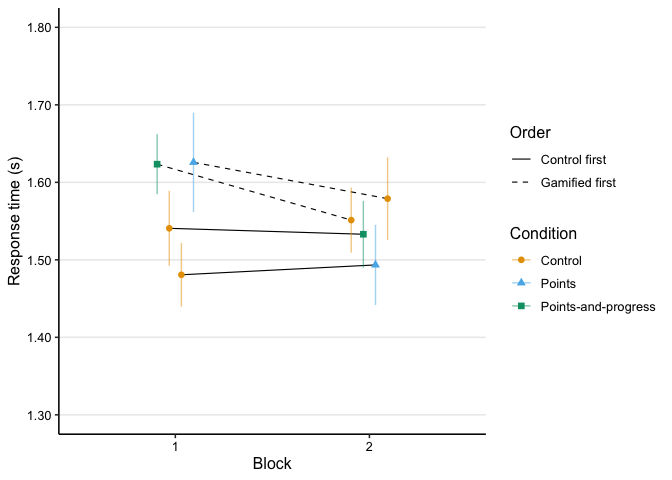
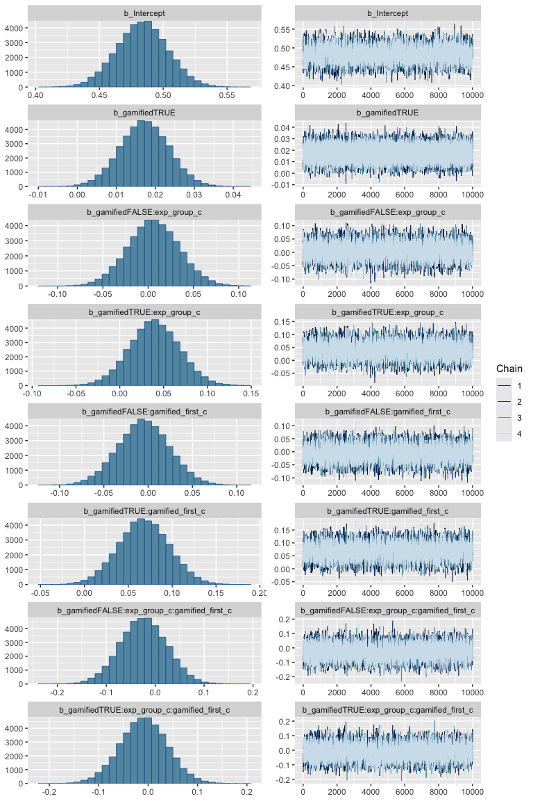
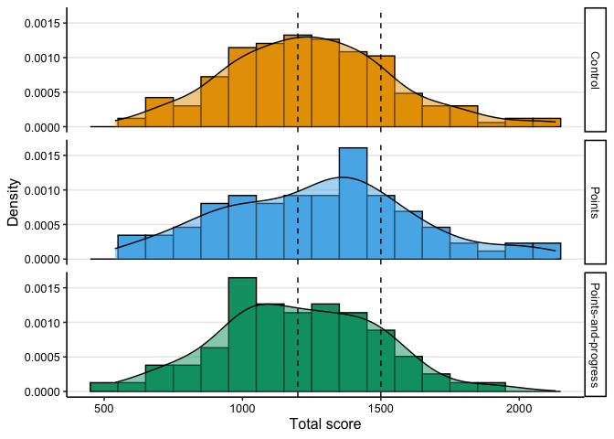

Analysis: learning session
================
Maarten van der Velde & Gesa van den Broek
Last updated: 2024-11-20

- [Setup](#setup)
- [Does gamification change performance during
  practice?](#does-gamification-change-performance-during-practice)
  - [Accuracy](#accuracy)
    - [Prepare data](#prepare-data)
    - [Visualise data](#visualise-data)
    - [Fit frequentist model](#fit-frequentist-model)
  - [Response time](#response-time)
    - [Prepare data](#prepare-data-1)
    - [Visualise data](#visualise-data-1)
    - [Fit frequentist model](#fit-frequentist-model-1)
    - [Visualise fitted model](#visualise-fitted-model-1)
  - [Total score](#total-score)
    - [Prepare data](#prepare-data-2)
    - [Visualise data](#visualise-data-2)
    - [Fit frequentist model](#fit-frequentist-model-2)
    - [Fit Bayesian model](#fit-bayesian-model)
  - [Number of words practiced](#number-of-words-practiced)
    - [Prepare data](#prepare-data-3)
    - [Visualise data](#visualise-data-3)
    - [Fit frequentist model](#fit-frequentist-model-3)
    - [Fit Bayesian model](#fit-bayesian-model-1)
  - [Completed trials](#completed-trials)
    - [Prepare data](#prepare-data-4)
    - [Visualise data](#visualise-data-4)
    - [Fit frequentist model](#fit-frequentist-model-4)
    - [Fit Bayesian model](#fit-bayesian-model-2)
  - [Conclusions](#conclusions)
  - [Combined plot](#combined-plot)
- [Save hypothesis testing output for
  visualisation](#save-hypothesis-testing-output-for-visualisation)
- [Session info](#session-info)

# Setup

``` r
library(here)
library(dplyr)
library(ggplot2)
library(scales)
library(patchwork)
library(stringr)
library(tidyr)
library(lme4)
library(lmerTest)
library(brms)

# Set up parallel processing for Bayesian models
library(future)
plan(multisession, workers = 4)
```

Helper functions for plots and tables:

``` r
source(here("scripts", "00_visualisation_functions.R"))
```

Load processed data:

``` r
d_learn <- readRDS(here("data", "processed", "d_learn.rds"))
```

``` r
add_experiment_cols <- function (data) {
  data |>
    mutate(exp_order = case_when(
      gamified_first == 0 & exp_group == "score" ~ "Control—Score",
      gamified_first == 0 & exp_group == "both" ~ "Control—Both",
      gamified_first == 1 & exp_group == "score" ~ "Score—Control",
      gamified_first == 1 & exp_group == "both" ~ "Both—Control"
    )) |>
    mutate(type = ifelse(gamified, "Gamified", "Control"))
}
```

Helper function for interpreting Bayes factors:

``` r
bf_to_strength <- function (bf) {
  
  direction <- "for"
  
  if (bf < 1) {
    bf <- 1/bf
    direction <- "against"
  }
  
  strength <- case_when(
    bf == 1 ~ "No",
    bf < 3 ~ "Anecdotal",
    bf < 10 ~ "Moderate",
    bf < 30 ~ "Strong",
    bf < 100 ~ "Very strong",
    TRUE ~ "Extreme"
  )
  
  paste0(strength, " evidence ", direction)
}
```

# Does gamification change performance during practice?

## Accuracy

### Prepare data

``` r
d_learn_acc <- d_learn |>
  filter(!study_trial) |>
  group_by(subject, exp_group, block, condition, gamified, gamified_first) |>
  summarise(accuracy = mean(correct))
```

    ## `summarise()` has grouped output by 'subject', 'exp_group', 'block',
    ## 'condition', 'gamified'. You can override using the `.groups` argument.

``` r
d_learn_acc_agg <- d_learn_acc |>
  group_by(block, condition, gamified, gamified_first, exp_group) |>
  summarise(acc = mean(accuracy, na.rm = T),
            acc_se = sd(accuracy, na.rm = T)/sqrt(n())) |>
  ungroup() |>
  add_experiment_cols()
```

    ## `summarise()` has grouped output by 'block', 'condition', 'gamified',
    ## 'gamified_first'. You can override using the `.groups` argument.

### Visualise data

``` r
p_learn_acc <- plot_data(d_learn_acc_agg, acc, acc_se, "Accuracy") +
  scale_y_continuous(limits = c(.725, .875), labels = scales::percent_format())

p_learn_acc
```

<!-- -->

### Fit frequentist model

Prepare data for modelling by mean-centering categorical predictors:

``` r
d_learn_m <- d_learn |>
  filter(!study_trial) |>
  mutate(exp_group_c = ifelse(exp_group == "score", 0, 1),
         exp_group_c = exp_group_c - mean(exp_group_c),
         gamified_first_c = gamified_first - mean(gamified_first))
```

``` r
m_learn_acc <- glmer(correct ~ gamified +
                       gamified:exp_group_c +
                       gamified:gamified_first_c +
                       gamified:gamified_first_c:exp_group_c +
                       (1 | subject) + (1 | fact),
                     family = "binomial",
                     data = d_learn_m)

summary(m_learn_acc)
```

    ## Generalized linear mixed model fit by maximum likelihood (Laplace
    ##   Approximation) [glmerMod]
    ##  Family: binomial  ( logit )
    ## Formula: 
    ## correct ~ gamified + gamified:exp_group_c + gamified:gamified_first_c +  
    ##     gamified:gamified_first_c:exp_group_c + (1 | subject) + (1 |      fact)
    ##    Data: d_learn_m
    ## 
    ##      AIC      BIC   logLik deviance df.resid 
    ##  38686.5  38772.8 -19333.3  38666.5    41479 
    ## 
    ## Scaled residuals: 
    ##     Min      1Q  Median      3Q     Max 
    ## -5.4230  0.2697  0.4166  0.5308  0.8948 
    ## 
    ## Random effects:
    ##  Groups  Name        Variance Std.Dev.
    ##  subject (Intercept) 0.2932   0.5415  
    ##  fact    (Intercept) 0.1178   0.3432  
    ## Number of obs: 41489, groups:  subject, 166; fact, 78
    ## 
    ## Fixed effects:
    ##                                             Estimate Std. Error z value
    ## (Intercept)                                 1.621184   0.060640  26.735
    ## gamifiedTRUE                               -0.007472   0.025932  -0.288
    ## gamifiedFALSE:exp_group_c                  -0.181824   0.092172  -1.973
    ## gamifiedTRUE:exp_group_c                   -0.160723   0.092242  -1.742
    ## gamifiedFALSE:gamified_first_c              0.069727   0.092386   0.755
    ## gamifiedTRUE:gamified_first_c              -0.079241   0.092419  -0.857
    ## gamifiedFALSE:exp_group_c:gamified_first_c -0.245058   0.185121  -1.324
    ## gamifiedTRUE:exp_group_c:gamified_first_c  -0.181772   0.185123  -0.982
    ##                                            Pr(>|z|)    
    ## (Intercept)                                  <2e-16 ***
    ## gamifiedTRUE                                 0.7732    
    ## gamifiedFALSE:exp_group_c                    0.0485 *  
    ## gamifiedTRUE:exp_group_c                     0.0814 .  
    ## gamifiedFALSE:gamified_first_c               0.4504    
    ## gamifiedTRUE:gamified_first_c                0.3912    
    ## gamifiedFALSE:exp_group_c:gamified_first_c   0.1856    
    ## gamifiedTRUE:exp_group_c:gamified_first_c    0.3261    
    ## ---
    ## Signif. codes:  0 '***' 0.001 '**' 0.01 '*' 0.05 '.' 0.1 ' ' 1
    ## 
    ## Correlation of Fixed Effects:
    ##               (Intr) gmTRUE gmfdFALSE:x__ gmfdTRUE:x__ gmfdFALSE:g__
    ## gamifidTRUE   -0.215                                                
    ## gmfdFALSE:x__ -0.014  0.017                                         
    ## gmfdTRUE:x__  -0.008 -0.012  0.841                                  
    ## gmfdFALSE:g__ -0.011  0.000 -0.010        -0.004                    
    ## gmfdTRUE:g__  -0.014  0.001 -0.004        -0.009        0.842       
    ## gFALSE:__:_   -0.008  0.011 -0.017        -0.016       -0.019       
    ## gTRUE:__:__   -0.003 -0.009 -0.016        -0.018       -0.010       
    ##               gmfdTRUE:g__ gFALSE:__:
    ## gamifidTRUE                          
    ## gmfdFALSE:x__                        
    ## gmfdTRUE:x__                         
    ## gmfdFALSE:g__                        
    ## gmfdTRUE:g__                         
    ## gFALSE:__:_   -0.010                 
    ## gTRUE:__:__   -0.016        0.842

``` r
print_model_table(m_learn_acc)
```


#### Fitted values

``` r
d_model_fit <- crossing(
  gamified = FALSE, 
  exp_group_c = sort(unique(d_learn_m$exp_group_c)), 
  gamified_first_c = 0
)

d_model_fit$model_fit <- predict(m_learn_acc,
                                 newdata = d_model_fit,
                                 re.form = NA, 
                                 type = "response")

d_model_fit
```

    ## # A tibble: 2 × 4
    ##   gamified exp_group_c gamified_first_c model_fit
    ##   <lgl>          <dbl>            <dbl>     <dbl>
    ## 1 FALSE         -0.470                0     0.846
    ## 2 FALSE          0.530                0     0.821

#### Visualise fitted model

``` r
p_learn_acc_m <- plot_model_fit(m_learn_acc, d_learn_m, y_lab = "Accuracy") +
  scale_y_continuous(limits = c(.75, .90), labels = scales::percent_format(accuracy = .1))
```

    ##   block           condition gamified gamified_first exp_group gamified_first_c
    ## 1     1             Control    FALSE          FALSE      both       -0.5320687
    ## 2     1             Control    FALSE          FALSE     score       -0.5320687
    ## 3     1              Points     TRUE           TRUE     score        0.4679313
    ## 4     1 Points-and-progress     TRUE           TRUE      both        0.4679313
    ## 5     2             Control    FALSE           TRUE      both        0.4679313
    ## 6     2             Control    FALSE           TRUE     score        0.4679313
    ## 7     2              Points     TRUE          FALSE     score       -0.5320687
    ## 8     2 Points-and-progress     TRUE          FALSE      both       -0.5320687
    ##   exp_group_c  pred_val     exp_order     type
    ## 1   0.5296826 0.8258994  Control—Both  Control
    ## 2  -0.4703174 0.8331719 Control—Score  Control
    ## 3  -0.4703174 0.8445168 Score—Control Gamified
    ## 4   0.5296826 0.8094510  Both—Control Gamified
    ## 5   0.5296826 0.8170913  Both—Control  Control
    ## 6  -0.4703174 0.8573262 Score—Control  Control
    ## 7  -0.4703174 0.8436944 Control—Score Gamified
    ## 8   0.5296826 0.8350666  Control—Both Gamified

    ## Scale for y is already present.
    ## Adding another scale for y, which will replace the existing scale.

``` r
p_learn_acc_m
```

<!-- -->
\### Fit Bayesian model

Fit again with `brms` so that we can calculate Bayes Factors. Because we
expect any fixed effects to be at most moderate in size, we will use a
weakly informative Normal(0, 1) prior for these effects.

``` r
m_learn_acc_brms <- brm(correct ~ gamified +
                          gamified:exp_group_c +
                          gamified:gamified_first_c +
                          gamified:gamified_first_c:exp_group_c +
                          (1 | subject) + (1 | fact),
                        family = "bernoulli",
                        data = d_learn_m,
                        prior = set_prior("normal(0, 1)", class = "b"),
                        chains = 4,
                        iter = 11000,
                        warmup = 1000,
                        sample_prior = TRUE,
                        future = TRUE,
                        seed = 0)
```

    ## Compiling Stan program...

    ## Trying to compile a simple C file

    ## Running /Library/Frameworks/R.framework/Resources/bin/R CMD SHLIB foo.c
    ## using C compiler: ‘Apple clang version 15.0.0 (clang-1500.3.9.4)’
    ## using SDK: ‘MacOSX14.4.sdk’
    ## clang -arch arm64 -I"/Library/Frameworks/R.framework/Resources/include" -DNDEBUG   -I"/Library/Frameworks/R.framework/Versions/4.3-arm64/Resources/library/Rcpp/include/"  -I"/Library/Frameworks/R.framework/Versions/4.3-arm64/Resources/library/RcppEigen/include/"  -I"/Library/Frameworks/R.framework/Versions/4.3-arm64/Resources/library/RcppEigen/include/unsupported"  -I"/Library/Frameworks/R.framework/Versions/4.3-arm64/Resources/library/BH/include" -I"/Library/Frameworks/R.framework/Versions/4.3-arm64/Resources/library/StanHeaders/include/src/"  -I"/Library/Frameworks/R.framework/Versions/4.3-arm64/Resources/library/StanHeaders/include/"  -I"/Library/Frameworks/R.framework/Versions/4.3-arm64/Resources/library/RcppParallel/include/"  -I"/Library/Frameworks/R.framework/Versions/4.3-arm64/Resources/library/rstan/include" -DEIGEN_NO_DEBUG  -DBOOST_DISABLE_ASSERTS  -DBOOST_PENDING_INTEGER_LOG2_HPP  -DSTAN_THREADS  -DUSE_STANC3 -DSTRICT_R_HEADERS  -DBOOST_PHOENIX_NO_VARIADIC_EXPRESSION  -D_HAS_AUTO_PTR_ETC=0  -include '/Library/Frameworks/R.framework/Versions/4.3-arm64/Resources/library/StanHeaders/include/stan/math/prim/fun/Eigen.hpp'  -D_REENTRANT -DRCPP_PARALLEL_USE_TBB=1   -I/opt/R/arm64/include    -fPIC  -falign-functions=64 -Wall -g -O2  -c foo.c -o foo.o
    ## In file included from <built-in>:1:
    ## In file included from /Library/Frameworks/R.framework/Versions/4.3-arm64/Resources/library/StanHeaders/include/stan/math/prim/fun/Eigen.hpp:22:
    ## In file included from /Library/Frameworks/R.framework/Versions/4.3-arm64/Resources/library/RcppEigen/include/Eigen/Dense:1:
    ## In file included from /Library/Frameworks/R.framework/Versions/4.3-arm64/Resources/library/RcppEigen/include/Eigen/Core:19:
    ## /Library/Frameworks/R.framework/Versions/4.3-arm64/Resources/library/RcppEigen/include/Eigen/src/Core/util/Macros.h:679:10: fatal error: 'cmath' file not found
    ## #include <cmath>
    ##          ^~~~~~~
    ## 1 error generated.
    ## make[1]: *** [foo.o] Error 1

    ## Start sampling

    ## 
    ## SAMPLING FOR MODEL 'anon_model' NOW (CHAIN 1).
    ## Chain 1: 
    ## Chain 1: Gradient evaluation took 0.002398 seconds
    ## Chain 1: 1000 transitions using 10 leapfrog steps per transition would take 23.98 seconds.
    ## Chain 1: Adjust your expectations accordingly!
    ## Chain 1: 
    ## Chain 1: 
    ## Chain 1: Iteration:     1 / 11000 [  0%]  (Warmup)
    ## Chain 1: Iteration:  1001 / 11000 [  9%]  (Sampling)
    ## Chain 1: Iteration:  2100 / 11000 [ 19%]  (Sampling)
    ## Chain 1: Iteration:  3200 / 11000 [ 29%]  (Sampling)
    ## Chain 1: Iteration:  4300 / 11000 [ 39%]  (Sampling)
    ## Chain 1: Iteration:  5400 / 11000 [ 49%]  (Sampling)
    ## Chain 1: Iteration:  6500 / 11000 [ 59%]  (Sampling)
    ## Chain 1: Iteration:  7600 / 11000 [ 69%]  (Sampling)
    ## Chain 1: Iteration:  8700 / 11000 [ 79%]  (Sampling)
    ## Chain 1: Iteration:  9800 / 11000 [ 89%]  (Sampling)
    ## Chain 1: Iteration: 10900 / 11000 [ 99%]  (Sampling)
    ## Chain 1: Iteration: 11000 / 11000 [100%]  (Sampling)
    ## Chain 1: 
    ## Chain 1:  Elapsed Time: 57.115 seconds (Warm-up)
    ## Chain 1:                416.529 seconds (Sampling)
    ## Chain 1:                473.644 seconds (Total)
    ## Chain 1: 
    ## 
    ## SAMPLING FOR MODEL 'anon_model' NOW (CHAIN 2).
    ## Chain 2: 
    ## Chain 2: Gradient evaluation took 0.00235 seconds
    ## Chain 2: 1000 transitions using 10 leapfrog steps per transition would take 23.5 seconds.
    ## Chain 2: Adjust your expectations accordingly!
    ## Chain 2: 
    ## Chain 2: 
    ## Chain 2: Iteration:     1 / 11000 [  0%]  (Warmup)
    ## Chain 2: Iteration:  1001 / 11000 [  9%]  (Sampling)
    ## Chain 2: Iteration:  2100 / 11000 [ 19%]  (Sampling)
    ## Chain 2: Iteration:  3200 / 11000 [ 29%]  (Sampling)
    ## Chain 2: Iteration:  4300 / 11000 [ 39%]  (Sampling)
    ## Chain 2: Iteration:  5400 / 11000 [ 49%]  (Sampling)
    ## Chain 2: Iteration:  6500 / 11000 [ 59%]  (Sampling)
    ## Chain 2: Iteration:  7600 / 11000 [ 69%]  (Sampling)
    ## Chain 2: Iteration:  8700 / 11000 [ 79%]  (Sampling)
    ## Chain 2: Iteration:  9800 / 11000 [ 89%]  (Sampling)
    ## Chain 2: Iteration: 10900 / 11000 [ 99%]  (Sampling)
    ## Chain 2: Iteration: 11000 / 11000 [100%]  (Sampling)
    ## Chain 2: 
    ## Chain 2:  Elapsed Time: 58.148 seconds (Warm-up)
    ## Chain 2:                394.846 seconds (Sampling)
    ## Chain 2:                452.994 seconds (Total)
    ## Chain 2: 
    ## 
    ## SAMPLING FOR MODEL 'anon_model' NOW (CHAIN 3).
    ## Chain 3: 
    ## Chain 3: Gradient evaluation took 0.002598 seconds
    ## Chain 3: 1000 transitions using 10 leapfrog steps per transition would take 25.98 seconds.
    ## Chain 3: Adjust your expectations accordingly!
    ## Chain 3: 
    ## Chain 3: 
    ## Chain 3: Iteration:     1 / 11000 [  0%]  (Warmup)
    ## Chain 3: Iteration:  1001 / 11000 [  9%]  (Sampling)
    ## Chain 3: Iteration:  2100 / 11000 [ 19%]  (Sampling)
    ## Chain 3: Iteration:  3200 / 11000 [ 29%]  (Sampling)
    ## Chain 3: Iteration:  4300 / 11000 [ 39%]  (Sampling)
    ## Chain 3: Iteration:  5400 / 11000 [ 49%]  (Sampling)
    ## Chain 3: Iteration:  6500 / 11000 [ 59%]  (Sampling)
    ## Chain 3: Iteration:  7600 / 11000 [ 69%]  (Sampling)
    ## Chain 3: Iteration:  8700 / 11000 [ 79%]  (Sampling)
    ## Chain 3: Iteration:  9800 / 11000 [ 89%]  (Sampling)
    ## Chain 3: Iteration: 10900 / 11000 [ 99%]  (Sampling)
    ## Chain 3: Iteration: 11000 / 11000 [100%]  (Sampling)
    ## Chain 3: 
    ## Chain 3:  Elapsed Time: 55.967 seconds (Warm-up)
    ## Chain 3:                408.229 seconds (Sampling)
    ## Chain 3:                464.196 seconds (Total)
    ## Chain 3: 
    ## 
    ## SAMPLING FOR MODEL 'anon_model' NOW (CHAIN 4).
    ## Chain 4: 
    ## Chain 4: Gradient evaluation took 0.002397 seconds
    ## Chain 4: 1000 transitions using 10 leapfrog steps per transition would take 23.97 seconds.
    ## Chain 4: Adjust your expectations accordingly!
    ## Chain 4: 
    ## Chain 4: 
    ## Chain 4: Iteration:     1 / 11000 [  0%]  (Warmup)
    ## Chain 4: Iteration:  1001 / 11000 [  9%]  (Sampling)
    ## Chain 4: Iteration:  2100 / 11000 [ 19%]  (Sampling)
    ## Chain 4: Iteration:  3200 / 11000 [ 29%]  (Sampling)
    ## Chain 4: Iteration:  4300 / 11000 [ 39%]  (Sampling)
    ## Chain 4: Iteration:  5400 / 11000 [ 49%]  (Sampling)
    ## Chain 4: Iteration:  6500 / 11000 [ 59%]  (Sampling)
    ## Chain 4: Iteration:  7600 / 11000 [ 69%]  (Sampling)
    ## Chain 4: Iteration:  8700 / 11000 [ 79%]  (Sampling)
    ## Chain 4: Iteration:  9800 / 11000 [ 89%]  (Sampling)
    ## Chain 4: Iteration: 10900 / 11000 [ 99%]  (Sampling)
    ## Chain 4: Iteration: 11000 / 11000 [100%]  (Sampling)
    ## Chain 4: 
    ## Chain 4:  Elapsed Time: 56.074 seconds (Warm-up)
    ## Chain 4:                578.887 seconds (Sampling)
    ## Chain 4:                634.961 seconds (Total)
    ## Chain 4:

``` r
summary(m_learn_acc_brms)
```

    ##  Family: bernoulli 
    ##   Links: mu = logit 
    ## Formula: correct ~ gamified + gamified:exp_group_c + gamified:gamified_first_c + gamified:gamified_first_c:exp_group_c + (1 | subject) + (1 | fact) 
    ##    Data: d_learn_m (Number of observations: 41489) 
    ##   Draws: 4 chains, each with iter = 11000; warmup = 1000; thin = 1;
    ##          total post-warmup draws = 40000
    ## 
    ## Multilevel Hyperparameters:
    ## ~fact (Number of levels: 78) 
    ##               Estimate Est.Error l-95% CI u-95% CI Rhat Bulk_ESS Tail_ESS
    ## sd(Intercept)     0.35      0.04     0.29     0.43 1.00     8273    14730
    ## 
    ## ~subject (Number of levels: 166) 
    ##               Estimate Est.Error l-95% CI u-95% CI Rhat Bulk_ESS Tail_ESS
    ## sd(Intercept)     0.55      0.04     0.49     0.63 1.00     7175    11801
    ## 
    ## Regression Coefficients:
    ##                                            Estimate Est.Error l-95% CI u-95% CI
    ## Intercept                                      1.62      0.06     1.50     1.75
    ## gamifiedTRUE                                  -0.01      0.03    -0.06     0.04
    ## gamifiedFALSE:exp_group_c                     -0.18      0.09    -0.36     0.00
    ## gamifiedTRUE:exp_group_c                      -0.16      0.09    -0.34     0.02
    ## gamifiedFALSE:gamified_first_c                 0.07      0.09    -0.11     0.25
    ## gamifiedTRUE:gamified_first_c                 -0.08      0.09    -0.26     0.11
    ## gamifiedFALSE:exp_group_c:gamified_first_c    -0.23      0.18    -0.60     0.12
    ## gamifiedTRUE:exp_group_c:gamified_first_c     -0.17      0.18    -0.53     0.19
    ##                                            Rhat Bulk_ESS Tail_ESS
    ## Intercept                                  1.00     5005    10011
    ## gamifiedTRUE                               1.00    43753    29667
    ## gamifiedFALSE:exp_group_c                  1.00     5185     9292
    ## gamifiedTRUE:exp_group_c                   1.00     5241     9538
    ## gamifiedFALSE:gamified_first_c             1.00     5024    10205
    ## gamifiedTRUE:gamified_first_c              1.00     4946     9580
    ## gamifiedFALSE:exp_group_c:gamified_first_c 1.00     5514    10973
    ## gamifiedTRUE:exp_group_c:gamified_first_c  1.00     5556    10691
    ## 
    ## Draws were sampled using sampling(NUTS). For each parameter, Bulk_ESS
    ## and Tail_ESS are effective sample size measures, and Rhat is the potential
    ## scale reduction factor on split chains (at convergence, Rhat = 1).

Inspect the posterior sample distributions of the fixed effects:

``` r
plot(m_learn_acc_brms, nvariables = 8, variable = "^b_", regex = TRUE)
```

<!-- -->

#### Bayes factors

Do a hypothesis test for all fixed-effect coefficients (both main
effects and interactions) in the model being equal to zero. The column
`Evid.Ratio` shows the Bayes Factor in favour of the null hypothesis
($BF_{01}$).

``` r
h_learn_acc <- hypothesis(m_learn_acc_brms,
                          c("gamifiedTRUE = 0",
                            "gamifiedFALSE:exp_group_c = 0",
                            "gamifiedTRUE:exp_group_c = 0",
                            "gamifiedFALSE:gamified_first_c = 0",
                            "gamifiedTRUE:gamified_first_c = 0",
                            "gamifiedFALSE:exp_group_c:gamified_first_c = 0",
                            "gamifiedTRUE:exp_group_c:gamified_first_c = 0"),
                          class = "b")

h_learn_acc$hypothesis |>
  mutate(BF10 = 1 / Evid.Ratio,
         evidence_for_null = sapply(Evid.Ratio, bf_to_strength))
```

    ##                                         Hypothesis     Estimate  Est.Error
    ## 1                               (gamifiedTRUE) = 0 -0.007671448 0.02592997
    ## 2                  (gamifiedFALSE:exp_group_c) = 0 -0.178279256 0.09254822
    ## 3                   (gamifiedTRUE:exp_group_c) = 0 -0.157272451 0.09273318
    ## 4             (gamifiedFALSE:gamified_first_c) = 0  0.071332360 0.09340858
    ## 5              (gamifiedTRUE:gamified_first_c) = 0 -0.077303260 0.09322141
    ## 6 (gamifiedFALSE:exp_group_c:gamified_first_c) = 0 -0.234572784 0.18398944
    ## 7  (gamifiedTRUE:exp_group_c:gamified_first_c) = 0 -0.171441211 0.18405519
    ##      CI.Lower    CI.Upper Evid.Ratio Post.Prob Star      BF10
    ## 1 -0.05866672 0.043048086  37.524864 0.9740427      0.0266490
    ## 2 -0.35961626 0.003946312   1.722451 0.6326839      0.5805682
    ## 3 -0.34144139 0.024208001   2.696869 0.7295008      0.3708004
    ## 4 -0.11192691 0.254935099   8.131908 0.8904939      0.1229724
    ## 5 -0.26130712 0.105105560   7.759501 0.8858382      0.1288743
    ## 6 -0.59512765 0.124879936   2.531294 0.7168177      0.3950549
    ## 7 -0.53178322 0.190083186   3.635790 0.7842870      0.2750434
    ##          evidence_for_null
    ## 1 Very strong evidence for
    ## 2   Anecdotal evidence for
    ## 3   Anecdotal evidence for
    ## 4    Moderate evidence for
    ## 5    Moderate evidence for
    ## 6   Anecdotal evidence for
    ## 7    Moderate evidence for

This hypothesis test is calculating the Savage-Dickey density ratio at
zero, which is a ratio of the posterior density at zero relative to the
prior density at zero (indicated by dashed vertical line). Values above
1 indicate a stronger belief that the effect is indeed zero after having
observed the data.

``` r
sd_ratio_acc <- plot(h_learn_acc, nvariables = 8, variable = "^b_", regex = TRUE, plot = FALSE)

sd_ratio_acc[[1]] +
  geom_vline(xintercept = 0, linetype = "dashed", colour = "grey25")
```

<!-- -->

#### Conclusion

The Bayesian model finds anecdotal to strong evidence in favour of the
null hypothesis (no effect on learning accuracy) for each of the
regression coefficients.

## Response time

Response time on correct answers only.

### Prepare data

To keep the visualisation of average response times by condition simple,
we calculate the median RT per participant, and then take the mean and
SD of these medians (which are themselves roughly normally distributed).

``` r
d_learn_rt <- d_learn |>
  filter(!study_trial) |>
  filter(correct) |>
  mutate(rt = rt / 1000) |>
  group_by(subject, exp_group, block, condition, gamified, gamified_first) |>
  summarise(rt_median = median(rt, na.rm = TRUE))
```

    ## `summarise()` has grouped output by 'subject', 'exp_group', 'block',
    ## 'condition', 'gamified'. You can override using the `.groups` argument.

``` r
d_learn_rt_agg <- d_learn_rt |>
  group_by(block, condition, gamified, gamified_first, exp_group) |>
  summarise(rt_mean = mean(rt_median, na.rm = T),
            rt_se = sd(rt_median, na.rm = T)/sqrt(n())) |>
  ungroup() |>
  add_experiment_cols()
```

    ## `summarise()` has grouped output by 'block', 'condition', 'gamified',
    ## 'gamified_first'. You can override using the `.groups` argument.

### Visualise data

``` r
p_learn_rt <- plot_data(d_learn_rt_agg, rt_mean, rt_se, "Response time (s)") +
  scale_y_continuous(limits = c(1.3, 1.8), labels = scales::comma_format())

p_learn_rt
```

<!-- -->

### Fit frequentist model

Since RT data is not normally distributed, we fit a lognormal model to
the response times. (See
<https://bbolker.github.io/mixedmodels-misc/glmmFAQ.html#gamma-glmms> .)
Prepare data for modelling by mean-centering categorical predictors:

``` r
d_learn_rt_m <- d_learn |>
  filter(!study_trial) |>
  filter(correct) |>
  mutate(log_rt = log(rt / 1000)) |>
  mutate(exp_group_c = ifelse(exp_group == "score", 0, 1),
         exp_group_c = exp_group_c - mean(exp_group_c),
         gamified_first_c = gamified_first - mean(gamified_first)
         )
```

``` r
m_learn_rt <- lmer(log_rt ~ gamified +
                      gamified:exp_group_c +
                      gamified:gamified_first_c +
                      gamified:gamified_first_c:exp_group_c +
                      (1 | subject) + (1 | fact),
                    data = d_learn_rt_m)

summary(m_learn_rt)
```

    ## Linear mixed model fit by REML. t-tests use Satterthwaite's method [
    ## lmerModLmerTest]
    ## Formula: 
    ## log_rt ~ gamified + gamified:exp_group_c + gamified:gamified_first_c +  
    ##     gamified:gamified_first_c:exp_group_c + (1 | subject) + (1 |      fact)
    ##    Data: d_learn_rt_m
    ## 
    ## REML criterion at convergence: 58081.7
    ## 
    ## Scaled residuals: 
    ##      Min       1Q   Median       3Q      Max 
    ## -15.6337  -0.5696  -0.1470   0.4864   4.8537 
    ## 
    ## Random effects:
    ##  Groups   Name        Variance Std.Dev.
    ##  subject  (Intercept) 0.03589  0.1895  
    ##  fact     (Intercept) 0.01190  0.1091  
    ##  Residual             0.32134  0.5669  
    ## Number of obs: 33657, groups:  subject, 166; fact, 78
    ## 
    ## Fixed effects:
    ##                                              Estimate Std. Error         df
    ## (Intercept)                                 4.837e-01  1.973e-02  2.287e+02
    ## gamifiedTRUE                                1.734e-02  6.240e-03  3.347e+04
    ## gamifiedFALSE:exp_group_c                   9.712e-03  3.077e-02  1.754e+02
    ## gamifiedTRUE:exp_group_c                    4.371e-02  3.078e-02  1.757e+02
    ## gamifiedFALSE:gamified_first_c              1.335e-03  3.084e-02  1.753e+02
    ## gamifiedTRUE:gamified_first_c               7.474e-02  3.085e-02  1.754e+02
    ## gamifiedFALSE:exp_group_c:gamified_first_c -3.774e-02  6.175e-02  1.755e+02
    ## gamifiedTRUE:exp_group_c:gamified_first_c  -2.206e-02  6.175e-02  1.754e+02
    ##                                            t value Pr(>|t|)    
    ## (Intercept)                                 24.522  < 2e-16 ***
    ## gamifiedTRUE                                 2.779  0.00546 ** 
    ## gamifiedFALSE:exp_group_c                    0.316  0.75264    
    ## gamifiedTRUE:exp_group_c                     1.420  0.15738    
    ## gamifiedFALSE:gamified_first_c               0.043  0.96553    
    ## gamifiedTRUE:gamified_first_c                2.423  0.01640 *  
    ## gamifiedFALSE:exp_group_c:gamified_first_c  -0.611  0.54185    
    ## gamifiedTRUE:exp_group_c:gamified_first_c   -0.357  0.72138    
    ## ---
    ## Signif. codes:  0 '***' 0.001 '**' 0.01 '*' 0.05 '.' 0.1 ' ' 1
    ## 
    ## Correlation of Fixed Effects:
    ##               (Intr) gmTRUE gmfdFALSE:x__ gmfdTRUE:x__ gmfdFALSE:g__
    ## gamifidTRUE   -0.158                                                
    ## gmfdFALSE:x__ -0.020  0.000                                         
    ## gmfdTRUE:x__  -0.020  0.000  0.917                                  
    ## gmfdFALSE:g__ -0.017  0.005 -0.003        -0.004                    
    ## gmfdTRUE:g__  -0.016  0.006 -0.004        -0.003        0.918       
    ## gFALSE:__:_   -0.002 -0.002 -0.022        -0.021       -0.025       
    ## gTRUE:__:__   -0.003  0.002 -0.021        -0.018       -0.025       
    ##               gmfdTRUE:g__ gFALSE:__:
    ## gamifidTRUE                          
    ## gmfdFALSE:x__                        
    ## gmfdTRUE:x__                         
    ## gmfdFALSE:g__                        
    ## gmfdTRUE:g__                         
    ## gFALSE:__:_   -0.025                 
    ## gTRUE:__:__   -0.025        0.917

``` r
print_model_table(m_learn_rt)
```


#### Fitted values

``` r
d_model_fit <- crossing(
  gamified = c(FALSE, TRUE), 
  exp_group_c = 0, 
  gamified_first_c = 0
)

d_model_fit$model_fit <- predict(m_learn_rt,
                                 newdata = d_model_fit,
                                 re.form = NA, 
                                 type = "response") |>
  exp() # Transform logRT to RT

d_model_fit
```

    ## # A tibble: 2 × 4
    ##   gamified exp_group_c gamified_first_c model_fit
    ##   <lgl>          <dbl>            <dbl>     <dbl>
    ## 1 FALSE              0                0      1.62
    ## 2 TRUE               0                0      1.65

``` r
d_model_fit <- crossing(
  gamified = c(FALSE, TRUE), 
  exp_group_c = 0, 
  gamified_first_c = sort(unique(d_learn_rt_m$gamified_first_c))
)

d_model_fit$model_fit <- predict(m_learn_rt,
                                 newdata = d_model_fit,
                                 re.form = NA, 
                                 type = "response") |>
  exp() # Transform logRT to RT

d_model_fit
```

    ## # A tibble: 4 × 4
    ##   gamified exp_group_c gamified_first_c model_fit
    ##   <lgl>          <dbl>            <dbl>     <dbl>
    ## 1 FALSE              0           -0.531      1.62
    ## 2 FALSE              0            0.469      1.62
    ## 3 TRUE               0           -0.531      1.59
    ## 4 TRUE               0            0.469      1.71

### Visualise fitted model

``` r
p_learn_rt_m <- plot_model_fit(m_learn_rt, d_learn_rt_m, exp_trans = TRUE, y_lab = "Response time (s)") +
  scale_y_continuous(limits = c(1.4, 1.9), labels = scales::comma_format())
```

    ##   block           condition gamified gamified_first exp_group gamified_first_c
    ## 1     1             Control    FALSE          FALSE      both       -0.5311822
    ## 2     1             Control    FALSE          FALSE     score       -0.5311822
    ## 3     1              Points     TRUE           TRUE     score        0.4688178
    ## 4     1 Points-and-progress     TRUE           TRUE      both        0.4688178
    ## 5     2             Control    FALSE           TRUE      both        0.4688178
    ## 6     2             Control    FALSE           TRUE     score        0.4688178
    ## 7     2              Points     TRUE          FALSE     score       -0.5311822
    ## 8     2 Points-and-progress     TRUE          FALSE      both       -0.5311822
    ##   exp_group_c pred_val     exp_order     type
    ## 1   0.5378079 1.647124  Control—Both  Control
    ## 2  -0.4621921 1.598827 Control—Score  Control
    ## 3  -0.4621921 1.683192 Score—Control Gamified
    ## 4   0.5378079 1.740307  Both—Control Gamified
    ## 5   0.5378079 1.616182  Both—Control  Control
    ## 6  -0.4621921 1.629135 Score—Control  Control
    ## 7  -0.4621921 1.546128 Control—Score Gamified
    ## 8   0.5378079 1.634243  Control—Both Gamified

    ## Scale for y is already present.
    ## Adding another scale for y, which will replace the existing scale.

``` r
p_learn_rt_m
```

<!-- -->
\### Fit Bayesian model

Fit again with `brms` so that we can calculate Bayes Factors. Because we
expect any fixed effects to be at most moderate in size, we will use a
weakly informative Normal(0, .1) prior for these effects.

``` r
m_learn_rt_brms <- brm(log_rt ~ gamified +
                         gamified:exp_group_c +
                         gamified:gamified_first_c +
                         gamified:gamified_first_c:exp_group_c +
                         (1 | subject) + (1 | fact),
                       family = "gaussian",
                       data = d_learn_rt_m,
                       prior = set_prior("normal(0, .1)", class = "b"),
                       chains = 4,
                       iter = 11000,
                       warmup = 1000,
                       sample_prior = TRUE,
                       future = TRUE,
                       seed = 0)
```

    ## Compiling Stan program...

    ## Trying to compile a simple C file

    ## Running /Library/Frameworks/R.framework/Resources/bin/R CMD SHLIB foo.c
    ## using C compiler: ‘Apple clang version 15.0.0 (clang-1500.3.9.4)’
    ## using SDK: ‘MacOSX14.4.sdk’
    ## clang -arch arm64 -I"/Library/Frameworks/R.framework/Resources/include" -DNDEBUG   -I"/Library/Frameworks/R.framework/Versions/4.3-arm64/Resources/library/Rcpp/include/"  -I"/Library/Frameworks/R.framework/Versions/4.3-arm64/Resources/library/RcppEigen/include/"  -I"/Library/Frameworks/R.framework/Versions/4.3-arm64/Resources/library/RcppEigen/include/unsupported"  -I"/Library/Frameworks/R.framework/Versions/4.3-arm64/Resources/library/BH/include" -I"/Library/Frameworks/R.framework/Versions/4.3-arm64/Resources/library/StanHeaders/include/src/"  -I"/Library/Frameworks/R.framework/Versions/4.3-arm64/Resources/library/StanHeaders/include/"  -I"/Library/Frameworks/R.framework/Versions/4.3-arm64/Resources/library/RcppParallel/include/"  -I"/Library/Frameworks/R.framework/Versions/4.3-arm64/Resources/library/rstan/include" -DEIGEN_NO_DEBUG  -DBOOST_DISABLE_ASSERTS  -DBOOST_PENDING_INTEGER_LOG2_HPP  -DSTAN_THREADS  -DUSE_STANC3 -DSTRICT_R_HEADERS  -DBOOST_PHOENIX_NO_VARIADIC_EXPRESSION  -D_HAS_AUTO_PTR_ETC=0  -include '/Library/Frameworks/R.framework/Versions/4.3-arm64/Resources/library/StanHeaders/include/stan/math/prim/fun/Eigen.hpp'  -D_REENTRANT -DRCPP_PARALLEL_USE_TBB=1   -I/opt/R/arm64/include    -fPIC  -falign-functions=64 -Wall -g -O2  -c foo.c -o foo.o
    ## In file included from <built-in>:1:
    ## In file included from /Library/Frameworks/R.framework/Versions/4.3-arm64/Resources/library/StanHeaders/include/stan/math/prim/fun/Eigen.hpp:22:
    ## In file included from /Library/Frameworks/R.framework/Versions/4.3-arm64/Resources/library/RcppEigen/include/Eigen/Dense:1:
    ## In file included from /Library/Frameworks/R.framework/Versions/4.3-arm64/Resources/library/RcppEigen/include/Eigen/Core:19:
    ## /Library/Frameworks/R.framework/Versions/4.3-arm64/Resources/library/RcppEigen/include/Eigen/src/Core/util/Macros.h:679:10: fatal error: 'cmath' file not found
    ## #include <cmath>
    ##          ^~~~~~~
    ## 1 error generated.
    ## make[1]: *** [foo.o] Error 1

    ## Start sampling

    ## 
    ## SAMPLING FOR MODEL 'anon_model' NOW (CHAIN 1).
    ## Chain 1: 
    ## Chain 1: Gradient evaluation took 0.00198 seconds
    ## Chain 1: 1000 transitions using 10 leapfrog steps per transition would take 19.8 seconds.
    ## Chain 1: Adjust your expectations accordingly!
    ## Chain 1: 
    ## Chain 1: 
    ## Chain 1: Iteration:     1 / 11000 [  0%]  (Warmup)
    ## Chain 1: Iteration:  1001 / 11000 [  9%]  (Sampling)
    ## Chain 1: Iteration:  2100 / 11000 [ 19%]  (Sampling)
    ## Chain 1: Iteration:  3200 / 11000 [ 29%]  (Sampling)
    ## Chain 1: Iteration:  4300 / 11000 [ 39%]  (Sampling)
    ## Chain 1: Iteration:  5400 / 11000 [ 49%]  (Sampling)
    ## Chain 1: Iteration:  6500 / 11000 [ 59%]  (Sampling)
    ## Chain 1: Iteration:  7600 / 11000 [ 69%]  (Sampling)
    ## Chain 1: Iteration:  8700 / 11000 [ 79%]  (Sampling)
    ## Chain 1: Iteration:  9800 / 11000 [ 89%]  (Sampling)
    ## Chain 1: Iteration: 10900 / 11000 [ 99%]  (Sampling)
    ## Chain 1: Iteration: 11000 / 11000 [100%]  (Sampling)
    ## Chain 1: 
    ## Chain 1:  Elapsed Time: 64.29 seconds (Warm-up)
    ## Chain 1:                387.721 seconds (Sampling)
    ## Chain 1:                452.011 seconds (Total)
    ## Chain 1: 
    ## 
    ## SAMPLING FOR MODEL 'anon_model' NOW (CHAIN 2).
    ## Chain 2: 
    ## Chain 2: Gradient evaluation took 0.00172 seconds
    ## Chain 2: 1000 transitions using 10 leapfrog steps per transition would take 17.2 seconds.
    ## Chain 2: Adjust your expectations accordingly!
    ## Chain 2: 
    ## Chain 2: 
    ## Chain 2: Iteration:     1 / 11000 [  0%]  (Warmup)
    ## Chain 2: Iteration:  1001 / 11000 [  9%]  (Sampling)
    ## Chain 2: Iteration:  2100 / 11000 [ 19%]  (Sampling)
    ## Chain 2: Iteration:  3200 / 11000 [ 29%]  (Sampling)
    ## Chain 2: Iteration:  4300 / 11000 [ 39%]  (Sampling)
    ## Chain 2: Iteration:  5400 / 11000 [ 49%]  (Sampling)
    ## Chain 2: Iteration:  6500 / 11000 [ 59%]  (Sampling)
    ## Chain 2: Iteration:  7600 / 11000 [ 69%]  (Sampling)
    ## Chain 2: Iteration:  8700 / 11000 [ 79%]  (Sampling)
    ## Chain 2: Iteration:  9800 / 11000 [ 89%]  (Sampling)
    ## Chain 2: Iteration: 10900 / 11000 [ 99%]  (Sampling)
    ## Chain 2: Iteration: 11000 / 11000 [100%]  (Sampling)
    ## Chain 2: 
    ## Chain 2:  Elapsed Time: 66.027 seconds (Warm-up)
    ## Chain 2:                346.442 seconds (Sampling)
    ## Chain 2:                412.469 seconds (Total)
    ## Chain 2: 
    ## 
    ## SAMPLING FOR MODEL 'anon_model' NOW (CHAIN 3).
    ## Chain 3: 
    ## Chain 3: Gradient evaluation took 0.001773 seconds
    ## Chain 3: 1000 transitions using 10 leapfrog steps per transition would take 17.73 seconds.
    ## Chain 3: Adjust your expectations accordingly!
    ## Chain 3: 
    ## Chain 3: 
    ## Chain 3: Iteration:     1 / 11000 [  0%]  (Warmup)
    ## Chain 3: Iteration:  1001 / 11000 [  9%]  (Sampling)
    ## Chain 3: Iteration:  2100 / 11000 [ 19%]  (Sampling)
    ## Chain 3: Iteration:  3200 / 11000 [ 29%]  (Sampling)
    ## Chain 3: Iteration:  4300 / 11000 [ 39%]  (Sampling)
    ## Chain 3: Iteration:  5400 / 11000 [ 49%]  (Sampling)
    ## Chain 3: Iteration:  6500 / 11000 [ 59%]  (Sampling)
    ## Chain 3: Iteration:  7600 / 11000 [ 69%]  (Sampling)
    ## Chain 3: Iteration:  8700 / 11000 [ 79%]  (Sampling)
    ## Chain 3: Iteration:  9800 / 11000 [ 89%]  (Sampling)
    ## Chain 3: Iteration: 10900 / 11000 [ 99%]  (Sampling)
    ## Chain 3: Iteration: 11000 / 11000 [100%]  (Sampling)
    ## Chain 3: 
    ## Chain 3:  Elapsed Time: 60.575 seconds (Warm-up)
    ## Chain 3:                353.397 seconds (Sampling)
    ## Chain 3:                413.972 seconds (Total)
    ## Chain 3: 
    ## 
    ## SAMPLING FOR MODEL 'anon_model' NOW (CHAIN 4).
    ## Chain 4: 
    ## Chain 4: Gradient evaluation took 0.001839 seconds
    ## Chain 4: 1000 transitions using 10 leapfrog steps per transition would take 18.39 seconds.
    ## Chain 4: Adjust your expectations accordingly!
    ## Chain 4: 
    ## Chain 4: 
    ## Chain 4: Iteration:     1 / 11000 [  0%]  (Warmup)
    ## Chain 4: Iteration:  1001 / 11000 [  9%]  (Sampling)
    ## Chain 4: Iteration:  2100 / 11000 [ 19%]  (Sampling)
    ## Chain 4: Iteration:  3200 / 11000 [ 29%]  (Sampling)
    ## Chain 4: Iteration:  4300 / 11000 [ 39%]  (Sampling)
    ## Chain 4: Iteration:  5400 / 11000 [ 49%]  (Sampling)
    ## Chain 4: Iteration:  6500 / 11000 [ 59%]  (Sampling)
    ## Chain 4: Iteration:  7600 / 11000 [ 69%]  (Sampling)
    ## Chain 4: Iteration:  8700 / 11000 [ 79%]  (Sampling)
    ## Chain 4: Iteration:  9800 / 11000 [ 89%]  (Sampling)
    ## Chain 4: Iteration: 10900 / 11000 [ 99%]  (Sampling)
    ## Chain 4: Iteration: 11000 / 11000 [100%]  (Sampling)
    ## Chain 4: 
    ## Chain 4:  Elapsed Time: 128.349 seconds (Warm-up)
    ## Chain 4:                347.884 seconds (Sampling)
    ## Chain 4:                476.233 seconds (Total)
    ## Chain 4:

``` r
summary(m_learn_rt_brms)
```

    ##  Family: gaussian 
    ##   Links: mu = identity; sigma = identity 
    ## Formula: log_rt ~ gamified + gamified:exp_group_c + gamified:gamified_first_c + gamified:gamified_first_c:exp_group_c + (1 | subject) + (1 | fact) 
    ##    Data: d_learn_rt_m (Number of observations: 33657) 
    ##   Draws: 4 chains, each with iter = 11000; warmup = 1000; thin = 1;
    ##          total post-warmup draws = 40000
    ## 
    ## Multilevel Hyperparameters:
    ## ~fact (Number of levels: 78) 
    ##               Estimate Est.Error l-95% CI u-95% CI Rhat Bulk_ESS Tail_ESS
    ## sd(Intercept)     0.11      0.01     0.09     0.13 1.00     8718    16292
    ## 
    ## ~subject (Number of levels: 166) 
    ##               Estimate Est.Error l-95% CI u-95% CI Rhat Bulk_ESS Tail_ESS
    ## sd(Intercept)     0.19      0.01     0.17     0.21 1.00     7137    14437
    ## 
    ## Regression Coefficients:
    ##                                            Estimate Est.Error l-95% CI u-95% CI
    ## Intercept                                      0.48      0.02     0.44     0.52
    ## gamifiedTRUE                                   0.02      0.01     0.01     0.03
    ## gamifiedFALSE:exp_group_c                      0.01      0.03    -0.05     0.06
    ## gamifiedTRUE:exp_group_c                       0.04      0.03    -0.02     0.10
    ## gamifiedFALSE:gamified_first_c                -0.01      0.03    -0.06     0.05
    ## gamifiedTRUE:gamified_first_c                  0.07      0.03     0.01     0.12
    ## gamifiedFALSE:exp_group_c:gamified_first_c    -0.02      0.05    -0.12     0.07
    ## gamifiedTRUE:exp_group_c:gamified_first_c     -0.01      0.05    -0.10     0.09
    ##                                            Rhat Bulk_ESS Tail_ESS
    ## Intercept                                  1.00     4838     9834
    ## gamifiedTRUE                               1.00   101540    27412
    ## gamifiedFALSE:exp_group_c                  1.00     5027    10328
    ## gamifiedTRUE:exp_group_c                   1.00     4972    10050
    ## gamifiedFALSE:gamified_first_c             1.00     4675     9141
    ## gamifiedTRUE:gamified_first_c              1.00     4765     9731
    ## gamifiedFALSE:exp_group_c:gamified_first_c 1.00     6758    11635
    ## gamifiedTRUE:exp_group_c:gamified_first_c  1.00     6701    12077
    ## 
    ## Further Distributional Parameters:
    ##       Estimate Est.Error l-95% CI u-95% CI Rhat Bulk_ESS Tail_ESS
    ## sigma     0.57      0.00     0.56     0.57 1.00    88321    27944
    ## 
    ## Draws were sampled using sampling(NUTS). For each parameter, Bulk_ESS
    ## and Tail_ESS are effective sample size measures, and Rhat is the potential
    ## scale reduction factor on split chains (at convergence, Rhat = 1).

Inspect the posterior sample distributions of the fixed effects:

``` r
plot(m_learn_rt_brms, nvariables = 8, variable = "^b_", regex = TRUE)
```

<!-- -->

#### Bayes factors

Do a hypothesis learn for all fixed-effect coefficients (both main
effects and interactions) in the model being equal to zero. The column
`Evid.Ratio` shows the Bayes Factor in favour of the null hypothesis
($BF_{01}$).

``` r
h_learn_rt <- hypothesis(m_learn_rt_brms,
                         c("gamifiedTRUE = 0",
                           "gamifiedFALSE:exp_group_c = 0",
                           "gamifiedTRUE:exp_group_c = 0",
                           "gamifiedFALSE:gamified_first_c = 0",
                           "gamifiedTRUE:gamified_first_c = 0",
                           "gamifiedFALSE:exp_group_c:gamified_first_c = 0",
                           "gamifiedTRUE:exp_group_c:gamified_first_c = 0"),
                         class = "b")


h_learn_rt$hypothesis |>
  mutate(BF10 = 1 / Evid.Ratio,
         evidence_for_null = sapply(Evid.Ratio, bf_to_strength))
```

    ##                                         Hypothesis     Estimate   Est.Error
    ## 1                               (gamifiedTRUE) = 0  0.017240195 0.006264736
    ## 2                  (gamifiedFALSE:exp_group_c) = 0  0.005920426 0.028466081
    ## 3                   (gamifiedTRUE:exp_group_c) = 0  0.039603456 0.028412714
    ## 4             (gamifiedFALSE:gamified_first_c) = 0 -0.005016911 0.028991743
    ## 5              (gamifiedTRUE:gamified_first_c) = 0  0.067847736 0.028881994
    ## 6 (gamifiedFALSE:exp_group_c:gamified_first_c) = 0 -0.023994539 0.047762798
    ## 7  (gamifiedTRUE:exp_group_c:gamified_first_c) = 0 -0.008868981 0.047883422
    ##       CI.Lower   CI.Upper Evid.Ratio Post.Prob Star      BF10
    ## 1  0.005017002 0.02947248  0.4153709 0.2934714    * 2.4074868
    ## 2 -0.049820897 0.06198248  3.4916064 0.7773625      0.2864011
    ## 3 -0.016277939 0.09531532  1.3296955 0.5707594      0.7520519
    ## 4 -0.062098268 0.05170683  3.4006225 0.7727594      0.2940638
    ## 5  0.011529608 0.12440629  0.2292975 0.1865272    * 4.3611472
    ## 6 -0.117975781 0.06925308  1.8181461 0.6451568      0.5500108
    ## 7 -0.103018879 0.08549442  2.0737582 0.6746654      0.4822163
    ##            evidence_for_null
    ## 1 Anecdotal evidence against
    ## 2      Moderate evidence for
    ## 3     Anecdotal evidence for
    ## 4      Moderate evidence for
    ## 5  Moderate evidence against
    ## 6     Anecdotal evidence for
    ## 7     Anecdotal evidence for

This hypothesis test is calculating the Savage-Dickey density ratio at
zero, which is a ratio of the posterior density at zero relative to the
prior density at zero (indicated by dashed vertical line). Values above
1 indicate a stronger belief that the effect is indeed zero after having
observed the data.

``` r
sd_ratio_rt <- plot(h_learn_rt, nvariables = 8, variable = "^b_", regex = TRUE, plot = FALSE)

sd_ratio_rt[[1]] +
  geom_vline(xintercept = 0, linetype = "dashed", colour = "grey25")
```

<!-- -->

#### Fitted values

``` r
d_model_fit <- crossing(
  gamified = c(FALSE, TRUE), 
  exp_group_c = 0, 
  gamified_first_c = sort(unique(d_learn_rt_m$gamified_first_c))
)

d_model_fit$model_fit <- predict(m_learn_rt_brms,
                                 newdata = d_model_fit,
                                 re_formula = NA,
                                 type = "response")[,1] |>
  exp() # Transform logRT to RT

d_model_fit
```

    ## # A tibble: 4 × 4
    ##   gamified exp_group_c gamified_first_c model_fit
    ##   <lgl>          <dbl>            <dbl>     <dbl>
    ## 1 FALSE              0           -0.531      1.63
    ## 2 FALSE              0            0.469      1.62
    ## 3 TRUE               0           -0.531      1.59
    ## 4 TRUE               0            0.469      1.70

#### Conclusion

The Bayesian model finds anecdotal to strong evidence in favour of the
null hypothesis (no effect on correct RT) for each of the regression
coefficients.

## Total score

The total score is the number of points after the last trial in a block.

### Prepare data

``` r
d_learn_score <- d_learn |>
  group_by(subject, exp_group, block, condition, gamified, gamified_first) |>
  slice(n())

d_learn_score_agg <- d_learn_score |>
  group_by(block, condition, gamified, gamified_first, exp_group) |>
  summarise(feedback_score_mean = mean(feedback_score, na.rm = T),
            feedback_score_se = sd(feedback_score, na.rm = T)/sqrt(n())) |>
  ungroup() |>
  add_experiment_cols()
```

    ## `summarise()` has grouped output by 'block', 'condition', 'gamified',
    ## 'gamified_first'. You can override using the `.groups` argument.

### Visualise data

``` r
p_learn_score <- plot_data(d_learn_score_agg, feedback_score_mean, feedback_score_se, "Total score") +
  scale_y_continuous(limits = c(1000, 1400), labels = scales::comma_format())

p_learn_score
```

<!-- -->

Distribution of scores:

``` r
p_learn_score_dist <- ggplot(d_learn_score, aes(x = feedback_score, fill = condition)) +
  facet_grid(condition ~ .) +
  geom_histogram(aes(y=..density..), colour = "black", binwidth = 100) +
  geom_density(alpha = .5) +
  geom_vline(xintercept = c(1200, 1500), lty = 2) +
  scale_fill_manual(values = col_condition) +
  scale_colour_manual(values = col_condition) +
  guides(fill = "none",
         colour = "none") +
  labs(x = "Total score",
       y = "Density") +
  theme_paper

p_learn_score_dist
```

<!-- -->

``` r
ggsave(here("output", "practice_scores.png"), width = 7.5, height = 5)
```

### Fit frequentist model

Prepare data for modelling by mean-centering categorical predictors:

``` r
d_learn_score_m <- d_learn_score |>
  ungroup() |>
  mutate(exp_group_c = ifelse(exp_group == "score", 0, 1),
         exp_group_c = exp_group_c - mean(exp_group_c),
         gamified_first_c = gamified_first - mean(gamified_first))
```

``` r
m_learn_score <- lmer(feedback_score ~ gamified +
                       gamified:exp_group_c +
                       gamified:gamified_first_c +
                       gamified:gamified_first_c:exp_group_c +
                       (1 | subject),
                     data = d_learn_score_m)

summary(m_learn_score)
```

    ## Linear mixed model fit by REML. t-tests use Satterthwaite's method [
    ## lmerModLmerTest]
    ## Formula: 
    ## feedback_score ~ gamified + gamified:exp_group_c + gamified:gamified_first_c +  
    ##     gamified:gamified_first_c:exp_group_c + (1 | subject)
    ##    Data: d_learn_score_m
    ## 
    ## REML criterion at convergence: 4534.5
    ## 
    ## Scaled residuals: 
    ##      Min       1Q   Median       3Q      Max 
    ## -2.48749 -0.54087 -0.03256  0.49006  2.49651 
    ## 
    ## Random effects:
    ##  Groups   Name        Variance Std.Dev.
    ##  subject  (Intercept) 67352    259.5   
    ##  Residual             25509    159.7   
    ## Number of obs: 332, groups:  subject, 166
    ## 
    ## Fixed effects:
    ##                                            Estimate Std. Error       df t value
    ## (Intercept)                                1245.256     23.652  212.312  52.649
    ## gamifiedTRUE                                 -4.856     17.531  162.000  -0.277
    ## gamifiedFALSE:exp_group_c                   -72.770     47.359  212.312  -1.537
    ## gamifiedTRUE:exp_group_c                    -72.704     47.359  212.312  -1.535
    ## gamifiedFALSE:gamified_first_c                7.425     47.473  212.312   0.156
    ## gamifiedTRUE:gamified_first_c              -123.533     47.473  212.312  -2.602
    ## gamifiedFALSE:exp_group_c:gamified_first_c  -74.168     95.059  212.312  -0.780
    ## gamifiedTRUE:exp_group_c:gamified_first_c   -85.754     95.059  212.312  -0.902
    ##                                            Pr(>|t|)    
    ## (Intercept)                                 < 2e-16 ***
    ## gamifiedTRUE                                0.78215    
    ## gamifiedFALSE:exp_group_c                   0.12589    
    ## gamifiedTRUE:exp_group_c                    0.12623    
    ## gamifiedFALSE:gamified_first_c              0.87586    
    ## gamifiedTRUE:gamified_first_c               0.00992 ** 
    ## gamifiedFALSE:exp_group_c:gamified_first_c  0.43613    
    ## gamifiedTRUE:exp_group_c:gamified_first_c   0.36802    
    ## ---
    ## Signif. codes:  0 '***' 0.001 '**' 0.01 '*' 0.05 '.' 0.1 ' ' 1
    ## 
    ## Correlation of Fixed Effects:
    ##               (Intr) gmTRUE gmfdFALSE:x__ gmfdTRUE:x__ gmfdFALSE:g__
    ## gamifidTRUE   -0.371                                                
    ## gmfdFALSE:x__  0.000  0.000                                         
    ## gmfdTRUE:x__   0.000  0.000  0.725                                  
    ## gmfdFALSE:g__  0.000  0.000 -0.004        -0.003                    
    ## gmfdTRUE:g__   0.000  0.000 -0.003        -0.004        0.725       
    ## gFALSE:__:_   -0.004  0.002  0.000         0.000        0.001       
    ## gTRUE:__:__   -0.003 -0.002  0.000         0.000        0.001       
    ##               gmfdTRUE:g__ gFALSE:__:
    ## gamifidTRUE                          
    ## gmfdFALSE:x__                        
    ## gmfdTRUE:x__                         
    ## gmfdFALSE:g__                        
    ## gmfdTRUE:g__                         
    ## gFALSE:__:_    0.001                 
    ## gTRUE:__:__    0.001        0.725

``` r
print_model_table(m_learn_score)
```


#### Fitted values

``` r
d_model_fit <- crossing(
  gamified = TRUE, 
  exp_group_c = 0,
  gamified_first_c = sort(unique(d_learn_score_m$gamified_first_c))
)

d_model_fit$model_fit <- predict(m_learn_score,
                                 newdata = d_model_fit,
                                 re.form = NA, 
                                 type = "response")

d_model_fit
```

    ## # A tibble: 2 × 4
    ##   gamified exp_group_c gamified_first_c model_fit
    ##   <lgl>          <dbl>            <dbl>     <dbl>
    ## 1 TRUE               0           -0.542     1307.
    ## 2 TRUE               0            0.458     1184.

### Fit Bayesian model

Since score is on a much larger scale than other dependent variables, we
expect coefficients for fixed effects to be on a much larger scale too.
Adjust the prior accordingly:

``` r
m_learn_score_bayes <- brm(feedback_score ~ gamified +
                             gamified:exp_group_c +
                             gamified:gamified_first_c +
                             gamified:gamified_first_c:exp_group_c +
                             (1 | subject),
                           family = "gaussian",
                           data = d_learn_score_m,
                           prior = set_prior("normal(0, 100)", class = "b"),
                           chains = 4,
                           iter = 11000,
                           warmup = 1000,
                           sample_prior = TRUE,
                           future = TRUE,
                           seed = 0)
```

    ## Compiling Stan program...

    ## Trying to compile a simple C file

    ## Running /Library/Frameworks/R.framework/Resources/bin/R CMD SHLIB foo.c
    ## using C compiler: ‘Apple clang version 15.0.0 (clang-1500.3.9.4)’
    ## using SDK: ‘MacOSX14.4.sdk’
    ## clang -arch arm64 -I"/Library/Frameworks/R.framework/Resources/include" -DNDEBUG   -I"/Library/Frameworks/R.framework/Versions/4.3-arm64/Resources/library/Rcpp/include/"  -I"/Library/Frameworks/R.framework/Versions/4.3-arm64/Resources/library/RcppEigen/include/"  -I"/Library/Frameworks/R.framework/Versions/4.3-arm64/Resources/library/RcppEigen/include/unsupported"  -I"/Library/Frameworks/R.framework/Versions/4.3-arm64/Resources/library/BH/include" -I"/Library/Frameworks/R.framework/Versions/4.3-arm64/Resources/library/StanHeaders/include/src/"  -I"/Library/Frameworks/R.framework/Versions/4.3-arm64/Resources/library/StanHeaders/include/"  -I"/Library/Frameworks/R.framework/Versions/4.3-arm64/Resources/library/RcppParallel/include/"  -I"/Library/Frameworks/R.framework/Versions/4.3-arm64/Resources/library/rstan/include" -DEIGEN_NO_DEBUG  -DBOOST_DISABLE_ASSERTS  -DBOOST_PENDING_INTEGER_LOG2_HPP  -DSTAN_THREADS  -DUSE_STANC3 -DSTRICT_R_HEADERS  -DBOOST_PHOENIX_NO_VARIADIC_EXPRESSION  -D_HAS_AUTO_PTR_ETC=0  -include '/Library/Frameworks/R.framework/Versions/4.3-arm64/Resources/library/StanHeaders/include/stan/math/prim/fun/Eigen.hpp'  -D_REENTRANT -DRCPP_PARALLEL_USE_TBB=1   -I/opt/R/arm64/include    -fPIC  -falign-functions=64 -Wall -g -O2  -c foo.c -o foo.o
    ## In file included from <built-in>:1:
    ## In file included from /Library/Frameworks/R.framework/Versions/4.3-arm64/Resources/library/StanHeaders/include/stan/math/prim/fun/Eigen.hpp:22:
    ## In file included from /Library/Frameworks/R.framework/Versions/4.3-arm64/Resources/library/RcppEigen/include/Eigen/Dense:1:
    ## In file included from /Library/Frameworks/R.framework/Versions/4.3-arm64/Resources/library/RcppEigen/include/Eigen/Core:19:
    ## /Library/Frameworks/R.framework/Versions/4.3-arm64/Resources/library/RcppEigen/include/Eigen/src/Core/util/Macros.h:679:10: fatal error: 'cmath' file not found
    ## #include <cmath>
    ##          ^~~~~~~
    ## 1 error generated.
    ## make[1]: *** [foo.o] Error 1

    ## Start sampling

    ## 
    ## SAMPLING FOR MODEL 'anon_model' NOW (CHAIN 1).
    ## Chain 1: 
    ## Chain 1: Gradient evaluation took 0.000103 seconds
    ## Chain 1: 1000 transitions using 10 leapfrog steps per transition would take 1.03 seconds.
    ## Chain 1: Adjust your expectations accordingly!
    ## Chain 1: 
    ## Chain 1: 
    ## Chain 1: Iteration:     1 / 11000 [  0%]  (Warmup)
    ## Chain 1: Iteration:  1001 / 11000 [  9%]  (Sampling)
    ## Chain 1: Iteration:  2100 / 11000 [ 19%]  (Sampling)
    ## Chain 1: Iteration:  3200 / 11000 [ 29%]  (Sampling)
    ## Chain 1: Iteration:  4300 / 11000 [ 39%]  (Sampling)
    ## Chain 1: Iteration:  5400 / 11000 [ 49%]  (Sampling)
    ## Chain 1: Iteration:  6500 / 11000 [ 59%]  (Sampling)
    ## Chain 1: Iteration:  7600 / 11000 [ 69%]  (Sampling)
    ## Chain 1: Iteration:  8700 / 11000 [ 79%]  (Sampling)
    ## Chain 1: Iteration:  9800 / 11000 [ 89%]  (Sampling)
    ## Chain 1: Iteration: 10900 / 11000 [ 99%]  (Sampling)
    ## Chain 1: Iteration: 11000 / 11000 [100%]  (Sampling)
    ## Chain 1: 
    ## Chain 1:  Elapsed Time: 0.671 seconds (Warm-up)
    ## Chain 1:                2.121 seconds (Sampling)
    ## Chain 1:                2.792 seconds (Total)
    ## Chain 1: 
    ## 
    ## SAMPLING FOR MODEL 'anon_model' NOW (CHAIN 2).
    ## Chain 2: 
    ## Chain 2: Gradient evaluation took 0.000113 seconds
    ## Chain 2: 1000 transitions using 10 leapfrog steps per transition would take 1.13 seconds.
    ## Chain 2: Adjust your expectations accordingly!
    ## Chain 2: 
    ## Chain 2: 
    ## Chain 2: Iteration:     1 / 11000 [  0%]  (Warmup)
    ## Chain 2: Iteration:  1001 / 11000 [  9%]  (Sampling)
    ## Chain 2: Iteration:  2100 / 11000 [ 19%]  (Sampling)
    ## Chain 2: Iteration:  3200 / 11000 [ 29%]  (Sampling)
    ## Chain 2: Iteration:  4300 / 11000 [ 39%]  (Sampling)
    ## Chain 2: Iteration:  5400 / 11000 [ 49%]  (Sampling)
    ## Chain 2: Iteration:  6500 / 11000 [ 59%]  (Sampling)
    ## Chain 2: Iteration:  7600 / 11000 [ 69%]  (Sampling)
    ## Chain 2: Iteration:  8700 / 11000 [ 79%]  (Sampling)
    ## Chain 2: Iteration:  9800 / 11000 [ 89%]  (Sampling)
    ## Chain 2: Iteration: 10900 / 11000 [ 99%]  (Sampling)
    ## Chain 2: Iteration: 11000 / 11000 [100%]  (Sampling)
    ## Chain 2: 
    ## Chain 2:  Elapsed Time: 0.661 seconds (Warm-up)
    ## Chain 2:                2.104 seconds (Sampling)
    ## Chain 2:                2.765 seconds (Total)
    ## Chain 2: 
    ## 
    ## SAMPLING FOR MODEL 'anon_model' NOW (CHAIN 3).
    ## Chain 3: 
    ## Chain 3: Gradient evaluation took 0.000104 seconds
    ## Chain 3: 1000 transitions using 10 leapfrog steps per transition would take 1.04 seconds.
    ## Chain 3: Adjust your expectations accordingly!
    ## Chain 3: 
    ## Chain 3: 
    ## Chain 3: Iteration:     1 / 11000 [  0%]  (Warmup)
    ## Chain 3: Iteration:  1001 / 11000 [  9%]  (Sampling)
    ## Chain 3: Iteration:  2100 / 11000 [ 19%]  (Sampling)
    ## Chain 3: Iteration:  3200 / 11000 [ 29%]  (Sampling)
    ## Chain 3: Iteration:  4300 / 11000 [ 39%]  (Sampling)
    ## Chain 3: Iteration:  5400 / 11000 [ 49%]  (Sampling)
    ## Chain 3: Iteration:  6500 / 11000 [ 59%]  (Sampling)
    ## Chain 3: Iteration:  7600 / 11000 [ 69%]  (Sampling)
    ## Chain 3: Iteration:  8700 / 11000 [ 79%]  (Sampling)
    ## Chain 3: Iteration:  9800 / 11000 [ 89%]  (Sampling)
    ## Chain 3: Iteration: 10900 / 11000 [ 99%]  (Sampling)
    ## Chain 3: Iteration: 11000 / 11000 [100%]  (Sampling)
    ## Chain 3: 
    ## Chain 3:  Elapsed Time: 0.738 seconds (Warm-up)
    ## Chain 3:                2.121 seconds (Sampling)
    ## Chain 3:                2.859 seconds (Total)
    ## Chain 3: 
    ## 
    ## SAMPLING FOR MODEL 'anon_model' NOW (CHAIN 4).
    ## Chain 4: 
    ## Chain 4: Gradient evaluation took 0.000111 seconds
    ## Chain 4: 1000 transitions using 10 leapfrog steps per transition would take 1.11 seconds.
    ## Chain 4: Adjust your expectations accordingly!
    ## Chain 4: 
    ## Chain 4: 
    ## Chain 4: Iteration:     1 / 11000 [  0%]  (Warmup)
    ## Chain 4: Iteration:  1001 / 11000 [  9%]  (Sampling)
    ## Chain 4: Iteration:  2100 / 11000 [ 19%]  (Sampling)
    ## Chain 4: Iteration:  3200 / 11000 [ 29%]  (Sampling)
    ## Chain 4: Iteration:  4300 / 11000 [ 39%]  (Sampling)
    ## Chain 4: Iteration:  5400 / 11000 [ 49%]  (Sampling)
    ## Chain 4: Iteration:  6500 / 11000 [ 59%]  (Sampling)
    ## Chain 4: Iteration:  7600 / 11000 [ 69%]  (Sampling)
    ## Chain 4: Iteration:  8700 / 11000 [ 79%]  (Sampling)
    ## Chain 4: Iteration:  9800 / 11000 [ 89%]  (Sampling)
    ## Chain 4: Iteration: 10900 / 11000 [ 99%]  (Sampling)
    ## Chain 4: Iteration: 11000 / 11000 [100%]  (Sampling)
    ## Chain 4: 
    ## Chain 4:  Elapsed Time: 0.692 seconds (Warm-up)
    ## Chain 4:                2.102 seconds (Sampling)
    ## Chain 4:                2.794 seconds (Total)
    ## Chain 4:

``` r
summary(m_learn_score_bayes)
```

    ##  Family: gaussian 
    ##   Links: mu = identity; sigma = identity 
    ## Formula: feedback_score ~ gamified + gamified:exp_group_c + gamified:gamified_first_c + gamified:gamified_first_c:exp_group_c + (1 | subject) 
    ##    Data: d_learn_score_m (Number of observations: 332) 
    ##   Draws: 4 chains, each with iter = 11000; warmup = 1000; thin = 1;
    ##          total post-warmup draws = 40000
    ## 
    ## Multilevel Hyperparameters:
    ## ~subject (Number of levels: 166) 
    ##               Estimate Est.Error l-95% CI u-95% CI Rhat Bulk_ESS Tail_ESS
    ## sd(Intercept)   259.54     17.49   227.10   295.57 1.00    11131    20038
    ## 
    ## Regression Coefficients:
    ##                                            Estimate Est.Error l-95% CI u-95% CI
    ## Intercept                                   1245.28     23.67  1198.74  1291.38
    ## gamifiedTRUE                                  -4.70     17.40   -38.90    29.50
    ## gamifiedFALSE:exp_group_c                    -51.79     40.99  -133.20    28.87
    ## gamifiedTRUE:exp_group_c                     -51.82     41.01  -132.72    29.14
    ## gamifiedFALSE:gamified_first_c                19.51     41.27   -61.15   100.19
    ## gamifiedTRUE:gamified_first_c               -103.71     41.42  -184.36   -21.94
    ## gamifiedFALSE:exp_group_c:gamified_first_c   -26.03     63.82  -151.67    98.47
    ## gamifiedTRUE:exp_group_c:gamified_first_c    -35.52     64.01  -160.77    90.96
    ##                                            Rhat Bulk_ESS Tail_ESS
    ## Intercept                                  1.00    12041    20700
    ## gamifiedTRUE                               1.00    85749    28038
    ## gamifiedFALSE:exp_group_c                  1.00    13502    22943
    ## gamifiedTRUE:exp_group_c                   1.00    13959    22394
    ## gamifiedFALSE:gamified_first_c             1.00    13528    22841
    ## gamifiedTRUE:gamified_first_c              1.00    13690    22803
    ## gamifiedFALSE:exp_group_c:gamified_first_c 1.00    23052    28888
    ## gamifiedTRUE:exp_group_c:gamified_first_c  1.00    22372    28974
    ## 
    ## Further Distributional Parameters:
    ##       Estimate Est.Error l-95% CI u-95% CI Rhat Bulk_ESS Tail_ESS
    ## sigma   160.88      9.02   144.43   179.62 1.00    18231    26019
    ## 
    ## Draws were sampled using sampling(NUTS). For each parameter, Bulk_ESS
    ## and Tail_ESS are effective sample size measures, and Rhat is the potential
    ## scale reduction factor on split chains (at convergence, Rhat = 1).

Inspect the posterior sample distributions of the fixed effects:

``` r
plot(m_learn_score_bayes, nvariables = 8, variable = "^b_", regex = TRUE)
```

<!-- -->

#### Bayes factors

Do a hypothesis learn for all fixed-effect coefficients (both main
effects and interactions) in the model being equal to zero. The column
`Evid.Ratio` shows the Bayes Factor in favour of the null hypothesis
($BF_{01}$).

``` r
h_learn_score <- hypothesis(m_learn_score_bayes,
                            c("gamifiedTRUE = 0",
                              "gamifiedFALSE:exp_group_c = 0",
                              "gamifiedTRUE:exp_group_c = 0",
                              "gamifiedFALSE:gamified_first_c = 0",
                              "gamifiedTRUE:gamified_first_c = 0",
                              "gamifiedFALSE:exp_group_c:gamified_first_c = 0",
                              "gamifiedTRUE:exp_group_c:gamified_first_c = 0"),
                            class = "b")


h_learn_score$hypothesis |>
  mutate(BF10 = 1 / Evid.Ratio,
         evidence_for_null = sapply(Evid.Ratio, bf_to_strength))
```

    ##                                         Hypothesis    Estimate Est.Error
    ## 1                               (gamifiedTRUE) = 0   -4.704721  17.39628
    ## 2                  (gamifiedFALSE:exp_group_c) = 0  -51.789846  40.98824
    ## 3                   (gamifiedTRUE:exp_group_c) = 0  -51.816791  41.00780
    ## 4             (gamifiedFALSE:gamified_first_c) = 0   19.510075  41.27373
    ## 5              (gamifiedTRUE:gamified_first_c) = 0 -103.712997  41.41690
    ## 6 (gamifiedFALSE:exp_group_c:gamified_first_c) = 0  -26.028790  63.82171
    ## 7  (gamifiedTRUE:exp_group_c:gamified_first_c) = 0  -35.515655  64.01265
    ##     CI.Lower  CI.Upper Evid.Ratio  Post.Prob Star      BF10
    ## 1  -38.89928  29.50277  5.4104798 0.84400544      0.1848265
    ## 2 -133.19740  28.87478  1.0541613 0.51318330      0.9486215
    ## 3 -132.71838  29.14123  1.0731780 0.51764876      0.9318119
    ## 4  -61.15222 100.18779  2.1586224 0.68340629      0.4632584
    ## 5 -184.35688 -21.93670  0.1041753 0.09434668    * 9.5992069
    ## 6 -151.66600  98.47043  1.4141711 0.58577916      0.7071280
    ## 7 -160.77405  90.96433  1.3372197 0.57214121      0.7478203
    ##           evidence_for_null
    ## 1     Moderate evidence for
    ## 2    Anecdotal evidence for
    ## 3    Anecdotal evidence for
    ## 4    Anecdotal evidence for
    ## 5 Moderate evidence against
    ## 6    Anecdotal evidence for
    ## 7    Anecdotal evidence for

This hypothesis test is calculating the Savage-Dickey density ratio at
zero, which is a ratio of the posterior density at zero relative to the
prior density at zero (indicated by dashed vertical line). Values above
1 indicate a stronger belief that the effect is indeed zero after having
observed the data.

``` r
sd_ratio_score <- plot(h_learn_score, nvariables = 8, variable = "^b_", regex = TRUE, plot = FALSE)

sd_ratio_score[[1]] +
  geom_vline(xintercept = 0, linetype = "dashed", colour = "grey25")
```

<!-- -->

#### Fitted values

``` r
d_model_fit <- crossing(
  gamified = TRUE, 
  exp_group_c = 0,
  gamified_first_c = sort(unique(d_learn_score_m$gamified_first_c))
)

d_model_fit$model_fit <- predict(m_learn_score_bayes,
                                 newdata = d_model_fit,
                                 re_formula = NA,
                                 type = "response")[,1]

d_model_fit
```

    ## # A tibble: 2 × 4
    ##   gamified exp_group_c gamified_first_c model_fit
    ##   <lgl>          <dbl>            <dbl>     <dbl>
    ## 1 TRUE               0           -0.542     1298.
    ## 2 TRUE               0            0.458     1193.

## Number of words practiced

### Prepare data

``` r
d_learn_words <- d_learn |>
  group_by(subject, exp_group, block, condition, gamified, gamified_first) |>
  summarise(words_seen = n_distinct(fact))
```

    ## `summarise()` has grouped output by 'subject', 'exp_group', 'block',
    ## 'condition', 'gamified'. You can override using the `.groups` argument.

``` r
d_learn_words_agg <- d_learn_words |>
  group_by(block, condition, gamified, gamified_first, exp_group) |>
  summarise(words_mean = mean(words_seen, na.rm = T),
            words_se = sd(words_seen, na.rm = T)/sqrt(n())) |>
  ungroup() |>
  add_experiment_cols()
```

    ## `summarise()` has grouped output by 'block', 'condition', 'gamified',
    ## 'gamified_first'. You can override using the `.groups` argument.

### Visualise data

``` r
p_learn_words <- plot_data(d_learn_words_agg, words_mean, words_se, "Words practiced") +
  scale_y_continuous(limits = c(20, 30))

p_learn_words
```

<!-- -->

### Fit frequentist model

Prepare data for modelling by mean-centering categorical predictors:

``` r
d_learn_words_m <- d_learn_words |>
  ungroup() |>
  mutate(exp_group_c = ifelse(exp_group == "score", 0, 1),
         exp_group_c = exp_group_c - mean(exp_group_c),
         gamified_first_c = gamified_first - mean(gamified_first))
```

``` r
m_learn_words <- lmer(words_seen ~ gamified +
                       gamified:exp_group_c +
                       gamified:gamified_first_c +
                       gamified:gamified_first_c:exp_group_c +
                       (1 | subject),
                     data = d_learn_words_m)

summary(m_learn_words)
```

    ## Linear mixed model fit by REML. t-tests use Satterthwaite's method [
    ## lmerModLmerTest]
    ## Formula: 
    ## words_seen ~ gamified + gamified:exp_group_c + gamified:gamified_first_c +  
    ##     gamified:gamified_first_c:exp_group_c + (1 | subject)
    ##    Data: d_learn_words_m
    ## 
    ## REML criterion at convergence: 2201.5
    ## 
    ## Scaled residuals: 
    ##      Min       1Q   Median       3Q      Max 
    ## -2.22686 -0.49906  0.05179  0.50386  2.35412 
    ## 
    ## Random effects:
    ##  Groups   Name        Variance Std.Dev.
    ##  subject  (Intercept) 57.91    7.610   
    ##  Residual             17.11    4.137   
    ## Number of obs: 332, groups:  subject, 166
    ## 
    ## Fixed effects:
    ##                                              Estimate Std. Error         df
    ## (Intercept)                                 25.725008   0.672290 203.027802
    ## gamifiedTRUE                                 0.002888   0.454075 162.000006
    ## gamifiedFALSE:exp_group_c                   -1.017908   1.346145 203.027801
    ## gamifiedTRUE:exp_group_c                    -1.655928   1.346145 203.027801
    ## gamifiedFALSE:gamified_first_c               0.317483   1.349388 203.027802
    ## gamifiedTRUE:gamified_first_c               -3.005740   1.349388 203.027802
    ## gamifiedFALSE:exp_group_c:gamified_first_c  -2.082412   2.702006 203.027802
    ## gamifiedTRUE:exp_group_c:gamified_first_c   -4.924329   2.702006 203.027802
    ##                                            t value Pr(>|t|)    
    ## (Intercept)                                 38.265   <2e-16 ***
    ## gamifiedTRUE                                 0.006   0.9949    
    ## gamifiedFALSE:exp_group_c                   -0.756   0.4504    
    ## gamifiedTRUE:exp_group_c                    -1.230   0.2201    
    ## gamifiedFALSE:gamified_first_c               0.235   0.8142    
    ## gamifiedTRUE:gamified_first_c               -2.227   0.0270 *  
    ## gamifiedFALSE:exp_group_c:gamified_first_c  -0.771   0.4418    
    ## gamifiedTRUE:exp_group_c:gamified_first_c   -1.822   0.0699 .  
    ## ---
    ## Signif. codes:  0 '***' 0.001 '**' 0.01 '*' 0.05 '.' 0.1 ' ' 1
    ## 
    ## Correlation of Fixed Effects:
    ##               (Intr) gmTRUE gmfdFALSE:x__ gmfdTRUE:x__ gmfdFALSE:g__
    ## gamifidTRUE   -0.338                                                
    ## gmfdFALSE:x__  0.000  0.000                                         
    ## gmfdTRUE:x__   0.000  0.000  0.772                                  
    ## gmfdFALSE:g__  0.000  0.000 -0.004        -0.003                    
    ## gmfdTRUE:g__   0.000  0.000 -0.003        -0.004        0.772       
    ## gFALSE:__:_   -0.004  0.001  0.000         0.000        0.001       
    ## gTRUE:__:__   -0.003 -0.001  0.000         0.000        0.001       
    ##               gmfdTRUE:g__ gFALSE:__:
    ## gamifidTRUE                          
    ## gmfdFALSE:x__                        
    ## gmfdTRUE:x__                         
    ## gmfdFALSE:g__                        
    ## gmfdTRUE:g__                         
    ## gFALSE:__:_    0.001                 
    ## gTRUE:__:__    0.001        0.772

``` r
print_model_table(m_learn_words)
```


#### Fitted values

``` r
d_model_fit <- crossing(
  gamified = TRUE, 
  exp_group_c = 0,
  gamified_first_c = sort(unique(d_learn_words_m$gamified_first_c))
)

d_model_fit$model_fit <- predict(m_learn_words,
                                 newdata = d_model_fit,
                                 re.form = NA, 
                                 type = "response")

d_model_fit
```

    ## # A tibble: 2 × 4
    ##   gamified exp_group_c gamified_first_c model_fit
    ##   <lgl>          <dbl>            <dbl>     <dbl>
    ## 1 TRUE               0           -0.542      27.4
    ## 2 TRUE               0            0.458      24.4

#### Visualise fitted model

``` r
p_learn_words_m <- plot_model_fit(m_learn_words, d_learn_words_m, y_lab = "Words practiced") +
  scale_y_continuous(limits = c(20, 30))
```

    ##   block           condition gamified gamified_first exp_group gamified_first_c
    ## 1     1             Control    FALSE          FALSE      both       -0.5421687
    ## 2     1             Control    FALSE          FALSE     score       -0.5421687
    ## 3     1              Points     TRUE           TRUE     score        0.4578313
    ## 4     1 Points-and-progress     TRUE           TRUE      both        0.4578313
    ## 5     2             Control    FALSE           TRUE      both        0.4578313
    ## 6     2             Control    FALSE           TRUE     score        0.4578313
    ## 7     2              Points     TRUE          FALSE     score       -0.5421687
    ## 8     2 Points-and-progress     TRUE          FALSE      both       -0.5421687
    ##   exp_group_c pred_val     exp_order     type
    ## 1   0.5240964 25.61111  Control—Both  Control
    ## 2  -0.4759036 25.50000 Control—Score  Control
    ## 3  -0.4759036 26.21277 Score—Control Gamified
    ## 4   0.5240964 22.30233  Both—Control Gamified
    ## 5   0.5240964 24.83721  Both—Control  Control
    ## 6  -0.4759036 26.80851 Score—Control  Control
    ## 7  -0.4759036 26.87500 Control—Score Gamified
    ## 8   0.5240964 27.88889  Control—Both Gamified

    ## Scale for y is already present.
    ## Adding another scale for y, which will replace the existing scale.

``` r
p_learn_words_m
```

<!-- -->

### Fit Bayesian model

As before, we’ll adjust the prior to fit the wider range of likely
coefficients, given the scale of the dependent variable.

``` r
m_learn_words_bayes <- brm(words_seen ~ gamified +
                           gamified:exp_group_c +
                           gamified:gamified_first_c +
                           gamified:gamified_first_c:exp_group_c +
                           (1 | subject),
                         family = "gaussian",
                         data = d_learn_words_m,
                         prior = set_prior("normal(0, 3)", class = "b"),
                         chains = 4,
                         iter = 11000,
                         warmup = 1000,
                         sample_prior = TRUE,
                         future = TRUE,
                         seed = 0)
```

    ## Compiling Stan program...

    ## Trying to compile a simple C file

    ## Running /Library/Frameworks/R.framework/Resources/bin/R CMD SHLIB foo.c
    ## using C compiler: ‘Apple clang version 15.0.0 (clang-1500.3.9.4)’
    ## using SDK: ‘MacOSX14.4.sdk’
    ## clang -arch arm64 -I"/Library/Frameworks/R.framework/Resources/include" -DNDEBUG   -I"/Library/Frameworks/R.framework/Versions/4.3-arm64/Resources/library/Rcpp/include/"  -I"/Library/Frameworks/R.framework/Versions/4.3-arm64/Resources/library/RcppEigen/include/"  -I"/Library/Frameworks/R.framework/Versions/4.3-arm64/Resources/library/RcppEigen/include/unsupported"  -I"/Library/Frameworks/R.framework/Versions/4.3-arm64/Resources/library/BH/include" -I"/Library/Frameworks/R.framework/Versions/4.3-arm64/Resources/library/StanHeaders/include/src/"  -I"/Library/Frameworks/R.framework/Versions/4.3-arm64/Resources/library/StanHeaders/include/"  -I"/Library/Frameworks/R.framework/Versions/4.3-arm64/Resources/library/RcppParallel/include/"  -I"/Library/Frameworks/R.framework/Versions/4.3-arm64/Resources/library/rstan/include" -DEIGEN_NO_DEBUG  -DBOOST_DISABLE_ASSERTS  -DBOOST_PENDING_INTEGER_LOG2_HPP  -DSTAN_THREADS  -DUSE_STANC3 -DSTRICT_R_HEADERS  -DBOOST_PHOENIX_NO_VARIADIC_EXPRESSION  -D_HAS_AUTO_PTR_ETC=0  -include '/Library/Frameworks/R.framework/Versions/4.3-arm64/Resources/library/StanHeaders/include/stan/math/prim/fun/Eigen.hpp'  -D_REENTRANT -DRCPP_PARALLEL_USE_TBB=1   -I/opt/R/arm64/include    -fPIC  -falign-functions=64 -Wall -g -O2  -c foo.c -o foo.o
    ## In file included from <built-in>:1:
    ## In file included from /Library/Frameworks/R.framework/Versions/4.3-arm64/Resources/library/StanHeaders/include/stan/math/prim/fun/Eigen.hpp:22:
    ## In file included from /Library/Frameworks/R.framework/Versions/4.3-arm64/Resources/library/RcppEigen/include/Eigen/Dense:1:
    ## In file included from /Library/Frameworks/R.framework/Versions/4.3-arm64/Resources/library/RcppEigen/include/Eigen/Core:19:
    ## /Library/Frameworks/R.framework/Versions/4.3-arm64/Resources/library/RcppEigen/include/Eigen/src/Core/util/Macros.h:679:10: fatal error: 'cmath' file not found
    ## #include <cmath>
    ##          ^~~~~~~
    ## 1 error generated.
    ## make[1]: *** [foo.o] Error 1

    ## Start sampling

    ## 
    ## SAMPLING FOR MODEL 'anon_model' NOW (CHAIN 1).
    ## Chain 1: 
    ## Chain 1: Gradient evaluation took 8.9e-05 seconds
    ## Chain 1: 1000 transitions using 10 leapfrog steps per transition would take 0.89 seconds.
    ## Chain 1: Adjust your expectations accordingly!
    ## Chain 1: 
    ## Chain 1: 
    ## Chain 1: Iteration:     1 / 11000 [  0%]  (Warmup)
    ## Chain 1: Iteration:  1001 / 11000 [  9%]  (Sampling)
    ## Chain 1: Iteration:  2100 / 11000 [ 19%]  (Sampling)
    ## Chain 1: Iteration:  3200 / 11000 [ 29%]  (Sampling)
    ## Chain 1: Iteration:  4300 / 11000 [ 39%]  (Sampling)
    ## Chain 1: Iteration:  5400 / 11000 [ 49%]  (Sampling)
    ## Chain 1: Iteration:  6500 / 11000 [ 59%]  (Sampling)
    ## Chain 1: Iteration:  7600 / 11000 [ 69%]  (Sampling)
    ## Chain 1: Iteration:  8700 / 11000 [ 79%]  (Sampling)
    ## Chain 1: Iteration:  9800 / 11000 [ 89%]  (Sampling)
    ## Chain 1: Iteration: 10900 / 11000 [ 99%]  (Sampling)
    ## Chain 1: Iteration: 11000 / 11000 [100%]  (Sampling)
    ## Chain 1: 
    ## Chain 1:  Elapsed Time: 0.29 seconds (Warm-up)
    ## Chain 1:                2.12 seconds (Sampling)
    ## Chain 1:                2.41 seconds (Total)
    ## Chain 1: 
    ## 
    ## SAMPLING FOR MODEL 'anon_model' NOW (CHAIN 2).
    ## Chain 2: 
    ## Chain 2: Gradient evaluation took 9.6e-05 seconds
    ## Chain 2: 1000 transitions using 10 leapfrog steps per transition would take 0.96 seconds.
    ## Chain 2: Adjust your expectations accordingly!
    ## Chain 2: 
    ## Chain 2: 
    ## Chain 2: Iteration:     1 / 11000 [  0%]  (Warmup)
    ## Chain 2: Iteration:  1001 / 11000 [  9%]  (Sampling)
    ## Chain 2: Iteration:  2100 / 11000 [ 19%]  (Sampling)
    ## Chain 2: Iteration:  3200 / 11000 [ 29%]  (Sampling)
    ## Chain 2: Iteration:  4300 / 11000 [ 39%]  (Sampling)
    ## Chain 2: Iteration:  5400 / 11000 [ 49%]  (Sampling)
    ## Chain 2: Iteration:  6500 / 11000 [ 59%]  (Sampling)
    ## Chain 2: Iteration:  7600 / 11000 [ 69%]  (Sampling)
    ## Chain 2: Iteration:  8700 / 11000 [ 79%]  (Sampling)
    ## Chain 2: Iteration:  9800 / 11000 [ 89%]  (Sampling)
    ## Chain 2: Iteration: 10900 / 11000 [ 99%]  (Sampling)
    ## Chain 2: Iteration: 11000 / 11000 [100%]  (Sampling)
    ## Chain 2: 
    ## Chain 2:  Elapsed Time: 0.291 seconds (Warm-up)
    ## Chain 2:                2.104 seconds (Sampling)
    ## Chain 2:                2.395 seconds (Total)
    ## Chain 2: 
    ## 
    ## SAMPLING FOR MODEL 'anon_model' NOW (CHAIN 3).
    ## Chain 3: 
    ## Chain 3: Gradient evaluation took 0.000105 seconds
    ## Chain 3: 1000 transitions using 10 leapfrog steps per transition would take 1.05 seconds.
    ## Chain 3: Adjust your expectations accordingly!
    ## Chain 3: 
    ## Chain 3: 
    ## Chain 3: Iteration:     1 / 11000 [  0%]  (Warmup)
    ## Chain 3: Iteration:  1001 / 11000 [  9%]  (Sampling)
    ## Chain 3: Iteration:  2100 / 11000 [ 19%]  (Sampling)
    ## Chain 3: Iteration:  3200 / 11000 [ 29%]  (Sampling)
    ## Chain 3: Iteration:  4300 / 11000 [ 39%]  (Sampling)
    ## Chain 3: Iteration:  5400 / 11000 [ 49%]  (Sampling)
    ## Chain 3: Iteration:  6500 / 11000 [ 59%]  (Sampling)
    ## Chain 3: Iteration:  7600 / 11000 [ 69%]  (Sampling)
    ## Chain 3: Iteration:  8700 / 11000 [ 79%]  (Sampling)
    ## Chain 3: Iteration:  9800 / 11000 [ 89%]  (Sampling)
    ## Chain 3: Iteration: 10900 / 11000 [ 99%]  (Sampling)
    ## Chain 3: Iteration: 11000 / 11000 [100%]  (Sampling)
    ## Chain 3: 
    ## Chain 3:  Elapsed Time: 0.293 seconds (Warm-up)
    ## Chain 3:                2.134 seconds (Sampling)
    ## Chain 3:                2.427 seconds (Total)
    ## Chain 3: 
    ## 
    ## SAMPLING FOR MODEL 'anon_model' NOW (CHAIN 4).
    ## Chain 4: 
    ## Chain 4: Gradient evaluation took 0.000103 seconds
    ## Chain 4: 1000 transitions using 10 leapfrog steps per transition would take 1.03 seconds.
    ## Chain 4: Adjust your expectations accordingly!
    ## Chain 4: 
    ## Chain 4: 
    ## Chain 4: Iteration:     1 / 11000 [  0%]  (Warmup)
    ## Chain 4: Iteration:  1001 / 11000 [  9%]  (Sampling)
    ## Chain 4: Iteration:  2100 / 11000 [ 19%]  (Sampling)
    ## Chain 4: Iteration:  3200 / 11000 [ 29%]  (Sampling)
    ## Chain 4: Iteration:  4300 / 11000 [ 39%]  (Sampling)
    ## Chain 4: Iteration:  5400 / 11000 [ 49%]  (Sampling)
    ## Chain 4: Iteration:  6500 / 11000 [ 59%]  (Sampling)
    ## Chain 4: Iteration:  7600 / 11000 [ 69%]  (Sampling)
    ## Chain 4: Iteration:  8700 / 11000 [ 79%]  (Sampling)
    ## Chain 4: Iteration:  9800 / 11000 [ 89%]  (Sampling)
    ## Chain 4: Iteration: 10900 / 11000 [ 99%]  (Sampling)
    ## Chain 4: Iteration: 11000 / 11000 [100%]  (Sampling)
    ## Chain 4: 
    ## Chain 4:  Elapsed Time: 0.29 seconds (Warm-up)
    ## Chain 4:                2.106 seconds (Sampling)
    ## Chain 4:                2.396 seconds (Total)
    ## Chain 4:

``` r
summary(m_learn_words_bayes)
```

    ##  Family: gaussian 
    ##   Links: mu = identity; sigma = identity 
    ## Formula: words_seen ~ gamified + gamified:exp_group_c + gamified:gamified_first_c + gamified:gamified_first_c:exp_group_c + (1 | subject) 
    ##    Data: d_learn_words_m (Number of observations: 332) 
    ##   Draws: 4 chains, each with iter = 11000; warmup = 1000; thin = 1;
    ##          total post-warmup draws = 40000
    ## 
    ## Multilevel Hyperparameters:
    ## ~subject (Number of levels: 166) 
    ##               Estimate Est.Error l-95% CI u-95% CI Rhat Bulk_ESS Tail_ESS
    ## sd(Intercept)     7.63      0.49     6.72     8.63 1.00     9656    17460
    ## 
    ## Regression Coefficients:
    ##                                            Estimate Est.Error l-95% CI u-95% CI
    ## Intercept                                     25.72      0.68    24.40    27.05
    ## gamifiedTRUE                                   0.00      0.45    -0.89     0.89
    ## gamifiedFALSE:exp_group_c                     -0.68      1.17    -2.95     1.64
    ## gamifiedTRUE:exp_group_c                      -1.29      1.18    -3.59     1.05
    ## gamifiedFALSE:gamified_first_c                 0.60      1.17    -1.71     2.90
    ## gamifiedTRUE:gamified_first_c                 -2.57      1.18    -4.89    -0.26
    ## gamifiedFALSE:exp_group_c:gamified_first_c    -0.26      1.84    -3.87     3.33
    ## gamifiedTRUE:exp_group_c:gamified_first_c     -2.65      1.84    -6.24     0.94
    ##                                            Rhat Bulk_ESS Tail_ESS
    ## Intercept                                  1.00     8243    14913
    ## gamifiedTRUE                               1.00    66510    28768
    ## gamifiedFALSE:exp_group_c                  1.00    10130    17922
    ## gamifiedTRUE:exp_group_c                   1.00     9760    17595
    ## gamifiedFALSE:gamified_first_c             1.00    10217    19276
    ## gamifiedTRUE:gamified_first_c              1.00    10360    18651
    ## gamifiedFALSE:exp_group_c:gamified_first_c 1.00    15914    25086
    ## gamifiedTRUE:exp_group_c:gamified_first_c  1.00    15977    26780
    ## 
    ## Further Distributional Parameters:
    ##       Estimate Est.Error l-95% CI u-95% CI Rhat Bulk_ESS Tail_ESS
    ## sigma     4.17      0.23     3.74     4.66 1.00    18196    28114
    ## 
    ## Draws were sampled using sampling(NUTS). For each parameter, Bulk_ESS
    ## and Tail_ESS are effective sample size measures, and Rhat is the potential
    ## scale reduction factor on split chains (at convergence, Rhat = 1).

Inspect the posterior sample distributions of the fixed effects:

``` r
plot(m_learn_words_bayes, nvariables = 8, variable = "^b_", regex = TRUE)
```

<!-- -->

#### Bayes factors

Do a hypothesis learn for all fixed-effect coefficients (both main
effects and interactions) in the model being equal to zero. The column
`Evid.Ratio` shows the Bayes Factor in favour of the null hypothesis
($BF_{01}$).

``` r
h_learn_words <- hypothesis(m_learn_words_bayes,
                            c("gamifiedTRUE = 0",
                              "gamifiedFALSE:exp_group_c = 0",
                              "gamifiedTRUE:exp_group_c = 0",
                              "gamifiedFALSE:gamified_first_c = 0",
                              "gamifiedTRUE:gamified_first_c = 0",
                              "gamifiedFALSE:exp_group_c:gamified_first_c = 0",
                              "gamifiedTRUE:exp_group_c:gamified_first_c = 0"),
                            class = "b")


h_learn_words$hypothesis |>
  mutate(BF10 = 1 / Evid.Ratio,
         evidence_for_null = sapply(Evid.Ratio, bf_to_strength))
```

    ##                                         Hypothesis     Estimate Est.Error
    ## 1                               (gamifiedTRUE) = 0  0.002699027 0.4536321
    ## 2                  (gamifiedFALSE:exp_group_c) = 0 -0.675590867 1.1665528
    ## 3                   (gamifiedTRUE:exp_group_c) = 0 -1.285201281 1.1771583
    ## 4             (gamifiedFALSE:gamified_first_c) = 0  0.597978898 1.1735854
    ## 5              (gamifiedTRUE:gamified_first_c) = 0 -2.569577811 1.1790084
    ## 6 (gamifiedFALSE:exp_group_c:gamified_first_c) = 0 -0.262245428 1.8383768
    ## 7  (gamifiedTRUE:exp_group_c:gamified_first_c) = 0 -2.649054366 1.8427508
    ##     CI.Lower   CI.Upper Evid.Ratio Post.Prob Star      BF10
    ## 1 -0.8878837  0.8903533   6.731711 0.8706625      0.1485507
    ## 2 -2.9466936  1.6370782   2.182155 0.6857475      0.4582627
    ## 3 -3.5882886  1.0507819   1.389369 0.5814794      0.7197513
    ## 4 -1.7121082  2.9021294   2.245914 0.6919203      0.4452531
    ## 5 -4.8875457 -0.2609745   0.249936 0.1999590    * 4.0010248
    ## 6 -3.8736631  3.3348155   1.610373 0.6169130      0.6209741
    ## 7 -6.2411271  0.9399051   0.587204 0.3699613      1.7029856
    ##            evidence_for_null
    ## 1      Moderate evidence for
    ## 2     Anecdotal evidence for
    ## 3     Anecdotal evidence for
    ## 4     Anecdotal evidence for
    ## 5  Moderate evidence against
    ## 6     Anecdotal evidence for
    ## 7 Anecdotal evidence against

This hypothesis test is calculating the Savage-Dickey density ratio at
zero, which is a ratio of the posterior density at zero relative to the
prior density at zero (indicated by dashed vertical line). Values above
1 indicate a stronger belief that the effect is indeed zero after having
observed the data.

``` r
sd_ratio_words <- plot(h_learn_words, nvariables = 8, variable = "^b_", regex = TRUE, plot = FALSE)

sd_ratio_words[[1]] +
  geom_vline(xintercept = 0, linetype = "dashed", colour = "grey25")
```

<!-- -->

## Completed trials

### Prepare data

``` r
d_learn_trials <- d_learn |>
  group_by(subject, exp_group, block, condition, gamified, gamified_first) |>
  summarise(n_trials = n())
```

    ## `summarise()` has grouped output by 'subject', 'exp_group', 'block',
    ## 'condition', 'gamified'. You can override using the `.groups` argument.

``` r
d_learn_trials_agg <- d_learn_trials |>
  group_by(block, condition, gamified, gamified_first, exp_group) |>
  summarise(trials_mean = mean(n_trials, na.rm = T),
            trials_se = sd(n_trials, na.rm = T)/sqrt(n())) |>
  ungroup() |>
  add_experiment_cols()
```

    ## `summarise()` has grouped output by 'block', 'condition', 'gamified',
    ## 'gamified_first'. You can override using the `.groups` argument.

### Visualise data

``` r
p_learn_trials <- plot_data(d_learn_trials_agg, trials_mean, trials_se, "Completed trials") +
  scale_y_continuous(limits = c(130, 170))

p_learn_trials
```

<!-- -->

### Fit frequentist model

Prepare data for modelling by mean-centering categorical predictors:

``` r
d_learn_trials_m <- d_learn_trials |>
  ungroup() |>
  mutate(exp_group_c = ifelse(exp_group == "score", 0, 1),
         exp_group_c = exp_group_c - mean(exp_group_c),
         gamified_first_c = gamified_first - mean(gamified_first))
```

``` r
m_learn_trials <- lmer(n_trials ~ gamified +
                       gamified:exp_group_c +
                       gamified:gamified_first_c +
                       gamified:gamified_first_c:exp_group_c +
                       (1 | subject),
                     data = d_learn_trials_m)

summary(m_learn_trials)
```

    ## Linear mixed model fit by REML. t-tests use Satterthwaite's method [
    ## lmerModLmerTest]
    ## Formula: 
    ## n_trials ~ gamified + gamified:exp_group_c + gamified:gamified_first_c +  
    ##     gamified:gamified_first_c:exp_group_c + (1 | subject)
    ##    Data: d_learn_trials_m
    ## 
    ## REML criterion at convergence: 2932.7
    ## 
    ## Scaled residuals: 
    ##      Min       1Q   Median       3Q      Max 
    ## -2.34679 -0.49538 -0.03198  0.45220  2.45632 
    ## 
    ## Random effects:
    ##  Groups   Name        Variance Std.Dev.
    ##  subject  (Intercept) 586.6    24.22   
    ##  Residual             156.2    12.50   
    ## Number of obs: 332, groups:  subject, 166
    ## 
    ## Fixed effects:
    ##                                            Estimate Std. Error       df t value
    ## (Intercept)                                151.1115     2.1153 199.5462  71.439
    ## gamifiedTRUE                                -0.8356     1.3717 162.0000  -0.609
    ## gamifiedFALSE:exp_group_c                   -3.6333     4.2355 199.5462  -0.858
    ## gamifiedTRUE:exp_group_c                    -4.5968     4.2355 199.5462  -1.085
    ## gamifiedFALSE:gamified_first_c              -0.6598     4.2457 199.5462  -0.155
    ## gamifiedTRUE:gamified_first_c              -12.1755     4.2457 199.5462  -2.868
    ## gamifiedFALSE:exp_group_c:gamified_first_c  -2.9971     8.5015 199.5462  -0.353
    ## gamifiedTRUE:exp_group_c:gamified_first_c   -4.7077     8.5015 199.5462  -0.554
    ##                                            Pr(>|t|)    
    ## (Intercept)                                 < 2e-16 ***
    ## gamifiedTRUE                                0.54326    
    ## gamifiedFALSE:exp_group_c                   0.39202    
    ## gamifiedTRUE:exp_group_c                    0.27909    
    ## gamifiedFALSE:gamified_first_c              0.87665    
    ## gamifiedTRUE:gamified_first_c               0.00458 ** 
    ## gamifiedFALSE:exp_group_c:gamified_first_c  0.72481    
    ## gamifiedTRUE:exp_group_c:gamified_first_c   0.58037    
    ## ---
    ## Signif. codes:  0 '***' 0.001 '**' 0.01 '*' 0.05 '.' 0.1 ' ' 1
    ## 
    ## Correlation of Fixed Effects:
    ##               (Intr) gmTRUE gmfdFALSE:x__ gmfdTRUE:x__ gmfdFALSE:g__
    ## gamifidTRUE   -0.324                                                
    ## gmfdFALSE:x__  0.000  0.000                                         
    ## gmfdTRUE:x__   0.000  0.000  0.790                                  
    ## gmfdFALSE:g__  0.000  0.000 -0.004        -0.003                    
    ## gmfdTRUE:g__   0.000  0.000 -0.003        -0.004        0.790       
    ## gFALSE:__:_   -0.004  0.001  0.000         0.000        0.001       
    ## gTRUE:__:__   -0.003 -0.001  0.000         0.000        0.001       
    ##               gmfdTRUE:g__ gFALSE:__:
    ## gamifidTRUE                          
    ## gmfdFALSE:x__                        
    ## gmfdTRUE:x__                         
    ## gmfdFALSE:g__                        
    ## gmfdTRUE:g__                         
    ## gFALSE:__:_    0.001                 
    ## gTRUE:__:__    0.001        0.790

``` r
print_model_table(m_learn_trials)
```


#### Fitted values

``` r
d_model_fit <- crossing(
  gamified = TRUE, 
  exp_group_c = 0,
  gamified_first_c = sort(unique(d_learn_trials_m$gamified_first_c))
)

d_model_fit$model_fit <- predict(m_learn_trials,
                                 newdata = d_model_fit,
                                 re.form = NA, 
                                 type = "response")

d_model_fit
```

    ## # A tibble: 2 × 4
    ##   gamified exp_group_c gamified_first_c model_fit
    ##   <lgl>          <dbl>            <dbl>     <dbl>
    ## 1 TRUE               0           -0.542      157.
    ## 2 TRUE               0            0.458      145.

#### Visualise fitted model

``` r
p_learn_trials_m <- plot_model_fit(m_learn_trials, d_learn_trials_m, y_lab = "Trials completed") +
  scale_y_continuous(limits = c(130, 170))
```

    ##   block           condition gamified gamified_first exp_group gamified_first_c
    ## 1     1             Control    FALSE          FALSE      both       -0.5421687
    ## 2     1             Control    FALSE          FALSE     score       -0.5421687
    ## 3     1              Points     TRUE           TRUE     score        0.4578313
    ## 4     1 Points-and-progress     TRUE           TRUE      both        0.4578313
    ## 5     2             Control    FALSE           TRUE      both        0.4578313
    ## 6     2             Control    FALSE           TRUE     score        0.4578313
    ## 7     2              Points     TRUE          FALSE     score       -0.5421687
    ## 8     2 Points-and-progress     TRUE          FALSE      both       -0.5421687
    ##   exp_group_c pred_val     exp_order     type
    ## 1   0.5240964 150.4167  Control—Both  Control
    ## 2  -0.4759036 152.4250 Control—Score  Control
    ## 3  -0.4759036 147.9149 Score—Control Gamified
    ## 4   0.5240964 141.1628  Both—Control Gamified
    ## 5   0.5240964 148.1860  Both—Control  Control
    ## 6  -0.4759036 153.1915 Score—Control  Control
    ## 7  -0.4759036 157.8500 Control—Score Gamified
    ## 8   0.5240964 155.8056  Control—Both Gamified

    ## Scale for y is already present.
    ## Adding another scale for y, which will replace the existing scale.

``` r
p_learn_trials_m
```

<!-- -->

### Fit Bayesian model

``` r
m_learn_trials_bayes <- brm(n_trials ~ gamified +
                           gamified:exp_group_c +
                           gamified:gamified_first_c +
                           gamified:gamified_first_c:exp_group_c +
                           (1 | subject),
                         family = "gaussian",
                         data = d_learn_trials_m,
                         prior = set_prior("normal(0, 10)", class = "b"),
                         chains = 4,
                         iter = 11000,
                         warmup = 1000,
                         sample_prior = TRUE,
                         future = TRUE,
                         seed = 0)
```

    ## Compiling Stan program...

    ## Trying to compile a simple C file

    ## Running /Library/Frameworks/R.framework/Resources/bin/R CMD SHLIB foo.c
    ## using C compiler: ‘Apple clang version 15.0.0 (clang-1500.3.9.4)’
    ## using SDK: ‘MacOSX14.4.sdk’
    ## clang -arch arm64 -I"/Library/Frameworks/R.framework/Resources/include" -DNDEBUG   -I"/Library/Frameworks/R.framework/Versions/4.3-arm64/Resources/library/Rcpp/include/"  -I"/Library/Frameworks/R.framework/Versions/4.3-arm64/Resources/library/RcppEigen/include/"  -I"/Library/Frameworks/R.framework/Versions/4.3-arm64/Resources/library/RcppEigen/include/unsupported"  -I"/Library/Frameworks/R.framework/Versions/4.3-arm64/Resources/library/BH/include" -I"/Library/Frameworks/R.framework/Versions/4.3-arm64/Resources/library/StanHeaders/include/src/"  -I"/Library/Frameworks/R.framework/Versions/4.3-arm64/Resources/library/StanHeaders/include/"  -I"/Library/Frameworks/R.framework/Versions/4.3-arm64/Resources/library/RcppParallel/include/"  -I"/Library/Frameworks/R.framework/Versions/4.3-arm64/Resources/library/rstan/include" -DEIGEN_NO_DEBUG  -DBOOST_DISABLE_ASSERTS  -DBOOST_PENDING_INTEGER_LOG2_HPP  -DSTAN_THREADS  -DUSE_STANC3 -DSTRICT_R_HEADERS  -DBOOST_PHOENIX_NO_VARIADIC_EXPRESSION  -D_HAS_AUTO_PTR_ETC=0  -include '/Library/Frameworks/R.framework/Versions/4.3-arm64/Resources/library/StanHeaders/include/stan/math/prim/fun/Eigen.hpp'  -D_REENTRANT -DRCPP_PARALLEL_USE_TBB=1   -I/opt/R/arm64/include    -fPIC  -falign-functions=64 -Wall -g -O2  -c foo.c -o foo.o
    ## In file included from <built-in>:1:
    ## In file included from /Library/Frameworks/R.framework/Versions/4.3-arm64/Resources/library/StanHeaders/include/stan/math/prim/fun/Eigen.hpp:22:
    ## In file included from /Library/Frameworks/R.framework/Versions/4.3-arm64/Resources/library/RcppEigen/include/Eigen/Dense:1:
    ## In file included from /Library/Frameworks/R.framework/Versions/4.3-arm64/Resources/library/RcppEigen/include/Eigen/Core:19:
    ## /Library/Frameworks/R.framework/Versions/4.3-arm64/Resources/library/RcppEigen/include/Eigen/src/Core/util/Macros.h:679:10: fatal error: 'cmath' file not found
    ## #include <cmath>
    ##          ^~~~~~~
    ## 1 error generated.
    ## make[1]: *** [foo.o] Error 1

    ## Start sampling

    ## 
    ## SAMPLING FOR MODEL 'anon_model' NOW (CHAIN 1).
    ## Chain 1: 
    ## Chain 1: Gradient evaluation took 0.000101 seconds
    ## Chain 1: 1000 transitions using 10 leapfrog steps per transition would take 1.01 seconds.
    ## Chain 1: Adjust your expectations accordingly!
    ## Chain 1: 
    ## Chain 1: 
    ## Chain 1: Iteration:     1 / 11000 [  0%]  (Warmup)
    ## Chain 1: Iteration:  1001 / 11000 [  9%]  (Sampling)
    ## Chain 1: Iteration:  2100 / 11000 [ 19%]  (Sampling)
    ## Chain 1: Iteration:  3200 / 11000 [ 29%]  (Sampling)
    ## Chain 1: Iteration:  4300 / 11000 [ 39%]  (Sampling)
    ## Chain 1: Iteration:  5400 / 11000 [ 49%]  (Sampling)
    ## Chain 1: Iteration:  6500 / 11000 [ 59%]  (Sampling)
    ## Chain 1: Iteration:  7600 / 11000 [ 69%]  (Sampling)
    ## Chain 1: Iteration:  8700 / 11000 [ 79%]  (Sampling)
    ## Chain 1: Iteration:  9800 / 11000 [ 89%]  (Sampling)
    ## Chain 1: Iteration: 10900 / 11000 [ 99%]  (Sampling)
    ## Chain 1: Iteration: 11000 / 11000 [100%]  (Sampling)
    ## Chain 1: 
    ## Chain 1:  Elapsed Time: 0.303 seconds (Warm-up)
    ## Chain 1:                2.12 seconds (Sampling)
    ## Chain 1:                2.423 seconds (Total)
    ## Chain 1: 
    ## 
    ## SAMPLING FOR MODEL 'anon_model' NOW (CHAIN 2).
    ## Chain 2: 
    ## Chain 2: Gradient evaluation took 9e-05 seconds
    ## Chain 2: 1000 transitions using 10 leapfrog steps per transition would take 0.9 seconds.
    ## Chain 2: Adjust your expectations accordingly!
    ## Chain 2: 
    ## Chain 2: 
    ## Chain 2: Iteration:     1 / 11000 [  0%]  (Warmup)
    ## Chain 2: Iteration:  1001 / 11000 [  9%]  (Sampling)
    ## Chain 2: Iteration:  2100 / 11000 [ 19%]  (Sampling)
    ## Chain 2: Iteration:  3200 / 11000 [ 29%]  (Sampling)
    ## Chain 2: Iteration:  4300 / 11000 [ 39%]  (Sampling)
    ## Chain 2: Iteration:  5400 / 11000 [ 49%]  (Sampling)
    ## Chain 2: Iteration:  6500 / 11000 [ 59%]  (Sampling)
    ## Chain 2: Iteration:  7600 / 11000 [ 69%]  (Sampling)
    ## Chain 2: Iteration:  8700 / 11000 [ 79%]  (Sampling)
    ## Chain 2: Iteration:  9800 / 11000 [ 89%]  (Sampling)
    ## Chain 2: Iteration: 10900 / 11000 [ 99%]  (Sampling)
    ## Chain 2: Iteration: 11000 / 11000 [100%]  (Sampling)
    ## Chain 2: 
    ## Chain 2:  Elapsed Time: 0.561 seconds (Warm-up)
    ## Chain 2:                2.11 seconds (Sampling)
    ## Chain 2:                2.671 seconds (Total)
    ## Chain 2: 
    ## 
    ## SAMPLING FOR MODEL 'anon_model' NOW (CHAIN 3).
    ## Chain 3: 
    ## Chain 3: Gradient evaluation took 9.8e-05 seconds
    ## Chain 3: 1000 transitions using 10 leapfrog steps per transition would take 0.98 seconds.
    ## Chain 3: Adjust your expectations accordingly!
    ## Chain 3: 
    ## Chain 3: 
    ## Chain 3: Iteration:     1 / 11000 [  0%]  (Warmup)
    ## Chain 3: Iteration:  1001 / 11000 [  9%]  (Sampling)
    ## Chain 3: Iteration:  2100 / 11000 [ 19%]  (Sampling)
    ## Chain 3: Iteration:  3200 / 11000 [ 29%]  (Sampling)
    ## Chain 3: Iteration:  4300 / 11000 [ 39%]  (Sampling)
    ## Chain 3: Iteration:  5400 / 11000 [ 49%]  (Sampling)
    ## Chain 3: Iteration:  6500 / 11000 [ 59%]  (Sampling)
    ## Chain 3: Iteration:  7600 / 11000 [ 69%]  (Sampling)
    ## Chain 3: Iteration:  8700 / 11000 [ 79%]  (Sampling)
    ## Chain 3: Iteration:  9800 / 11000 [ 89%]  (Sampling)
    ## Chain 3: Iteration: 10900 / 11000 [ 99%]  (Sampling)
    ## Chain 3: Iteration: 11000 / 11000 [100%]  (Sampling)
    ## Chain 3: 
    ## Chain 3:  Elapsed Time: 0.608 seconds (Warm-up)
    ## Chain 3:                2.128 seconds (Sampling)
    ## Chain 3:                2.736 seconds (Total)
    ## Chain 3: 
    ## 
    ## SAMPLING FOR MODEL 'anon_model' NOW (CHAIN 4).
    ## Chain 4: 
    ## Chain 4: Gradient evaluation took 0.0001 seconds
    ## Chain 4: 1000 transitions using 10 leapfrog steps per transition would take 1 seconds.
    ## Chain 4: Adjust your expectations accordingly!
    ## Chain 4: 
    ## Chain 4: 
    ## Chain 4: Iteration:     1 / 11000 [  0%]  (Warmup)
    ## Chain 4: Iteration:  1001 / 11000 [  9%]  (Sampling)
    ## Chain 4: Iteration:  2100 / 11000 [ 19%]  (Sampling)
    ## Chain 4: Iteration:  3200 / 11000 [ 29%]  (Sampling)
    ## Chain 4: Iteration:  4300 / 11000 [ 39%]  (Sampling)
    ## Chain 4: Iteration:  5400 / 11000 [ 49%]  (Sampling)
    ## Chain 4: Iteration:  6500 / 11000 [ 59%]  (Sampling)
    ## Chain 4: Iteration:  7600 / 11000 [ 69%]  (Sampling)
    ## Chain 4: Iteration:  8700 / 11000 [ 79%]  (Sampling)
    ## Chain 4: Iteration:  9800 / 11000 [ 89%]  (Sampling)
    ## Chain 4: Iteration: 10900 / 11000 [ 99%]  (Sampling)
    ## Chain 4: Iteration: 11000 / 11000 [100%]  (Sampling)
    ## Chain 4: 
    ## Chain 4:  Elapsed Time: 0.581 seconds (Warm-up)
    ## Chain 4:                2.148 seconds (Sampling)
    ## Chain 4:                2.729 seconds (Total)
    ## Chain 4:

``` r
summary(m_learn_trials_bayes)
```

    ##  Family: gaussian 
    ##   Links: mu = identity; sigma = identity 
    ## Formula: n_trials ~ gamified + gamified:exp_group_c + gamified:gamified_first_c + gamified:gamified_first_c:exp_group_c + (1 | subject) 
    ##    Data: d_learn_trials_m (Number of observations: 332) 
    ##   Draws: 4 chains, each with iter = 11000; warmup = 1000; thin = 1;
    ##          total post-warmup draws = 40000
    ## 
    ## Multilevel Hyperparameters:
    ## ~subject (Number of levels: 166) 
    ##               Estimate Est.Error l-95% CI u-95% CI Rhat Bulk_ESS Tail_ESS
    ## sd(Intercept)    24.23      1.55    21.36    27.44 1.00     9301    17644
    ## 
    ## Regression Coefficients:
    ##                                            Estimate Est.Error l-95% CI u-95% CI
    ## Intercept                                    151.10      2.13   146.91   155.30
    ## gamifiedTRUE                                  -0.81      1.37    -3.53     1.90
    ## gamifiedFALSE:exp_group_c                     -2.69      3.71    -9.90     4.58
    ## gamifiedTRUE:exp_group_c                      -3.62      3.72   -10.90     3.65
    ## gamifiedFALSE:gamified_first_c                 0.73      3.73    -6.64     8.05
    ## gamifiedTRUE:gamified_first_c                -10.34      3.73   -17.69    -2.96
    ## gamifiedFALSE:exp_group_c:gamified_first_c    -0.95      5.92   -12.59    10.69
    ## gamifiedTRUE:exp_group_c:gamified_first_c     -2.43      5.91   -13.96     9.08
    ##                                            Rhat Bulk_ESS Tail_ESS
    ## Intercept                                  1.00     6797    13747
    ## gamifiedTRUE                               1.00    68590    27470
    ## gamifiedFALSE:exp_group_c                  1.00     8772    17479
    ## gamifiedTRUE:exp_group_c                   1.00     8995    17343
    ## gamifiedFALSE:gamified_first_c             1.00     8900    16298
    ## gamifiedTRUE:gamified_first_c              1.00     8886    16215
    ## gamifiedFALSE:exp_group_c:gamified_first_c 1.00    13869    21955
    ## gamifiedTRUE:exp_group_c:gamified_first_c  1.00    13753    21771
    ## 
    ## Further Distributional Parameters:
    ##       Estimate Est.Error l-95% CI u-95% CI Rhat Bulk_ESS Tail_ESS
    ## sigma    12.59      0.71    11.30    14.08 1.00    18091    25582
    ## 
    ## Draws were sampled using sampling(NUTS). For each parameter, Bulk_ESS
    ## and Tail_ESS are effective sample size measures, and Rhat is the potential
    ## scale reduction factor on split chains (at convergence, Rhat = 1).

Inspect the posterior sample distributions of the fixed effects:

``` r
plot(m_learn_trials_bayes, nvariables = 8, variable = "^b_", regex = TRUE)
```

<!-- -->

#### Bayes factors

Do a hypothesis learn for all fixed-effect coefficients (both main
effects and interactions) in the model being equal to zero. The column
`Evid.Ratio` shows the Bayes Factor in favour of the null hypothesis
($BF_{01}$).

``` r
h_learn_trials <- hypothesis(m_learn_trials_bayes,
                             c("gamifiedTRUE = 0",
                               "gamifiedFALSE:exp_group_c = 0",
                               "gamifiedTRUE:exp_group_c = 0",
                               "gamifiedFALSE:gamified_first_c = 0",
                               "gamifiedTRUE:gamified_first_c = 0",
                               "gamifiedFALSE:exp_group_c:gamified_first_c = 0",
                               "gamifiedTRUE:exp_group_c:gamified_first_c = 0"),
                             class = "b")


h_learn_trials$hypothesis |>
  mutate(BF10 = 1 / Evid.Ratio,
         evidence_for_null = sapply(Evid.Ratio, bf_to_strength))
```

    ##                                         Hypothesis    Estimate Est.Error
    ## 1                               (gamifiedTRUE) = 0  -0.8140162  1.373225
    ## 2                  (gamifiedFALSE:exp_group_c) = 0  -2.6932146  3.711183
    ## 3                   (gamifiedTRUE:exp_group_c) = 0  -3.6209191  3.716818
    ## 4             (gamifiedFALSE:gamified_first_c) = 0   0.7341701  3.729148
    ## 5              (gamifiedTRUE:gamified_first_c) = 0 -10.3394391  3.733750
    ## 6 (gamifiedFALSE:exp_group_c:gamified_first_c) = 0  -0.9517337  5.920696
    ## 7  (gamifiedTRUE:exp_group_c:gamified_first_c) = 0  -2.4328569  5.913250
    ##     CI.Lower  CI.Upper Evid.Ratio  Post.Prob Star       BF10
    ## 1  -3.534415  1.897872 6.04921004 0.85814013       0.1653108
    ## 2  -9.901037  4.583759 1.99213785 0.66579080       0.5019733
    ## 3 -10.897675  3.649111 1.66529462 0.62480696       0.6004943
    ## 4  -6.637500  8.052904 2.65992551 0.72677040       0.3759504
    ## 5 -17.685685 -2.960804 0.05725486 0.05415427    * 17.4657648
    ## 6 -12.587230 10.685268 1.64487452 0.62191023       0.6079491
    ## 7 -13.958412  9.079685 1.50081393 0.60013019       0.6663051
    ##         evidence_for_null
    ## 1   Moderate evidence for
    ## 2  Anecdotal evidence for
    ## 3  Anecdotal evidence for
    ## 4  Anecdotal evidence for
    ## 5 Strong evidence against
    ## 6  Anecdotal evidence for
    ## 7  Anecdotal evidence for

This hypothesis test is calculating the Savage-Dickey density ratio at
zero, which is a ratio of the posterior density at zero relative to the
prior density at zero (indicated by dashed vertical line). Values above
1 indicate a stronger belief that the effect is indeed zero after having
observed the data.

``` r
sd_ratio_trials <- plot(h_learn_trials, nvariables = 8, variable = "^b_", regex = TRUE, plot = FALSE)

sd_ratio_trials[[1]] +
  geom_vline(xintercept = 0, linetype = "dashed", colour = "grey25")
```

<!-- -->

## Conclusions

- Gamified feedback had no effect on response accuracy during practice.
  Response accuracy was slightly higher in the Control condition for
  participants in the Points group than for participants in the Progress
  bar group, possibly due to group differences in spite of random
  assignment.
- Correct responses were slower during practice with gamified feedback
  than in the control condition, particularly so in Block 1.
- There were no overall effects of the gamification manipulation on
  total score, number of words practiced, or number of trials completed.
  However, in the gamified conditions, these outcomes were all better in
  Block 2 than in Block 1.

## Combined plot

``` r
((p_learn_acc | p_learn_rt) / (p_learn_trials | p_learn_words | p_learn_score)) +
  plot_layout(guides = "collect") +
  plot_annotation(tag_levels = "a")
```

<!-- -->

``` r
ggsave(here("output", "practice_performance_all.png"), width = 7.5, height = 5)
```

Streamlined version:

``` r
(p_learn_acc | p_learn_rt | p_learn_score) +
  plot_layout(guides = "collect") +
  plot_annotation(tag_levels = "a")
```

<!-- -->

``` r
ggsave(here("output", "practice_performance.png"), width = 7.5, height = 3)
```

# Save hypothesis testing output for visualisation

``` r
fwrite(h_learn_acc$hypothesis, here("output", "hypothesis_tests", "h_learn_acc.csv"))
fwrite(h_learn_rt$hypothesis, here("output", "hypothesis_tests", "h_learn_rt.csv"))
fwrite(h_learn_score$hypothesis, here("output", "hypothesis_tests", "h_learn_score.csv"))
fwrite(h_learn_words$hypothesis, here("output", "hypothesis_tests", "h_learn_words.csv"))
fwrite(h_learn_trials$hypothesis, here("output", "hypothesis_tests", "h_learn_trials.csv"))
```

# Session info

``` r
sessionInfo()
```

    ## R version 4.3.1 (2023-06-16)
    ## Platform: aarch64-apple-darwin20 (64-bit)
    ## Running under: macOS Sonoma 14.5
    ## 
    ## Matrix products: default
    ## BLAS:   /Library/Frameworks/R.framework/Versions/4.3-arm64/Resources/lib/libRblas.0.dylib 
    ## LAPACK: /Library/Frameworks/R.framework/Versions/4.3-arm64/Resources/lib/libRlapack.dylib;  LAPACK version 3.11.0
    ## 
    ## locale:
    ## [1] en_US.UTF-8/en_US.UTF-8/en_US.UTF-8/C/en_US.UTF-8/en_US.UTF-8
    ## 
    ## time zone: Europe/Amsterdam
    ## tzcode source: internal
    ## 
    ## attached base packages:
    ## [1] stats     graphics  grDevices utils     datasets  methods   base     
    ## 
    ## other attached packages:
    ##  [1] flextable_0.9.6   data.table_1.14.8 future_1.33.0     brms_2.21.0      
    ##  [5] Rcpp_1.0.11       lmerTest_3.1-3    lme4_1.1-34       Matrix_1.6-1.1   
    ##  [9] tidyr_1.3.0       stringr_1.5.0     patchwork_1.3.0   scales_1.3.0     
    ## [13] ggplot2_3.5.0     dplyr_1.1.3       here_1.0.1       
    ## 
    ## loaded via a namespace (and not attached):
    ##   [1] gridExtra_2.3           inline_0.3.19           sandwich_3.0-2         
    ##   [4] rlang_1.1.1             magrittr_2.0.3          multcomp_1.4-25        
    ##   [7] matrixStats_1.3.0       compiler_4.3.1          loo_2.7.0              
    ##  [10] png_0.1-8               reshape2_1.4.4          systemfonts_1.0.4      
    ##  [13] callr_3.7.3             vctrs_0.6.3             httpcode_0.3.0         
    ##  [16] pkgconfig_2.0.3         crayon_1.5.2            fastmap_1.1.1          
    ##  [19] ellipsis_0.3.2          backports_1.4.1         labeling_0.4.3         
    ##  [22] utf8_1.2.3              promises_1.2.1          rmarkdown_2.25         
    ##  [25] ps_1.7.5                nloptr_2.0.3            ragg_1.2.7             
    ##  [28] purrr_1.0.2             xfun_0.40               cachem_1.0.8           
    ##  [31] jsonlite_1.8.7          later_1.3.1             uuid_1.2-0             
    ##  [34] parallel_4.3.1          prettyunits_1.2.0       R6_2.5.1               
    ##  [37] bslib_0.5.1             stringi_1.7.12          StanHeaders_2.32.6     
    ##  [40] parallelly_1.36.0       boot_1.3-28.1           jquerylib_0.1.4        
    ##  [43] numDeriv_2016.8-1.1     estimability_1.4.1      rstan_2.32.6           
    ##  [46] knitr_1.44              zoo_1.8-12              bayesplot_1.11.1       
    ##  [49] httpuv_1.6.12           splines_4.3.1           tidyselect_1.2.0       
    ##  [52] rstudioapi_0.15.0       abind_1.4-5             yaml_2.3.7             
    ##  [55] codetools_0.2-19        curl_5.1.0              processx_3.8.2         
    ##  [58] listenv_0.9.0           pkgbuild_1.4.2          plyr_1.8.9             
    ##  [61] lattice_0.21-9          tibble_3.2.1            shiny_1.8.0            
    ##  [64] withr_2.5.1             bridgesampling_1.1-2    askpass_1.2.0          
    ##  [67] posterior_1.5.0         coda_0.19-4             evaluate_0.22          
    ##  [70] survival_3.5-7          RcppParallel_5.1.7      zip_2.3.1              
    ##  [73] xml2_1.3.5              pillar_1.9.0            tensorA_0.36.2.1       
    ##  [76] checkmate_2.3.1         stats4_4.3.1            distributional_0.4.0   
    ##  [79] generics_0.1.3          rprojroot_2.0.3         rstantools_2.4.0       
    ##  [82] munsell_0.5.0           minqa_1.2.6             globals_0.16.2         
    ##  [85] xtable_1.8-4            glue_1.6.2              gdtools_0.3.7          
    ##  [88] emmeans_1.8.9           tools_4.3.1             gfonts_0.2.0           
    ##  [91] mvtnorm_1.2-3           grid_4.3.1              QuickJSR_1.1.3         
    ##  [94] colorspace_2.1-0        nlme_3.1-163            cli_3.6.1              
    ##  [97] textshaping_0.3.7       officer_0.6.6           fontBitstreamVera_0.1.1
    ## [100] fansi_1.0.4             Brobdingnag_1.2-9       V8_4.3.3               
    ## [103] gtable_0.3.4            sass_0.4.7              digest_0.6.33          
    ## [106] fontquiver_0.2.1        crul_1.4.2              TH.data_1.1-2          
    ## [109] farver_2.1.1            htmltools_0.5.6         lifecycle_1.0.3        
    ## [112] mime_0.12               openssl_2.1.1           fontLiberation_0.1.0   
    ## [115] MASS_7.3-60
