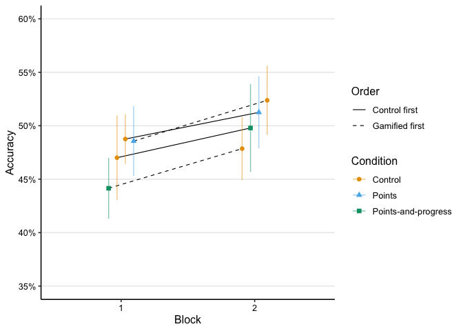
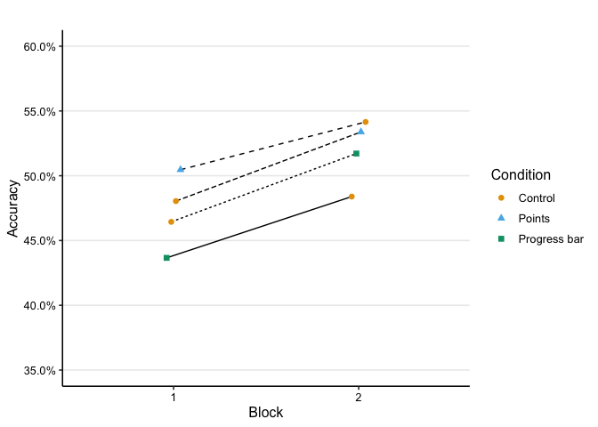
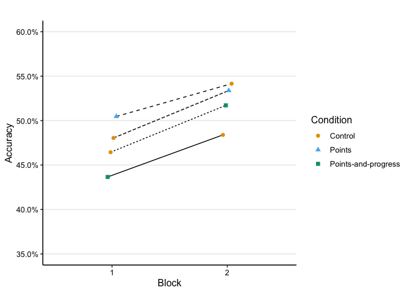
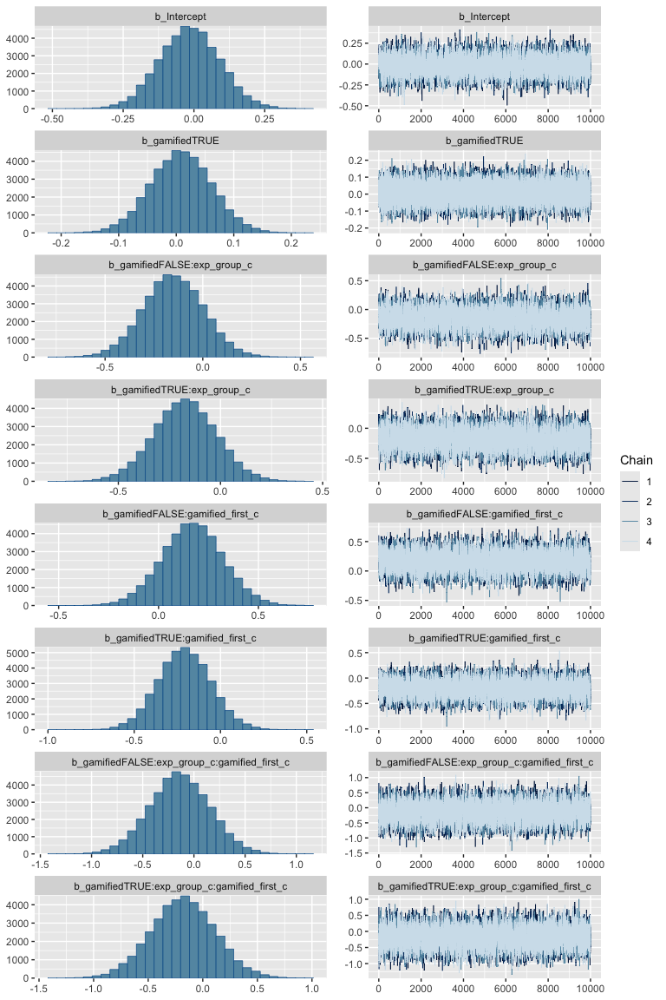
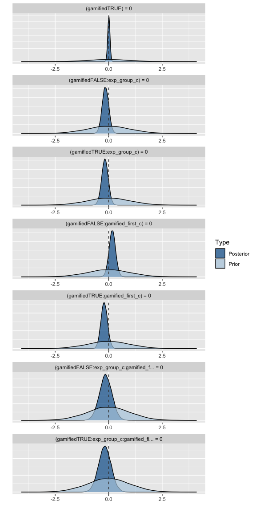
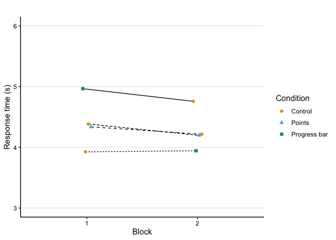
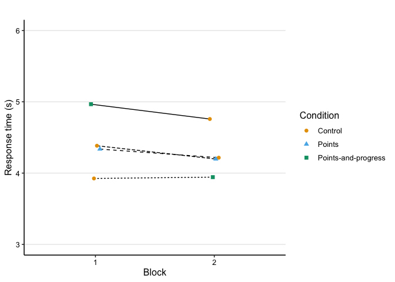
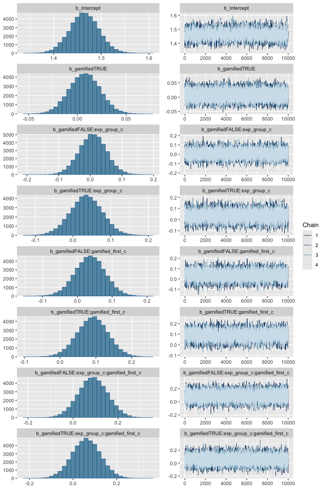
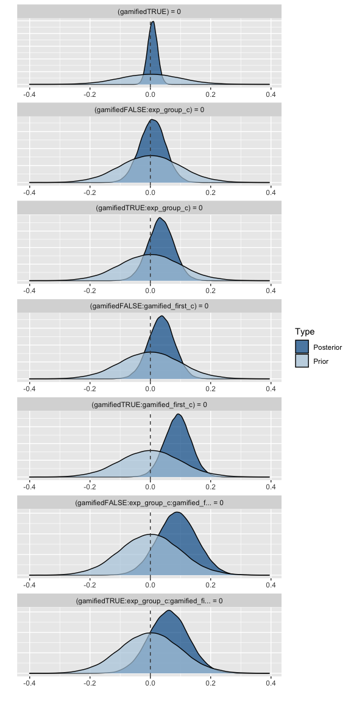
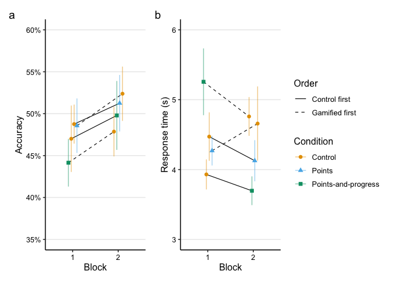

Analysis: posttest
================
Maarten van der Velde & Gesa van den Broek
Last updated: 2024-11-20

- [Setup](#setup)
- [Does gamification change learning outcomes on the
  test?](#does-gamification-change-learning-outcomes-on-the-test)
  - [Accuracy](#accuracy)
    - [Prepare data](#prepare-data)
    - [Visualise data](#visualise-data)
    - [Fit model](#fit-model)
    - [Visualise fitted model](#visualise-fitted-model)
    - [Bayesian regression model](#bayesian-regression-model)
  - [Response time](#response-time)
    - [Prepare data](#prepare-data-1)
    - [Visualise data](#visualise-data-1)
    - [Fit model](#fit-model-1)
    - [Fitted values](#fitted-values)
    - [Visualise fitted model](#visualise-fitted-model-1)
    - [Bayesian regression model](#bayesian-regression-model-1)
    - [Fitted values](#fitted-values-1)
  - [Conclusions](#conclusions)
  - [Combined plot](#combined-plot)
- [Save hypothesis testing output for
  visualisation](#save-hypothesis-testing-output-for-visualisation)
- [Session info](#session-info)

# Setup

``` r
library(here)
library(dplyr)
library(ggplot2)
library(scales)
library(patchwork)
library(stringr)
library(tidyr)
library(lme4)
library(lmerTest)
library(brms)

# Set up parallel processing for Bayesian models
library(future)
plan(multisession, workers = 4)
```

Helper functions for plots and tables:

``` r
source(here("scripts", "00_visualisation_functions.R"))
```

Load processed data:

``` r
d_test <- readRDS(here("data", "processed", "d_test.rds"))
```

``` r
add_experiment_cols <- function (data) {
  data |>
    mutate(exp_order = case_when(
      gamified_first == 0 & exp_group == "score" ~ "Control—Score",
      gamified_first == 0 & exp_group == "both" ~ "Control—Both",
      gamified_first == 1 & exp_group == "score" ~ "Score—Control",
      gamified_first == 1 & exp_group == "both" ~ "Both—Control"
    )) |>
    mutate(type = ifelse(gamified, "Gamified", "Control"))
}
```

Helper function for interpreting Bayes factors:

``` r
bf_to_strength <- function (bf) {
  
  direction <- "for"
  
  if (bf < 1) {
    bf <- 1/bf
    direction <- "against"
  }
  
  strength <- case_when(
    bf == 1 ~ "No",
    bf < 3 ~ "Anecdotal",
    bf < 10 ~ "Moderate",
    bf < 30 ~ "Strong",
    bf < 100 ~ "Very strong",
    TRUE ~ "Extreme"
  )
  
  paste0(strength, " evidence ", direction)
}
```

# Does gamification change learning outcomes on the test?

## Accuracy

### Prepare data

``` r
d_test_acc <- d_test |>
  group_by(subject, exp_group, block, condition, gamified, gamified_first) |>
  summarise(accuracy = mean(correct))
```

    ## `summarise()` has grouped output by 'subject', 'exp_group', 'block',
    ## 'condition', 'gamified'. You can override using the `.groups` argument.

``` r
d_test_acc_agg <- d_test_acc |>
  group_by(block, condition, gamified, gamified_first, exp_group) |>
  summarise(acc = mean(accuracy, na.rm = T),
            acc_se = sd(accuracy, na.rm = T)/sqrt(n())) |>
  ungroup() |>
  add_experiment_cols()
```

    ## `summarise()` has grouped output by 'block', 'condition', 'gamified',
    ## 'gamified_first'. You can override using the `.groups` argument.

### Visualise data

``` r
p_test_acc <- plot_data(d_test_acc_agg, acc, acc_se, "Accuracy") +
  scale_y_continuous(limits = c(.35, .6), labels = scales::percent_format())

p_test_acc
```

<!-- -->

### Fit model

Prepare data for modelling by mean-centering categorical predictors:

``` r
d_test_m <- d_test |>
  mutate(exp_group_c = ifelse(exp_group == "score", 0, 1),
         exp_group_c = exp_group_c - mean(exp_group_c),
         gamified_first_c = gamified_first - mean(gamified_first))
```

``` r
m_test_acc <- glmer(correct ~ gamified +
                       gamified:exp_group_c +
                       gamified:gamified_first_c +
                       gamified:gamified_first_c:exp_group_c +
                       (1 | subject) + (1 | fact),
                     family = "binomial",
                     data = d_test_m)

summary(m_test_acc)
```

    ## Generalized linear mixed model fit by maximum likelihood (Laplace
    ##   Approximation) [glmerMod]
    ##  Family: binomial  ( logit )
    ## Formula: 
    ## correct ~ gamified + gamified:exp_group_c + gamified:gamified_first_c +  
    ##     gamified:gamified_first_c:exp_group_c + (1 | subject) + (1 |      fact)
    ##    Data: d_test_m
    ## 
    ##      AIC      BIC   logLik deviance df.resid 
    ##   8909.2   8977.8  -4444.6   8889.2     7014 
    ## 
    ## Scaled residuals: 
    ##     Min      1Q  Median      3Q     Max 
    ## -3.8290 -0.8456  0.3436  0.8197  3.1357 
    ## 
    ## Random effects:
    ##  Groups  Name        Variance Std.Dev.
    ##  subject (Intercept) 0.6635   0.8145  
    ##  fact    (Intercept) 0.3379   0.5813  
    ## Number of obs: 7024, groups:  subject, 152; fact, 70
    ## 
    ## Fixed effects:
    ##                                             Estimate Std. Error z value
    ## (Intercept)                                -0.015175   0.103341  -0.147
    ## gamifiedTRUE                                0.008417   0.052769   0.160
    ## gamifiedFALSE:exp_group_c                  -0.153904   0.153331  -1.004
    ## gamifiedTRUE:exp_group_c                   -0.178017   0.153562  -1.159
    ## gamifiedFALSE:gamified_first_c              0.170561   0.153567   1.111
    ## gamifiedTRUE:gamified_first_c              -0.208889   0.153591  -1.360
    ## gamifiedFALSE:exp_group_c:gamified_first_c -0.166474   0.308267  -0.540
    ## gamifiedTRUE:exp_group_c:gamified_first_c  -0.206697   0.308355  -0.670
    ##                                            Pr(>|z|)
    ## (Intercept)                                   0.883
    ## gamifiedTRUE                                  0.873
    ## gamifiedFALSE:exp_group_c                     0.316
    ## gamifiedTRUE:exp_group_c                      0.246
    ## gamifiedFALSE:gamified_first_c                0.267
    ## gamifiedTRUE:gamified_first_c                 0.174
    ## gamifiedFALSE:exp_group_c:gamified_first_c    0.589
    ## gamifiedTRUE:exp_group_c:gamified_first_c     0.503
    ## 
    ## Correlation of Fixed Effects:
    ##               (Intr) gmTRUE gmfdFALSE:x__ gmfdTRUE:x__ gmfdFALSE:g__
    ## gamifidTRUE   -0.255                                                
    ## gmfdFALSE:x__ -0.019  0.004                                         
    ## gmfdTRUE:x__  -0.017  0.005  0.760                                  
    ## gmfdFALSE:g__ -0.019  0.007 -0.009        -0.007                    
    ## gmfdTRUE:g__  -0.015  0.012 -0.007        -0.004        0.763       
    ## gFALSE:__:_   -0.007  0.001 -0.028        -0.022       -0.025       
    ## gTRUE:__:__   -0.006  0.006 -0.022        -0.013       -0.023       
    ##               gmfdTRUE:g__ gFALSE:__:
    ## gamifidTRUE                          
    ## gmfdFALSE:x__                        
    ## gmfdTRUE:x__                         
    ## gmfdFALSE:g__                        
    ## gmfdTRUE:g__                         
    ## gFALSE:__:_   -0.023                 
    ## gTRUE:__:__   -0.019        0.761

``` r
print_model_table(m_test_acc)
```



### Visualise fitted model

``` r
p_test_acc_m <- plot_model_fit(m_test_acc, d_test_m, y_lab = "Accuracy") +
  scale_y_continuous(limits = c(.35, .6), labels = scales::percent_format(accuracy = .1))
```

    ##   block           condition gamified gamified_first exp_group gamified_first_c
    ## 1     1             Control    FALSE          FALSE      both       -0.5380125
    ## 2     1             Control    FALSE          FALSE     score       -0.5380125
    ## 3     1              Points     TRUE           TRUE     score        0.4619875
    ## 4     1 Points-and-progress     TRUE           TRUE      both        0.4619875
    ## 5     2             Control    FALSE           TRUE      both        0.4619875
    ## 6     2             Control    FALSE           TRUE     score        0.4619875
    ## 7     2              Points     TRUE          FALSE     score       -0.5380125
    ## 8     2 Points-and-progress     TRUE          FALSE      both       -0.5380125
    ##   exp_group_c  pred_val     exp_order     type
    ## 1   0.5545273 0.4644061  Control—Both  Control
    ## 2  -0.4454727 0.4804404 Control—Score  Control
    ## 3  -0.4454727 0.5046444 Score—Control Gamified
    ## 4   0.5545273 0.4366104  Both—Control Gamified
    ## 5   0.5545273 0.4839130  Both—Control  Control
    ## 6  -0.4454727 0.5415149 Score—Control  Control
    ## 7  -0.4454727 0.5337956 Control—Score Gamified
    ## 8   0.5545273 0.5171377  Control—Both Gamified

    ## Scale for y is already present.
    ## Adding another scale for y, which will replace the existing scale.

``` r
p_test_acc_m
```

<!-- -->

### Bayesian regression model

Fit again with `brms` so that we can calculate Bayes Factors. Because we
expect any fixed effects to be at most moderate in size, we will use a
weakly informative Normal(0, 1) prior for these effects.

``` r
m_test_acc_brms <- brm(correct ~ gamified +
                         gamified:exp_group_c +
                         gamified:gamified_first_c +
                         gamified:gamified_first_c:exp_group_c +
                         (1 | subject) + (1 | fact),
                       family = "bernoulli",
                       data = d_test_m,
                       prior = set_prior("normal(0, 1)", class = "b"),
                       chains = 4,
                       iter = 11000,
                       warmup = 1000,
                       sample_prior = TRUE,
                       future = TRUE,
                       seed = 0)
```

    ## Compiling Stan program...

    ## Trying to compile a simple C file

    ## Running /Library/Frameworks/R.framework/Resources/bin/R CMD SHLIB foo.c
    ## using C compiler: ‘Apple clang version 15.0.0 (clang-1500.3.9.4)’
    ## using SDK: ‘MacOSX14.4.sdk’
    ## clang -arch arm64 -I"/Library/Frameworks/R.framework/Resources/include" -DNDEBUG   -I"/Library/Frameworks/R.framework/Versions/4.3-arm64/Resources/library/Rcpp/include/"  -I"/Library/Frameworks/R.framework/Versions/4.3-arm64/Resources/library/RcppEigen/include/"  -I"/Library/Frameworks/R.framework/Versions/4.3-arm64/Resources/library/RcppEigen/include/unsupported"  -I"/Library/Frameworks/R.framework/Versions/4.3-arm64/Resources/library/BH/include" -I"/Library/Frameworks/R.framework/Versions/4.3-arm64/Resources/library/StanHeaders/include/src/"  -I"/Library/Frameworks/R.framework/Versions/4.3-arm64/Resources/library/StanHeaders/include/"  -I"/Library/Frameworks/R.framework/Versions/4.3-arm64/Resources/library/RcppParallel/include/"  -I"/Library/Frameworks/R.framework/Versions/4.3-arm64/Resources/library/rstan/include" -DEIGEN_NO_DEBUG  -DBOOST_DISABLE_ASSERTS  -DBOOST_PENDING_INTEGER_LOG2_HPP  -DSTAN_THREADS  -DUSE_STANC3 -DSTRICT_R_HEADERS  -DBOOST_PHOENIX_NO_VARIADIC_EXPRESSION  -D_HAS_AUTO_PTR_ETC=0  -include '/Library/Frameworks/R.framework/Versions/4.3-arm64/Resources/library/StanHeaders/include/stan/math/prim/fun/Eigen.hpp'  -D_REENTRANT -DRCPP_PARALLEL_USE_TBB=1   -I/opt/R/arm64/include    -fPIC  -falign-functions=64 -Wall -g -O2  -c foo.c -o foo.o
    ## In file included from <built-in>:1:
    ## In file included from /Library/Frameworks/R.framework/Versions/4.3-arm64/Resources/library/StanHeaders/include/stan/math/prim/fun/Eigen.hpp:22:
    ## In file included from /Library/Frameworks/R.framework/Versions/4.3-arm64/Resources/library/RcppEigen/include/Eigen/Dense:1:
    ## In file included from /Library/Frameworks/R.framework/Versions/4.3-arm64/Resources/library/RcppEigen/include/Eigen/Core:19:
    ## /Library/Frameworks/R.framework/Versions/4.3-arm64/Resources/library/RcppEigen/include/Eigen/src/Core/util/Macros.h:679:10: fatal error: 'cmath' file not found
    ## #include <cmath>
    ##          ^~~~~~~
    ## 1 error generated.
    ## make[1]: *** [foo.o] Error 1

    ## Start sampling

    ## 
    ## SAMPLING FOR MODEL 'anon_model' NOW (CHAIN 1).
    ## Chain 1: 
    ## Chain 1: Gradient evaluation took 0.00042 seconds
    ## Chain 1: 1000 transitions using 10 leapfrog steps per transition would take 4.2 seconds.
    ## Chain 1: Adjust your expectations accordingly!
    ## Chain 1: 
    ## Chain 1: 
    ## Chain 1: Iteration:     1 / 11000 [  0%]  (Warmup)
    ## Chain 1: Iteration:  1001 / 11000 [  9%]  (Sampling)
    ## Chain 1: Iteration:  2100 / 11000 [ 19%]  (Sampling)
    ## Chain 1: Iteration:  3200 / 11000 [ 29%]  (Sampling)
    ## Chain 1: Iteration:  4300 / 11000 [ 39%]  (Sampling)
    ## Chain 1: Iteration:  5400 / 11000 [ 49%]  (Sampling)
    ## Chain 1: Iteration:  6500 / 11000 [ 59%]  (Sampling)
    ## Chain 1: Iteration:  7600 / 11000 [ 69%]  (Sampling)
    ## Chain 1: Iteration:  8700 / 11000 [ 79%]  (Sampling)
    ## Chain 1: Iteration:  9800 / 11000 [ 89%]  (Sampling)
    ## Chain 1: Iteration: 10900 / 11000 [ 99%]  (Sampling)
    ## Chain 1: Iteration: 11000 / 11000 [100%]  (Sampling)
    ## Chain 1: 
    ## Chain 1:  Elapsed Time: 7.178 seconds (Warm-up)
    ## Chain 1:                46.207 seconds (Sampling)
    ## Chain 1:                53.385 seconds (Total)
    ## Chain 1: 
    ## 
    ## SAMPLING FOR MODEL 'anon_model' NOW (CHAIN 2).
    ## Chain 2: 
    ## Chain 2: Gradient evaluation took 0.000435 seconds
    ## Chain 2: 1000 transitions using 10 leapfrog steps per transition would take 4.35 seconds.
    ## Chain 2: Adjust your expectations accordingly!
    ## Chain 2: 
    ## Chain 2: 
    ## Chain 2: Iteration:     1 / 11000 [  0%]  (Warmup)
    ## Chain 2: Iteration:  1001 / 11000 [  9%]  (Sampling)
    ## Chain 2: Iteration:  2100 / 11000 [ 19%]  (Sampling)
    ## Chain 2: Iteration:  3200 / 11000 [ 29%]  (Sampling)
    ## Chain 2: Iteration:  4300 / 11000 [ 39%]  (Sampling)
    ## Chain 2: Iteration:  5400 / 11000 [ 49%]  (Sampling)
    ## Chain 2: Iteration:  6500 / 11000 [ 59%]  (Sampling)
    ## Chain 2: Iteration:  7600 / 11000 [ 69%]  (Sampling)
    ## Chain 2: Iteration:  8700 / 11000 [ 79%]  (Sampling)
    ## Chain 2: Iteration:  9800 / 11000 [ 89%]  (Sampling)
    ## Chain 2: Iteration: 10900 / 11000 [ 99%]  (Sampling)
    ## Chain 2: Iteration: 11000 / 11000 [100%]  (Sampling)
    ## Chain 2: 
    ## Chain 2:  Elapsed Time: 6.904 seconds (Warm-up)
    ## Chain 2:                46.375 seconds (Sampling)
    ## Chain 2:                53.279 seconds (Total)
    ## Chain 2: 
    ## 
    ## SAMPLING FOR MODEL 'anon_model' NOW (CHAIN 3).
    ## Chain 3: 
    ## Chain 3: Gradient evaluation took 0.000459 seconds
    ## Chain 3: 1000 transitions using 10 leapfrog steps per transition would take 4.59 seconds.
    ## Chain 3: Adjust your expectations accordingly!
    ## Chain 3: 
    ## Chain 3: 
    ## Chain 3: Iteration:     1 / 11000 [  0%]  (Warmup)
    ## Chain 3: Iteration:  1001 / 11000 [  9%]  (Sampling)
    ## Chain 3: Iteration:  2100 / 11000 [ 19%]  (Sampling)
    ## Chain 3: Iteration:  3200 / 11000 [ 29%]  (Sampling)
    ## Chain 3: Iteration:  4300 / 11000 [ 39%]  (Sampling)
    ## Chain 3: Iteration:  5400 / 11000 [ 49%]  (Sampling)
    ## Chain 3: Iteration:  6500 / 11000 [ 59%]  (Sampling)
    ## Chain 3: Iteration:  7600 / 11000 [ 69%]  (Sampling)
    ## Chain 3: Iteration:  8700 / 11000 [ 79%]  (Sampling)
    ## Chain 3: Iteration:  9800 / 11000 [ 89%]  (Sampling)
    ## Chain 3: Iteration: 10900 / 11000 [ 99%]  (Sampling)
    ## Chain 3: Iteration: 11000 / 11000 [100%]  (Sampling)
    ## Chain 3: 
    ## Chain 3:  Elapsed Time: 7.726 seconds (Warm-up)
    ## Chain 3:                46.071 seconds (Sampling)
    ## Chain 3:                53.797 seconds (Total)
    ## Chain 3: 
    ## 
    ## SAMPLING FOR MODEL 'anon_model' NOW (CHAIN 4).
    ## Chain 4: 
    ## Chain 4: Gradient evaluation took 0.000549 seconds
    ## Chain 4: 1000 transitions using 10 leapfrog steps per transition would take 5.49 seconds.
    ## Chain 4: Adjust your expectations accordingly!
    ## Chain 4: 
    ## Chain 4: 
    ## Chain 4: Iteration:     1 / 11000 [  0%]  (Warmup)
    ## Chain 4: Iteration:  1001 / 11000 [  9%]  (Sampling)
    ## Chain 4: Iteration:  2100 / 11000 [ 19%]  (Sampling)
    ## Chain 4: Iteration:  3200 / 11000 [ 29%]  (Sampling)
    ## Chain 4: Iteration:  4300 / 11000 [ 39%]  (Sampling)
    ## Chain 4: Iteration:  5400 / 11000 [ 49%]  (Sampling)
    ## Chain 4: Iteration:  6500 / 11000 [ 59%]  (Sampling)
    ## Chain 4: Iteration:  7600 / 11000 [ 69%]  (Sampling)
    ## Chain 4: Iteration:  8700 / 11000 [ 79%]  (Sampling)
    ## Chain 4: Iteration:  9800 / 11000 [ 89%]  (Sampling)
    ## Chain 4: Iteration: 10900 / 11000 [ 99%]  (Sampling)
    ## Chain 4: Iteration: 11000 / 11000 [100%]  (Sampling)
    ## Chain 4: 
    ## Chain 4:  Elapsed Time: 7.222 seconds (Warm-up)
    ## Chain 4:                46.281 seconds (Sampling)
    ## Chain 4:                53.503 seconds (Total)
    ## Chain 4:

``` r
summary(m_test_acc_brms)
```

    ##  Family: bernoulli 
    ##   Links: mu = logit 
    ## Formula: correct ~ gamified + gamified:exp_group_c + gamified:gamified_first_c + gamified:gamified_first_c:exp_group_c + (1 | subject) + (1 | fact) 
    ##    Data: d_test_m (Number of observations: 7024) 
    ##   Draws: 4 chains, each with iter = 11000; warmup = 1000; thin = 1;
    ##          total post-warmup draws = 40000
    ## 
    ## Multilevel Hyperparameters:
    ## ~fact (Number of levels: 70) 
    ##               Estimate Est.Error l-95% CI u-95% CI Rhat Bulk_ESS Tail_ESS
    ## sd(Intercept)     0.60      0.06     0.49     0.72 1.00     9887    18255
    ## 
    ## ~subject (Number of levels: 152) 
    ##               Estimate Est.Error l-95% CI u-95% CI Rhat Bulk_ESS Tail_ESS
    ## sd(Intercept)     0.84      0.06     0.72     0.97 1.00    10168    18058
    ## 
    ## Regression Coefficients:
    ##                                            Estimate Est.Error l-95% CI u-95% CI
    ## Intercept                                     -0.02      0.11    -0.22     0.19
    ## gamifiedTRUE                                   0.01      0.05    -0.10     0.11
    ## gamifiedFALSE:exp_group_c                     -0.15      0.15    -0.45     0.15
    ## gamifiedTRUE:exp_group_c                      -0.17      0.15    -0.48     0.13
    ## gamifiedFALSE:gamified_first_c                 0.17      0.15    -0.13     0.47
    ## gamifiedTRUE:gamified_first_c                 -0.21      0.15    -0.51     0.10
    ## gamifiedFALSE:exp_group_c:gamified_first_c    -0.14      0.29    -0.72     0.44
    ## gamifiedTRUE:exp_group_c:gamified_first_c     -0.18      0.29    -0.76     0.40
    ##                                            Rhat Bulk_ESS Tail_ESS
    ## Intercept                                  1.00     6025    11946
    ## gamifiedTRUE                               1.00    56931    30687
    ## gamifiedFALSE:exp_group_c                  1.00     6665    13012
    ## gamifiedTRUE:exp_group_c                   1.00     6751    13442
    ## gamifiedFALSE:gamified_first_c             1.00     6871    14131
    ## gamifiedTRUE:gamified_first_c              1.00     6895    14193
    ## gamifiedFALSE:exp_group_c:gamified_first_c 1.00     7791    15057
    ## gamifiedTRUE:exp_group_c:gamified_first_c  1.00     7762    14611
    ## 
    ## Draws were sampled using sampling(NUTS). For each parameter, Bulk_ESS
    ## and Tail_ESS are effective sample size measures, and Rhat is the potential
    ## scale reduction factor on split chains (at convergence, Rhat = 1).

Inspect the posterior sample distributions of the fixed effects:

``` r
plot(m_test_acc_brms, nvariables = 8, variable = "^b_", regex = TRUE)
```

<!-- -->

#### Bayes factors

Do a hypothesis test for all fixed-effect coefficients (both main
effects and interactions) in the model being equal to zero. The column
`Evid.Ratio` shows the Bayes Factor in favour of the null hypothesis
($BF_{01}$).

``` r
h_test_acc <- hypothesis(m_test_acc_brms,
                         c("gamifiedTRUE = 0",
                           "gamifiedFALSE:exp_group_c = 0",
                           "gamifiedTRUE:exp_group_c = 0",
                           "gamifiedFALSE:gamified_first_c = 0",
                           "gamifiedTRUE:gamified_first_c = 0",
                           "gamifiedFALSE:exp_group_c:gamified_first_c = 0",
                           "gamifiedTRUE:exp_group_c:gamified_first_c = 0"),
                         class = "b")

h_test_acc$hypothesis |>
  mutate(BF10 = 1 / Evid.Ratio,
         evidence_for_null = sapply(Evid.Ratio, bf_to_strength))
```

    ##                                         Hypothesis     Estimate  Est.Error
    ## 1                               (gamifiedTRUE) = 0  0.008687397 0.05334058
    ## 2                  (gamifiedFALSE:exp_group_c) = 0 -0.150083022 0.15390634
    ## 3                   (gamifiedTRUE:exp_group_c) = 0 -0.173554559 0.15415135
    ## 4             (gamifiedFALSE:gamified_first_c) = 0  0.170015856 0.15321421
    ## 5              (gamifiedTRUE:gamified_first_c) = 0 -0.208223991 0.15343810
    ## 6 (gamifiedFALSE:exp_group_c:gamified_first_c) = 0 -0.138816109 0.29414821
    ## 7  (gamifiedTRUE:exp_group_c:gamified_first_c) = 0 -0.179908087 0.29341963
    ##      CI.Lower   CI.Upper Evid.Ratio Post.Prob Star       BF10
    ## 1 -0.09612076 0.11367826  18.994024 0.9499851      0.05264814
    ## 2 -0.45290662 0.15089147   4.182169 0.8070306      0.23911039
    ## 3 -0.47626402 0.12868003   3.541179 0.7797929      0.28239179
    ## 4 -0.13132973 0.47229239   3.484678 0.7770186      0.28697052
    ## 5 -0.50881536 0.09736747   2.628270 0.7243866      0.38047836
    ## 6 -0.71845073 0.44140706   3.032078 0.7519889      0.32980681
    ## 7 -0.75671810 0.40069861   2.849107 0.7401995      0.35098711
    ##        evidence_for_null
    ## 1    Strong evidence for
    ## 2  Moderate evidence for
    ## 3  Moderate evidence for
    ## 4  Moderate evidence for
    ## 5 Anecdotal evidence for
    ## 6  Moderate evidence for
    ## 7 Anecdotal evidence for

This hypothesis test is calculating the Savage-Dickey density ratio at
zero, which is a ratio of the posterior density at zero relative to the
prior density at zero (indicated by dashed vertical line). Values above
1 indicate a stronger belief that the effect is indeed zero after having
observed the data.

``` r
sd_ratio_acc <- plot(h_test_acc, nvariables = 8, variable = "^b_", regex = TRUE, plot = FALSE)

sd_ratio_acc[[1]] +
  geom_vline(xintercept = 0, linetype = "dashed", colour = "grey25")
```

<!-- -->

#### Conclusion

The Bayesian model finds anecdotal to strong evidence in favour of the
null hypothesis (no effect on posttest accuracy) for each of the
regression coefficients.

## Response time

Response time on correct answers only.

### Prepare data

To keep the visualisation of average response times by condition simple,
we calculate the median RT per participant, and then take the mean and
SD of these medians (which are themselves roughly normally distributed).

``` r
d_test_rt <- d_test |>
  filter(correct) |>
  mutate(rt = rt / 1000) |>
  group_by(subject, exp_group, block, condition, gamified, gamified_first) |>
  summarise(rt_median = median(rt, na.rm = TRUE))
```

    ## `summarise()` has grouped output by 'subject', 'exp_group', 'block',
    ## 'condition', 'gamified'. You can override using the `.groups` argument.

``` r
d_test_rt_agg <- d_test_rt |>
  group_by(block, condition, gamified, gamified_first, exp_group) |>
  summarise(rt_mean = mean(rt_median, na.rm = T),
            rt_se = sd(rt_median, na.rm = T)/sqrt(n())) |>
  ungroup() |>
  add_experiment_cols()
```

    ## `summarise()` has grouped output by 'block', 'condition', 'gamified',
    ## 'gamified_first'. You can override using the `.groups` argument.

### Visualise data

``` r
p_test_rt <- plot_data(d_test_rt_agg, rt_mean, rt_se, "Response time (s)") +
  scale_y_continuous(limits = c(3, 6), labels = scales::comma_format())

p_test_rt
```

<!-- -->

### Fit model

Since RT data is not normally distributed, we fit a lognormal model to
the response times. (See
<https://bbolker.github.io/mixedmodels-misc/glmmFAQ.html#gamma-glmms> .)
Prepare data for modelling by mean-centering categorical predictors:

``` r
d_test_rt_m <- d_test |>
  filter(correct) |>
  mutate(log_rt = log(rt / 1000)) |>
  mutate(exp_group_c = ifelse(exp_group == "score", 0, 1),
         exp_group_c = exp_group_c - mean(exp_group_c),
         gamified_first_c = gamified_first - mean(gamified_first))
```

``` r
m_test_rt <- lmer(log_rt ~ gamified +
                      gamified:exp_group_c +
                      gamified:gamified_first_c +
                      gamified:gamified_first_c:exp_group_c +
                      (1 | subject) + (1 | fact),
                    data = d_test_rt_m)

summary(m_test_rt)
```

    ## Linear mixed model fit by REML. t-tests use Satterthwaite's method [
    ## lmerModLmerTest]
    ## Formula: 
    ## log_rt ~ gamified + gamified:exp_group_c + gamified:gamified_first_c +  
    ##     gamified:gamified_first_c:exp_group_c + (1 | subject) + (1 |      fact)
    ##    Data: d_test_rt_m
    ## 
    ## REML criterion at convergence: 5381.8
    ## 
    ## Scaled residuals: 
    ##     Min      1Q  Median      3Q     Max 
    ## -2.9689 -0.6786 -0.1696  0.5261  4.8408 
    ## 
    ## Random effects:
    ##  Groups   Name        Variance Std.Dev.
    ##  subject  (Intercept) 0.07237  0.2690  
    ##  fact     (Intercept) 0.01968  0.1403  
    ##  Residual             0.22400  0.4733  
    ## Number of obs: 3673, groups:  subject, 152; fact, 70
    ## 
    ## Fixed effects:
    ##                                             Estimate Std. Error        df
    ## (Intercept)                                1.463e+00  3.028e-02 2.065e+02
    ## gamifiedTRUE                               7.858e-03  1.611e-02 3.515e+03
    ## gamifiedFALSE:exp_group_c                  1.367e-02  5.045e-02 1.720e+02
    ## gamifiedTRUE:exp_group_c                   4.380e-02  5.067e-02 1.736e+02
    ## gamifiedFALSE:gamified_first_c             6.011e-02  5.053e-02 1.708e+02
    ## gamifiedTRUE:gamified_first_c              1.174e-01  5.064e-02 1.711e+02
    ## gamifiedFALSE:exp_group_c:gamified_first_c 2.316e-01  1.015e-01 1.723e+02
    ## gamifiedTRUE:exp_group_c:gamified_first_c  1.980e-01  1.017e-01 1.727e+02
    ##                                            t value Pr(>|t|)    
    ## (Intercept)                                 48.315   <2e-16 ***
    ## gamifiedTRUE                                 0.488   0.6257    
    ## gamifiedFALSE:exp_group_c                    0.271   0.7867    
    ## gamifiedTRUE:exp_group_c                     0.864   0.3885    
    ## gamifiedFALSE:gamified_first_c               1.190   0.2358    
    ## gamifiedTRUE:gamified_first_c                2.318   0.0216 *  
    ## gamifiedFALSE:exp_group_c:gamified_first_c   2.282   0.0237 *  
    ## gamifiedTRUE:exp_group_c:gamified_first_c    1.946   0.0533 .  
    ## ---
    ## Signif. codes:  0 '***' 0.001 '**' 0.01 '*' 0.05 '.' 0.1 ' ' 1
    ## 
    ## Correlation of Fixed Effects:
    ##               (Intr) gmTRUE gmfdFALSE:x__ gmfdTRUE:x__ gmfdFALSE:g__
    ## gamifidTRUE   -0.262                                                
    ## gmfdFALSE:x__ -0.040  0.000                                         
    ## gmfdTRUE:x__  -0.040  0.006  0.792                                  
    ## gmfdFALSE:g__ -0.028  0.018 -0.005        -0.016                    
    ## gmfdTRUE:g__  -0.018  0.018 -0.016         0.002        0.796       
    ## gFALSE:__:_   -0.004 -0.016 -0.036        -0.028       -0.048       
    ## gTRUE:__:__   -0.014  0.029 -0.027        -0.008       -0.045       
    ##               gmfdTRUE:g__ gFALSE:__:
    ## gamifidTRUE                          
    ## gmfdFALSE:x__                        
    ## gmfdTRUE:x__                         
    ## gmfdFALSE:g__                        
    ## gmfdTRUE:g__                         
    ## gFALSE:__:_   -0.046                 
    ## gTRUE:__:__   -0.046        0.792

``` r
print_model_table(m_test_rt)
```


### Fitted values

``` r
d_model_fit <- crossing(
  gamified = TRUE, 
  exp_group_c = 0, 
  gamified_first_c = sort(unique(d_test_rt_m$gamified_first_c))
)

d_model_fit$model_fit <- predict(m_test_rt,
                                 newdata = d_model_fit,
                                 re.form = NA, 
                                 type = "response") |>
  exp() # Transform logRT to RT

d_model_fit
```

    ## # A tibble: 2 × 4
    ##   gamified exp_group_c gamified_first_c model_fit
    ##   <lgl>          <dbl>            <dbl>     <dbl>
    ## 1 TRUE               0           -0.536      4.09
    ## 2 TRUE               0            0.464      4.60

``` r
d_model_fit <- crossing(
  gamified = FALSE, 
  exp_group_c = sort(unique(d_test_rt_m$exp_group_c)), 
  gamified_first_c = sort(unique(d_test_rt_m$gamified_first_c))
)

d_model_fit$model_fit <- predict(m_test_rt,
                                 newdata = d_model_fit,
                                 re.form = NA, 
                                 type = "response") |>
  exp() # Transform logRT to RT

d_model_fit
```

    ## # A tibble: 4 × 4
    ##   gamified exp_group_c gamified_first_c model_fit
    ##   <lgl>          <dbl>            <dbl>     <dbl>
    ## 1 FALSE         -0.428           -0.536      4.38
    ## 2 FALSE         -0.428            0.464      4.22
    ## 3 FALSE          0.572           -0.536      3.92
    ## 4 FALSE          0.572            0.464      4.76

### Visualise fitted model

``` r
p_test_rt_m <- plot_model_fit(m_test_rt, d_test_rt_m, exp_trans = TRUE, y_lab = "Response time (s)") +
  scale_y_continuous(limits = c(3, 6), labels = scales::comma_format())
```

    ##   block           condition gamified gamified_first exp_group gamified_first_c
    ## 1     1             Control    FALSE          FALSE      both       -0.5363463
    ## 2     1             Control    FALSE          FALSE     score       -0.5363463
    ## 3     1              Points     TRUE           TRUE     score        0.4636537
    ## 4     1 Points-and-progress     TRUE           TRUE      both        0.4636537
    ## 5     2             Control    FALSE           TRUE      both        0.4636537
    ## 6     2             Control    FALSE           TRUE     score        0.4636537
    ## 7     2              Points     TRUE          FALSE     score       -0.5363463
    ## 8     2 Points-and-progress     TRUE          FALSE      both       -0.5363463
    ##   exp_group_c pred_val     exp_order     type
    ## 1   0.5722842 3.924932  Control—Both  Control
    ## 2  -0.4277158 4.383624 Control—Score  Control
    ## 3  -0.4277158 4.336746 Score—Control Gamified
    ## 4   0.5722842 4.966467  Both—Control Gamified
    ## 5   0.5722842 4.758713  Both—Control  Control
    ## 6  -0.4277158 4.216226 Score—Control  Control
    ## 7  -0.4277158 4.197234 Control—Score Gamified
    ## 8   0.5722842 3.943450  Control—Both Gamified

    ## Scale for y is already present.
    ## Adding another scale for y, which will replace the existing scale.

``` r
p_test_rt_m
```

<!-- -->

### Bayesian regression model

Fit again with `brms` so that we can calculate Bayes Factors. Because we
expect any fixed effects to be at most moderate in size, we will use a
weakly informative Normal(0, 1) prior for these effects.

``` r
m_test_rt_brms <- brm(log_rt ~ gamified +
                         gamified:exp_group_c +
                         gamified:gamified_first_c +
                         gamified:gamified_first_c:exp_group_c +
                         (1 | subject) + (1 | fact),
                       family = "gaussian",
                       data = d_test_rt_m,
                       prior = set_prior("normal(0, .1)", class = "b"),
                       chains = 4,
                       iter = 11000,
                       warmup = 1000,
                       sample_prior = TRUE,
                       future = TRUE,
                       seed = 0)
```

    ## Compiling Stan program...

    ## Trying to compile a simple C file

    ## Running /Library/Frameworks/R.framework/Resources/bin/R CMD SHLIB foo.c
    ## using C compiler: ‘Apple clang version 15.0.0 (clang-1500.3.9.4)’
    ## using SDK: ‘MacOSX14.4.sdk’
    ## clang -arch arm64 -I"/Library/Frameworks/R.framework/Resources/include" -DNDEBUG   -I"/Library/Frameworks/R.framework/Versions/4.3-arm64/Resources/library/Rcpp/include/"  -I"/Library/Frameworks/R.framework/Versions/4.3-arm64/Resources/library/RcppEigen/include/"  -I"/Library/Frameworks/R.framework/Versions/4.3-arm64/Resources/library/RcppEigen/include/unsupported"  -I"/Library/Frameworks/R.framework/Versions/4.3-arm64/Resources/library/BH/include" -I"/Library/Frameworks/R.framework/Versions/4.3-arm64/Resources/library/StanHeaders/include/src/"  -I"/Library/Frameworks/R.framework/Versions/4.3-arm64/Resources/library/StanHeaders/include/"  -I"/Library/Frameworks/R.framework/Versions/4.3-arm64/Resources/library/RcppParallel/include/"  -I"/Library/Frameworks/R.framework/Versions/4.3-arm64/Resources/library/rstan/include" -DEIGEN_NO_DEBUG  -DBOOST_DISABLE_ASSERTS  -DBOOST_PENDING_INTEGER_LOG2_HPP  -DSTAN_THREADS  -DUSE_STANC3 -DSTRICT_R_HEADERS  -DBOOST_PHOENIX_NO_VARIADIC_EXPRESSION  -D_HAS_AUTO_PTR_ETC=0  -include '/Library/Frameworks/R.framework/Versions/4.3-arm64/Resources/library/StanHeaders/include/stan/math/prim/fun/Eigen.hpp'  -D_REENTRANT -DRCPP_PARALLEL_USE_TBB=1   -I/opt/R/arm64/include    -fPIC  -falign-functions=64 -Wall -g -O2  -c foo.c -o foo.o
    ## In file included from <built-in>:1:
    ## In file included from /Library/Frameworks/R.framework/Versions/4.3-arm64/Resources/library/StanHeaders/include/stan/math/prim/fun/Eigen.hpp:22:
    ## In file included from /Library/Frameworks/R.framework/Versions/4.3-arm64/Resources/library/RcppEigen/include/Eigen/Dense:1:
    ## In file included from /Library/Frameworks/R.framework/Versions/4.3-arm64/Resources/library/RcppEigen/include/Eigen/Core:19:
    ## /Library/Frameworks/R.framework/Versions/4.3-arm64/Resources/library/RcppEigen/include/Eigen/src/Core/util/Macros.h:679:10: fatal error: 'cmath' file not found
    ## #include <cmath>
    ##          ^~~~~~~
    ## 1 error generated.
    ## make[1]: *** [foo.o] Error 1

    ## Start sampling

    ## 
    ## SAMPLING FOR MODEL 'anon_model' NOW (CHAIN 1).
    ## Chain 1: 
    ## Chain 1: Gradient evaluation took 0.000257 seconds
    ## Chain 1: 1000 transitions using 10 leapfrog steps per transition would take 2.57 seconds.
    ## Chain 1: Adjust your expectations accordingly!
    ## Chain 1: 
    ## Chain 1: 
    ## Chain 1: Iteration:     1 / 11000 [  0%]  (Warmup)
    ## Chain 1: Iteration:  1001 / 11000 [  9%]  (Sampling)
    ## Chain 1: Iteration:  2100 / 11000 [ 19%]  (Sampling)
    ## Chain 1: Iteration:  3200 / 11000 [ 29%]  (Sampling)
    ## Chain 1: Iteration:  4300 / 11000 [ 39%]  (Sampling)
    ## Chain 1: Iteration:  5400 / 11000 [ 49%]  (Sampling)
    ## Chain 1: Iteration:  6500 / 11000 [ 59%]  (Sampling)
    ## Chain 1: Iteration:  7600 / 11000 [ 69%]  (Sampling)
    ## Chain 1: Iteration:  8700 / 11000 [ 79%]  (Sampling)
    ## Chain 1: Iteration:  9800 / 11000 [ 89%]  (Sampling)
    ## Chain 1: Iteration: 10900 / 11000 [ 99%]  (Sampling)
    ## Chain 1: Iteration: 11000 / 11000 [100%]  (Sampling)
    ## Chain 1: 
    ## Chain 1:  Elapsed Time: 5.261 seconds (Warm-up)
    ## Chain 1:                19.711 seconds (Sampling)
    ## Chain 1:                24.972 seconds (Total)
    ## Chain 1: 
    ## 
    ## SAMPLING FOR MODEL 'anon_model' NOW (CHAIN 2).
    ## Chain 2: 
    ## Chain 2: Gradient evaluation took 0.00024 seconds
    ## Chain 2: 1000 transitions using 10 leapfrog steps per transition would take 2.4 seconds.
    ## Chain 2: Adjust your expectations accordingly!
    ## Chain 2: 
    ## Chain 2: 
    ## Chain 2: Iteration:     1 / 11000 [  0%]  (Warmup)
    ## Chain 2: Iteration:  1001 / 11000 [  9%]  (Sampling)
    ## Chain 2: Iteration:  2100 / 11000 [ 19%]  (Sampling)
    ## Chain 2: Iteration:  3200 / 11000 [ 29%]  (Sampling)
    ## Chain 2: Iteration:  4300 / 11000 [ 39%]  (Sampling)
    ## Chain 2: Iteration:  5400 / 11000 [ 49%]  (Sampling)
    ## Chain 2: Iteration:  6500 / 11000 [ 59%]  (Sampling)
    ## Chain 2: Iteration:  7600 / 11000 [ 69%]  (Sampling)
    ## Chain 2: Iteration:  8700 / 11000 [ 79%]  (Sampling)
    ## Chain 2: Iteration:  9800 / 11000 [ 89%]  (Sampling)
    ## Chain 2: Iteration: 10900 / 11000 [ 99%]  (Sampling)
    ## Chain 2: Iteration: 11000 / 11000 [100%]  (Sampling)
    ## Chain 2: 
    ## Chain 2:  Elapsed Time: 5.355 seconds (Warm-up)
    ## Chain 2:                23.267 seconds (Sampling)
    ## Chain 2:                28.622 seconds (Total)
    ## Chain 2: 
    ## 
    ## SAMPLING FOR MODEL 'anon_model' NOW (CHAIN 3).
    ## Chain 3: 
    ## Chain 3: Gradient evaluation took 0.00025 seconds
    ## Chain 3: 1000 transitions using 10 leapfrog steps per transition would take 2.5 seconds.
    ## Chain 3: Adjust your expectations accordingly!
    ## Chain 3: 
    ## Chain 3: 
    ## Chain 3: Iteration:     1 / 11000 [  0%]  (Warmup)
    ## Chain 3: Iteration:  1001 / 11000 [  9%]  (Sampling)
    ## Chain 3: Iteration:  2100 / 11000 [ 19%]  (Sampling)
    ## Chain 3: Iteration:  3200 / 11000 [ 29%]  (Sampling)
    ## Chain 3: Iteration:  4300 / 11000 [ 39%]  (Sampling)
    ## Chain 3: Iteration:  5400 / 11000 [ 49%]  (Sampling)
    ## Chain 3: Iteration:  6500 / 11000 [ 59%]  (Sampling)
    ## Chain 3: Iteration:  7600 / 11000 [ 69%]  (Sampling)
    ## Chain 3: Iteration:  8700 / 11000 [ 79%]  (Sampling)
    ## Chain 3: Iteration:  9800 / 11000 [ 89%]  (Sampling)
    ## Chain 3: Iteration: 10900 / 11000 [ 99%]  (Sampling)
    ## Chain 3: Iteration: 11000 / 11000 [100%]  (Sampling)
    ## Chain 3: 
    ## Chain 3:  Elapsed Time: 5.416 seconds (Warm-up)
    ## Chain 3:                26.424 seconds (Sampling)
    ## Chain 3:                31.84 seconds (Total)
    ## Chain 3: 
    ## 
    ## SAMPLING FOR MODEL 'anon_model' NOW (CHAIN 4).
    ## Chain 4: 
    ## Chain 4: Gradient evaluation took 0.00028 seconds
    ## Chain 4: 1000 transitions using 10 leapfrog steps per transition would take 2.8 seconds.
    ## Chain 4: Adjust your expectations accordingly!
    ## Chain 4: 
    ## Chain 4: 
    ## Chain 4: Iteration:     1 / 11000 [  0%]  (Warmup)
    ## Chain 4: Iteration:  1001 / 11000 [  9%]  (Sampling)
    ## Chain 4: Iteration:  2100 / 11000 [ 19%]  (Sampling)
    ## Chain 4: Iteration:  3200 / 11000 [ 29%]  (Sampling)
    ## Chain 4: Iteration:  4300 / 11000 [ 39%]  (Sampling)
    ## Chain 4: Iteration:  5400 / 11000 [ 49%]  (Sampling)
    ## Chain 4: Iteration:  6500 / 11000 [ 59%]  (Sampling)
    ## Chain 4: Iteration:  7600 / 11000 [ 69%]  (Sampling)
    ## Chain 4: Iteration:  8700 / 11000 [ 79%]  (Sampling)
    ## Chain 4: Iteration:  9800 / 11000 [ 89%]  (Sampling)
    ## Chain 4: Iteration: 10900 / 11000 [ 99%]  (Sampling)
    ## Chain 4: Iteration: 11000 / 11000 [100%]  (Sampling)
    ## Chain 4: 
    ## Chain 4:  Elapsed Time: 5.303 seconds (Warm-up)
    ## Chain 4:                19.681 seconds (Sampling)
    ## Chain 4:                24.984 seconds (Total)
    ## Chain 4:

``` r
summary(m_test_rt_brms)
```

    ##  Family: gaussian 
    ##   Links: mu = identity; sigma = identity 
    ## Formula: log_rt ~ gamified + gamified:exp_group_c + gamified:gamified_first_c + gamified:gamified_first_c:exp_group_c + (1 | subject) + (1 | fact) 
    ##    Data: d_test_rt_m (Number of observations: 3673) 
    ##   Draws: 4 chains, each with iter = 11000; warmup = 1000; thin = 1;
    ##          total post-warmup draws = 40000
    ## 
    ## Multilevel Hyperparameters:
    ## ~fact (Number of levels: 70) 
    ##               Estimate Est.Error l-95% CI u-95% CI Rhat Bulk_ESS Tail_ESS
    ## sd(Intercept)     0.14      0.02     0.12     0.18 1.00    10785    18637
    ## 
    ## ~subject (Number of levels: 152) 
    ##               Estimate Est.Error l-95% CI u-95% CI Rhat Bulk_ESS Tail_ESS
    ## sd(Intercept)     0.27      0.02     0.24     0.31 1.00     7496    13982
    ## 
    ## Regression Coefficients:
    ##                                            Estimate Est.Error l-95% CI u-95% CI
    ## Intercept                                      1.46      0.03     1.40     1.53
    ## gamifiedTRUE                                   0.01      0.02    -0.02     0.04
    ## gamifiedFALSE:exp_group_c                      0.01      0.04    -0.08     0.09
    ## gamifiedTRUE:exp_group_c                       0.03      0.04    -0.05     0.12
    ## gamifiedFALSE:gamified_first_c                 0.04      0.04    -0.05     0.12
    ## gamifiedTRUE:gamified_first_c                  0.09      0.04     0.01     0.17
    ## gamifiedFALSE:exp_group_c:gamified_first_c     0.09      0.06    -0.04     0.22
    ## gamifiedTRUE:exp_group_c:gamified_first_c      0.06      0.07    -0.07     0.19
    ##                                            Rhat Bulk_ESS Tail_ESS
    ## Intercept                                  1.00     5821    10898
    ## gamifiedTRUE                               1.00    44637    31503
    ## gamifiedFALSE:exp_group_c                  1.00     7546    14751
    ## gamifiedTRUE:exp_group_c                   1.00     7609    15045
    ## gamifiedFALSE:gamified_first_c             1.00     6795    14173
    ## gamifiedTRUE:gamified_first_c              1.00     6834    13035
    ## gamifiedFALSE:exp_group_c:gamified_first_c 1.00    12457    22090
    ## gamifiedTRUE:exp_group_c:gamified_first_c  1.00    12397    21890
    ## 
    ## Further Distributional Parameters:
    ##       Estimate Est.Error l-95% CI u-95% CI Rhat Bulk_ESS Tail_ESS
    ## sigma     0.47      0.01     0.46     0.48 1.00    45311    30732
    ## 
    ## Draws were sampled using sampling(NUTS). For each parameter, Bulk_ESS
    ## and Tail_ESS are effective sample size measures, and Rhat is the potential
    ## scale reduction factor on split chains (at convergence, Rhat = 1).

Inspect the posterior sample distributions of the fixed effects:

``` r
plot(m_test_rt_brms, nvariables = 8, variable = "^b_", regex = TRUE)
```

<!-- -->

#### Bayes factors

Do a hypothesis test for all fixed-effect coefficients (both main
effects and interactions) in the model being equal to zero. The column
`Evid.Ratio` shows the Bayes Factor in favour of the null hypothesis
($BF_{01}$).

``` r
h_test_rt <- hypothesis(m_test_rt_brms,
                         c("gamifiedTRUE = 0",
                           "gamifiedFALSE:exp_group_c = 0",
                           "gamifiedTRUE:exp_group_c = 0",
                           "gamifiedFALSE:gamified_first_c = 0",
                           "gamifiedTRUE:gamified_first_c = 0",
                           "gamifiedFALSE:exp_group_c:gamified_first_c = 0",
                           "gamifiedTRUE:exp_group_c:gamified_first_c = 0"),
                         class = "b")


h_test_rt$hypothesis |>
  mutate(BF10 = 1 / Evid.Ratio,
         evidence_for_null = sapply(Evid.Ratio, bf_to_strength))
```

    ##                                         Hypothesis    Estimate  Est.Error
    ## 1                               (gamifiedTRUE) = 0 0.007487736 0.01588308
    ## 2                  (gamifiedFALSE:exp_group_c) = 0 0.007674597 0.04269901
    ## 3                   (gamifiedTRUE:exp_group_c) = 0 0.034947116 0.04272960
    ## 4             (gamifiedFALSE:gamified_first_c) = 0 0.036578155 0.04300717
    ## 5              (gamifiedTRUE:gamified_first_c) = 0 0.090629947 0.04302191
    ## 6 (gamifiedFALSE:exp_group_c:gamified_first_c) = 0 0.088914561 0.06496967
    ## 7  (gamifiedTRUE:exp_group_c:gamified_first_c) = 0 0.060585282 0.06501708
    ##       CI.Lower   CI.Upper Evid.Ratio Post.Prob Star      BF10
    ## 1 -0.023478799 0.03861548  5.6185711 0.8489100      0.1779812
    ## 2 -0.076479164 0.09148120  2.3223758 0.6990106      0.4305935
    ## 3 -0.049420898 0.11859916  1.6599279 0.6240500      0.6024358
    ## 4 -0.048309069 0.12050966  1.6226974 0.6187132      0.6162579
    ## 5  0.005380672 0.17472226  0.2712556 0.2133761    * 3.6865596
    ## 6 -0.038403315 0.21575711  0.6269892 0.3853678      1.5949237
    ## 7 -0.067056133 0.18772109  1.0222008 0.5054893      0.9782814
    ##            evidence_for_null
    ## 1      Moderate evidence for
    ## 2     Anecdotal evidence for
    ## 3     Anecdotal evidence for
    ## 4     Anecdotal evidence for
    ## 5  Moderate evidence against
    ## 6 Anecdotal evidence against
    ## 7     Anecdotal evidence for

This hypothesis test is calculating the Savage-Dickey density ratio at
zero, which is a ratio of the posterior density at zero relative to the
prior density at zero (indicated by dashed vertical line). Values above
1 indicate a stronger belief that the effect is indeed zero after having
observed the data.

``` r
sd_ratio_rt <- plot(h_test_rt, nvariables = 8, variable = "^b_", regex = TRUE, plot = FALSE)

sd_ratio_rt[[1]] +
  geom_vline(xintercept = 0, linetype = "dashed", colour = "grey25")
```

<!-- -->

#### Conclusion

The Bayesian model finds evidence in favour of the null hypothesis (no
effect on posttest accuracy) for all but two of the regression
coefficients. There is moderate evidence for an order effect on the
gamified conditions, as well as weak anecdotal evidence in favour of an
indirect order effect of gamification type in the control condition
(`(gamifiedFALSE:exp_group_c:gamified_first_c)`).

### Fitted values

``` r
d_model_fit <- crossing(
  gamified = TRUE, 
  exp_group_c = 0, 
  gamified_first_c = sort(unique(d_test_rt_m$gamified_first_c))
)

d_model_fit$model_fit <- predict(m_test_rt_brms,
                                 newdata = d_model_fit,
                                 re_formula = NA)[,1] |>
  exp() # Transform logRT to RT

d_model_fit
```

    ## # A tibble: 2 × 4
    ##   gamified exp_group_c gamified_first_c model_fit
    ##   <lgl>          <dbl>            <dbl>     <dbl>
    ## 1 TRUE               0           -0.536      4.15
    ## 2 TRUE               0            0.464      4.55

``` r
d_model_fit <- crossing(
  gamified = FALSE, 
  exp_group_c = sort(unique(d_test_rt_m$exp_group_c)), 
  gamified_first_c = sort(unique(d_test_rt_m$gamified_first_c))
)

d_model_fit$model_fit <- predict(m_test_rt_brms,
                                 newdata = d_model_fit,
                                 re_formula = NA)[,1] |>
  exp() # Transform logRT to RT

d_model_fit
```

    ## # A tibble: 4 × 4
    ##   gamified exp_group_c gamified_first_c model_fit
    ##   <lgl>          <dbl>            <dbl>     <dbl>
    ## 1 FALSE         -0.428           -0.536      4.32
    ## 2 FALSE         -0.428            0.464      4.32
    ## 3 FALSE          0.572           -0.536      4.14
    ## 4 FALSE          0.572            0.464      4.53

## Conclusions

- Gamified feedback had no effect on response accuracy on the test.
- Gamified feedback had no effect on response time on correct answers on
  the test. One exception: there was anecdotal evidence that, in the
  Control condition, the difference in RT between the two experimental
  groups (Points vs Progress bar) changed between blocks.

## Combined plot

``` r
(p_test_acc | p_test_rt) +
  plot_layout(guides = "collect") +
  plot_annotation(tag_levels = "a")
```

<!-- -->

``` r
ggsave(here("output", "test_performance.png"), width = 7.5, height = 3)
```

# Save hypothesis testing output for visualisation

``` r
fwrite(h_test_acc$hypothesis, here("output", "hypothesis_tests", "h_test_acc.csv"))
fwrite(h_test_rt$hypothesis, here("output", "hypothesis_tests", "h_test_rt.csv"))
```

# Session info

``` r
sessionInfo()
```

    ## R version 4.3.1 (2023-06-16)
    ## Platform: aarch64-apple-darwin20 (64-bit)
    ## Running under: macOS Sonoma 14.5
    ## 
    ## Matrix products: default
    ## BLAS:   /Library/Frameworks/R.framework/Versions/4.3-arm64/Resources/lib/libRblas.0.dylib 
    ## LAPACK: /Library/Frameworks/R.framework/Versions/4.3-arm64/Resources/lib/libRlapack.dylib;  LAPACK version 3.11.0
    ## 
    ## locale:
    ## [1] en_US.UTF-8/en_US.UTF-8/en_US.UTF-8/C/en_US.UTF-8/en_US.UTF-8
    ## 
    ## time zone: Europe/Amsterdam
    ## tzcode source: internal
    ## 
    ## attached base packages:
    ## [1] stats     graphics  grDevices utils     datasets  methods   base     
    ## 
    ## other attached packages:
    ##  [1] rstan_2.32.6       StanHeaders_2.32.6 flextable_0.9.6    data.table_1.14.8 
    ##  [5] future_1.33.0      brms_2.21.0        Rcpp_1.0.11        lmerTest_3.1-3    
    ##  [9] lme4_1.1-34        Matrix_1.6-1.1     tidyr_1.3.0        stringr_1.5.0     
    ## [13] patchwork_1.3.0    scales_1.3.0       ggplot2_3.5.0      dplyr_1.1.3       
    ## [17] here_1.0.1        
    ## 
    ## loaded via a namespace (and not attached):
    ##   [1] gridExtra_2.3           inline_0.3.19           sandwich_3.0-2         
    ##   [4] rlang_1.1.1             magrittr_2.0.3          multcomp_1.4-25        
    ##   [7] matrixStats_1.3.0       compiler_4.3.1          loo_2.7.0              
    ##  [10] png_0.1-8               reshape2_1.4.4          systemfonts_1.0.4      
    ##  [13] callr_3.7.3             vctrs_0.6.3             httpcode_0.3.0         
    ##  [16] pkgconfig_2.0.3         crayon_1.5.2            fastmap_1.1.1          
    ##  [19] ellipsis_0.3.2          backports_1.4.1         labeling_0.4.3         
    ##  [22] utf8_1.2.3              promises_1.2.1          rmarkdown_2.25         
    ##  [25] ps_1.7.5                nloptr_2.0.3            ragg_1.2.7             
    ##  [28] purrr_1.0.2             xfun_0.40               cachem_1.0.8           
    ##  [31] jsonlite_1.8.7          later_1.3.1             uuid_1.2-0             
    ##  [34] parallel_4.3.1          prettyunits_1.2.0       R6_2.5.1               
    ##  [37] bslib_0.5.1             stringi_1.7.12          parallelly_1.36.0      
    ##  [40] boot_1.3-28.1           jquerylib_0.1.4         numDeriv_2016.8-1.1    
    ##  [43] estimability_1.4.1      knitr_1.44              zoo_1.8-12             
    ##  [46] bayesplot_1.11.1        httpuv_1.6.12           splines_4.3.1          
    ##  [49] tidyselect_1.2.0        rstudioapi_0.15.0       abind_1.4-5            
    ##  [52] yaml_2.3.7              codetools_0.2-19        curl_5.1.0             
    ##  [55] processx_3.8.2          listenv_0.9.0           pkgbuild_1.4.2         
    ##  [58] plyr_1.8.9              lattice_0.21-9          tibble_3.2.1           
    ##  [61] shiny_1.8.0             withr_2.5.1             bridgesampling_1.1-2   
    ##  [64] askpass_1.2.0           posterior_1.5.0         coda_0.19-4            
    ##  [67] evaluate_0.22           survival_3.5-7          RcppParallel_5.1.7     
    ##  [70] zip_2.3.1               xml2_1.3.5              pillar_1.9.0           
    ##  [73] tensorA_0.36.2.1        checkmate_2.3.1         stats4_4.3.1           
    ##  [76] distributional_0.4.0    generics_0.1.3          rprojroot_2.0.3        
    ##  [79] rstantools_2.4.0        munsell_0.5.0           minqa_1.2.6            
    ##  [82] globals_0.16.2          xtable_1.8-4            glue_1.6.2             
    ##  [85] gdtools_0.3.7           emmeans_1.8.9           tools_4.3.1            
    ##  [88] gfonts_0.2.0            mvtnorm_1.2-3           grid_4.3.1             
    ##  [91] QuickJSR_1.1.3          colorspace_2.1-0        nlme_3.1-163           
    ##  [94] cli_3.6.1               textshaping_0.3.7       officer_0.6.6          
    ##  [97] fontBitstreamVera_0.1.1 fansi_1.0.4             Brobdingnag_1.2-9      
    ## [100] V8_4.3.3                gtable_0.3.4            sass_0.4.7             
    ## [103] digest_0.6.33           fontquiver_0.2.1        crul_1.4.2             
    ## [106] TH.data_1.1-2           farver_2.1.1            htmltools_0.5.6        
    ## [109] lifecycle_1.0.3         mime_0.12               openssl_2.1.1          
    ## [112] fontLiberation_0.1.0    MASS_7.3-60
