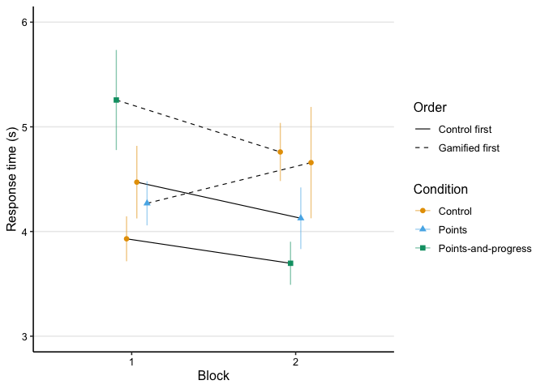

Analysis: posttest
================
Maarten van der Velde & Gesa van den Broek
Last updated: 2024-07-11

- [Setup](#setup)
- [Does gamification change learning outcomes on the
  test?](#does-gamification-change-learning-outcomes-on-the-test)
  - [Accuracy](#accuracy)
    - [Prepare data](#prepare-data)
    - [Visualise data](#visualise-data)
    - [Fit model](#fit-model)
    - [Visualise fitted model](#visualise-fitted-model)
  - [Response time](#response-time)
    - [Prepare data](#prepare-data-1)
    - [Visualise data](#visualise-data-1)
    - [Fit model](#fit-model-1)
    - [Fitted values](#fitted-values)
    - [Visualise fitted model](#visualise-fitted-model-1)
  - [Conclusions](#conclusions)
  - [Combined plot](#combined-plot)
- [Session info](#session-info)

# Setup

``` r
library(here)
library(dplyr)
library(ggplot2)
library(scales)
library(patchwork)
library(stringr)
library(tidyr)
library(lme4)
library(lmerTest)
```

Helper functions for plots and tables:

``` r
source(here("scripts", "00_visualisation_functions.R"))
```

Load processed data:

``` r
d_test <- readRDS(here("data", "processed", "d_test.rds"))
```

``` r
add_experiment_cols <- function (data) {
  data |>
    mutate(exp_order = case_when(
      gamified_first == 0 & exp_group == "score" ~ "Control—Score",
      gamified_first == 0 & exp_group == "both" ~ "Control—Both",
      gamified_first == 1 & exp_group == "score" ~ "Score—Control",
      gamified_first == 1 & exp_group == "both" ~ "Both—Control"
    )) |>
    mutate(type = ifelse(gamified, "Gamified", "Control"))
}
```

# Does gamification change learning outcomes on the test?

## Accuracy

### Prepare data

``` r
d_test_acc <- d_test |>
  group_by(subject, exp_group, block, condition, gamified, gamified_first) |>
  summarise(accuracy = mean(correct))
```

    ## `summarise()` has grouped output by 'subject', 'exp_group', 'block',
    ## 'condition', 'gamified'. You can override using the `.groups` argument.

``` r
d_test_acc_agg <- d_test_acc |>
  group_by(block, condition, gamified, gamified_first, exp_group) |>
  summarise(acc = mean(accuracy, na.rm = T),
            acc_se = sd(accuracy, na.rm = T)/sqrt(n())) |>
  ungroup() |>
  add_experiment_cols()
```

    ## `summarise()` has grouped output by 'block', 'condition', 'gamified',
    ## 'gamified_first'. You can override using the `.groups` argument.

### Visualise data

``` r
p_test_acc <- plot_data(d_test_acc_agg, acc, acc_se, "Accuracy") +
  scale_y_continuous(limits = c(.35, .6), labels = scales::percent_format())

p_test_acc
```

<!-- -->

### Fit model

Prepare data for modelling by mean-centering categorical predictors:

``` r
d_test_m <- d_test |>
  mutate(exp_group_c = ifelse(exp_group == "score", 0, 1),
         exp_group_c = exp_group_c - mean(exp_group_c),
         gamified_first_c = gamified_first - mean(gamified_first))
```

``` r
m_test_acc <- glmer(correct ~ gamified +
                       gamified:exp_group_c +
                       gamified:gamified_first_c +
                       gamified:gamified_first_c:exp_group_c +
                       (1 | subject) + (1 | fact),
                     family = "binomial",
                     data = d_test_m)

summary(m_test_acc)
```

    ## Generalized linear mixed model fit by maximum likelihood (Laplace
    ##   Approximation) [glmerMod]
    ##  Family: binomial  ( logit )
    ## Formula: 
    ## correct ~ gamified + gamified:exp_group_c + gamified:gamified_first_c +  
    ##     gamified:gamified_first_c:exp_group_c + (1 | subject) + (1 |      fact)
    ##    Data: d_test_m
    ## 
    ##      AIC      BIC   logLik deviance df.resid 
    ##   8909.2   8977.8  -4444.6   8889.2     7014 
    ## 
    ## Scaled residuals: 
    ##     Min      1Q  Median      3Q     Max 
    ## -3.8290 -0.8456  0.3436  0.8197  3.1357 
    ## 
    ## Random effects:
    ##  Groups  Name        Variance Std.Dev.
    ##  subject (Intercept) 0.6635   0.8145  
    ##  fact    (Intercept) 0.3379   0.5813  
    ## Number of obs: 7024, groups:  subject, 152; fact, 70
    ## 
    ## Fixed effects:
    ##                                             Estimate Std. Error z value
    ## (Intercept)                                -0.015175   0.103341  -0.147
    ## gamifiedTRUE                                0.008417   0.052769   0.160
    ## gamifiedFALSE:exp_group_c                  -0.153904   0.153331  -1.004
    ## gamifiedTRUE:exp_group_c                   -0.178017   0.153562  -1.159
    ## gamifiedFALSE:gamified_first_c              0.170561   0.153567   1.111
    ## gamifiedTRUE:gamified_first_c              -0.208889   0.153591  -1.360
    ## gamifiedFALSE:exp_group_c:gamified_first_c -0.166474   0.308267  -0.540
    ## gamifiedTRUE:exp_group_c:gamified_first_c  -0.206697   0.308355  -0.670
    ##                                            Pr(>|z|)
    ## (Intercept)                                   0.883
    ## gamifiedTRUE                                  0.873
    ## gamifiedFALSE:exp_group_c                     0.316
    ## gamifiedTRUE:exp_group_c                      0.246
    ## gamifiedFALSE:gamified_first_c                0.267
    ## gamifiedTRUE:gamified_first_c                 0.174
    ## gamifiedFALSE:exp_group_c:gamified_first_c    0.589
    ## gamifiedTRUE:exp_group_c:gamified_first_c     0.503
    ## 
    ## Correlation of Fixed Effects:
    ##               (Intr) gmTRUE gmfdFALSE:x__ gmfdTRUE:x__ gmfdFALSE:g__
    ## gamifidTRUE   -0.255                                                
    ## gmfdFALSE:x__ -0.019  0.004                                         
    ## gmfdTRUE:x__  -0.017  0.005  0.760                                  
    ## gmfdFALSE:g__ -0.019  0.007 -0.009        -0.007                    
    ## gmfdTRUE:g__  -0.015  0.012 -0.007        -0.004        0.763       
    ## gFALSE:__:_   -0.007  0.001 -0.028        -0.022       -0.025       
    ## gTRUE:__:__   -0.006  0.006 -0.022        -0.013       -0.023       
    ##               gmfdTRUE:g__ gFALSE:__:
    ## gamifidTRUE                          
    ## gmfdFALSE:x__                        
    ## gmfdTRUE:x__                         
    ## gmfdFALSE:g__                        
    ## gmfdTRUE:g__                         
    ## gFALSE:__:_   -0.023                 
    ## gTRUE:__:__   -0.019        0.761

``` r
print_model_table(m_test_acc)
```


### Visualise fitted model

``` r
p_test_acc_m <- plot_model_fit(m_test_acc, d_test_m, y_lab = "Accuracy") +
  scale_y_continuous(limits = c(.35, .6), labels = scales::percent_format(accuracy = .1))
```

    ##   block    condition gamified gamified_first exp_group gamified_first_c
    ## 1     1      Control    FALSE          FALSE      both       -0.5380125
    ## 2     1      Control    FALSE          FALSE     score       -0.5380125
    ## 3     1       Points     TRUE           TRUE     score        0.4619875
    ## 4     1 Progress bar     TRUE           TRUE      both        0.4619875
    ## 5     2      Control    FALSE           TRUE      both        0.4619875
    ## 6     2      Control    FALSE           TRUE     score        0.4619875
    ## 7     2       Points     TRUE          FALSE     score       -0.5380125
    ## 8     2 Progress bar     TRUE          FALSE      both       -0.5380125
    ##   exp_group_c  pred_val     exp_order     type
    ## 1   0.5545273 0.4644061  Control—Both  Control
    ## 2  -0.4454727 0.4804404 Control—Score  Control
    ## 3  -0.4454727 0.5046444 Score—Control Gamified
    ## 4   0.5545273 0.4366104  Both—Control Gamified
    ## 5   0.5545273 0.4839130  Both—Control  Control
    ## 6  -0.4454727 0.5415149 Score—Control  Control
    ## 7  -0.4454727 0.5337956 Control—Score Gamified
    ## 8   0.5545273 0.5171377  Control—Both Gamified

    ## Scale for y is already present.
    ## Adding another scale for y, which will replace the existing scale.

``` r
p_test_acc_m
```

<!-- -->

## Response time

Response time on correct answers only.

### Prepare data

To keep the visualisation of average response times by condition simple,
we calculate the median RT per participant, and then take the mean and
SD of these medians (which are themselves roughly normally distributed).

``` r
d_test_rt <- d_test |>
  filter(correct) |>
  mutate(rt = rt / 1000) |>
  group_by(subject, exp_group, block, condition, gamified, gamified_first) |>
  summarise(rt_median = median(rt, na.rm = TRUE))
```

    ## `summarise()` has grouped output by 'subject', 'exp_group', 'block',
    ## 'condition', 'gamified'. You can override using the `.groups` argument.

``` r
d_test_rt_agg <- d_test_rt |>
  group_by(block, condition, gamified, gamified_first, exp_group) |>
  summarise(rt_mean = mean(rt_median, na.rm = T),
            rt_se = sd(rt_median, na.rm = T)/sqrt(n())) |>
  ungroup() |>
  add_experiment_cols()
```

    ## `summarise()` has grouped output by 'block', 'condition', 'gamified',
    ## 'gamified_first'. You can override using the `.groups` argument.

### Visualise data

``` r
p_test_rt <- plot_data(d_test_rt_agg, rt_mean, rt_se, "Response time (s)") +
  scale_y_continuous(limits = c(3, 6), labels = scales::comma_format())

p_test_rt
```

<!-- -->

### Fit model

Since RT data is not normally distributed, we fit a lognormal model to
the response times. (See
<https://bbolker.github.io/mixedmodels-misc/glmmFAQ.html#gamma-glmms> .)
Prepare data for modelling by mean-centering categorical predictors:

``` r
d_test_rt_m <- d_test |>
  filter(correct) |>
  mutate(log_rt = log(rt / 1000)) |>
  mutate(exp_group_c = ifelse(exp_group == "score", 0, 1),
         exp_group_c = exp_group_c - mean(exp_group_c),
         gamified_first_c = gamified_first - mean(gamified_first))
```

``` r
m_test_rt <- lmer(log_rt ~ gamified +
                      gamified:exp_group_c +
                      gamified:gamified_first_c +
                      gamified:gamified_first_c:exp_group_c +
                      (1 | subject) + (1 | fact),
                    data = d_test_rt_m)

summary(m_test_rt)
```

    ## Linear mixed model fit by REML. t-tests use Satterthwaite's method [
    ## lmerModLmerTest]
    ## Formula: 
    ## log_rt ~ gamified + gamified:exp_group_c + gamified:gamified_first_c +  
    ##     gamified:gamified_first_c:exp_group_c + (1 | subject) + (1 |      fact)
    ##    Data: d_test_rt_m
    ## 
    ## REML criterion at convergence: 5381.8
    ## 
    ## Scaled residuals: 
    ##     Min      1Q  Median      3Q     Max 
    ## -2.9689 -0.6786 -0.1696  0.5261  4.8408 
    ## 
    ## Random effects:
    ##  Groups   Name        Variance Std.Dev.
    ##  subject  (Intercept) 0.07237  0.2690  
    ##  fact     (Intercept) 0.01968  0.1403  
    ##  Residual             0.22400  0.4733  
    ## Number of obs: 3673, groups:  subject, 152; fact, 70
    ## 
    ## Fixed effects:
    ##                                             Estimate Std. Error        df
    ## (Intercept)                                1.463e+00  3.028e-02 2.065e+02
    ## gamifiedTRUE                               7.858e-03  1.611e-02 3.515e+03
    ## gamifiedFALSE:exp_group_c                  1.367e-02  5.045e-02 1.720e+02
    ## gamifiedTRUE:exp_group_c                   4.380e-02  5.067e-02 1.736e+02
    ## gamifiedFALSE:gamified_first_c             6.011e-02  5.053e-02 1.708e+02
    ## gamifiedTRUE:gamified_first_c              1.174e-01  5.064e-02 1.711e+02
    ## gamifiedFALSE:exp_group_c:gamified_first_c 2.316e-01  1.015e-01 1.723e+02
    ## gamifiedTRUE:exp_group_c:gamified_first_c  1.980e-01  1.017e-01 1.727e+02
    ##                                            t value Pr(>|t|)    
    ## (Intercept)                                 48.315   <2e-16 ***
    ## gamifiedTRUE                                 0.488   0.6257    
    ## gamifiedFALSE:exp_group_c                    0.271   0.7867    
    ## gamifiedTRUE:exp_group_c                     0.864   0.3885    
    ## gamifiedFALSE:gamified_first_c               1.190   0.2358    
    ## gamifiedTRUE:gamified_first_c                2.318   0.0216 *  
    ## gamifiedFALSE:exp_group_c:gamified_first_c   2.282   0.0237 *  
    ## gamifiedTRUE:exp_group_c:gamified_first_c    1.946   0.0533 .  
    ## ---
    ## Signif. codes:  0 '***' 0.001 '**' 0.01 '*' 0.05 '.' 0.1 ' ' 1
    ## 
    ## Correlation of Fixed Effects:
    ##               (Intr) gmTRUE gmfdFALSE:x__ gmfdTRUE:x__ gmfdFALSE:g__
    ## gamifidTRUE   -0.262                                                
    ## gmfdFALSE:x__ -0.040  0.000                                         
    ## gmfdTRUE:x__  -0.040  0.006  0.792                                  
    ## gmfdFALSE:g__ -0.028  0.018 -0.005        -0.016                    
    ## gmfdTRUE:g__  -0.018  0.018 -0.016         0.002        0.796       
    ## gFALSE:__:_   -0.004 -0.016 -0.036        -0.028       -0.048       
    ## gTRUE:__:__   -0.014  0.029 -0.027        -0.008       -0.045       
    ##               gmfdTRUE:g__ gFALSE:__:
    ## gamifidTRUE                          
    ## gmfdFALSE:x__                        
    ## gmfdTRUE:x__                         
    ## gmfdFALSE:g__                        
    ## gmfdTRUE:g__                         
    ## gFALSE:__:_   -0.046                 
    ## gTRUE:__:__   -0.046        0.792

``` r
print_model_table(m_test_rt)
```


### Fitted values

``` r
d_model_fit <- crossing(
  gamified = TRUE, 
  exp_group_c = 0, 
  gamified_first_c = sort(unique(d_test_rt_m$gamified_first_c))
)

d_model_fit$model_fit <- predict(m_test_rt,
                                 newdata = d_model_fit,
                                 re.form = NA, 
                                 type = "response") |>
  exp() # Transform logRT to RT

d_model_fit
```

    ## # A tibble: 2 × 4
    ##   gamified exp_group_c gamified_first_c model_fit
    ##   <lgl>          <dbl>            <dbl>     <dbl>
    ## 1 TRUE               0           -0.536      4.09
    ## 2 TRUE               0            0.464      4.60

``` r
d_model_fit <- crossing(
  gamified = FALSE, 
  exp_group_c = sort(unique(d_test_rt_m$exp_group_c)), 
  gamified_first_c = sort(unique(d_test_rt_m$gamified_first_c))
)

d_model_fit$model_fit <- predict(m_test_rt,
                                 newdata = d_model_fit,
                                 re.form = NA, 
                                 type = "response") |>
  exp() # Transform logRT to RT

d_model_fit
```

    ## # A tibble: 4 × 4
    ##   gamified exp_group_c gamified_first_c model_fit
    ##   <lgl>          <dbl>            <dbl>     <dbl>
    ## 1 FALSE         -0.428           -0.536      4.38
    ## 2 FALSE         -0.428            0.464      4.22
    ## 3 FALSE          0.572           -0.536      3.92
    ## 4 FALSE          0.572            0.464      4.76

### Visualise fitted model

``` r
p_test_rt_m <- plot_model_fit(m_test_rt, d_test_rt_m, exp_trans = TRUE, y_lab = "Response time (s)") +
  scale_y_continuous(limits = c(3, 6), labels = scales::comma_format())
```

    ##   block    condition gamified gamified_first exp_group gamified_first_c
    ## 1     1      Control    FALSE          FALSE      both       -0.5363463
    ## 2     1      Control    FALSE          FALSE     score       -0.5363463
    ## 3     1       Points     TRUE           TRUE     score        0.4636537
    ## 4     1 Progress bar     TRUE           TRUE      both        0.4636537
    ## 5     2      Control    FALSE           TRUE      both        0.4636537
    ## 6     2      Control    FALSE           TRUE     score        0.4636537
    ## 7     2       Points     TRUE          FALSE     score       -0.5363463
    ## 8     2 Progress bar     TRUE          FALSE      both       -0.5363463
    ##   exp_group_c pred_val     exp_order     type
    ## 1   0.5722842 3.924932  Control—Both  Control
    ## 2  -0.4277158 4.383624 Control—Score  Control
    ## 3  -0.4277158 4.336746 Score—Control Gamified
    ## 4   0.5722842 4.966467  Both—Control Gamified
    ## 5   0.5722842 4.758713  Both—Control  Control
    ## 6  -0.4277158 4.216226 Score—Control  Control
    ## 7  -0.4277158 4.197234 Control—Score Gamified
    ## 8   0.5722842 3.943450  Control—Both Gamified

    ## Scale for y is already present.
    ## Adding another scale for y, which will replace the existing scale.

``` r
p_test_rt_m
```

<!-- -->

## Conclusions

- Gamified feedback had no effect on response accuracy on the test.
- For items studied with gamified feedback, response times on the test
  were faster when items had been practiced in Block 2 than in Block 1.
- In the Control condition, the difference in RT between the two
  experimental groups (Points vs Progress bar) changed significantly
  between blocks.

## Combined plot

``` r
(p_test_acc | p_test_rt) +
  plot_layout(guides = "collect") +
  plot_annotation(tag_levels = "a")
```

<!-- -->

``` r
ggsave(here("output", "test_performance.png"), width = 8, height = 3)
```

# Session info

``` r
sessionInfo()
```

    ## R version 4.3.1 (2023-06-16)
    ## Platform: aarch64-apple-darwin20 (64-bit)
    ## Running under: macOS Sonoma 14.5
    ## 
    ## Matrix products: default
    ## BLAS:   /Library/Frameworks/R.framework/Versions/4.3-arm64/Resources/lib/libRblas.0.dylib 
    ## LAPACK: /Library/Frameworks/R.framework/Versions/4.3-arm64/Resources/lib/libRlapack.dylib;  LAPACK version 3.11.0
    ## 
    ## locale:
    ## [1] en_US.UTF-8/en_US.UTF-8/en_US.UTF-8/C/en_US.UTF-8/en_US.UTF-8
    ## 
    ## time zone: Europe/Amsterdam
    ## tzcode source: internal
    ## 
    ## attached base packages:
    ## [1] stats     graphics  grDevices utils     datasets  methods   base     
    ## 
    ## other attached packages:
    ##  [1] flextable_0.9.6   data.table_1.14.8 lmerTest_3.1-3    lme4_1.1-34      
    ##  [5] Matrix_1.6-1.1    tidyr_1.3.0       stringr_1.5.0     patchwork_1.2.0  
    ##  [9] scales_1.3.0      ggplot2_3.5.0     dplyr_1.1.3       here_1.0.1       
    ## 
    ## loaded via a namespace (and not attached):
    ##  [1] gtable_0.3.4            xfun_0.40               bslib_0.5.1            
    ##  [4] lattice_0.21-9          numDeriv_2016.8-1.1     vctrs_0.6.3            
    ##  [7] tools_4.3.1             generics_0.1.3          curl_5.1.0             
    ## [10] tibble_3.2.1            fansi_1.0.4             pkgconfig_2.0.3        
    ## [13] uuid_1.2-0              lifecycle_1.0.3         farver_2.1.1           
    ## [16] compiler_4.3.1          textshaping_0.3.7       munsell_0.5.0          
    ## [19] httpuv_1.6.12           fontquiver_0.2.1        fontLiberation_0.1.0   
    ## [22] htmltools_0.5.6         sass_0.4.7              yaml_2.3.7             
    ## [25] pillar_1.9.0            later_1.3.1             nloptr_2.0.3           
    ## [28] crayon_1.5.2            jquerylib_0.1.4         MASS_7.3-60            
    ## [31] gfonts_0.2.0            ellipsis_0.3.2          openssl_2.1.1          
    ## [34] cachem_1.0.8            boot_1.3-28.1           nlme_3.1-163           
    ## [37] mime_0.12               fontBitstreamVera_0.1.1 zip_2.3.1              
    ## [40] tidyselect_1.2.0        digest_0.6.33           stringi_1.7.12         
    ## [43] purrr_1.0.2             labeling_0.4.3          splines_4.3.1          
    ## [46] rprojroot_2.0.3         fastmap_1.1.1           grid_4.3.1             
    ## [49] colorspace_2.1-0        cli_3.6.1               magrittr_2.0.3         
    ## [52] crul_1.4.2              utf8_1.2.3              withr_2.5.1            
    ## [55] gdtools_0.3.7           promises_1.2.1          officer_0.6.6          
    ## [58] rmarkdown_2.25          png_0.1-8               ragg_1.2.7             
    ## [61] askpass_1.2.0           shiny_1.8.0             evaluate_0.22          
    ## [64] knitr_1.44              rlang_1.1.1             Rcpp_1.0.11            
    ## [67] xtable_1.8-4            glue_1.6.2              httpcode_0.3.0         
    ## [70] xml2_1.3.5              rstudioapi_0.15.0       minqa_1.2.6            
    ## [73] jsonlite_1.8.7          R6_2.5.1                systemfonts_1.0.4
