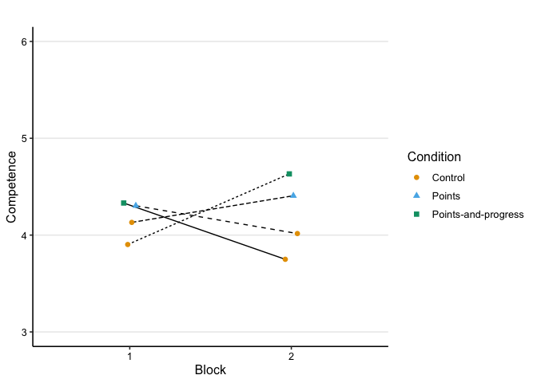

Analysis: survey
================
Maarten van der Velde & Gesa van den Broek
Last updated: 2024-07-11

- [Setup](#setup)
- [Does gamification change task-motivational
  outcomes?](#does-gamification-change-task-motivational-outcomes)
  - [Combined plot](#combined-plot)
  - [Competence](#competence)
    - [Fit model](#fit-model)
    - [Fitted values](#fitted-values)
  - [Enjoyment](#enjoyment)
    - [Fit model](#fit-model-1)
    - [Fitted values](#fitted-values-1)
    - [Visualise fitted model:](#visualise-fitted-model)
  - [Perceived Task Value](#perceived-task-value)
    - [Fit model](#fit-model-2)
    - [Fitted values](#fitted-values-2)
    - [Visualise fitted model:](#visualise-fitted-model-1)
  - [Conclusion](#conclusion)
- [Does gamification change goal setting
  behavior?](#does-gamification-change-goal-setting-behavior)
  - [Combined plot](#combined-plot-1)
  - [Goalsetting](#goalsetting)
    - [Fit model](#fit-model-3)
    - [Fitted values](#fitted-values-3)
    - [Visualise fitted model:](#visualise-fitted-model-2)
  - [Wanting to perform well](#wanting-to-perform-well)
    - [Fit model](#fit-model-4)
    - [Fitted values](#fitted-values-4)
    - [Visualise fitted model](#visualise-fitted-model-3)
  - [Conclusion](#conclusion-1)
- [Are there negative effects of gamified feedback on learners’
  experience?](#are-there-negative-effects-of-gamified-feedback-on-learners-experience)
  - [Stress](#stress)
    - [Fitted values](#fitted-values-5)
    - [Visualise fitted model:](#visualise-fitted-model-4)
  - [Distraction](#distraction)
    - [Fitted values](#fitted-values-6)
  - [Conclusion](#conclusion-2)
- [Which Condition do Learners
  prefer?](#which-condition-do-learners-prefer)
  - [Perceived Relevance](#perceived-relevance)
    - [Fitted values](#fitted-values-7)
  - [Preference for Condition](#preference-for-condition)
  - [Conclusions](#conclusions)
- [Session info](#session-info)

# Setup

``` r
library(here)
library(dplyr)
library(ggplot2)
library(scales)
library(patchwork)
library(stringr)
library(tidyr)
library(lme4)
library(lmerTest)
```

Helper functions for plots and tables:

``` r
source(here("scripts", "00_visualisation_functions.R"))
```

Load processed data:

``` r
d_survey <- readRDS(here("data", "processed", "d_survey.rds"))
```

``` r
add_experiment_cols <- function (data) {
  data |>
    mutate(exp_order = case_when(
      gamified_first == 0 & exp_group == "score" ~ "Control—Score",
      gamified_first == 0 & exp_group == "both" ~ "Control—Both",
      gamified_first == 1 & exp_group == "score" ~ "Score—Control",
      gamified_first == 1 & exp_group == "both" ~ "Both—Control"
    )) |>
    mutate(type = ifelse(gamified, "Gamified", "Control"))
}
```

# Does gamification change task-motivational outcomes?

Relevant variables: Feelings of competence, Enjoyment, task value, and
task preference.

Prepare data

``` r
d_survey_agg <- d_survey %>%
  group_by(block, condition, gamified, gamified_first, exp_group, category, question) %>%
  summarise(response_mean = mean(response, na.rm = T),
            response_se = sd(response, na.rm = T)/sqrt(n())) %>%
  ungroup() %>%
  add_experiment_cols() |>
  mutate(perception_label_sorted = factor(question, levels = c("goalsetting","performwell","goalstress","distraction","relevance")))
```

    ## `summarise()` has grouped output by 'block', 'condition', 'gamified',
    ## 'gamified_first', 'exp_group', 'category'. You can override using the `.groups`
    ## argument.

Mean-centering categorical predictors for modelling:

``` r
d_survey_m <- d_survey %>%
  mutate(exp_group_c = ifelse(exp_group == "score", 0, 1),
         exp_group_c = exp_group_c - mean(exp_group_c),
         gamified_first_c = gamified_first - mean(gamified_first))
```

## Combined plot

``` r
dodge_width <- .25

p_motivation <- d_survey_agg %>%
  filter(category == "motivation") %>%
  ggplot(aes(x = block, y = response_mean, group = interaction(exp_order, question))) +
  facet_grid(~ question, labeller = labeller(question = str_to_title)) +
  geom_line(aes(lty = exp_order), position = position_dodge(width = dodge_width)) +
  geom_errorbar(aes(ymin = response_mean - response_se, ymax = response_mean + response_se, colour = condition),
                width = 0,
                alpha = .5,
                position = position_dodge(width = dodge_width)) +
  geom_point(aes(colour = condition, pch = condition),
             size = 2,
             position = position_dodge(width = dodge_width)) +
  scale_y_continuous(breaks = 1:7) +
  scale_colour_manual(values = col_condition) +
  guides(lty = "none") +
  labs(x = "Block",
       y = "Response",
       colour = "Condition",
       pch = "Condition") +
  theme_paper

p_motivation
```

<!-- -->

``` r
ggsave(p_motivation, filename = here("output", "survey_motivation.png"), width = 8, height = 3)
```

## Competence

### Fit model

``` r
m_competence <- lmer(response ~ gamified +
                       gamified:exp_group_c +
                       gamified:gamified_first_c +
                       gamified:gamified_first_c:exp_group_c +
                       (1 | subject),
                     data = filter(d_survey_m, question == "competence"))

summary(m_competence)
```

    ## Linear mixed model fit by REML. t-tests use Satterthwaite's method [
    ## lmerModLmerTest]
    ## Formula: 
    ## response ~ gamified + gamified:exp_group_c + gamified:gamified_first_c +  
    ##     gamified:gamified_first_c:exp_group_c + (1 | subject)
    ##    Data: filter(d_survey_m, question == "competence")
    ## 
    ## REML criterion at convergence: 1119.5
    ## 
    ## Scaled residuals: 
    ##      Min       1Q   Median       3Q      Max 
    ## -2.32430 -0.51027  0.00453  0.51192  2.02550 
    ## 
    ## Random effects:
    ##  Groups   Name        Variance Std.Dev.
    ##  subject  (Intercept) 1.2298   1.1090  
    ##  Residual             0.8614   0.9281  
    ## Number of obs: 332, groups:  subject, 166
    ## 
    ## Fixed effects:
    ##                                             Estimate Std. Error        df
    ## (Intercept)                                  3.95034    0.11224 240.74459
    ## gamifiedTRUE                                 0.45649    0.10188 162.00000
    ## gamifiedFALSE:exp_group_c                   -0.24880    0.22474 240.74459
    ## gamifiedTRUE:exp_group_c                     0.11862    0.22474 240.74459
    ## gamifiedFALSE:gamified_first_c              -0.13313    0.22528 240.74459
    ## gamifiedTRUE:gamified_first_c               -0.19704    0.22528 240.74459
    ## gamifiedFALSE:exp_group_c:gamified_first_c  -0.03749    0.45111 240.74459
    ## gamifiedTRUE:exp_group_c:gamified_first_c   -0.19749    0.45111 240.74459
    ##                                            t value Pr(>|t|)    
    ## (Intercept)                                 35.195  < 2e-16 ***
    ## gamifiedTRUE                                 4.481  1.4e-05 ***
    ## gamifiedFALSE:exp_group_c                   -1.107    0.269    
    ## gamifiedTRUE:exp_group_c                     0.528    0.598    
    ## gamifiedFALSE:gamified_first_c              -0.591    0.555    
    ## gamifiedTRUE:gamified_first_c               -0.875    0.383    
    ## gamifiedFALSE:exp_group_c:gamified_first_c  -0.083    0.934    
    ## gamifiedTRUE:exp_group_c:gamified_first_c   -0.438    0.662    
    ## ---
    ## Signif. codes:  0 '***' 0.001 '**' 0.01 '*' 0.05 '.' 0.1 ' ' 1
    ## 
    ## Correlation of Fixed Effects:
    ##               (Intr) gmTRUE gmfdFALSE:x__ gmfdTRUE:x__ gmfdFALSE:g__
    ## gamifidTRUE   -0.454                                                
    ## gmfdFALSE:x__  0.000  0.000                                         
    ## gmfdTRUE:x__   0.000  0.000  0.588                                  
    ## gmfdFALSE:g__  0.000  0.000 -0.004        -0.002                    
    ## gmfdTRUE:g__   0.000  0.000 -0.002        -0.004        0.588       
    ## gFALSE:__:_   -0.004  0.002  0.000         0.000        0.001       
    ## gTRUE:__:__   -0.002 -0.002  0.000         0.000        0.000       
    ##               gmfdTRUE:g__ gFALSE:__:
    ## gamifidTRUE                          
    ## gmfdFALSE:x__                        
    ## gmfdTRUE:x__                         
    ## gmfdFALSE:g__                        
    ## gmfdTRUE:g__                         
    ## gFALSE:__:_    0.000                 
    ## gTRUE:__:__    0.001        0.588

``` r
print_model_table(m_competence)
```


### Fitted values

``` r
d_model_fit <- crossing(
  gamified = c(TRUE, FALSE), 
  exp_group_c = 0,
  gamified_first_c = 0
)

d_model_fit$model_fit <- predict(m_competence,
                                 newdata = d_model_fit,
                                 re.form = NA, 
                                 type = "response")

d_model_fit
```

    ## # A tibble: 2 × 4
    ##   gamified exp_group_c gamified_first_c model_fit
    ##   <lgl>          <dbl>            <dbl>     <dbl>
    ## 1 FALSE              0                0      3.95
    ## 2 TRUE               0                0      4.41

Visualise fitted model:

``` r
p_competence_m <- plot_model_fit(m_competence, filter(d_survey_m, question == "competence"), y_lab = "Competence") +
  scale_y_continuous(limits = c(3, 6), labels = scales::comma_format())
```

    ##   block    condition gamified gamified_first exp_group gamified_first_c
    ## 1     1      Control    FALSE          FALSE      both       -0.5421687
    ## 2     1      Control    FALSE          FALSE     score       -0.5421687
    ## 3     1       Points     TRUE           TRUE     score        0.4578313
    ## 4     1 Progress bar     TRUE           TRUE      both        0.4578313
    ## 5     2      Control    FALSE           TRUE      both        0.4578313
    ## 6     2      Control    FALSE           TRUE     score        0.4578313
    ## 7     2       Points     TRUE          FALSE     score       -0.5421687
    ## 8     2 Progress bar     TRUE          FALSE      both       -0.5421687
    ##   exp_group_c pred_val     exp_order     type
    ## 1   0.5240964 3.902778  Control—Both  Control
    ## 2  -0.4759036 4.131250 Control—Score  Control
    ## 3  -0.4759036 4.303191 Score—Control Gamified
    ## 4   0.5240964 4.331395  Both—Control Gamified
    ## 5   0.5240964 3.750000  Both—Control  Control
    ## 6  -0.4759036 4.015957 Score—Control  Control
    ## 7  -0.4759036 4.406250 Control—Score Gamified
    ## 8   0.5240964 4.631944  Control—Both Gamified

    ## Scale for y is already present.
    ## Adding another scale for y, which will replace the existing scale.

``` r
p_competence_m
```

<!-- -->

## Enjoyment

### Fit model

``` r
m_enjoyment <- lmer(response ~ gamified +
                      gamified:exp_group_c +
                      gamified:gamified_first_c +
                      gamified:gamified_first_c:exp_group_c +
                      (1 | subject),
                    data = filter(d_survey_m, question == "enjoyment"))

summary(m_enjoyment)
```

    ## Linear mixed model fit by REML. t-tests use Satterthwaite's method [
    ## lmerModLmerTest]
    ## Formula: 
    ## response ~ gamified + gamified:exp_group_c + gamified:gamified_first_c +  
    ##     gamified:gamified_first_c:exp_group_c + (1 | subject)
    ##    Data: filter(d_survey_m, question == "enjoyment")
    ## 
    ## REML criterion at convergence: 923.4
    ## 
    ## Scaled residuals: 
    ##      Min       1Q   Median       3Q      Max 
    ## -2.28644 -0.46853  0.04077  0.45253  2.13674 
    ## 
    ## Random effects:
    ##  Groups   Name        Variance Std.Dev.
    ##  subject  (Intercept) 0.8818   0.9391  
    ##  Residual             0.3950   0.6285  
    ## Number of obs: 332, groups:  subject, 166
    ## 
    ## Fixed effects:
    ##                                             Estimate Std. Error        df
    ## (Intercept)                                  4.48639    0.08770 219.36009
    ## gamifiedTRUE                                 0.54544    0.06898 162.00000
    ## gamifiedFALSE:exp_group_c                   -0.30539    0.17561 219.36009
    ## gamifiedTRUE:exp_group_c                     0.15226    0.17561 219.36009
    ## gamifiedFALSE:gamified_first_c              -0.63243    0.17603 219.36009
    ## gamifiedTRUE:gamified_first_c                0.14920    0.17603 219.36009
    ## gamifiedFALSE:exp_group_c:gamified_first_c  -0.83175    0.35248 219.36009
    ## gamifiedTRUE:exp_group_c:gamified_first_c   -0.49793    0.35248 219.36009
    ##                                            t value Pr(>|t|)    
    ## (Intercept)                                 51.155  < 2e-16 ***
    ## gamifiedTRUE                                 7.907 3.86e-13 ***
    ## gamifiedFALSE:exp_group_c                   -1.739 0.083428 .  
    ## gamifiedTRUE:exp_group_c                     0.867 0.386862    
    ## gamifiedFALSE:gamified_first_c              -3.593 0.000404 ***
    ## gamifiedTRUE:gamified_first_c                0.848 0.397584    
    ## gamifiedFALSE:exp_group_c:gamified_first_c  -2.360 0.019168 *  
    ## gamifiedTRUE:exp_group_c:gamified_first_c   -1.413 0.159185    
    ## ---
    ## Signif. codes:  0 '***' 0.001 '**' 0.01 '*' 0.05 '.' 0.1 ' ' 1
    ## 
    ## Correlation of Fixed Effects:
    ##               (Intr) gmTRUE gmfdFALSE:x__ gmfdTRUE:x__ gmfdFALSE:g__
    ## gamifidTRUE   -0.393                                                
    ## gmfdFALSE:x__  0.000  0.000                                         
    ## gmfdTRUE:x__   0.000  0.000  0.691                                  
    ## gmfdFALSE:g__  0.000  0.000 -0.004        -0.003                    
    ## gmfdTRUE:g__   0.000  0.000 -0.003        -0.004        0.691       
    ## gFALSE:__:_   -0.004  0.002  0.000         0.000        0.001       
    ## gTRUE:__:__   -0.003 -0.002  0.000         0.000        0.000       
    ##               gmfdTRUE:g__ gFALSE:__:
    ## gamifidTRUE                          
    ## gmfdFALSE:x__                        
    ## gmfdTRUE:x__                         
    ## gmfdFALSE:g__                        
    ## gmfdTRUE:g__                         
    ## gFALSE:__:_    0.000                 
    ## gTRUE:__:__    0.001        0.691

``` r
print_model_table(m_enjoyment)
```



### Fitted values

``` r
d_model_fit <- crossing(
  gamified = c(TRUE, FALSE), 
  exp_group_c = 0,
  gamified_first_c = 0
)

d_model_fit$model_fit <- predict(m_enjoyment,
                                 newdata = d_model_fit,
                                 re.form = NA, 
                                 type = "response")

d_model_fit
```

    ## # A tibble: 2 × 4
    ##   gamified exp_group_c gamified_first_c model_fit
    ##   <lgl>          <dbl>            <dbl>     <dbl>
    ## 1 FALSE              0                0      4.49
    ## 2 TRUE               0                0      5.03

``` r
d_model_fit <- crossing(
  gamified = FALSE, 
  exp_group_c = 0,
  gamified_first_c = sort(unique(d_survey_m$gamified_first_c))
)

d_model_fit$model_fit <- predict(m_enjoyment,
                                 newdata = d_model_fit,
                                 re.form = NA, 
                                 type = "response")

d_model_fit
```

    ## # A tibble: 2 × 4
    ##   gamified exp_group_c gamified_first_c model_fit
    ##   <lgl>          <dbl>            <dbl>     <dbl>
    ## 1 FALSE              0           -0.542      4.83
    ## 2 FALSE              0            0.458      4.20

``` r
d_model_fit <- crossing(
  gamified = FALSE, 
  exp_group_c = sort(unique(d_survey_m$exp_group_c)),
  gamified_first_c = sort(unique(d_survey_m$gamified_first_c))
)

d_model_fit$model_fit <- predict(m_enjoyment,
                                 newdata = d_model_fit,
                                 re.form = NA, 
                                 type = "response")

d_model_fit
```

    ## # A tibble: 4 × 4
    ##   gamified exp_group_c gamified_first_c model_fit
    ##   <lgl>          <dbl>            <dbl>     <dbl>
    ## 1 FALSE         -0.476           -0.542      4.76
    ## 2 FALSE         -0.476            0.458      4.52
    ## 3 FALSE          0.524           -0.542      4.91
    ## 4 FALSE          0.524            0.458      3.84

### Visualise fitted model:

``` r
p_enjoyment_m <- plot_model_fit(m_enjoyment, filter(d_survey_m, question == "enjoyment"), y_lab = "Enjoyment") +
  scale_y_continuous(limits = c(3, 6), labels = scales::comma_format())
```

    ##   block    condition gamified gamified_first exp_group gamified_first_c
    ## 1     1      Control    FALSE          FALSE      both       -0.5421687
    ## 2     1      Control    FALSE          FALSE     score       -0.5421687
    ## 3     1       Points     TRUE           TRUE     score        0.4578313
    ## 4     1 Progress bar     TRUE           TRUE      both        0.4578313
    ## 5     2      Control    FALSE           TRUE      both        0.4578313
    ## 6     2      Control    FALSE           TRUE     score        0.4578313
    ## 7     2       Points     TRUE          FALSE     score       -0.5421687
    ## 8     2 Progress bar     TRUE          FALSE      both       -0.5421687
    ##   exp_group_c pred_val     exp_order     type
    ## 1   0.5240964 4.905556  Control—Both  Control
    ## 2  -0.4759036 4.760000 Control—Score  Control
    ## 3  -0.4759036 5.136170 Score—Control Gamified
    ## 4   0.5240964 5.060465  Both—Control Gamified
    ## 5   0.5240964 3.837209  Both—Control  Control
    ## 6  -0.4759036 4.523404 Score—Control  Control
    ## 7  -0.4759036 4.750000 Control—Score Gamified
    ## 8   0.5240964 5.172222  Control—Both Gamified

    ## Scale for y is already present.
    ## Adding another scale for y, which will replace the existing scale.

``` r
p_enjoyment_m
```

<!-- -->

## Perceived Task Value

### Fit model

``` r
m_value <- lmer(response ~ gamified +
                       gamified:exp_group_c +
                       gamified:gamified_first_c +
                       gamified:gamified_first_c:exp_group_c +
                       (1 | subject),
                     data = filter(d_survey_m, question == "value"))

summary(m_value)
```

    ## Linear mixed model fit by REML. t-tests use Satterthwaite's method [
    ## lmerModLmerTest]
    ## Formula: 
    ## response ~ gamified + gamified:exp_group_c + gamified:gamified_first_c +  
    ##     gamified:gamified_first_c:exp_group_c + (1 | subject)
    ##    Data: filter(d_survey_m, question == "value")
    ## 
    ## REML criterion at convergence: 911.9
    ## 
    ## Scaled residuals: 
    ##      Min       1Q   Median       3Q      Max 
    ## -2.96908 -0.46010  0.04555  0.52620  2.10776 
    ## 
    ## Random effects:
    ##  Groups   Name        Variance Std.Dev.
    ##  subject  (Intercept) 0.7933   0.8907  
    ##  Residual             0.3998   0.6323  
    ## Number of obs: 332, groups:  subject, 166
    ## 
    ## Fixed effects:
    ##                                             Estimate Std. Error        df
    ## (Intercept)                                  5.43795    0.08478 224.66834
    ## gamifiedTRUE                                 0.32761    0.06940 162.00000
    ## gamifiedFALSE:exp_group_c                   -0.43243    0.16976 224.66834
    ## gamifiedTRUE:exp_group_c                    -0.13120    0.16976 224.66834
    ## gamifiedFALSE:gamified_first_c              -0.52788    0.17017 224.66834
    ## gamifiedTRUE:gamified_first_c               -0.02039    0.17017 224.66834
    ## gamifiedFALSE:exp_group_c:gamified_first_c  -1.18186    0.34074 224.66834
    ## gamifiedTRUE:exp_group_c:gamified_first_c   -0.49049    0.34074 224.66834
    ##                                            t value Pr(>|t|)    
    ## (Intercept)                                 64.142  < 2e-16 ***
    ## gamifiedTRUE                                 4.720 5.06e-06 ***
    ## gamifiedFALSE:exp_group_c                   -2.547 0.011522 *  
    ## gamifiedTRUE:exp_group_c                    -0.773 0.440397    
    ## gamifiedFALSE:gamified_first_c              -3.102 0.002168 ** 
    ## gamifiedTRUE:gamified_first_c               -0.120 0.904718    
    ## gamifiedFALSE:exp_group_c:gamified_first_c  -3.469 0.000627 ***
    ## gamifiedTRUE:exp_group_c:gamified_first_c   -1.439 0.151407    
    ## ---
    ## Signif. codes:  0 '***' 0.001 '**' 0.01 '*' 0.05 '.' 0.1 ' ' 1
    ## 
    ## Correlation of Fixed Effects:
    ##               (Intr) gmTRUE gmfdFALSE:x__ gmfdTRUE:x__ gmfdFALSE:g__
    ## gamifidTRUE   -0.409                                                
    ## gmfdFALSE:x__  0.000  0.000                                         
    ## gmfdTRUE:x__   0.000  0.000  0.665                                  
    ## gmfdFALSE:g__  0.000  0.000 -0.004        -0.003                    
    ## gmfdTRUE:g__   0.000  0.000 -0.003        -0.004        0.665       
    ## gFALSE:__:_   -0.004  0.002  0.000         0.000        0.001       
    ## gTRUE:__:__   -0.003 -0.002  0.000         0.000        0.000       
    ##               gmfdTRUE:g__ gFALSE:__:
    ## gamifidTRUE                          
    ## gmfdFALSE:x__                        
    ## gmfdTRUE:x__                         
    ## gmfdFALSE:g__                        
    ## gmfdTRUE:g__                         
    ## gFALSE:__:_    0.000                 
    ## gTRUE:__:__    0.001        0.665

``` r
print_model_table(m_value)
```


### Fitted values

overall difference in reported task value between gamified and
non-gamified conditions…

``` r
d_model_fit <- crossing(
  gamified = c(TRUE, FALSE), 
  exp_group_c = 0,
  gamified_first_c = 0
)

d_model_fit$model_fit <- predict(m_value,
                                 newdata = d_model_fit,
                                 re.form = NA, 
                                 type = "response")

d_model_fit
```

    ## # A tibble: 2 × 4
    ##   gamified exp_group_c gamified_first_c model_fit
    ##   <lgl>          <dbl>            <dbl>     <dbl>
    ## 1 FALSE              0                0      5.44
    ## 2 TRUE               0                0      5.77

within the Control condition, reported task value is higher in the
Points experimental group than in the Progress bar group…

``` r
d_model_fit <- crossing(
  gamified = FALSE, 
  exp_group_c = sort(unique(d_survey_m$exp_group_c)),
  gamified_first_c = 0
)

d_model_fit$model_fit <- predict(m_value,
                                 newdata = d_model_fit,
                                 re.form = NA, 
                                 type = "response")

d_model_fit
```

    ## # A tibble: 2 × 4
    ##   gamified exp_group_c gamified_first_c model_fit
    ##   <lgl>          <dbl>            <dbl>     <dbl>
    ## 1 FALSE         -0.476                0      5.64
    ## 2 FALSE          0.524                0      5.21

within the Control condition, reported task value is higher in the Block
1 than in Block 2…

``` r
d_model_fit <- crossing(
  gamified = FALSE, 
  exp_group_c = 0,
  gamified_first_c = sort(unique(d_survey_m$gamified_first_c))
)

d_model_fit$model_fit <- predict(m_value,
                                 newdata = d_model_fit,
                                 re.form = NA, 
                                 type = "response")

d_model_fit
```

    ## # A tibble: 2 × 4
    ##   gamified exp_group_c gamified_first_c model_fit
    ##   <lgl>          <dbl>            <dbl>     <dbl>
    ## 1 FALSE              0           -0.542      5.72
    ## 2 FALSE              0            0.458      5.20

``` r
d_model_fit <- crossing(
  gamified = FALSE, 
  exp_group_c = sort(unique(d_survey_m$exp_group_c)),
  gamified_first_c = sort(unique(d_survey_m$gamified_first_c))
)

d_model_fit$model_fit <- predict(m_value,
                                 newdata = d_model_fit,
                                 re.form = NA, 
                                 type = "response")

d_model_fit
```

    ## # A tibble: 4 × 4
    ##   gamified exp_group_c gamified_first_c model_fit
    ##   <lgl>          <dbl>            <dbl>     <dbl>
    ## 1 FALSE         -0.476           -0.542      5.62
    ## 2 FALSE         -0.476            0.458      5.66
    ## 3 FALSE          0.524           -0.542      5.83
    ## 4 FALSE          0.524            0.458      4.69

### Visualise fitted model:

``` r
p_value_m <- plot_model_fit(m_value, filter(d_survey_m, question == "value"), y_lab = "Value") +
  scale_y_continuous(limits = c(3, 6), labels = scales::comma_format())
```

    ##   block    condition gamified gamified_first exp_group gamified_first_c
    ## 1     1      Control    FALSE          FALSE      both       -0.5421687
    ## 2     1      Control    FALSE          FALSE     score       -0.5421687
    ## 3     1       Points     TRUE           TRUE     score        0.4578313
    ## 4     1 Progress bar     TRUE           TRUE      both        0.4578313
    ## 5     2      Control    FALSE           TRUE      both        0.4578313
    ## 6     2      Control    FALSE           TRUE     score        0.4578313
    ## 7     2       Points     TRUE          FALSE     score       -0.5421687
    ## 8     2 Progress bar     TRUE          FALSE      both       -0.5421687
    ##   exp_group_c pred_val     exp_order     type
    ## 1   0.5240964 5.833333  Control—Both  Control
    ## 2  -0.4759036 5.625000 Control—Score  Control
    ## 3  -0.4759036 5.925532 Score—Control Gamified
    ## 4   0.5240964 5.569767  Both—Control Gamified
    ## 5   0.5240964 4.686047  Both—Control  Control
    ## 6  -0.4759036 5.659574 Score—Control  Control
    ## 7  -0.4759036 5.712500 Control—Score Gamified
    ## 8   0.5240964 5.847222  Control—Both Gamified

    ## Scale for y is already present.
    ## Adding another scale for y, which will replace the existing scale.

``` r
p_value_m
```

<!-- -->

## Conclusion

- All three aspects of task motivation (experienced competence,
  enjoyment, task value) were rated higher in the gamified conditions
  than in the control condition, but not significantly different between
  the points and progress bar condition.
- There was also an indirect effect of the manipulation in that the
  control condition was rated lower when presented after gamified
  practice than before gamified practice: both enjoyment and perceived
  task value were significantly worse if the control condition was
  presented after the gamified condition, and this effect was more
  pronounced when the control condition was done after the progress bar
  condition than after the points condition.

# Does gamification change goal setting behavior?

Relevant variables: goal use and wanting to perform well.

## Combined plot

``` r
dodge_width <- .25

p_perception <- d_survey_agg %>%
  filter(category == "perception") %>%
  mutate(question_sorted = factor(question, levels = c("goalsetting","performwell","goalstress","distraction","relevance")))%>%
  ggplot(aes(x = block, y = response_mean, group = interaction(exp_order, question))) +
  facet_grid(~ perception_label_sorted, labeller = labeller(question = str_to_title)) +
  geom_line(aes(lty = exp_order), position = position_dodge(width = dodge_width)) +
  geom_errorbar(aes(ymin = response_mean - response_se, ymax = response_mean + response_se, colour = condition),
                width = 0,
                alpha = .5,
                position = position_dodge(width = dodge_width)) +
  geom_point(aes(colour = condition, pch = condition),
             size = 2,
             position = position_dodge(width = dodge_width)) +
  scale_y_continuous(breaks = 1:7) +
  scale_colour_manual(values = col_condition) +
  guides(lty = "none") +
  labs(x = "Block",
       y = "Response",
       colour = "Condition",
       pch = "Condition") +
  theme_paper

p_perception
```

    ## Warning: Removed 4 rows containing missing values or values outside the scale
    ## range (`geom_line()`).

    ## `geom_line()`: Each group consists of only one observation.
    ## ℹ Do you need to adjust the group aesthetic?

    ## Warning: Removed 4 rows containing missing values or values outside the scale
    ## range (`geom_point()`).

<!-- -->

``` r
ggsave(p_perception, file = here("output", "survey_perception.png"), width = 8, height = 3)
```

    ## Warning: Removed 4 rows containing missing values or values outside the scale
    ## range (`geom_line()`).

    ## `geom_line()`: Each group consists of only one observation.
    ## ℹ Do you need to adjust the group aesthetic?

    ## Warning: Removed 4 rows containing missing values or values outside the scale
    ## range (`geom_point()`).

## Goalsetting

### Fit model

``` r
m_goalsetting <- lmer(response ~ gamified +
                    gamified:exp_group_c +
                    gamified:gamified_first_c +
                    gamified:gamified_first_c:exp_group_c +
                    (1 | subject),
                  data = filter(d_survey_m, question == "goalsetting"))

summary(m_goalsetting)
```

    ## Linear mixed model fit by REML. t-tests use Satterthwaite's method [
    ## lmerModLmerTest]
    ## Formula: 
    ## response ~ gamified + gamified:exp_group_c + gamified:gamified_first_c +  
    ##     gamified:gamified_first_c:exp_group_c + (1 | subject)
    ##    Data: filter(d_survey_m, question == "goalsetting")
    ## 
    ## REML criterion at convergence: 1230.9
    ## 
    ## Scaled residuals: 
    ##      Min       1Q   Median       3Q      Max 
    ## -2.50358 -0.46869  0.09304  0.60013  2.16834 
    ## 
    ## Random effects:
    ##  Groups   Name        Variance Std.Dev.
    ##  subject  (Intercept) 1.225    1.107   
    ##  Residual             1.456    1.207   
    ## Number of obs: 332, groups:  subject, 166
    ## 
    ## Fixed effects:
    ##                                            Estimate Std. Error       df t value
    ## (Intercept)                                  4.3441     0.1271 268.0605  34.180
    ## gamifiedTRUE                                 0.9207     0.1325 162.0000   6.951
    ## gamifiedFALSE:exp_group_c                   -0.5549     0.2545 268.0605  -2.180
    ## gamifiedTRUE:exp_group_c                     0.6310     0.2545 268.0605   2.480
    ## gamifiedFALSE:gamified_first_c              -0.8693     0.2551 268.0605  -3.408
    ## gamifiedTRUE:gamified_first_c               -0.4116     0.2551 268.0605  -1.613
    ## gamifiedFALSE:exp_group_c:gamified_first_c  -0.6956     0.5108 268.0605  -1.362
    ## gamifiedTRUE:exp_group_c:gamified_first_c    0.2417     0.5108 268.0605   0.473
    ##                                            Pr(>|t|)    
    ## (Intercept)                                 < 2e-16 ***
    ## gamifiedTRUE                               8.44e-11 ***
    ## gamifiedFALSE:exp_group_c                  0.030097 *  
    ## gamifiedTRUE:exp_group_c                   0.013764 *  
    ## gamifiedFALSE:gamified_first_c             0.000756 ***
    ## gamifiedTRUE:gamified_first_c              0.107846    
    ## gamifiedFALSE:exp_group_c:gamified_first_c 0.174446    
    ## gamifiedTRUE:exp_group_c:gamified_first_c  0.636460    
    ## ---
    ## Signif. codes:  0 '***' 0.001 '**' 0.01 '*' 0.05 '.' 0.1 ' ' 1
    ## 
    ## Correlation of Fixed Effects:
    ##               (Intr) gmTRUE gmfdFALSE:x__ gmfdTRUE:x__ gmfdFALSE:g__
    ## gamifidTRUE   -0.521                                                
    ## gmfdFALSE:x__  0.000  0.000                                         
    ## gmfdTRUE:x__   0.000  0.000  0.457                                  
    ## gmfdFALSE:g__  0.000  0.000 -0.004        -0.002                    
    ## gmfdTRUE:g__   0.000  0.000 -0.002        -0.004        0.457       
    ## gFALSE:__:_   -0.004  0.002  0.000         0.000        0.001       
    ## gTRUE:__:__   -0.002 -0.002  0.000         0.000        0.000       
    ##               gmfdTRUE:g__ gFALSE:__:
    ## gamifidTRUE                          
    ## gmfdFALSE:x__                        
    ## gmfdTRUE:x__                         
    ## gmfdFALSE:g__                        
    ## gmfdTRUE:g__                         
    ## gFALSE:__:_    0.000                 
    ## gTRUE:__:__    0.001        0.457

``` r
print_model_table(m_goalsetting)
```


### Fitted values

Gamified versus control:

``` r
d_model_fit <- crossing(
  gamified = sort(unique(d_survey_m$gamified)), 
  exp_group_c = 0,
  gamified_first_c = 0
)

d_model_fit$model_fit <- predict(m_goalsetting,
                                 newdata = d_model_fit,
                                 re.form = NA, 
                                 type = "response")

d_model_fit
```

    ## # A tibble: 2 × 4
    ##   gamified exp_group_c gamified_first_c model_fit
    ##   <lgl>          <dbl>            <dbl>     <dbl>
    ## 1 FALSE              0                0      4.34
    ## 2 TRUE               0                0      5.26

Points group versus progress bar group:

``` r
d_model_fit <- crossing(
  gamified = TRUE, 
  exp_group_c = sort(unique(d_survey_m$exp_group_c)),
  gamified_first_c = 0
)

d_model_fit$model_fit <- predict(m_goalsetting,
                                 newdata = d_model_fit,
                                 re.form = NA, 
                                 type = "response")

d_model_fit
```

    ## # A tibble: 2 × 4
    ##   gamified exp_group_c gamified_first_c model_fit
    ##   <lgl>          <dbl>            <dbl>     <dbl>
    ## 1 TRUE          -0.476                0      4.96
    ## 2 TRUE           0.524                0      5.60

Control condition: gamified first vs. gamified second:

``` r
d_model_fit <- crossing(
  gamified = FALSE, 
  exp_group_c = 0,
  gamified_first_c = sort(unique(d_survey_m$gamified_first_c))
)

d_model_fit$model_fit <- predict(m_goalsetting,
                                 newdata = d_model_fit,
                                 re.form = NA, 
                                 type = "response")

d_model_fit
```

    ## # A tibble: 2 × 4
    ##   gamified exp_group_c gamified_first_c model_fit
    ##   <lgl>          <dbl>            <dbl>     <dbl>
    ## 1 FALSE              0           -0.542      4.82
    ## 2 FALSE              0            0.458      3.95

Control condition: progress bar group vs. points group:

``` r
d_model_fit <- crossing(
  gamified = FALSE, 
  exp_group_c = sort(unique(d_survey_m$exp_group_c)),
  gamified_first_c = 0
)

d_model_fit$model_fit <- predict(m_goalsetting,
                                 newdata = d_model_fit,
                                 re.form = NA, 
                                 type = "response")

d_model_fit
```

    ## # A tibble: 2 × 4
    ##   gamified exp_group_c gamified_first_c model_fit
    ##   <lgl>          <dbl>            <dbl>     <dbl>
    ## 1 FALSE         -0.476                0      4.61
    ## 2 FALSE          0.524                0      4.05

### Visualise fitted model:

``` r
p_goalsetting_m <- plot_model_fit(m_goalsetting, filter(d_survey_m, question == "goalsetting"), y_lab = "Goal use") +
  scale_y_continuous(limits = c(3, 6), labels = scales::comma_format())
```

    ##   block    condition gamified gamified_first exp_group gamified_first_c
    ## 1     1      Control    FALSE          FALSE      both       -0.5421687
    ## 2     1      Control    FALSE          FALSE     score       -0.5421687
    ## 3     1       Points     TRUE           TRUE     score        0.4578313
    ## 4     1 Progress bar     TRUE           TRUE      both        0.4578313
    ## 5     2      Control    FALSE           TRUE      both        0.4578313
    ## 6     2      Control    FALSE           TRUE     score        0.4578313
    ## 7     2       Points     TRUE          FALSE     score       -0.5421687
    ## 8     2 Progress bar     TRUE          FALSE      both       -0.5421687
    ##   exp_group_c pred_val     exp_order     type
    ## 1   0.5240964 4.722222  Control—Both  Control
    ## 2  -0.4759036 4.900000 Control—Score  Control
    ## 3  -0.4759036 4.723404 Score—Control Gamified
    ## 4   0.5240964 5.465116  Both—Control Gamified
    ## 5   0.5240964 3.488372  Both—Control  Control
    ## 6  -0.4759036 4.361702 Score—Control  Control
    ## 7  -0.4759036 5.250000 Control—Score Gamified
    ## 8   0.5240964 5.750000  Control—Both Gamified

    ## Scale for y is already present.
    ## Adding another scale for y, which will replace the existing scale.

``` r
p_goalsetting_m
```

<!-- -->

## Wanting to perform well

### Fit model

``` r
m_performwell <- lmer(response ~ gamified +
                        gamified:exp_group_c +
                        gamified:gamified_first_c +
                        gamified:gamified_first_c:exp_group_c +
                        (1 | subject),
                      data = filter(d_survey_m, question == "performwell"))

summary(m_performwell)
```

    ## Linear mixed model fit by REML. t-tests use Satterthwaite's method [
    ## lmerModLmerTest]
    ## Formula: 
    ## response ~ gamified + gamified:exp_group_c + gamified:gamified_first_c +  
    ##     gamified:gamified_first_c:exp_group_c + (1 | subject)
    ##    Data: filter(d_survey_m, question == "performwell")
    ## 
    ## REML criterion at convergence: 930.6
    ## 
    ## Scaled residuals: 
    ##     Min      1Q  Median      3Q     Max 
    ## -3.0045 -0.3379  0.1355  0.5652  1.6591 
    ## 
    ## Random effects:
    ##  Groups   Name        Variance Std.Dev.
    ##  subject  (Intercept) 0.5291   0.7274  
    ##  Residual             0.5530   0.7436  
    ## Number of obs: 332, groups:  subject, 166
    ## 
    ## Fixed effects:
    ##                                             Estimate Std. Error        df
    ## (Intercept)                                  5.74133    0.08074 261.48308
    ## gamifiedTRUE                                 0.49956    0.08163 162.00000
    ## gamifiedFALSE:exp_group_c                   -0.37273    0.16167 261.48308
    ## gamifiedTRUE:exp_group_c                     0.23992    0.16167 261.48308
    ## gamifiedFALSE:gamified_first_c              -0.59772    0.16206 261.48308
    ## gamifiedTRUE:gamified_first_c                0.17653    0.16206 261.48308
    ## gamifiedFALSE:exp_group_c:gamified_first_c  -0.35958    0.32450 261.48308
    ## gamifiedTRUE:exp_group_c:gamified_first_c    0.07363    0.32450 261.48308
    ##                                            t value Pr(>|t|)    
    ## (Intercept)                                 71.109  < 2e-16 ***
    ## gamifiedTRUE                                 6.120 6.79e-09 ***
    ## gamifiedFALSE:exp_group_c                   -2.306 0.021920 *  
    ## gamifiedTRUE:exp_group_c                     1.484 0.139010    
    ## gamifiedFALSE:gamified_first_c              -3.688 0.000275 ***
    ## gamifiedTRUE:gamified_first_c                1.089 0.277028    
    ## gamifiedFALSE:exp_group_c:gamified_first_c  -1.108 0.268841    
    ## gamifiedTRUE:exp_group_c:gamified_first_c    0.227 0.820686    
    ## ---
    ## Signif. codes:  0 '***' 0.001 '**' 0.01 '*' 0.05 '.' 0.1 ' ' 1
    ## 
    ## Correlation of Fixed Effects:
    ##               (Intr) gmTRUE gmfdFALSE:x__ gmfdTRUE:x__ gmfdFALSE:g__
    ## gamifidTRUE   -0.505                                                
    ## gmfdFALSE:x__  0.000  0.000                                         
    ## gmfdTRUE:x__   0.000  0.000  0.489                                  
    ## gmfdFALSE:g__  0.000  0.000 -0.004        -0.002                    
    ## gmfdTRUE:g__   0.000  0.000 -0.002        -0.004        0.489       
    ## gFALSE:__:_   -0.004  0.002  0.000         0.000        0.001       
    ## gTRUE:__:__   -0.002 -0.002  0.000         0.000        0.000       
    ##               gmfdTRUE:g__ gFALSE:__:
    ## gamifidTRUE                          
    ## gmfdFALSE:x__                        
    ## gmfdTRUE:x__                         
    ## gmfdFALSE:g__                        
    ## gmfdTRUE:g__                         
    ## gFALSE:__:_    0.000                 
    ## gTRUE:__:__    0.001        0.489

``` r
print_model_table(m_performwell)
```


### Fitted values

Gamified versus control:

``` r
d_model_fit <- crossing(
  gamified = sort(unique(d_survey_m$gamified)), 
  exp_group_c = 0,
  gamified_first_c = 0
)

d_model_fit$model_fit <- predict(m_performwell,
                                 newdata = d_model_fit,
                                 re.form = NA, 
                                 type = "response")

d_model_fit
```

    ## # A tibble: 2 × 4
    ##   gamified exp_group_c gamified_first_c model_fit
    ##   <lgl>          <dbl>            <dbl>     <dbl>
    ## 1 FALSE              0                0      5.74
    ## 2 TRUE               0                0      6.24

Points group versus progress bar group:

``` r
d_model_fit <- crossing(
  gamified = TRUE, 
  exp_group_c = sort(unique(d_survey_m$exp_group_c)),
  gamified_first_c = 0
)

d_model_fit$model_fit <- predict(m_performwell,
                                 newdata = d_model_fit,
                                 re.form = NA, 
                                 type = "response")

d_model_fit
```

    ## # A tibble: 2 × 4
    ##   gamified exp_group_c gamified_first_c model_fit
    ##   <lgl>          <dbl>            <dbl>     <dbl>
    ## 1 TRUE          -0.476                0      6.13
    ## 2 TRUE           0.524                0      6.37

Control condition: gamified first vs. gamified second:

``` r
d_model_fit <- crossing(
  gamified = FALSE, 
  exp_group_c = 0,
  gamified_first_c = sort(unique(d_survey_m$gamified_first_c))
)

d_model_fit$model_fit <- predict(m_performwell,
                                 newdata = d_model_fit,
                                 re.form = NA, 
                                 type = "response")

d_model_fit
```

    ## # A tibble: 2 × 4
    ##   gamified exp_group_c gamified_first_c model_fit
    ##   <lgl>          <dbl>            <dbl>     <dbl>
    ## 1 FALSE              0           -0.542      6.07
    ## 2 FALSE              0            0.458      5.47

Control condition in progress bar group vs. points group:

``` r
d_model_fit <- crossing(
  gamified = FALSE, 
  exp_group_c = sort(unique(d_survey_m$exp_group_c)),
  gamified_first_c = 0
)

d_model_fit$model_fit <- predict(m_performwell,
                                 newdata = d_model_fit,
                                 re.form = NA, 
                                 type = "response")

d_model_fit
```

    ## # A tibble: 2 × 4
    ##   gamified exp_group_c gamified_first_c model_fit
    ##   <lgl>          <dbl>            <dbl>     <dbl>
    ## 1 FALSE         -0.476                0      5.92
    ## 2 FALSE          0.524                0      5.55

### Visualise fitted model

fitted model:

``` r
p_performwell_m <- plot_model_fit(m_performwell, filter(d_survey_m, question == "performwell"), y_lab = "Wanting to perform well") +
  scale_y_continuous(limits = c(4, 7), labels = scales::comma_format())
```

    ##   block    condition gamified gamified_first exp_group gamified_first_c
    ## 1     1      Control    FALSE          FALSE      both       -0.5421687
    ## 2     1      Control    FALSE          FALSE     score       -0.5421687
    ## 3     1       Points     TRUE           TRUE     score        0.4578313
    ## 4     1 Progress bar     TRUE           TRUE      both        0.4578313
    ## 5     2      Control    FALSE           TRUE      both        0.4578313
    ## 6     2      Control    FALSE           TRUE     score        0.4578313
    ## 7     2       Points     TRUE          FALSE     score       -0.5421687
    ## 8     2 Progress bar     TRUE          FALSE      both       -0.5421687
    ##   exp_group_c pred_val     exp_order     type
    ## 1   0.5240964 5.972222  Control—Both  Control
    ## 2  -0.4759036 6.150000 Control—Score  Control
    ## 3  -0.4759036 6.191489 Score—Control Gamified
    ## 4   0.5240964 6.465116  Both—Control Gamified
    ## 5   0.5240964 5.186047  Both—Control  Control
    ## 6  -0.4759036 5.723404 Score—Control  Control
    ## 7  -0.4759036 6.050000 Control—Score Gamified
    ## 8   0.5240964 6.250000  Control—Both Gamified

    ## Scale for y is already present.
    ## Adding another scale for y, which will replace the existing scale.

``` r
p_performwell_m
```

<!-- -->

## Conclusion

- The two aspects of goal setting (feeling like working towards a goal,
  trying to perform well) were rated higher in the gamified conditions
  than the control condition
- Learners felt more like they were working towards a goal with progress
  bar feedback than with points.
- There were also indirect effects: Learners felt less like working
  towards a goal and tried less to perform well in the control condition
  when they had started with gamified practice and/or when in the
  progress bar group

# Are there negative effects of gamified feedback on learners’ experience?

Relevant variables: stress and distraction.

## Stress

``` r
m_goalstress <- lmer(response ~ gamified +
                       gamified:exp_group_c +
                       gamified:gamified_first_c +
                       gamified:gamified_first_c:exp_group_c +
                       (1 | subject),
                     data = filter(d_survey_m, question == "goalstress"))

summary(m_goalstress)
```

    ## Linear mixed model fit by REML. t-tests use Satterthwaite's method [
    ## lmerModLmerTest]
    ## Formula: 
    ## response ~ gamified + gamified:exp_group_c + gamified:gamified_first_c +  
    ##     gamified:gamified_first_c:exp_group_c + (1 | subject)
    ##    Data: filter(d_survey_m, question == "goalstress")
    ## 
    ## REML criterion at convergence: 1186.3
    ## 
    ## Scaled residuals: 
    ##      Min       1Q   Median       3Q      Max 
    ## -1.84686 -0.53139 -0.03832  0.52102  1.93172 
    ## 
    ## Random effects:
    ##  Groups   Name        Variance Std.Dev.
    ##  subject  (Intercept) 1.487    1.219   
    ##  Residual             1.069    1.034   
    ## Number of obs: 332, groups:  subject, 166
    ## 
    ## Fixed effects:
    ##                                              Estimate Std. Error         df
    ## (Intercept)                                  3.584645   0.124081 242.064754
    ## gamifiedTRUE                                 0.367929   0.113479 162.000003
    ## gamifiedFALSE:exp_group_c                    0.213467   0.248451 242.064754
    ## gamifiedTRUE:exp_group_c                     0.624127   0.248451 242.064754
    ## gamifiedFALSE:gamified_first_c               0.008963   0.249049 242.064754
    ## gamifiedTRUE:gamified_first_c               -0.164511   0.249049 242.064754
    ## gamifiedFALSE:exp_group_c:gamified_first_c  -0.303062   0.498695 242.064754
    ## gamifiedTRUE:exp_group_c:gamified_first_c   -0.754758   0.498695 242.064754
    ##                                            t value Pr(>|t|)    
    ## (Intercept)                                 28.890  < 2e-16 ***
    ## gamifiedTRUE                                 3.242  0.00144 ** 
    ## gamifiedFALSE:exp_group_c                    0.859  0.39108    
    ## gamifiedTRUE:exp_group_c                     2.512  0.01265 *  
    ## gamifiedFALSE:gamified_first_c               0.036  0.97132    
    ## gamifiedTRUE:gamified_first_c               -0.661  0.50952    
    ## gamifiedFALSE:exp_group_c:gamified_first_c  -0.608  0.54395    
    ## gamifiedTRUE:exp_group_c:gamified_first_c   -1.513  0.13147    
    ## ---
    ## Signif. codes:  0 '***' 0.001 '**' 0.01 '*' 0.05 '.' 0.1 ' ' 1
    ## 
    ## Correlation of Fixed Effects:
    ##               (Intr) gmTRUE gmfdFALSE:x__ gmfdTRUE:x__ gmfdFALSE:g__
    ## gamifidTRUE   -0.457                                                
    ## gmfdFALSE:x__  0.000  0.000                                         
    ## gmfdTRUE:x__   0.000  0.000  0.582                                  
    ## gmfdFALSE:g__  0.000  0.000 -0.004        -0.002                    
    ## gmfdTRUE:g__   0.000  0.000 -0.002        -0.004        0.582       
    ## gFALSE:__:_   -0.004  0.002  0.000         0.000        0.001       
    ## gTRUE:__:__   -0.002 -0.002  0.000         0.000        0.000       
    ##               gmfdTRUE:g__ gFALSE:__:
    ## gamifidTRUE                          
    ## gmfdFALSE:x__                        
    ## gmfdTRUE:x__                         
    ## gmfdFALSE:g__                        
    ## gmfdTRUE:g__                         
    ## gFALSE:__:_    0.000                 
    ## gTRUE:__:__    0.001        0.582

``` r
print_model_table(m_goalstress)
```


### Fitted values

Gamified versus control:

``` r
d_model_fit <- crossing(
  gamified = sort(unique(d_survey_m$gamified)), 
  exp_group_c = 0,
  gamified_first_c = 0
)

d_model_fit$model_fit <- predict(m_goalstress,
                                 newdata = d_model_fit,
                                 re.form = NA, 
                                 type = "response")

d_model_fit
```

    ## # A tibble: 2 × 4
    ##   gamified exp_group_c gamified_first_c model_fit
    ##   <lgl>          <dbl>            <dbl>     <dbl>
    ## 1 FALSE              0                0      3.58
    ## 2 TRUE               0                0      3.95

Points group versus progress bar group:

``` r
d_model_fit <- crossing(
  gamified = TRUE, 
  exp_group_c = sort(unique(d_survey_m$exp_group_c)),
  gamified_first_c = 0
)

d_model_fit$model_fit <- predict(m_goalstress,
                                 newdata = d_model_fit,
                                 re.form = NA, 
                                 type = "response")

d_model_fit
```

    ## # A tibble: 2 × 4
    ##   gamified exp_group_c gamified_first_c model_fit
    ##   <lgl>          <dbl>            <dbl>     <dbl>
    ## 1 TRUE          -0.476                0      3.66
    ## 2 TRUE           0.524                0      4.28

### Visualise fitted model:

``` r
p_goalstress_m <- plot_model_fit(m_goalstress, filter(d_survey_m, question == "goalstress"), y_lab = "Goal stress") +
  scale_y_continuous(limits = c(3, 6), labels = scales::comma_format())
```

    ##   block    condition gamified gamified_first exp_group gamified_first_c
    ## 1     1      Control    FALSE          FALSE      both       -0.5421687
    ## 2     1      Control    FALSE          FALSE     score       -0.5421687
    ## 3     1       Points     TRUE           TRUE     score        0.4578313
    ## 4     1 Progress bar     TRUE           TRUE      both        0.4578313
    ## 5     2      Control    FALSE           TRUE      both        0.4578313
    ## 6     2      Control    FALSE           TRUE     score        0.4578313
    ## 7     2       Points     TRUE          FALSE     score       -0.5421687
    ## 8     2 Progress bar     TRUE          FALSE      both       -0.5421687
    ##   exp_group_c pred_val     exp_order     type
    ## 1   0.5240964 3.777778  Control—Both  Control
    ## 2  -0.4759036 3.400000 Control—Score  Control
    ## 3  -0.4759036 3.744681 Score—Control Gamified
    ## 4   0.5240964 4.023256  Both—Control Gamified
    ## 5   0.5240964 3.627907  Both—Control  Control
    ## 6  -0.4759036 3.553191 Score—Control  Control
    ## 7  -0.4759036 3.550000 Control—Score Gamified
    ## 8   0.5240964 4.583333  Control—Both Gamified

    ## Scale for y is already present.
    ## Adding another scale for y, which will replace the existing scale.

``` r
p_goalstress_m
```

<!-- -->

## Distraction

``` r
m_distraction <- lmer(response ~ gamified +
                       gamified:exp_group_c +
                       gamified:gamified_first_c +
                       gamified:gamified_first_c:exp_group_c +
                       (1 | subject),
                     data = filter(d_survey_m, question == "distraction"))

summary(m_distraction)
```

    ## Linear mixed model fit by REML. t-tests use Satterthwaite's method [
    ## lmerModLmerTest]
    ## Formula: 
    ## response ~ gamified + gamified:exp_group_c + gamified:gamified_first_c +  
    ##     gamified:gamified_first_c:exp_group_c + (1 | subject)
    ##    Data: filter(d_survey_m, question == "distraction")
    ## 
    ## REML criterion at convergence: 1216.2
    ## 
    ## Scaled residuals: 
    ##     Min      1Q  Median      3Q     Max 
    ## -2.0444 -0.6717 -0.1767  0.4219  2.8290 
    ## 
    ## Random effects:
    ##  Groups   Name        Variance Std.Dev.
    ##  subject  (Intercept) 0.6679   0.8172  
    ##  Residual             1.7075   1.3067  
    ## Number of obs: 332, groups:  subject, 166
    ## 
    ## Fixed effects:
    ##                                              Estimate Std. Error         df
    ## (Intercept)                                  2.946421   0.119623 300.263104
    ## gamifiedTRUE                                 0.005577   0.143431 161.999985
    ## gamifiedFALSE:exp_group_c                    0.565358   0.239524 300.263104
    ## gamifiedTRUE:exp_group_c                     0.578774   0.239524 300.263104
    ## gamifiedFALSE:gamified_first_c              -0.709256   0.240101 300.263104
    ## gamifiedTRUE:gamified_first_c               -0.916469   0.240101 300.263104
    ## gamifiedFALSE:exp_group_c:gamified_first_c  -0.627475   0.480778 300.263104
    ## gamifiedTRUE:exp_group_c:gamified_first_c   -0.187730   0.480778 300.263104
    ##                                            t value Pr(>|t|)    
    ## (Intercept)                                 24.631  < 2e-16 ***
    ## gamifiedTRUE                                 0.039 0.969030    
    ## gamifiedFALSE:exp_group_c                    2.360 0.018898 *  
    ## gamifiedTRUE:exp_group_c                     2.416 0.016273 *  
    ## gamifiedFALSE:gamified_first_c              -2.954 0.003385 ** 
    ## gamifiedTRUE:gamified_first_c               -3.817 0.000164 ***
    ## gamifiedFALSE:exp_group_c:gamified_first_c  -1.305 0.192849    
    ## gamifiedTRUE:exp_group_c:gamified_first_c   -0.390 0.696464    
    ## ---
    ## Signif. codes:  0 '***' 0.001 '**' 0.01 '*' 0.05 '.' 0.1 ' ' 1
    ## 
    ## Correlation of Fixed Effects:
    ##               (Intr) gmTRUE gmfdFALSE:x__ gmfdTRUE:x__ gmfdFALSE:g__
    ## gamifidTRUE   -0.600                                                
    ## gmfdFALSE:x__  0.000  0.000                                         
    ## gmfdTRUE:x__   0.000  0.000  0.281                                  
    ## gmfdFALSE:g__  0.000  0.000 -0.004        -0.001                    
    ## gmfdTRUE:g__   0.000  0.000 -0.001        -0.004        0.281       
    ## gFALSE:__:_   -0.004  0.002  0.000         0.000        0.001       
    ## gTRUE:__:__   -0.001 -0.002  0.000         0.000        0.000       
    ##               gmfdTRUE:g__ gFALSE:__:
    ## gamifidTRUE                          
    ## gmfdFALSE:x__                        
    ## gmfdTRUE:x__                         
    ## gmfdFALSE:g__                        
    ## gmfdTRUE:g__                         
    ## gFALSE:__:_    0.000                 
    ## gTRUE:__:__    0.001        0.281

``` r
print_model_table(m_distraction)
```


### Fitted values

Points versus progress bar condition

``` r
d_model_fit <- crossing(
  gamified = TRUE, 
  exp_group_c = sort(unique(d_survey_m$exp_group_c)),
  gamified_first_c = 0
)

d_model_fit$model_fit <- predict(m_distraction,
                                 newdata = d_model_fit,
                                 re.form = NA, 
                                 type = "response")

d_model_fit
```

    ## # A tibble: 2 × 4
    ##   gamified exp_group_c gamified_first_c model_fit
    ##   <lgl>          <dbl>            <dbl>     <dbl>
    ## 1 TRUE          -0.476                0      2.68
    ## 2 TRUE           0.524                0      3.26

Control condition in Block 1 versus Block 2

``` r
d_model_fit <- crossing(
  gamified = FALSE, 
  exp_group_c = 0,
  gamified_first_c = sort(unique(d_survey_m$exp_group_c))
)

d_model_fit$model_fit <- predict(m_distraction,
                                 newdata = d_model_fit,
                                 re.form = NA, 
                                 type = "response")

d_model_fit
```

    ## # A tibble: 2 × 4
    ##   gamified exp_group_c gamified_first_c model_fit
    ##   <lgl>          <dbl>            <dbl>     <dbl>
    ## 1 FALSE              0           -0.476      3.28
    ## 2 FALSE              0            0.524      2.57

Gamified conditions in Block 1 versus Block 2

``` r
d_model_fit <- crossing(
  gamified = TRUE, 
  exp_group_c = 0,
  gamified_first_c = sort(unique(d_survey_m$gamified_first_c))
)

d_model_fit$model_fit <- predict(m_distraction,
                                 newdata = d_model_fit,
                                 re.form = NA, 
                                 type = "response")

d_model_fit
```

    ## # A tibble: 2 × 4
    ##   gamified exp_group_c gamified_first_c model_fit
    ##   <lgl>          <dbl>            <dbl>     <dbl>
    ## 1 TRUE               0           -0.542      3.45
    ## 2 TRUE               0            0.458      2.53

## Conclusion

- Gamified practice was rated as more stressful than the control
  condition
- The progress bar condition was rated as more stressful and more
  distracting than the points condition. (However, ratings were overall
  relatively low on the 7-point scale, with average values between 2.68
  and 4.28).
- There was also an indirect effect in that the gamified feedback was
  rated as more distracting (and the timer in the control condition as
  less distracting) when presented in the second block.

# Which Condition do Learners prefer?

Relevant variables: perceived relevance of gamification, preference for
condition.

## Perceived Relevance

Since perceived relevance was only rated in the gamified conditions, we
cannot use the same model as elsewhere. Instead we can use a simpler
linear regression:

``` r
m_relevance <- lm(response ~ exp_group_c +
                    gamified_first_c +
                    gamified_first_c:exp_group_c,
                  data = filter(d_survey_m, question == "relevance", gamified == TRUE))

summary(m_relevance)
```

    ## 
    ## Call:
    ## lm(formula = response ~ exp_group_c + gamified_first_c + gamified_first_c:exp_group_c, 
    ##     data = filter(d_survey_m, question == "relevance", gamified == 
    ##         TRUE))
    ## 
    ## Residuals:
    ##     Min      1Q  Median      3Q     Max 
    ## -4.3101 -0.9782  0.3546  1.0233  2.3546 
    ## 
    ## Coefficients:
    ##                              Estimate Std. Error t value Pr(>|t|)    
    ## (Intercept)                    5.0421     0.1148  43.916  < 2e-16 ***
    ## exp_group_c                    0.6529     0.2299   2.840  0.00509 ** 
    ## gamified_first_c              -0.1757     0.2304  -0.762  0.44700    
    ## exp_group_c:gamified_first_c   0.0258     0.4614   0.056  0.95548    
    ## ---
    ## Signif. codes:  0 '***' 0.001 '**' 0.01 '*' 0.05 '.' 0.1 ' ' 1
    ## 
    ## Residual standard error: 1.479 on 162 degrees of freedom
    ## Multiple R-squared:  0.05059,    Adjusted R-squared:  0.03301 
    ## F-statistic: 2.877 on 3 and 162 DF,  p-value: 0.03782

### Fitted values

``` r
d_model_fit <- crossing(
  exp_group_c = sort(unique(d_survey_m$exp_group_c)),
  gamified_first_c = 0,
)

d_model_fit$model_fit <- predict(m_relevance,
                                 newdata = d_model_fit,
                                 re.form = NA, 
                                 type = "response")

d_model_fit
```

    ## # A tibble: 2 × 3
    ##   exp_group_c gamified_first_c model_fit
    ##         <dbl>            <dbl>     <dbl>
    ## 1      -0.476                0      4.73
    ## 2       0.524                0      5.38

## Preference for Condition

``` r
data_preferences <- d_survey %>% filter(preference!="" & condition != "Control") # Exclude two participants who did not respond to this item and keep only one row per participant
CrossTable_preferences <-  table(data_preferences$exp_group, data_preferences$preference)
CrossTable_preferences
```

    ##        
    ##         Control Experimental NoPreference
    ##   both      128          432           56
    ##   score     176          408          112

``` r
prop.table(CrossTable_preferences,1)
```

    ##        
    ##            Control Experimental NoPreference
    ##   both  0.20779221   0.70129870   0.09090909
    ##   score 0.25287356   0.58620690   0.16091954

``` r
summary(table(data_preferences$exp_group, data_preferences$preference))
```

    ## Number of cases in table: 1312 
    ## Number of factors: 2 
    ## Test for independence of all factors:
    ##  Chisq = 22.136, df = 2, p-value = 1.561e-05

## Conclusions

- Progress bar condition was rated as more relevant than the points
  condition.
- However, participants in the progress bar group did not show a
  significantly stronger preference for gamified practice over the
  control condition than participants in the points group.

# Session info

``` r
sessionInfo()
```

    ## R version 4.3.1 (2023-06-16)
    ## Platform: aarch64-apple-darwin20 (64-bit)
    ## Running under: macOS Sonoma 14.5
    ## 
    ## Matrix products: default
    ## BLAS:   /Library/Frameworks/R.framework/Versions/4.3-arm64/Resources/lib/libRblas.0.dylib 
    ## LAPACK: /Library/Frameworks/R.framework/Versions/4.3-arm64/Resources/lib/libRlapack.dylib;  LAPACK version 3.11.0
    ## 
    ## locale:
    ## [1] en_US.UTF-8/en_US.UTF-8/en_US.UTF-8/C/en_US.UTF-8/en_US.UTF-8
    ## 
    ## time zone: Europe/Amsterdam
    ## tzcode source: internal
    ## 
    ## attached base packages:
    ## [1] stats     graphics  grDevices utils     datasets  methods   base     
    ## 
    ## other attached packages:
    ##  [1] flextable_0.9.6   data.table_1.14.8 lmerTest_3.1-3    lme4_1.1-34      
    ##  [5] Matrix_1.6-1.1    tidyr_1.3.0       stringr_1.5.0     patchwork_1.2.0  
    ##  [9] scales_1.3.0      ggplot2_3.5.0     dplyr_1.1.3       here_1.0.1       
    ## 
    ## loaded via a namespace (and not attached):
    ##  [1] gtable_0.3.4            xfun_0.40               bslib_0.5.1            
    ##  [4] lattice_0.21-9          numDeriv_2016.8-1.1     vctrs_0.6.3            
    ##  [7] tools_4.3.1             generics_0.1.3          curl_5.1.0             
    ## [10] tibble_3.2.1            fansi_1.0.4             pkgconfig_2.0.3        
    ## [13] uuid_1.2-0              lifecycle_1.0.3         farver_2.1.1           
    ## [16] compiler_4.3.1          textshaping_0.3.7       munsell_0.5.0          
    ## [19] httpuv_1.6.12           fontquiver_0.2.1        fontLiberation_0.1.0   
    ## [22] htmltools_0.5.6         sass_0.4.7              yaml_2.3.7             
    ## [25] pillar_1.9.0            later_1.3.1             nloptr_2.0.3           
    ## [28] crayon_1.5.2            jquerylib_0.1.4         MASS_7.3-60            
    ## [31] gfonts_0.2.0            ellipsis_0.3.2          openssl_2.1.1          
    ## [34] cachem_1.0.8            boot_1.3-28.1           nlme_3.1-163           
    ## [37] mime_0.12               fontBitstreamVera_0.1.1 zip_2.3.1              
    ## [40] tidyselect_1.2.0        digest_0.6.33           stringi_1.7.12         
    ## [43] purrr_1.0.2             labeling_0.4.3          splines_4.3.1          
    ## [46] rprojroot_2.0.3         fastmap_1.1.1           grid_4.3.1             
    ## [49] colorspace_2.1-0        cli_3.6.1               magrittr_2.0.3         
    ## [52] crul_1.4.2              utf8_1.2.3              withr_2.5.1            
    ## [55] gdtools_0.3.7           promises_1.2.1          officer_0.6.6          
    ## [58] rmarkdown_2.25          png_0.1-8               ragg_1.2.7             
    ## [61] askpass_1.2.0           shiny_1.8.0             evaluate_0.22          
    ## [64] knitr_1.44              rlang_1.1.1             Rcpp_1.0.11            
    ## [67] xtable_1.8-4            glue_1.6.2              httpcode_0.3.0         
    ## [70] xml2_1.3.5              rstudioapi_0.15.0       minqa_1.2.6            
    ## [73] jsonlite_1.8.7          R6_2.5.1                systemfonts_1.0.4
