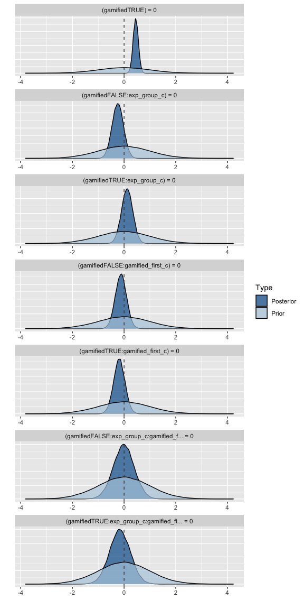
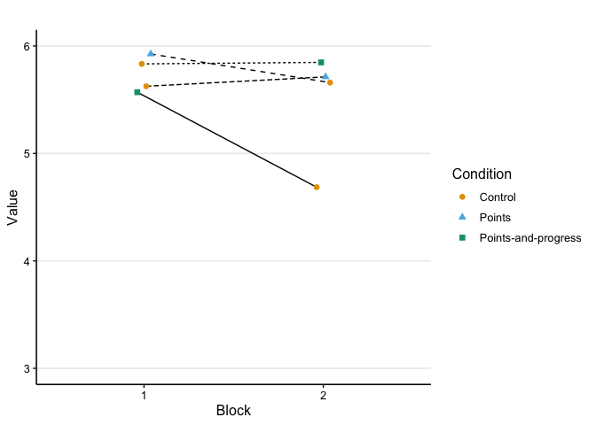
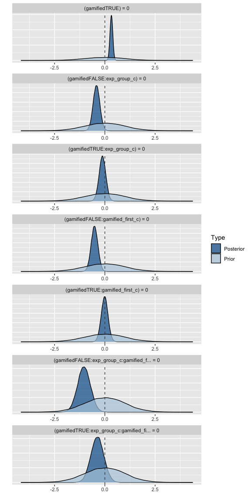
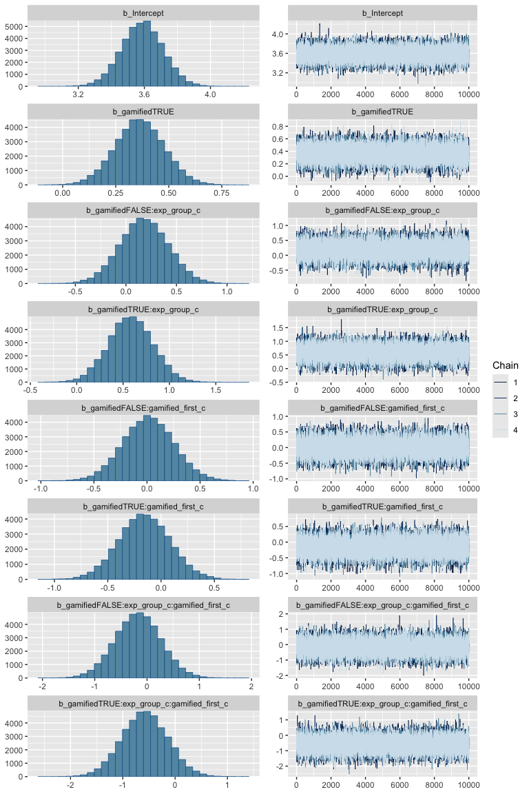

Analysis: survey
================
Maarten van der Velde & Gesa van den Broek
Last updated: 2024-11-20

- [Overview](#overview)
- [Setup](#setup)
- [Does gamification change task-motivational
  outcomes?](#does-gamification-change-task-motivational-outcomes)
  - [Combined plot](#combined-plot)
  - [Competence](#competence)
    - [Fit frequentist model](#fit-frequentist-model)
  - [Enjoyment](#enjoyment)
    - [Fit frequentist model](#fit-frequentist-model-1)
    - [Fit Bayesian model](#fit-bayesian-model)
  - [Perceived Task Value](#perceived-task-value)
    - [Fit frequentist model](#fit-frequentist-model-2)
  - [Conclusion](#conclusion)
- [Does gamification change goal setting
  behavior?](#does-gamification-change-goal-setting-behavior)
  - [Combined plot](#combined-plot-1)
  - [Goalsetting](#goalsetting)
    - [Fit frequentist model](#fit-frequentist-model-3)
  - [Wanting to perform well](#wanting-to-perform-well)
    - [Fit frequentist model](#fit-frequentist-model-4)
  - [Conclusion](#conclusion-1)
- [Are there negative effects of gamified feedback on learners’
  experience?](#are-there-negative-effects-of-gamified-feedback-on-learners-experience)
  - [Stress](#stress)
    - [Fit frequentist model](#fit-frequentist-model-5)
  - [Distraction](#distraction)
    - [Fit frequentist model](#fit-frequentist-model-6)
  - [Conclusion](#conclusion-2)
- [Which Condition do Learners
  prefer?](#which-condition-do-learners-prefer)
  - [Perceived Relevance](#perceived-relevance)
    - [Fit frequentist model](#fit-frequentist-model-7)
    - [Fit Bayesian model](#fit-bayesian-model-1)
  - [Preference for Condition](#preference-for-condition)
    - [Frequentist Chi-square test](#frequentist-chi-square-test)
    - [Bayesian Chi-square test](#bayesian-chi-square-test)
  - [Conclusions](#conclusions)
- [Does gamification change learners’ metacognitive
  judgements?](#does-gamification-change-learners-metacognitive-judgements)
  - [Judgement of learning](#judgement-of-learning)
    - [Fit frequentist model](#fit-frequentist-model-8)
    - [Visualise fitted model](#visualise-fitted-model-7)
  - [Conclusion](#conclusion-3)
- [Save hypothesis testing output for
  visualisation](#save-hypothesis-testing-output-for-visualisation)
- [Session info](#session-info)

# Overview

This notebook analyses the survey data collected in the study. After
each practice block, participants were asked about task-motivational
outcomes (feelings of competence, enjoyment, task value), goal setting
behaviour (experienced goal setting, trying to perform well), potential
negative effects (stress, distraction), perceived relevance of the form
of gamified feedback they encountered in the practice block, and were
asked to give a judgement of learning. After the last practice block,
participants also indicated their preferred feedback type from the types
they had encountered during practice.

This notebook analyses the effects of gamification on these outcomes. We
use mixed-effects regression models with the same set of
theoretically-motivated predictors across all analyses. We report both a
frequentist (using `lme4` and `lmerTest`) and a Bayesian (using `brms`)
analysis for each outcome.

# Setup

``` r
library(here)
library(dplyr)
library(ggplot2)
library(scales)
library(patchwork)
library(stringr)
library(tidyr)
library(lme4)
library(lmerTest)
library(brms)
library(BayesFactor)

# Set up parallel processing for Bayesian models
library(future)
plan(multisession, workers = 4)
```

Helper functions for plots and tables:

``` r
source(here("scripts", "00_visualisation_functions.R"))
```

Load processed data:

``` r
d_survey <- readRDS(here("data", "processed", "d_survey.rds"))
```

``` r
add_experiment_cols <- function (data) {
  data |>
    mutate(exp_order = case_when(
      gamified_first == 0 & exp_group == "score" ~ "Control—Score",
      gamified_first == 0 & exp_group == "both" ~ "Control—Both",
      gamified_first == 1 & exp_group == "score" ~ "Score—Control",
      gamified_first == 1 & exp_group == "both" ~ "Both—Control"
    )) |>
    mutate(type = ifelse(gamified, "Gamified", "Control"))
}
```

Helper function for interpreting Bayes factors:

``` r
bf_to_strength <- function (bf) {
  
  direction <- "for"
  
  if (bf < 1) {
    bf <- 1/bf
    direction <- "against"
  }
  
  strength <- case_when(
    bf == 1 ~ "No",
    bf < 3 ~ "Anecdotal",
    bf < 10 ~ "Moderate",
    bf < 30 ~ "Strong",
    bf < 100 ~ "Very strong",
    TRUE ~ "Extreme"
  )
  
  paste0(strength, " evidence ", direction)
}
```

# Does gamification change task-motivational outcomes?

Relevant variables: feelings of competence, enjoyment, task value.

Prepare data

``` r
d_survey_agg <- d_survey |>
  group_by(block, condition, gamified, gamified_first, exp_group, category, question) |>
  summarise(response_mean = mean(response, na.rm = T),
            response_se = sd(response, na.rm = T)/sqrt(n())) |>
  ungroup() |>
  add_experiment_cols() |>
  mutate(perception_label_sorted = factor(question, levels = c("goalsetting","performwell","goalstress","distraction","relevance")))
```

    ## `summarise()` has grouped output by 'block', 'condition', 'gamified',
    ## 'gamified_first', 'exp_group', 'category'. You can override using the `.groups`
    ## argument.

Mean-centering categorical predictors for modelling:

``` r
d_survey_m <- d_survey |>
  mutate(exp_group_c = ifelse(exp_group == "score", 0, 1),
         exp_group_c = exp_group_c - mean(exp_group_c),
         gamified_first_c = gamified_first - mean(gamified_first))
```

## Combined plot

``` r
dodge_width <- .25

p_motivation <- d_survey_agg |>
  filter(category == "motivation") |>
  ggplot(aes(x = block, y = response_mean, group = interaction(exp_order, question))) +
  facet_grid(~ question, labeller = labeller(question = str_to_title)) +
  geom_line(aes(lty = gamified_first), position = position_dodge(width = dodge_width), lwd = .4) +
  geom_errorbar(aes(ymin = response_mean - response_se, ymax = response_mean + response_se, colour = condition),
                width = 0,
                alpha = .5,
                position = position_dodge(width = dodge_width)) +
  geom_point(aes(colour = condition, pch = condition),
             size = 2,
             position = position_dodge(width = dodge_width)) +
  scale_y_continuous(breaks = 1:7) +
  scale_colour_manual(values = col_condition) +
  scale_linetype_manual(values = c(1, 2), labels = c("Control first", "Gamified first")) +
  labs(x = "Block",
       y = "Response",
       colour = "Condition",
       pch = "Condition",
       lty = "Order") +
  theme_paper

p_motivation
```

<!-- -->

``` r
ggsave(p_motivation, filename = here("output", "survey_motivation.png"), width = 7.5, height = 3)
```

## Competence

### Fit frequentist model

``` r
m_competence <- lmer(response ~ gamified +
                       gamified:exp_group_c +
                       gamified:gamified_first_c +
                       gamified:gamified_first_c:exp_group_c +
                       (1 | subject),
                     data = filter(d_survey_m, question == "competence"))

summary(m_competence)
```

    ## Linear mixed model fit by REML. t-tests use Satterthwaite's method [
    ## lmerModLmerTest]
    ## Formula: 
    ## response ~ gamified + gamified:exp_group_c + gamified:gamified_first_c +  
    ##     gamified:gamified_first_c:exp_group_c + (1 | subject)
    ##    Data: filter(d_survey_m, question == "competence")
    ## 
    ## REML criterion at convergence: 1119.5
    ## 
    ## Scaled residuals: 
    ##      Min       1Q   Median       3Q      Max 
    ## -2.32430 -0.51027  0.00453  0.51192  2.02550 
    ## 
    ## Random effects:
    ##  Groups   Name        Variance Std.Dev.
    ##  subject  (Intercept) 1.2298   1.1090  
    ##  Residual             0.8614   0.9281  
    ## Number of obs: 332, groups:  subject, 166
    ## 
    ## Fixed effects:
    ##                                             Estimate Std. Error        df
    ## (Intercept)                                  3.95034    0.11224 240.74459
    ## gamifiedTRUE                                 0.45649    0.10188 162.00000
    ## gamifiedFALSE:exp_group_c                   -0.24880    0.22474 240.74459
    ## gamifiedTRUE:exp_group_c                     0.11862    0.22474 240.74459
    ## gamifiedFALSE:gamified_first_c              -0.13313    0.22528 240.74459
    ## gamifiedTRUE:gamified_first_c               -0.19704    0.22528 240.74459
    ## gamifiedFALSE:exp_group_c:gamified_first_c  -0.03749    0.45111 240.74459
    ## gamifiedTRUE:exp_group_c:gamified_first_c   -0.19749    0.45111 240.74459
    ##                                            t value Pr(>|t|)    
    ## (Intercept)                                 35.195  < 2e-16 ***
    ## gamifiedTRUE                                 4.481  1.4e-05 ***
    ## gamifiedFALSE:exp_group_c                   -1.107    0.269    
    ## gamifiedTRUE:exp_group_c                     0.528    0.598    
    ## gamifiedFALSE:gamified_first_c              -0.591    0.555    
    ## gamifiedTRUE:gamified_first_c               -0.875    0.383    
    ## gamifiedFALSE:exp_group_c:gamified_first_c  -0.083    0.934    
    ## gamifiedTRUE:exp_group_c:gamified_first_c   -0.438    0.662    
    ## ---
    ## Signif. codes:  0 '***' 0.001 '**' 0.01 '*' 0.05 '.' 0.1 ' ' 1
    ## 
    ## Correlation of Fixed Effects:
    ##               (Intr) gmTRUE gmfdFALSE:x__ gmfdTRUE:x__ gmfdFALSE:g__
    ## gamifidTRUE   -0.454                                                
    ## gmfdFALSE:x__  0.000  0.000                                         
    ## gmfdTRUE:x__   0.000  0.000  0.588                                  
    ## gmfdFALSE:g__  0.000  0.000 -0.004        -0.002                    
    ## gmfdTRUE:g__   0.000  0.000 -0.002        -0.004        0.588       
    ## gFALSE:__:_   -0.004  0.002  0.000         0.000        0.001       
    ## gTRUE:__:__   -0.002 -0.002  0.000         0.000        0.000       
    ##               gmfdTRUE:g__ gFALSE:__:
    ## gamifidTRUE                          
    ## gmfdFALSE:x__                        
    ## gmfdTRUE:x__                         
    ## gmfdFALSE:g__                        
    ## gmfdTRUE:g__                         
    ## gFALSE:__:_    0.000                 
    ## gTRUE:__:__    0.001        0.588

``` r
print_model_table(m_competence)
```


#### Fitted values

``` r
d_model_fit <- crossing(
  gamified = c(TRUE, FALSE), 
  exp_group_c = 0,
  gamified_first_c = 0
)

d_model_fit$model_fit <- predict(m_competence,
                                 newdata = d_model_fit,
                                 re.form = NA, 
                                 type = "response")

d_model_fit
```

    ## # A tibble: 2 × 4
    ##   gamified exp_group_c gamified_first_c model_fit
    ##   <lgl>          <dbl>            <dbl>     <dbl>
    ## 1 FALSE              0                0      3.95
    ## 2 TRUE               0                0      4.41

#### Visualise fitted model

``` r
p_competence_m <- plot_model_fit(m_competence, filter(d_survey_m, question == "competence"), y_lab = "Competence") +
  scale_y_continuous(limits = c(3, 6), labels = scales::comma_format())
```

    ##   block           condition gamified gamified_first exp_group gamified_first_c
    ## 1     1             Control    FALSE          FALSE      both       -0.5421687
    ## 2     1             Control    FALSE          FALSE     score       -0.5421687
    ## 3     1              Points     TRUE           TRUE     score        0.4578313
    ## 4     1 Points-and-progress     TRUE           TRUE      both        0.4578313
    ## 5     2             Control    FALSE           TRUE      both        0.4578313
    ## 6     2             Control    FALSE           TRUE     score        0.4578313
    ## 7     2              Points     TRUE          FALSE     score       -0.5421687
    ## 8     2 Points-and-progress     TRUE          FALSE      both       -0.5421687
    ##   exp_group_c pred_val     exp_order     type
    ## 1   0.5240964 3.902778  Control—Both  Control
    ## 2  -0.4759036 4.131250 Control—Score  Control
    ## 3  -0.4759036 4.303191 Score—Control Gamified
    ## 4   0.5240964 4.331395  Both—Control Gamified
    ## 5   0.5240964 3.750000  Both—Control  Control
    ## 6  -0.4759036 4.015957 Score—Control  Control
    ## 7  -0.4759036 4.406250 Control—Score Gamified
    ## 8   0.5240964 4.631944  Control—Both Gamified

    ## Scale for y is already present.
    ## Adding another scale for y, which will replace the existing scale.

``` r
p_competence_m
```

<!-- -->
\### Fit Bayesian model

``` r
m_competence_bayes <- brm(response ~ gamified +
                            gamified:exp_group_c +
                            gamified:gamified_first_c +
                            gamified:gamified_first_c:exp_group_c +
                            (1 | subject),
                          data = filter(d_survey_m, question == "competence"),
                          prior = set_prior("normal(0, 1)", class = "b"),
                          chains = 4,
                          iter = 11000,
                          warmup = 1000,
                          sample_prior = TRUE,
                          future = TRUE,
                          seed = 0)
```

    ## Compiling Stan program...

    ## Trying to compile a simple C file

    ## Running /Library/Frameworks/R.framework/Resources/bin/R CMD SHLIB foo.c
    ## using C compiler: ‘Apple clang version 15.0.0 (clang-1500.3.9.4)’
    ## using SDK: ‘MacOSX14.4.sdk’
    ## clang -arch arm64 -I"/Library/Frameworks/R.framework/Resources/include" -DNDEBUG   -I"/Library/Frameworks/R.framework/Versions/4.3-arm64/Resources/library/Rcpp/include/"  -I"/Library/Frameworks/R.framework/Versions/4.3-arm64/Resources/library/RcppEigen/include/"  -I"/Library/Frameworks/R.framework/Versions/4.3-arm64/Resources/library/RcppEigen/include/unsupported"  -I"/Library/Frameworks/R.framework/Versions/4.3-arm64/Resources/library/BH/include" -I"/Library/Frameworks/R.framework/Versions/4.3-arm64/Resources/library/StanHeaders/include/src/"  -I"/Library/Frameworks/R.framework/Versions/4.3-arm64/Resources/library/StanHeaders/include/"  -I"/Library/Frameworks/R.framework/Versions/4.3-arm64/Resources/library/RcppParallel/include/"  -I"/Library/Frameworks/R.framework/Versions/4.3-arm64/Resources/library/rstan/include" -DEIGEN_NO_DEBUG  -DBOOST_DISABLE_ASSERTS  -DBOOST_PENDING_INTEGER_LOG2_HPP  -DSTAN_THREADS  -DUSE_STANC3 -DSTRICT_R_HEADERS  -DBOOST_PHOENIX_NO_VARIADIC_EXPRESSION  -D_HAS_AUTO_PTR_ETC=0  -include '/Library/Frameworks/R.framework/Versions/4.3-arm64/Resources/library/StanHeaders/include/stan/math/prim/fun/Eigen.hpp'  -D_REENTRANT -DRCPP_PARALLEL_USE_TBB=1   -I/opt/R/arm64/include    -fPIC  -falign-functions=64 -Wall -g -O2  -c foo.c -o foo.o
    ## In file included from <built-in>:1:
    ## In file included from /Library/Frameworks/R.framework/Versions/4.3-arm64/Resources/library/StanHeaders/include/stan/math/prim/fun/Eigen.hpp:22:
    ## In file included from /Library/Frameworks/R.framework/Versions/4.3-arm64/Resources/library/RcppEigen/include/Eigen/Dense:1:
    ## In file included from /Library/Frameworks/R.framework/Versions/4.3-arm64/Resources/library/RcppEigen/include/Eigen/Core:19:
    ## /Library/Frameworks/R.framework/Versions/4.3-arm64/Resources/library/RcppEigen/include/Eigen/src/Core/util/Macros.h:679:10: fatal error: 'cmath' file not found
    ## #include <cmath>
    ##          ^~~~~~~
    ## 1 error generated.
    ## make[1]: *** [foo.o] Error 1

    ## Start sampling

    ## 
    ## SAMPLING FOR MODEL 'anon_model' NOW (CHAIN 1).
    ## Chain 1: 
    ## Chain 1: Gradient evaluation took 8.8e-05 seconds
    ## Chain 1: 1000 transitions using 10 leapfrog steps per transition would take 0.88 seconds.
    ## Chain 1: Adjust your expectations accordingly!
    ## Chain 1: 
    ## Chain 1: 
    ## Chain 1: Iteration:     1 / 11000 [  0%]  (Warmup)
    ## Chain 1: Iteration:  1001 / 11000 [  9%]  (Sampling)
    ## Chain 1: Iteration:  2100 / 11000 [ 19%]  (Sampling)
    ## Chain 1: Iteration:  3200 / 11000 [ 29%]  (Sampling)
    ## Chain 1: Iteration:  4300 / 11000 [ 39%]  (Sampling)
    ## Chain 1: Iteration:  5400 / 11000 [ 49%]  (Sampling)
    ## Chain 1: Iteration:  6500 / 11000 [ 59%]  (Sampling)
    ## Chain 1: Iteration:  7600 / 11000 [ 69%]  (Sampling)
    ## Chain 1: Iteration:  8700 / 11000 [ 79%]  (Sampling)
    ## Chain 1: Iteration:  9800 / 11000 [ 89%]  (Sampling)
    ## Chain 1: Iteration: 10900 / 11000 [ 99%]  (Sampling)
    ## Chain 1: Iteration: 11000 / 11000 [100%]  (Sampling)
    ## Chain 1: 
    ## Chain 1:  Elapsed Time: 0.31 seconds (Warm-up)
    ## Chain 1:                2.159 seconds (Sampling)
    ## Chain 1:                2.469 seconds (Total)
    ## Chain 1: 
    ## 
    ## SAMPLING FOR MODEL 'anon_model' NOW (CHAIN 2).
    ## Chain 2: 
    ## Chain 2: Gradient evaluation took 9.4e-05 seconds
    ## Chain 2: 1000 transitions using 10 leapfrog steps per transition would take 0.94 seconds.
    ## Chain 2: Adjust your expectations accordingly!
    ## Chain 2: 
    ## Chain 2: 
    ## Chain 2: Iteration:     1 / 11000 [  0%]  (Warmup)
    ## Chain 2: Iteration:  1001 / 11000 [  9%]  (Sampling)
    ## Chain 2: Iteration:  2100 / 11000 [ 19%]  (Sampling)
    ## Chain 2: Iteration:  3200 / 11000 [ 29%]  (Sampling)
    ## Chain 2: Iteration:  4300 / 11000 [ 39%]  (Sampling)
    ## Chain 2: Iteration:  5400 / 11000 [ 49%]  (Sampling)
    ## Chain 2: Iteration:  6500 / 11000 [ 59%]  (Sampling)
    ## Chain 2: Iteration:  7600 / 11000 [ 69%]  (Sampling)
    ## Chain 2: Iteration:  8700 / 11000 [ 79%]  (Sampling)
    ## Chain 2: Iteration:  9800 / 11000 [ 89%]  (Sampling)
    ## Chain 2: Iteration: 10900 / 11000 [ 99%]  (Sampling)
    ## Chain 2: Iteration: 11000 / 11000 [100%]  (Sampling)
    ## Chain 2: 
    ## Chain 2:  Elapsed Time: 0.315 seconds (Warm-up)
    ## Chain 2:                2.175 seconds (Sampling)
    ## Chain 2:                2.49 seconds (Total)
    ## Chain 2: 
    ## 
    ## SAMPLING FOR MODEL 'anon_model' NOW (CHAIN 3).
    ## Chain 3: 
    ## Chain 3: Gradient evaluation took 8.5e-05 seconds
    ## Chain 3: 1000 transitions using 10 leapfrog steps per transition would take 0.85 seconds.
    ## Chain 3: Adjust your expectations accordingly!
    ## Chain 3: 
    ## Chain 3: 
    ## Chain 3: Iteration:     1 / 11000 [  0%]  (Warmup)
    ## Chain 3: Iteration:  1001 / 11000 [  9%]  (Sampling)
    ## Chain 3: Iteration:  2100 / 11000 [ 19%]  (Sampling)
    ## Chain 3: Iteration:  3200 / 11000 [ 29%]  (Sampling)
    ## Chain 3: Iteration:  4300 / 11000 [ 39%]  (Sampling)
    ## Chain 3: Iteration:  5400 / 11000 [ 49%]  (Sampling)
    ## Chain 3: Iteration:  6500 / 11000 [ 59%]  (Sampling)
    ## Chain 3: Iteration:  7600 / 11000 [ 69%]  (Sampling)
    ## Chain 3: Iteration:  8700 / 11000 [ 79%]  (Sampling)
    ## Chain 3: Iteration:  9800 / 11000 [ 89%]  (Sampling)
    ## Chain 3: Iteration: 10900 / 11000 [ 99%]  (Sampling)
    ## Chain 3: Iteration: 11000 / 11000 [100%]  (Sampling)
    ## Chain 3: 
    ## Chain 3:  Elapsed Time: 0.304 seconds (Warm-up)
    ## Chain 3:                2.151 seconds (Sampling)
    ## Chain 3:                2.455 seconds (Total)
    ## Chain 3: 
    ## 
    ## SAMPLING FOR MODEL 'anon_model' NOW (CHAIN 4).
    ## Chain 4: 
    ## Chain 4: Gradient evaluation took 8.6e-05 seconds
    ## Chain 4: 1000 transitions using 10 leapfrog steps per transition would take 0.86 seconds.
    ## Chain 4: Adjust your expectations accordingly!
    ## Chain 4: 
    ## Chain 4: 
    ## Chain 4: Iteration:     1 / 11000 [  0%]  (Warmup)
    ## Chain 4: Iteration:  1001 / 11000 [  9%]  (Sampling)
    ## Chain 4: Iteration:  2100 / 11000 [ 19%]  (Sampling)
    ## Chain 4: Iteration:  3200 / 11000 [ 29%]  (Sampling)
    ## Chain 4: Iteration:  4300 / 11000 [ 39%]  (Sampling)
    ## Chain 4: Iteration:  5400 / 11000 [ 49%]  (Sampling)
    ## Chain 4: Iteration:  6500 / 11000 [ 59%]  (Sampling)
    ## Chain 4: Iteration:  7600 / 11000 [ 69%]  (Sampling)
    ## Chain 4: Iteration:  8700 / 11000 [ 79%]  (Sampling)
    ## Chain 4: Iteration:  9800 / 11000 [ 89%]  (Sampling)
    ## Chain 4: Iteration: 10900 / 11000 [ 99%]  (Sampling)
    ## Chain 4: Iteration: 11000 / 11000 [100%]  (Sampling)
    ## Chain 4: 
    ## Chain 4:  Elapsed Time: 0.301 seconds (Warm-up)
    ## Chain 4:                2.178 seconds (Sampling)
    ## Chain 4:                2.479 seconds (Total)
    ## Chain 4:

``` r
summary(m_competence_bayes)
```

    ##  Family: gaussian 
    ##   Links: mu = identity; sigma = identity 
    ## Formula: response ~ gamified + gamified:exp_group_c + gamified:gamified_first_c + gamified:gamified_first_c:exp_group_c + (1 | subject) 
    ##    Data: filter(d_survey_m, question == "competence") (Number of observations: 332) 
    ##   Draws: 4 chains, each with iter = 11000; warmup = 1000; thin = 1;
    ##          total post-warmup draws = 40000
    ## 
    ## Multilevel Hyperparameters:
    ## ~subject (Number of levels: 166) 
    ##               Estimate Est.Error l-95% CI u-95% CI Rhat Bulk_ESS Tail_ESS
    ## sd(Intercept)     1.11      0.09     0.95     1.29 1.00    12390    21795
    ## 
    ## Regression Coefficients:
    ##                                            Estimate Est.Error l-95% CI u-95% CI
    ## Intercept                                      3.95      0.11     3.73     4.17
    ## gamifiedTRUE                                   0.45      0.10     0.25     0.65
    ## gamifiedFALSE:exp_group_c                     -0.24      0.22    -0.67     0.19
    ## gamifiedTRUE:exp_group_c                       0.12      0.22    -0.31     0.54
    ## gamifiedFALSE:gamified_first_c                -0.12      0.22    -0.55     0.30
    ## gamifiedTRUE:gamified_first_c                 -0.19      0.22    -0.62     0.25
    ## gamifiedFALSE:exp_group_c:gamified_first_c    -0.01      0.40    -0.81     0.77
    ## gamifiedTRUE:exp_group_c:gamified_first_c     -0.16      0.40    -0.95     0.63
    ##                                            Rhat Bulk_ESS Tail_ESS
    ## Intercept                                  1.00    24434    28437
    ## gamifiedTRUE                               1.00    82895    27999
    ## gamifiedFALSE:exp_group_c                  1.00    22129    28957
    ## gamifiedTRUE:exp_group_c                   1.00    21794    28643
    ## gamifiedFALSE:gamified_first_c             1.00    21855    28028
    ## gamifiedTRUE:gamified_first_c              1.00    22243    28415
    ## gamifiedFALSE:exp_group_c:gamified_first_c 1.00    25998    31069
    ## gamifiedTRUE:exp_group_c:gamified_first_c  1.00    26191    30603
    ## 
    ## Further Distributional Parameters:
    ##       Estimate Est.Error l-95% CI u-95% CI Rhat Bulk_ESS Tail_ESS
    ## sigma     0.94      0.05     0.84     1.05 1.00    17125    26124
    ## 
    ## Draws were sampled using sampling(NUTS). For each parameter, Bulk_ESS
    ## and Tail_ESS are effective sample size measures, and Rhat is the potential
    ## scale reduction factor on split chains (at convergence, Rhat = 1).

Inspect the posterior sample distributions of the fixed effects:

``` r
plot(m_competence_bayes, nvariables = 8, variable = "^b_", regex = TRUE)
```

<!-- -->
\#### Bayes factors

Do a hypothesis test for all fixed-effect coefficients (both main
effects and interactions) in the model being equal to zero. The column
`Evid.Ratio` shows the Bayes Factor in favour of the null hypothesis
($BF_{01}$).

``` r
h_test_competence <- hypothesis(m_competence_bayes,
                                c("gamifiedTRUE = 0",
                                  "gamifiedFALSE:exp_group_c = 0",
                                  "gamifiedTRUE:exp_group_c = 0",
                                  "gamifiedFALSE:gamified_first_c = 0",
                                  "gamifiedTRUE:gamified_first_c = 0",
                                  "gamifiedFALSE:exp_group_c:gamified_first_c = 0",
                                  "gamifiedTRUE:exp_group_c:gamified_first_c = 0"),
                                class = "b")

h_test_competence$hypothesis |>
  mutate(BF10 = 1 / Evid.Ratio,
         evidence_for_null = sapply(Evid.Ratio, bf_to_strength))
```

    ##                                         Hypothesis    Estimate Est.Error
    ## 1                               (gamifiedTRUE) = 0  0.45150909 0.1018394
    ## 2                  (gamifiedFALSE:exp_group_c) = 0 -0.24194251 0.2186226
    ## 3                   (gamifiedTRUE:exp_group_c) = 0  0.11732514 0.2186598
    ## 4             (gamifiedFALSE:gamified_first_c) = 0 -0.12202355 0.2176879
    ## 5              (gamifiedTRUE:gamified_first_c) = 0 -0.18501960 0.2195844
    ## 6 (gamifiedFALSE:exp_group_c:gamified_first_c) = 0 -0.01412887 0.4019075
    ## 7  (gamifiedTRUE:exp_group_c:gamified_first_c) = 0 -0.16078221 0.4011443
    ##     CI.Lower  CI.Upper Evid.Ratio Post.Prob Star        BF10
    ## 1  0.2520347 0.6503728 0.00120886 0.0012074    * 827.2257998
    ## 2 -0.6694900 0.1890433 2.43883517 0.7092039        0.4100318
    ## 3 -0.3132999 0.5434606 3.91127303 0.7963868        0.2556712
    ## 4 -0.5467040 0.3047861 3.88306789 0.7952107        0.2575283
    ## 5 -0.6189145 0.2481842 3.08960230 0.7554774        0.3236663
    ## 6 -0.8111936 0.7714445 2.48791876 0.7132961        0.4019424
    ## 7 -0.9462816 0.6319266 2.22452747 0.6898770        0.4495337
    ##          evidence_for_null
    ## 1 Extreme evidence against
    ## 2   Anecdotal evidence for
    ## 3    Moderate evidence for
    ## 4    Moderate evidence for
    ## 5    Moderate evidence for
    ## 6   Anecdotal evidence for
    ## 7   Anecdotal evidence for

This hypothesis test is calculating the Savage-Dickey density ratio at
zero, which is a ratio of the posterior density at zero relative to the
prior density at zero (indicated by dashed vertical line). Values above
1 indicate a stronger belief that the effect is indeed zero after having
observed the data. See Wagenmakers et al. (2010) for details on this
test, and
<https://mvuorre.github.io/posts/2017-03-21-bayes-factors-with-brms/>
for a reference on doing this with `brms`.

``` r
sd_ratio_competence <- plot(h_test_competence, nvariables = 8, variable = "^b_", regex = TRUE, plot = FALSE)

sd_ratio_competence[[1]] +
  geom_vline(xintercept = 0, linetype = "dashed", colour = "grey25")
```

<!-- -->

#### Fitted values

``` r
d_model_fit <- crossing(
  gamified = c(TRUE, FALSE), 
  exp_group_c = 0,
  gamified_first_c = 0
)

d_model_fit$model_fit <- predict(m_competence_bayes,
                                 newdata = d_model_fit,
                                 re_formula = NA,
                                 type = "response")[,1]

d_model_fit
```

    ## # A tibble: 2 × 4
    ##   gamified exp_group_c gamified_first_c model_fit
    ##   <lgl>          <dbl>            <dbl>     <dbl>
    ## 1 FALSE              0                0      3.96
    ## 2 TRUE               0                0      4.40

## Enjoyment

### Fit frequentist model

``` r
m_enjoyment <- lmer(response ~ gamified +
                      gamified:exp_group_c +
                      gamified:gamified_first_c +
                      gamified:gamified_first_c:exp_group_c +
                      (1 | subject),
                    data = filter(d_survey_m, question == "enjoyment"))

summary(m_enjoyment)
```

    ## Linear mixed model fit by REML. t-tests use Satterthwaite's method [
    ## lmerModLmerTest]
    ## Formula: 
    ## response ~ gamified + gamified:exp_group_c + gamified:gamified_first_c +  
    ##     gamified:gamified_first_c:exp_group_c + (1 | subject)
    ##    Data: filter(d_survey_m, question == "enjoyment")
    ## 
    ## REML criterion at convergence: 923.4
    ## 
    ## Scaled residuals: 
    ##      Min       1Q   Median       3Q      Max 
    ## -2.28644 -0.46853  0.04077  0.45253  2.13674 
    ## 
    ## Random effects:
    ##  Groups   Name        Variance Std.Dev.
    ##  subject  (Intercept) 0.8818   0.9391  
    ##  Residual             0.3950   0.6285  
    ## Number of obs: 332, groups:  subject, 166
    ## 
    ## Fixed effects:
    ##                                             Estimate Std. Error        df
    ## (Intercept)                                  4.48639    0.08770 219.36009
    ## gamifiedTRUE                                 0.54544    0.06898 162.00000
    ## gamifiedFALSE:exp_group_c                   -0.30539    0.17561 219.36009
    ## gamifiedTRUE:exp_group_c                     0.15226    0.17561 219.36009
    ## gamifiedFALSE:gamified_first_c              -0.63243    0.17603 219.36009
    ## gamifiedTRUE:gamified_first_c                0.14920    0.17603 219.36009
    ## gamifiedFALSE:exp_group_c:gamified_first_c  -0.83175    0.35248 219.36009
    ## gamifiedTRUE:exp_group_c:gamified_first_c   -0.49793    0.35248 219.36009
    ##                                            t value Pr(>|t|)    
    ## (Intercept)                                 51.155  < 2e-16 ***
    ## gamifiedTRUE                                 7.907 3.86e-13 ***
    ## gamifiedFALSE:exp_group_c                   -1.739 0.083428 .  
    ## gamifiedTRUE:exp_group_c                     0.867 0.386862    
    ## gamifiedFALSE:gamified_first_c              -3.593 0.000404 ***
    ## gamifiedTRUE:gamified_first_c                0.848 0.397584    
    ## gamifiedFALSE:exp_group_c:gamified_first_c  -2.360 0.019168 *  
    ## gamifiedTRUE:exp_group_c:gamified_first_c   -1.413 0.159185    
    ## ---
    ## Signif. codes:  0 '***' 0.001 '**' 0.01 '*' 0.05 '.' 0.1 ' ' 1
    ## 
    ## Correlation of Fixed Effects:
    ##               (Intr) gmTRUE gmfdFALSE:x__ gmfdTRUE:x__ gmfdFALSE:g__
    ## gamifidTRUE   -0.393                                                
    ## gmfdFALSE:x__  0.000  0.000                                         
    ## gmfdTRUE:x__   0.000  0.000  0.691                                  
    ## gmfdFALSE:g__  0.000  0.000 -0.004        -0.003                    
    ## gmfdTRUE:g__   0.000  0.000 -0.003        -0.004        0.691       
    ## gFALSE:__:_   -0.004  0.002  0.000         0.000        0.001       
    ## gTRUE:__:__   -0.003 -0.002  0.000         0.000        0.000       
    ##               gmfdTRUE:g__ gFALSE:__:
    ## gamifidTRUE                          
    ## gmfdFALSE:x__                        
    ## gmfdTRUE:x__                         
    ## gmfdFALSE:g__                        
    ## gmfdTRUE:g__                         
    ## gFALSE:__:_    0.000                 
    ## gTRUE:__:__    0.001        0.691

``` r
print_model_table(m_enjoyment)
```


#### Fitted values

``` r
d_model_fit <- crossing(
  gamified = c(TRUE, FALSE), 
  exp_group_c = 0,
  gamified_first_c = 0
)

d_model_fit$model_fit <- predict(m_enjoyment,
                                 newdata = d_model_fit,
                                 re.form = NA, 
                                 type = "response")

d_model_fit
```

    ## # A tibble: 2 × 4
    ##   gamified exp_group_c gamified_first_c model_fit
    ##   <lgl>          <dbl>            <dbl>     <dbl>
    ## 1 FALSE              0                0      4.49
    ## 2 TRUE               0                0      5.03

``` r
d_model_fit <- crossing(
  gamified = FALSE, 
  exp_group_c = 0,
  gamified_first_c = sort(unique(d_survey_m$gamified_first_c))
)

d_model_fit$model_fit <- predict(m_enjoyment,
                                 newdata = d_model_fit,
                                 re.form = NA, 
                                 type = "response")

d_model_fit
```

    ## # A tibble: 2 × 4
    ##   gamified exp_group_c gamified_first_c model_fit
    ##   <lgl>          <dbl>            <dbl>     <dbl>
    ## 1 FALSE              0           -0.542      4.83
    ## 2 FALSE              0            0.458      4.20

``` r
d_model_fit <- crossing(
  gamified = FALSE, 
  exp_group_c = sort(unique(d_survey_m$exp_group_c)),
  gamified_first_c = sort(unique(d_survey_m$gamified_first_c))
)

d_model_fit$model_fit <- predict(m_enjoyment,
                                 newdata = d_model_fit,
                                 re.form = NA, 
                                 type = "response")

d_model_fit
```

    ## # A tibble: 4 × 4
    ##   gamified exp_group_c gamified_first_c model_fit
    ##   <lgl>          <dbl>            <dbl>     <dbl>
    ## 1 FALSE         -0.476           -0.542      4.76
    ## 2 FALSE         -0.476            0.458      4.52
    ## 3 FALSE          0.524           -0.542      4.91
    ## 4 FALSE          0.524            0.458      3.84

#### Visualise fitted model

``` r
p_enjoyment_m <- plot_model_fit(m_enjoyment, filter(d_survey_m, question == "enjoyment"), y_lab = "Enjoyment") +
  scale_y_continuous(limits = c(3, 6), labels = scales::comma_format())
```

    ##   block           condition gamified gamified_first exp_group gamified_first_c
    ## 1     1             Control    FALSE          FALSE      both       -0.5421687
    ## 2     1             Control    FALSE          FALSE     score       -0.5421687
    ## 3     1              Points     TRUE           TRUE     score        0.4578313
    ## 4     1 Points-and-progress     TRUE           TRUE      both        0.4578313
    ## 5     2             Control    FALSE           TRUE      both        0.4578313
    ## 6     2             Control    FALSE           TRUE     score        0.4578313
    ## 7     2              Points     TRUE          FALSE     score       -0.5421687
    ## 8     2 Points-and-progress     TRUE          FALSE      both       -0.5421687
    ##   exp_group_c pred_val     exp_order     type
    ## 1   0.5240964 4.905556  Control—Both  Control
    ## 2  -0.4759036 4.760000 Control—Score  Control
    ## 3  -0.4759036 5.136170 Score—Control Gamified
    ## 4   0.5240964 5.060465  Both—Control Gamified
    ## 5   0.5240964 3.837209  Both—Control  Control
    ## 6  -0.4759036 4.523404 Score—Control  Control
    ## 7  -0.4759036 4.750000 Control—Score Gamified
    ## 8   0.5240964 5.172222  Control—Both Gamified

    ## Scale for y is already present.
    ## Adding another scale for y, which will replace the existing scale.

``` r
p_enjoyment_m
```

<!-- -->

### Fit Bayesian model

``` r
m_enjoyment_bayes <- brm(response ~ gamified +
                           gamified:exp_group_c +
                           gamified:gamified_first_c +
                           gamified:gamified_first_c:exp_group_c +
                           (1 | subject),
                         data = filter(d_survey_m, question == "enjoyment"),
                         prior = set_prior("normal(0, 1)", class = "b"),
                         chains = 4,
                         iter = 11000,
                         warmup = 1000,
                         sample_prior = TRUE,
                         future = TRUE,
                         seed = 0)
```

    ## Compiling Stan program...

    ## Trying to compile a simple C file

    ## Running /Library/Frameworks/R.framework/Resources/bin/R CMD SHLIB foo.c
    ## using C compiler: ‘Apple clang version 15.0.0 (clang-1500.3.9.4)’
    ## using SDK: ‘MacOSX14.4.sdk’
    ## clang -arch arm64 -I"/Library/Frameworks/R.framework/Resources/include" -DNDEBUG   -I"/Library/Frameworks/R.framework/Versions/4.3-arm64/Resources/library/Rcpp/include/"  -I"/Library/Frameworks/R.framework/Versions/4.3-arm64/Resources/library/RcppEigen/include/"  -I"/Library/Frameworks/R.framework/Versions/4.3-arm64/Resources/library/RcppEigen/include/unsupported"  -I"/Library/Frameworks/R.framework/Versions/4.3-arm64/Resources/library/BH/include" -I"/Library/Frameworks/R.framework/Versions/4.3-arm64/Resources/library/StanHeaders/include/src/"  -I"/Library/Frameworks/R.framework/Versions/4.3-arm64/Resources/library/StanHeaders/include/"  -I"/Library/Frameworks/R.framework/Versions/4.3-arm64/Resources/library/RcppParallel/include/"  -I"/Library/Frameworks/R.framework/Versions/4.3-arm64/Resources/library/rstan/include" -DEIGEN_NO_DEBUG  -DBOOST_DISABLE_ASSERTS  -DBOOST_PENDING_INTEGER_LOG2_HPP  -DSTAN_THREADS  -DUSE_STANC3 -DSTRICT_R_HEADERS  -DBOOST_PHOENIX_NO_VARIADIC_EXPRESSION  -D_HAS_AUTO_PTR_ETC=0  -include '/Library/Frameworks/R.framework/Versions/4.3-arm64/Resources/library/StanHeaders/include/stan/math/prim/fun/Eigen.hpp'  -D_REENTRANT -DRCPP_PARALLEL_USE_TBB=1   -I/opt/R/arm64/include    -fPIC  -falign-functions=64 -Wall -g -O2  -c foo.c -o foo.o
    ## In file included from <built-in>:1:
    ## In file included from /Library/Frameworks/R.framework/Versions/4.3-arm64/Resources/library/StanHeaders/include/stan/math/prim/fun/Eigen.hpp:22:
    ## In file included from /Library/Frameworks/R.framework/Versions/4.3-arm64/Resources/library/RcppEigen/include/Eigen/Dense:1:
    ## In file included from /Library/Frameworks/R.framework/Versions/4.3-arm64/Resources/library/RcppEigen/include/Eigen/Core:19:
    ## /Library/Frameworks/R.framework/Versions/4.3-arm64/Resources/library/RcppEigen/include/Eigen/src/Core/util/Macros.h:679:10: fatal error: 'cmath' file not found
    ## #include <cmath>
    ##          ^~~~~~~
    ## 1 error generated.
    ## make[1]: *** [foo.o] Error 1

    ## Start sampling

    ## 
    ## SAMPLING FOR MODEL 'anon_model' NOW (CHAIN 1).
    ## Chain 1: 
    ## Chain 1: Gradient evaluation took 9.5e-05 seconds
    ## Chain 1: 1000 transitions using 10 leapfrog steps per transition would take 0.95 seconds.
    ## Chain 1: Adjust your expectations accordingly!
    ## Chain 1: 
    ## Chain 1: 
    ## Chain 1: Iteration:     1 / 11000 [  0%]  (Warmup)
    ## Chain 1: Iteration:  1001 / 11000 [  9%]  (Sampling)
    ## Chain 1: Iteration:  2100 / 11000 [ 19%]  (Sampling)
    ## Chain 1: Iteration:  3200 / 11000 [ 29%]  (Sampling)
    ## Chain 1: Iteration:  4300 / 11000 [ 39%]  (Sampling)
    ## Chain 1: Iteration:  5400 / 11000 [ 49%]  (Sampling)
    ## Chain 1: Iteration:  6500 / 11000 [ 59%]  (Sampling)
    ## Chain 1: Iteration:  7600 / 11000 [ 69%]  (Sampling)
    ## Chain 1: Iteration:  8700 / 11000 [ 79%]  (Sampling)
    ## Chain 1: Iteration:  9800 / 11000 [ 89%]  (Sampling)
    ## Chain 1: Iteration: 10900 / 11000 [ 99%]  (Sampling)
    ## Chain 1: Iteration: 11000 / 11000 [100%]  (Sampling)
    ## Chain 1: 
    ## Chain 1:  Elapsed Time: 0.307 seconds (Warm-up)
    ## Chain 1:                2.232 seconds (Sampling)
    ## Chain 1:                2.539 seconds (Total)
    ## Chain 1: 
    ## 
    ## SAMPLING FOR MODEL 'anon_model' NOW (CHAIN 2).
    ## Chain 2: 
    ## Chain 2: Gradient evaluation took 9.1e-05 seconds
    ## Chain 2: 1000 transitions using 10 leapfrog steps per transition would take 0.91 seconds.
    ## Chain 2: Adjust your expectations accordingly!
    ## Chain 2: 
    ## Chain 2: 
    ## Chain 2: Iteration:     1 / 11000 [  0%]  (Warmup)
    ## Chain 2: Iteration:  1001 / 11000 [  9%]  (Sampling)
    ## Chain 2: Iteration:  2100 / 11000 [ 19%]  (Sampling)
    ## Chain 2: Iteration:  3200 / 11000 [ 29%]  (Sampling)
    ## Chain 2: Iteration:  4300 / 11000 [ 39%]  (Sampling)
    ## Chain 2: Iteration:  5400 / 11000 [ 49%]  (Sampling)
    ## Chain 2: Iteration:  6500 / 11000 [ 59%]  (Sampling)
    ## Chain 2: Iteration:  7600 / 11000 [ 69%]  (Sampling)
    ## Chain 2: Iteration:  8700 / 11000 [ 79%]  (Sampling)
    ## Chain 2: Iteration:  9800 / 11000 [ 89%]  (Sampling)
    ## Chain 2: Iteration: 10900 / 11000 [ 99%]  (Sampling)
    ## Chain 2: Iteration: 11000 / 11000 [100%]  (Sampling)
    ## Chain 2: 
    ## Chain 2:  Elapsed Time: 0.289 seconds (Warm-up)
    ## Chain 2:                2.151 seconds (Sampling)
    ## Chain 2:                2.44 seconds (Total)
    ## Chain 2: 
    ## 
    ## SAMPLING FOR MODEL 'anon_model' NOW (CHAIN 3).
    ## Chain 3: 
    ## Chain 3: Gradient evaluation took 0.000104 seconds
    ## Chain 3: 1000 transitions using 10 leapfrog steps per transition would take 1.04 seconds.
    ## Chain 3: Adjust your expectations accordingly!
    ## Chain 3: 
    ## Chain 3: 
    ## Chain 3: Iteration:     1 / 11000 [  0%]  (Warmup)
    ## Chain 3: Iteration:  1001 / 11000 [  9%]  (Sampling)
    ## Chain 3: Iteration:  2100 / 11000 [ 19%]  (Sampling)
    ## Chain 3: Iteration:  3200 / 11000 [ 29%]  (Sampling)
    ## Chain 3: Iteration:  4300 / 11000 [ 39%]  (Sampling)
    ## Chain 3: Iteration:  5400 / 11000 [ 49%]  (Sampling)
    ## Chain 3: Iteration:  6500 / 11000 [ 59%]  (Sampling)
    ## Chain 3: Iteration:  7600 / 11000 [ 69%]  (Sampling)
    ## Chain 3: Iteration:  8700 / 11000 [ 79%]  (Sampling)
    ## Chain 3: Iteration:  9800 / 11000 [ 89%]  (Sampling)
    ## Chain 3: Iteration: 10900 / 11000 [ 99%]  (Sampling)
    ## Chain 3: Iteration: 11000 / 11000 [100%]  (Sampling)
    ## Chain 3: 
    ## Chain 3:  Elapsed Time: 0.34 seconds (Warm-up)
    ## Chain 3:                2.189 seconds (Sampling)
    ## Chain 3:                2.529 seconds (Total)
    ## Chain 3: 
    ## 
    ## SAMPLING FOR MODEL 'anon_model' NOW (CHAIN 4).
    ## Chain 4: 
    ## Chain 4: Gradient evaluation took 9.9e-05 seconds
    ## Chain 4: 1000 transitions using 10 leapfrog steps per transition would take 0.99 seconds.
    ## Chain 4: Adjust your expectations accordingly!
    ## Chain 4: 
    ## Chain 4: 
    ## Chain 4: Iteration:     1 / 11000 [  0%]  (Warmup)
    ## Chain 4: Iteration:  1001 / 11000 [  9%]  (Sampling)
    ## Chain 4: Iteration:  2100 / 11000 [ 19%]  (Sampling)
    ## Chain 4: Iteration:  3200 / 11000 [ 29%]  (Sampling)
    ## Chain 4: Iteration:  4300 / 11000 [ 39%]  (Sampling)
    ## Chain 4: Iteration:  5400 / 11000 [ 49%]  (Sampling)
    ## Chain 4: Iteration:  6500 / 11000 [ 59%]  (Sampling)
    ## Chain 4: Iteration:  7600 / 11000 [ 69%]  (Sampling)
    ## Chain 4: Iteration:  8700 / 11000 [ 79%]  (Sampling)
    ## Chain 4: Iteration:  9800 / 11000 [ 89%]  (Sampling)
    ## Chain 4: Iteration: 10900 / 11000 [ 99%]  (Sampling)
    ## Chain 4: Iteration: 11000 / 11000 [100%]  (Sampling)
    ## Chain 4: 
    ## Chain 4:  Elapsed Time: 0.315 seconds (Warm-up)
    ## Chain 4:                2.168 seconds (Sampling)
    ## Chain 4:                2.483 seconds (Total)
    ## Chain 4:

``` r
summary(m_enjoyment_bayes)
```

    ##  Family: gaussian 
    ##   Links: mu = identity; sigma = identity 
    ## Formula: response ~ gamified + gamified:exp_group_c + gamified:gamified_first_c + gamified:gamified_first_c:exp_group_c + (1 | subject) 
    ##    Data: filter(d_survey_m, question == "enjoyment") (Number of observations: 332) 
    ##   Draws: 4 chains, each with iter = 11000; warmup = 1000; thin = 1;
    ##          total post-warmup draws = 40000
    ## 
    ## Multilevel Hyperparameters:
    ## ~subject (Number of levels: 166) 
    ##               Estimate Est.Error l-95% CI u-95% CI Rhat Bulk_ESS Tail_ESS
    ## sd(Intercept)     0.94      0.07     0.82     1.08 1.00    11228    22789
    ## 
    ## Regression Coefficients:
    ##                                            Estimate Est.Error l-95% CI u-95% CI
    ## Intercept                                      4.49      0.09     4.31     4.66
    ## gamifiedTRUE                                   0.54      0.07     0.41     0.68
    ## gamifiedFALSE:exp_group_c                     -0.30      0.17    -0.64     0.04
    ## gamifiedTRUE:exp_group_c                       0.16      0.17    -0.18     0.49
    ## gamifiedFALSE:gamified_first_c                -0.61      0.17    -0.95    -0.28
    ## gamifiedTRUE:gamified_first_c                  0.16      0.17    -0.18     0.50
    ## gamifiedFALSE:exp_group_c:gamified_first_c    -0.71      0.33    -1.35    -0.07
    ## gamifiedTRUE:exp_group_c:gamified_first_c     -0.39      0.33    -1.03     0.25
    ##                                            Rhat Bulk_ESS Tail_ESS
    ## Intercept                                  1.00    14172    23030
    ## gamifiedTRUE                               1.00    81404    27741
    ## gamifiedFALSE:exp_group_c                  1.00    12929    21242
    ## gamifiedTRUE:exp_group_c                   1.00    13206    21816
    ## gamifiedFALSE:gamified_first_c             1.00    12698    21773
    ## gamifiedTRUE:gamified_first_c              1.00    13144    21628
    ## gamifiedFALSE:exp_group_c:gamified_first_c 1.00    15905    24017
    ## gamifiedTRUE:exp_group_c:gamified_first_c  1.00    15589    24687
    ## 
    ## Further Distributional Parameters:
    ##       Estimate Est.Error l-95% CI u-95% CI Rhat Bulk_ESS Tail_ESS
    ## sigma     0.63      0.04     0.57     0.71 1.00    16303    24044
    ## 
    ## Draws were sampled using sampling(NUTS). For each parameter, Bulk_ESS
    ## and Tail_ESS are effective sample size measures, and Rhat is the potential
    ## scale reduction factor on split chains (at convergence, Rhat = 1).

Inspect the posterior sample distributions of the fixed effects:

``` r
plot(m_enjoyment_bayes, nvariables = 8, variable = "^b_", regex = TRUE)
```

<!-- -->

#### Bayes factors

Do a hypothesis test for all fixed-effect coefficients (both main
effects and interactions) in the model being equal to zero. The column
`Evid.Ratio` shows the Bayes Factor in favour of the null hypothesis
($BF_{01}$).

``` r
h_test_enjoyment <- hypothesis(m_enjoyment_bayes,
                               c("gamifiedTRUE = 0",
                                 "gamifiedFALSE:exp_group_c = 0",
                                 "gamifiedTRUE:exp_group_c = 0",
                                 "gamifiedFALSE:gamified_first_c = 0",
                                 "gamifiedTRUE:gamified_first_c = 0",
                                 "gamifiedFALSE:exp_group_c:gamified_first_c = 0",
                                 "gamifiedTRUE:exp_group_c:gamified_first_c = 0"),
                               class = "b")

h_test_enjoyment$hypothesis |>
  mutate(BF10 = 1 / Evid.Ratio,
         evidence_for_null = sapply(Evid.Ratio, bf_to_strength))
```

    ##                                         Hypothesis   Estimate  Est.Error
    ## 1                               (gamifiedTRUE) = 0  0.5428439 0.06948424
    ## 2                  (gamifiedFALSE:exp_group_c) = 0 -0.2984663 0.17314413
    ## 3                   (gamifiedTRUE:exp_group_c) = 0  0.1551086 0.17280448
    ## 4             (gamifiedFALSE:gamified_first_c) = 0 -0.6149647 0.17244908
    ## 5              (gamifiedTRUE:gamified_first_c) = 0  0.1594374 0.17350448
    ## 6 (gamifiedFALSE:exp_group_c:gamified_first_c) = 0 -0.7086042 0.32564573
    ## 7  (gamifiedTRUE:exp_group_c:gamified_first_c) = 0 -0.3869589 0.32569495
    ##     CI.Lower    CI.Upper   Evid.Ratio    Post.Prob Star         BF10
    ## 1  0.4061468  0.68057256 1.013629e-19 1.013629e-19    * 9.865540e+18
    ## 2 -0.6377063  0.04215965 1.338441e+00 5.723647e-01      7.471379e-01
    ## 3 -0.1844929  0.49291430 3.965591e+00 7.986141e-01      2.521692e-01
    ## 4 -0.9527943 -0.27820328 7.980132e-03 7.916953e-03    * 1.253112e+02
    ## 5 -0.1787247  0.49877104 3.753019e+00 7.896074e-01      2.664522e-01
    ## 6 -1.3491006 -0.07051127 2.945438e-01 2.275271e-01    * 3.395080e+00
    ## 7 -1.0318012  0.25046289 1.532198e+00 6.050862e-01      6.526570e-01
    ##           evidence_for_null
    ## 1  Extreme evidence against
    ## 2    Anecdotal evidence for
    ## 3     Moderate evidence for
    ## 4  Extreme evidence against
    ## 5     Moderate evidence for
    ## 6 Moderate evidence against
    ## 7    Anecdotal evidence for

This hypothesis test is calculating the Savage-Dickey density ratio at
zero, which is a ratio of the posterior density at zero relative to the
prior density at zero (indicated by dashed vertical line). Values above
1 indicate a stronger belief that the effect is indeed zero after having
observed the data.

``` r
sd_ratio_enjoyment <- plot(h_test_enjoyment, nvariables = 8, variable = "^b_", regex = TRUE, plot = FALSE)

sd_ratio_enjoyment[[1]] +
  geom_vline(xintercept = 0, linetype = "dashed", colour = "grey25")
```

<!-- -->

#### Fitted values

``` r
d_model_fit <- crossing(
  gamified = c(TRUE, FALSE), 
  exp_group_c = 0,
  gamified_first_c = 0
)

d_model_fit$model_fit <- predict(m_enjoyment_bayes,,
                                 newdata = d_model_fit,
                                 re_formula = NA, 
                                 type = "response")[,1]

d_model_fit
```

    ## # A tibble: 2 × 4
    ##   gamified exp_group_c gamified_first_c model_fit
    ##   <lgl>          <dbl>            <dbl>     <dbl>
    ## 1 FALSE              0                0      4.49
    ## 2 TRUE               0                0      5.03

``` r
d_model_fit <- crossing(
  gamified = FALSE, 
  exp_group_c = 0,
  gamified_first_c = sort(unique(d_survey_m$gamified_first_c))
)

d_model_fit$model_fit <- predict(m_enjoyment_bayes,
                                 newdata = d_model_fit,
                                 re_formula = NA,
                                 type = "response")[,1]

d_model_fit
```

    ## # A tibble: 2 × 4
    ##   gamified exp_group_c gamified_first_c model_fit
    ##   <lgl>          <dbl>            <dbl>     <dbl>
    ## 1 FALSE              0           -0.542      4.82
    ## 2 FALSE              0            0.458      4.21

``` r
d_model_fit <- crossing(
  gamified = FALSE, 
  exp_group_c = sort(unique(d_survey_m$exp_group_c)),
  gamified_first_c = sort(unique(d_survey_m$gamified_first_c))
)

d_model_fit$model_fit <- predict(m_enjoyment_bayes,
                                 newdata = d_model_fit,
                                 re_formula = NA,
                                 type = "response")[,1]

d_model_fit
```

    ## # A tibble: 4 × 4
    ##   gamified exp_group_c gamified_first_c model_fit
    ##   <lgl>          <dbl>            <dbl>     <dbl>
    ## 1 FALSE         -0.476           -0.542      4.77
    ## 2 FALSE         -0.476            0.458      4.50
    ## 3 FALSE          0.524           -0.542      4.86
    ## 4 FALSE          0.524            0.458      3.87

## Perceived Task Value

### Fit frequentist model

``` r
m_value <- lmer(response ~ gamified +
                       gamified:exp_group_c +
                       gamified:gamified_first_c +
                       gamified:gamified_first_c:exp_group_c +
                       (1 | subject),
                     data = filter(d_survey_m, question == "value"))

summary(m_value)
```

    ## Linear mixed model fit by REML. t-tests use Satterthwaite's method [
    ## lmerModLmerTest]
    ## Formula: 
    ## response ~ gamified + gamified:exp_group_c + gamified:gamified_first_c +  
    ##     gamified:gamified_first_c:exp_group_c + (1 | subject)
    ##    Data: filter(d_survey_m, question == "value")
    ## 
    ## REML criterion at convergence: 911.9
    ## 
    ## Scaled residuals: 
    ##      Min       1Q   Median       3Q      Max 
    ## -2.96908 -0.46010  0.04555  0.52620  2.10776 
    ## 
    ## Random effects:
    ##  Groups   Name        Variance Std.Dev.
    ##  subject  (Intercept) 0.7933   0.8907  
    ##  Residual             0.3998   0.6323  
    ## Number of obs: 332, groups:  subject, 166
    ## 
    ## Fixed effects:
    ##                                             Estimate Std. Error        df
    ## (Intercept)                                  5.43795    0.08478 224.66834
    ## gamifiedTRUE                                 0.32761    0.06940 162.00000
    ## gamifiedFALSE:exp_group_c                   -0.43243    0.16976 224.66834
    ## gamifiedTRUE:exp_group_c                    -0.13120    0.16976 224.66834
    ## gamifiedFALSE:gamified_first_c              -0.52788    0.17017 224.66834
    ## gamifiedTRUE:gamified_first_c               -0.02039    0.17017 224.66834
    ## gamifiedFALSE:exp_group_c:gamified_first_c  -1.18186    0.34074 224.66834
    ## gamifiedTRUE:exp_group_c:gamified_first_c   -0.49049    0.34074 224.66834
    ##                                            t value Pr(>|t|)    
    ## (Intercept)                                 64.142  < 2e-16 ***
    ## gamifiedTRUE                                 4.720 5.06e-06 ***
    ## gamifiedFALSE:exp_group_c                   -2.547 0.011522 *  
    ## gamifiedTRUE:exp_group_c                    -0.773 0.440397    
    ## gamifiedFALSE:gamified_first_c              -3.102 0.002168 ** 
    ## gamifiedTRUE:gamified_first_c               -0.120 0.904718    
    ## gamifiedFALSE:exp_group_c:gamified_first_c  -3.469 0.000627 ***
    ## gamifiedTRUE:exp_group_c:gamified_first_c   -1.439 0.151407    
    ## ---
    ## Signif. codes:  0 '***' 0.001 '**' 0.01 '*' 0.05 '.' 0.1 ' ' 1
    ## 
    ## Correlation of Fixed Effects:
    ##               (Intr) gmTRUE gmfdFALSE:x__ gmfdTRUE:x__ gmfdFALSE:g__
    ## gamifidTRUE   -0.409                                                
    ## gmfdFALSE:x__  0.000  0.000                                         
    ## gmfdTRUE:x__   0.000  0.000  0.665                                  
    ## gmfdFALSE:g__  0.000  0.000 -0.004        -0.003                    
    ## gmfdTRUE:g__   0.000  0.000 -0.003        -0.004        0.665       
    ## gFALSE:__:_   -0.004  0.002  0.000         0.000        0.001       
    ## gTRUE:__:__   -0.003 -0.002  0.000         0.000        0.000       
    ##               gmfdTRUE:g__ gFALSE:__:
    ## gamifidTRUE                          
    ## gmfdFALSE:x__                        
    ## gmfdTRUE:x__                         
    ## gmfdFALSE:g__                        
    ## gmfdTRUE:g__                         
    ## gFALSE:__:_    0.000                 
    ## gTRUE:__:__    0.001        0.665

``` r
print_model_table(m_value)
```


#### Fitted values

overall difference in reported task value between gamified and
non-gamified conditions…

``` r
d_model_fit <- crossing(
  gamified = c(TRUE, FALSE), 
  exp_group_c = 0,
  gamified_first_c = 0
)

d_model_fit$model_fit <- predict(m_value,
                                 newdata = d_model_fit,
                                 re.form = NA, 
                                 type = "response")

d_model_fit
```

    ## # A tibble: 2 × 4
    ##   gamified exp_group_c gamified_first_c model_fit
    ##   <lgl>          <dbl>            <dbl>     <dbl>
    ## 1 FALSE              0                0      5.44
    ## 2 TRUE               0                0      5.77

within the Control condition, reported task value is higher in the
Points experimental group than in the Progress bar group…

``` r
d_model_fit <- crossing(
  gamified = FALSE, 
  exp_group_c = sort(unique(d_survey_m$exp_group_c)),
  gamified_first_c = 0
)

d_model_fit$model_fit <- predict(m_value,
                                 newdata = d_model_fit,
                                 re.form = NA, 
                                 type = "response")

d_model_fit
```

    ## # A tibble: 2 × 4
    ##   gamified exp_group_c gamified_first_c model_fit
    ##   <lgl>          <dbl>            <dbl>     <dbl>
    ## 1 FALSE         -0.476                0      5.64
    ## 2 FALSE          0.524                0      5.21

within the Control condition, reported task value is higher in the Block
1 than in Block 2…

``` r
d_model_fit <- crossing(
  gamified = FALSE, 
  exp_group_c = 0,
  gamified_first_c = sort(unique(d_survey_m$gamified_first_c))
)

d_model_fit$model_fit <- predict(m_value,
                                 newdata = d_model_fit,
                                 re.form = NA, 
                                 type = "response")

d_model_fit
```

    ## # A tibble: 2 × 4
    ##   gamified exp_group_c gamified_first_c model_fit
    ##   <lgl>          <dbl>            <dbl>     <dbl>
    ## 1 FALSE              0           -0.542      5.72
    ## 2 FALSE              0            0.458      5.20

``` r
d_model_fit <- crossing(
  gamified = FALSE, 
  exp_group_c = sort(unique(d_survey_m$exp_group_c)),
  gamified_first_c = sort(unique(d_survey_m$gamified_first_c))
)

d_model_fit$model_fit <- predict(m_value,
                                 newdata = d_model_fit,
                                 re.form = NA, 
                                 type = "response")

d_model_fit
```

    ## # A tibble: 4 × 4
    ##   gamified exp_group_c gamified_first_c model_fit
    ##   <lgl>          <dbl>            <dbl>     <dbl>
    ## 1 FALSE         -0.476           -0.542      5.62
    ## 2 FALSE         -0.476            0.458      5.66
    ## 3 FALSE          0.524           -0.542      5.83
    ## 4 FALSE          0.524            0.458      4.69

#### Visualise fitted model

``` r
p_value_m <- plot_model_fit(m_value, filter(d_survey_m, question == "value"), y_lab = "Value") +
  scale_y_continuous(limits = c(3, 6), labels = scales::comma_format())
```

    ##   block           condition gamified gamified_first exp_group gamified_first_c
    ## 1     1             Control    FALSE          FALSE      both       -0.5421687
    ## 2     1             Control    FALSE          FALSE     score       -0.5421687
    ## 3     1              Points     TRUE           TRUE     score        0.4578313
    ## 4     1 Points-and-progress     TRUE           TRUE      both        0.4578313
    ## 5     2             Control    FALSE           TRUE      both        0.4578313
    ## 6     2             Control    FALSE           TRUE     score        0.4578313
    ## 7     2              Points     TRUE          FALSE     score       -0.5421687
    ## 8     2 Points-and-progress     TRUE          FALSE      both       -0.5421687
    ##   exp_group_c pred_val     exp_order     type
    ## 1   0.5240964 5.833333  Control—Both  Control
    ## 2  -0.4759036 5.625000 Control—Score  Control
    ## 3  -0.4759036 5.925532 Score—Control Gamified
    ## 4   0.5240964 5.569767  Both—Control Gamified
    ## 5   0.5240964 4.686047  Both—Control  Control
    ## 6  -0.4759036 5.659574 Score—Control  Control
    ## 7  -0.4759036 5.712500 Control—Score Gamified
    ## 8   0.5240964 5.847222  Control—Both Gamified

    ## Scale for y is already present.
    ## Adding another scale for y, which will replace the existing scale.

``` r
p_value_m
```

<!-- -->
\### Fit Bayesian model

``` r
m_value_bayes <- brm(response ~ gamified +
                       gamified:exp_group_c +
                       gamified:gamified_first_c +
                       gamified:gamified_first_c:exp_group_c +
                       (1 | subject),
                     data = filter(d_survey_m, question == "value"),
                     prior = set_prior("normal(0, 1)", class = "b"),
                     chains = 4,
                     iter = 11000,
                     warmup = 1000,
                     sample_prior = TRUE,
                     future = TRUE,
                     seed = 0)
```

    ## Compiling Stan program...

    ## Trying to compile a simple C file

    ## Running /Library/Frameworks/R.framework/Resources/bin/R CMD SHLIB foo.c
    ## using C compiler: ‘Apple clang version 15.0.0 (clang-1500.3.9.4)’
    ## using SDK: ‘MacOSX14.4.sdk’
    ## clang -arch arm64 -I"/Library/Frameworks/R.framework/Resources/include" -DNDEBUG   -I"/Library/Frameworks/R.framework/Versions/4.3-arm64/Resources/library/Rcpp/include/"  -I"/Library/Frameworks/R.framework/Versions/4.3-arm64/Resources/library/RcppEigen/include/"  -I"/Library/Frameworks/R.framework/Versions/4.3-arm64/Resources/library/RcppEigen/include/unsupported"  -I"/Library/Frameworks/R.framework/Versions/4.3-arm64/Resources/library/BH/include" -I"/Library/Frameworks/R.framework/Versions/4.3-arm64/Resources/library/StanHeaders/include/src/"  -I"/Library/Frameworks/R.framework/Versions/4.3-arm64/Resources/library/StanHeaders/include/"  -I"/Library/Frameworks/R.framework/Versions/4.3-arm64/Resources/library/RcppParallel/include/"  -I"/Library/Frameworks/R.framework/Versions/4.3-arm64/Resources/library/rstan/include" -DEIGEN_NO_DEBUG  -DBOOST_DISABLE_ASSERTS  -DBOOST_PENDING_INTEGER_LOG2_HPP  -DSTAN_THREADS  -DUSE_STANC3 -DSTRICT_R_HEADERS  -DBOOST_PHOENIX_NO_VARIADIC_EXPRESSION  -D_HAS_AUTO_PTR_ETC=0  -include '/Library/Frameworks/R.framework/Versions/4.3-arm64/Resources/library/StanHeaders/include/stan/math/prim/fun/Eigen.hpp'  -D_REENTRANT -DRCPP_PARALLEL_USE_TBB=1   -I/opt/R/arm64/include    -fPIC  -falign-functions=64 -Wall -g -O2  -c foo.c -o foo.o
    ## In file included from <built-in>:1:
    ## In file included from /Library/Frameworks/R.framework/Versions/4.3-arm64/Resources/library/StanHeaders/include/stan/math/prim/fun/Eigen.hpp:22:
    ## In file included from /Library/Frameworks/R.framework/Versions/4.3-arm64/Resources/library/RcppEigen/include/Eigen/Dense:1:
    ## In file included from /Library/Frameworks/R.framework/Versions/4.3-arm64/Resources/library/RcppEigen/include/Eigen/Core:19:
    ## /Library/Frameworks/R.framework/Versions/4.3-arm64/Resources/library/RcppEigen/include/Eigen/src/Core/util/Macros.h:679:10: fatal error: 'cmath' file not found
    ## #include <cmath>
    ##          ^~~~~~~
    ## 1 error generated.
    ## make[1]: *** [foo.o] Error 1

    ## Start sampling

    ## 
    ## SAMPLING FOR MODEL 'anon_model' NOW (CHAIN 1).
    ## Chain 1: 
    ## Chain 1: Gradient evaluation took 0.000101 seconds
    ## Chain 1: 1000 transitions using 10 leapfrog steps per transition would take 1.01 seconds.
    ## Chain 1: Adjust your expectations accordingly!
    ## Chain 1: 
    ## Chain 1: 
    ## Chain 1: Iteration:     1 / 11000 [  0%]  (Warmup)
    ## Chain 1: Iteration:  1001 / 11000 [  9%]  (Sampling)
    ## Chain 1: Iteration:  2100 / 11000 [ 19%]  (Sampling)
    ## Chain 1: Iteration:  3200 / 11000 [ 29%]  (Sampling)
    ## Chain 1: Iteration:  4300 / 11000 [ 39%]  (Sampling)
    ## Chain 1: Iteration:  5400 / 11000 [ 49%]  (Sampling)
    ## Chain 1: Iteration:  6500 / 11000 [ 59%]  (Sampling)
    ## Chain 1: Iteration:  7600 / 11000 [ 69%]  (Sampling)
    ## Chain 1: Iteration:  8700 / 11000 [ 79%]  (Sampling)
    ## Chain 1: Iteration:  9800 / 11000 [ 89%]  (Sampling)
    ## Chain 1: Iteration: 10900 / 11000 [ 99%]  (Sampling)
    ## Chain 1: Iteration: 11000 / 11000 [100%]  (Sampling)
    ## Chain 1: 
    ## Chain 1:  Elapsed Time: 0.331 seconds (Warm-up)
    ## Chain 1:                2.195 seconds (Sampling)
    ## Chain 1:                2.526 seconds (Total)
    ## Chain 1: 
    ## 
    ## SAMPLING FOR MODEL 'anon_model' NOW (CHAIN 2).
    ## Chain 2: 
    ## Chain 2: Gradient evaluation took 9.8e-05 seconds
    ## Chain 2: 1000 transitions using 10 leapfrog steps per transition would take 0.98 seconds.
    ## Chain 2: Adjust your expectations accordingly!
    ## Chain 2: 
    ## Chain 2: 
    ## Chain 2: Iteration:     1 / 11000 [  0%]  (Warmup)
    ## Chain 2: Iteration:  1001 / 11000 [  9%]  (Sampling)
    ## Chain 2: Iteration:  2100 / 11000 [ 19%]  (Sampling)
    ## Chain 2: Iteration:  3200 / 11000 [ 29%]  (Sampling)
    ## Chain 2: Iteration:  4300 / 11000 [ 39%]  (Sampling)
    ## Chain 2: Iteration:  5400 / 11000 [ 49%]  (Sampling)
    ## Chain 2: Iteration:  6500 / 11000 [ 59%]  (Sampling)
    ## Chain 2: Iteration:  7600 / 11000 [ 69%]  (Sampling)
    ## Chain 2: Iteration:  8700 / 11000 [ 79%]  (Sampling)
    ## Chain 2: Iteration:  9800 / 11000 [ 89%]  (Sampling)
    ## Chain 2: Iteration: 10900 / 11000 [ 99%]  (Sampling)
    ## Chain 2: Iteration: 11000 / 11000 [100%]  (Sampling)
    ## Chain 2: 
    ## Chain 2:  Elapsed Time: 0.335 seconds (Warm-up)
    ## Chain 2:                2.216 seconds (Sampling)
    ## Chain 2:                2.551 seconds (Total)
    ## Chain 2: 
    ## 
    ## SAMPLING FOR MODEL 'anon_model' NOW (CHAIN 3).
    ## Chain 3: 
    ## Chain 3: Gradient evaluation took 0.000109 seconds
    ## Chain 3: 1000 transitions using 10 leapfrog steps per transition would take 1.09 seconds.
    ## Chain 3: Adjust your expectations accordingly!
    ## Chain 3: 
    ## Chain 3: 
    ## Chain 3: Iteration:     1 / 11000 [  0%]  (Warmup)
    ## Chain 3: Iteration:  1001 / 11000 [  9%]  (Sampling)
    ## Chain 3: Iteration:  2100 / 11000 [ 19%]  (Sampling)
    ## Chain 3: Iteration:  3200 / 11000 [ 29%]  (Sampling)
    ## Chain 3: Iteration:  4300 / 11000 [ 39%]  (Sampling)
    ## Chain 3: Iteration:  5400 / 11000 [ 49%]  (Sampling)
    ## Chain 3: Iteration:  6500 / 11000 [ 59%]  (Sampling)
    ## Chain 3: Iteration:  7600 / 11000 [ 69%]  (Sampling)
    ## Chain 3: Iteration:  8700 / 11000 [ 79%]  (Sampling)
    ## Chain 3: Iteration:  9800 / 11000 [ 89%]  (Sampling)
    ## Chain 3: Iteration: 10900 / 11000 [ 99%]  (Sampling)
    ## Chain 3: Iteration: 11000 / 11000 [100%]  (Sampling)
    ## Chain 3: 
    ## Chain 3:  Elapsed Time: 0.319 seconds (Warm-up)
    ## Chain 3:                2.237 seconds (Sampling)
    ## Chain 3:                2.556 seconds (Total)
    ## Chain 3: 
    ## 
    ## SAMPLING FOR MODEL 'anon_model' NOW (CHAIN 4).
    ## Chain 4: 
    ## Chain 4: Gradient evaluation took 9.6e-05 seconds
    ## Chain 4: 1000 transitions using 10 leapfrog steps per transition would take 0.96 seconds.
    ## Chain 4: Adjust your expectations accordingly!
    ## Chain 4: 
    ## Chain 4: 
    ## Chain 4: Iteration:     1 / 11000 [  0%]  (Warmup)
    ## Chain 4: Iteration:  1001 / 11000 [  9%]  (Sampling)
    ## Chain 4: Iteration:  2100 / 11000 [ 19%]  (Sampling)
    ## Chain 4: Iteration:  3200 / 11000 [ 29%]  (Sampling)
    ## Chain 4: Iteration:  4300 / 11000 [ 39%]  (Sampling)
    ## Chain 4: Iteration:  5400 / 11000 [ 49%]  (Sampling)
    ## Chain 4: Iteration:  6500 / 11000 [ 59%]  (Sampling)
    ## Chain 4: Iteration:  7600 / 11000 [ 69%]  (Sampling)
    ## Chain 4: Iteration:  8700 / 11000 [ 79%]  (Sampling)
    ## Chain 4: Iteration:  9800 / 11000 [ 89%]  (Sampling)
    ## Chain 4: Iteration: 10900 / 11000 [ 99%]  (Sampling)
    ## Chain 4: Iteration: 11000 / 11000 [100%]  (Sampling)
    ## Chain 4: 
    ## Chain 4:  Elapsed Time: 0.313 seconds (Warm-up)
    ## Chain 4:                2.243 seconds (Sampling)
    ## Chain 4:                2.556 seconds (Total)
    ## Chain 4:

``` r
summary(m_value_bayes)
```

    ##  Family: gaussian 
    ##   Links: mu = identity; sigma = identity 
    ## Formula: response ~ gamified + gamified:exp_group_c + gamified:gamified_first_c + gamified:gamified_first_c:exp_group_c + (1 | subject) 
    ##    Data: filter(d_survey_m, question == "value") (Number of observations: 332) 
    ##   Draws: 4 chains, each with iter = 11000; warmup = 1000; thin = 1;
    ##          total post-warmup draws = 40000
    ## 
    ## Multilevel Hyperparameters:
    ## ~subject (Number of levels: 166) 
    ##               Estimate Est.Error l-95% CI u-95% CI Rhat Bulk_ESS Tail_ESS
    ## sd(Intercept)     0.89      0.06     0.77     1.02 1.00    12641    23192
    ## 
    ## Regression Coefficients:
    ##                                            Estimate Est.Error l-95% CI u-95% CI
    ## Intercept                                      5.44      0.08     5.27     5.60
    ## gamifiedTRUE                                   0.33      0.07     0.19     0.46
    ## gamifiedFALSE:exp_group_c                     -0.42      0.17    -0.75    -0.09
    ## gamifiedTRUE:exp_group_c                      -0.12      0.17    -0.45     0.21
    ## gamifiedFALSE:gamified_first_c                -0.51      0.17    -0.84    -0.18
    ## gamifiedTRUE:gamified_first_c                 -0.01      0.17    -0.34     0.32
    ## gamifiedFALSE:exp_group_c:gamified_first_c    -1.04      0.32    -1.66    -0.42
    ## gamifiedTRUE:exp_group_c:gamified_first_c     -0.37      0.32    -0.99     0.26
    ##                                            Rhat Bulk_ESS Tail_ESS
    ## Intercept                                  1.00    17168    25766
    ## gamifiedTRUE                               1.00    85609    28264
    ## gamifiedFALSE:exp_group_c                  1.00    15850    23576
    ## gamifiedTRUE:exp_group_c                   1.00    15771    25040
    ## gamifiedFALSE:gamified_first_c             1.00    15565    25200
    ## gamifiedTRUE:gamified_first_c              1.00    15923    23666
    ## gamifiedFALSE:exp_group_c:gamified_first_c 1.00    17489    26062
    ## gamifiedTRUE:exp_group_c:gamified_first_c  1.00    17837    25694
    ## 
    ## Further Distributional Parameters:
    ##       Estimate Est.Error l-95% CI u-95% CI Rhat Bulk_ESS Tail_ESS
    ## sigma     0.64      0.04     0.57     0.71 1.00    18083    26124
    ## 
    ## Draws were sampled using sampling(NUTS). For each parameter, Bulk_ESS
    ## and Tail_ESS are effective sample size measures, and Rhat is the potential
    ## scale reduction factor on split chains (at convergence, Rhat = 1).

Inspect the posterior sample distributions of the fixed effects:

``` r
plot(m_value_bayes, nvariables = 8, variable = "^b_", regex = TRUE)
```

<!-- -->
\#### Bayes factors

Do a hypothesis test for all fixed-effect coefficients (both main
effects and interactions) in the model being equal to zero. The column
`Evid.Ratio` shows the Bayes Factor in favour of the null hypothesis
($BF_{01}$).

``` r
h_test_value <- hypothesis(m_value_bayes,
                           c("gamifiedTRUE = 0",
                             "gamifiedFALSE:exp_group_c = 0",
                             "gamifiedTRUE:exp_group_c = 0",
                             "gamifiedFALSE:gamified_first_c = 0",
                             "gamifiedTRUE:gamified_first_c = 0",
                             "gamifiedFALSE:exp_group_c:gamified_first_c = 0",
                             "gamifiedTRUE:exp_group_c:gamified_first_c = 0"),
                           class = "b")

h_test_value$hypothesis |>
    mutate(BF10 = 1 / Evid.Ratio,
         evidence_for_null = sapply(Evid.Ratio, bf_to_strength))
```

    ##                                         Hypothesis    Estimate  Est.Error
    ## 1                               (gamifiedTRUE) = 0  0.32566449 0.06952311
    ## 2                  (gamifiedFALSE:exp_group_c) = 0 -0.41600284 0.16807801
    ## 3                   (gamifiedTRUE:exp_group_c) = 0 -0.11833803 0.16786892
    ## 4             (gamifiedFALSE:gamified_first_c) = 0 -0.51394109 0.16830882
    ## 5              (gamifiedTRUE:gamified_first_c) = 0 -0.01123322 0.16797088
    ## 6 (gamifiedFALSE:exp_group_c:gamified_first_c) = 0 -1.03838523 0.31787473
    ## 7  (gamifiedTRUE:exp_group_c:gamified_first_c) = 0 -0.37230233 0.31922952
    ##     CI.Lower    CI.Upper   Evid.Ratio    Post.Prob Star         BF10
    ## 1  0.1894933  0.46198997 7.731895e-08 7.731894e-08    * 1.293344e+07
    ## 2 -0.7476938 -0.08555785 2.980918e-01 2.296385e-01    * 3.354671e+00
    ## 3 -0.4513472  0.20774943 4.718684e+00 8.251346e-01      2.119235e-01
    ## 4 -0.8436281 -0.18401756 7.133594e-02 6.658597e-02    * 1.401818e+01
    ## 5 -0.3412752  0.32099284 6.037140e+00 8.578968e-01      1.656414e-01
    ## 6 -1.6608250 -0.41750093 2.158617e-02 2.113005e-02    * 4.632596e+01
    ## 7 -0.9928220  0.25939253 1.607648e+00 6.165127e-01      6.220266e-01
    ##              evidence_for_null
    ## 1     Extreme evidence against
    ## 2    Moderate evidence against
    ## 3        Moderate evidence for
    ## 4      Strong evidence against
    ## 5        Moderate evidence for
    ## 6 Very strong evidence against
    ## 7       Anecdotal evidence for

This hypothesis test is calculating the Savage-Dickey density ratio at
zero, which is a ratio of the posterior density at zero relative to the
prior density at zero (indicated by dashed vertical line). Values above
1 indicate a stronger belief that the effect is indeed zero after having
observed the data.

``` r
sd_ratio_value <- plot(h_test_value, nvariables = 8, variable = "^b_", regex = TRUE, plot = FALSE)

sd_ratio_value[[1]] +
  geom_vline(xintercept = 0, linetype = "dashed", colour = "grey25")
```

<!-- -->

#### Fitted values

``` r
d_model_fit <- crossing(
  gamified = c(TRUE, FALSE), 
  exp_group_c = 0,
  gamified_first_c = 0
)

d_model_fit$model_fit <- predict(m_value_bayes,,
                                 newdata = d_model_fit,
                                 re_formula = NA,
                                 type = "response")[,1]

d_model_fit
```

    ## # A tibble: 2 × 4
    ##   gamified exp_group_c gamified_first_c model_fit
    ##   <lgl>          <dbl>            <dbl>     <dbl>
    ## 1 FALSE              0                0      5.44
    ## 2 TRUE               0                0      5.77

``` r
d_model_fit <- crossing(
  gamified = FALSE, 
  exp_group_c = sort(unique(d_survey_m$exp_group_c)),
  gamified_first_c = 0
)

d_model_fit$model_fit <- predict(m_value_bayes,
                                 newdata = d_model_fit,
                                 re_formula = NA,
                                 type = "response")[,1]

d_model_fit
```

    ## # A tibble: 2 × 4
    ##   gamified exp_group_c gamified_first_c model_fit
    ##   <lgl>          <dbl>            <dbl>     <dbl>
    ## 1 FALSE         -0.476                0      5.64
    ## 2 FALSE          0.524                0      5.22

``` r
d_model_fit <- crossing(
  gamified = FALSE, 
  exp_group_c = 0,
  gamified_first_c = sort(unique(d_survey_m$gamified_first_c))
)

d_model_fit$model_fit <- predict(m_value_bayes,,
                                 newdata = d_model_fit,
                                 re_formula = NA,
                                 type = "response")[,1]

d_model_fit
```

    ## # A tibble: 2 × 4
    ##   gamified exp_group_c gamified_first_c model_fit
    ##   <lgl>          <dbl>            <dbl>     <dbl>
    ## 1 FALSE              0           -0.542      5.72
    ## 2 FALSE              0            0.458      5.20

``` r
d_model_fit <- crossing(
  gamified = FALSE, 
  exp_group_c = sort(unique(d_survey_m$exp_group_c)),
  gamified_first_c = sort(unique(d_survey_m$gamified_first_c))
)

d_model_fit$model_fit <- predict(m_value,
                                 newdata = d_model_fit,
                                 re.form = NA, 
                                 type = "response")

d_model_fit
```

    ## # A tibble: 4 × 4
    ##   gamified exp_group_c gamified_first_c model_fit
    ##   <lgl>          <dbl>            <dbl>     <dbl>
    ## 1 FALSE         -0.476           -0.542      5.62
    ## 2 FALSE         -0.476            0.458      5.66
    ## 3 FALSE          0.524           -0.542      5.83
    ## 4 FALSE          0.524            0.458      4.69

## Conclusion

- All three aspects of task motivation (experienced competence,
  enjoyment, task value) were rated higher in the gamified conditions
  than in the control condition, but no different between the points and
  progress bar condition.
- There was also an indirect effect of the manipulation in that the
  control condition was rated lower when presented after gamified
  practice than before gamified practice: both enjoyment and perceived
  task value were worse if the control condition was presented after the
  gamified condition, and this effect was more pronounced when the
  control condition was done after the progress bar condition than after
  the points condition.

# Does gamification change goal setting behavior?

Relevant variables: goal use and wanting to perform well.

## Combined plot

``` r
dodge_width <- .25

p_perception <- d_survey_agg |>
  filter(category == "perception") |>
  mutate(question_sorted = factor(question, levels = c("goalsetting","performwell","goalstress","distraction","relevance")))|>
  ggplot(aes(x = block, y = response_mean, group = interaction(exp_order, question))) +
  facet_grid(~ perception_label_sorted, labeller = labeller(question = str_to_title)) +
  geom_line(aes(lty = exp_order), position = position_dodge(width = dodge_width)) +
  geom_errorbar(aes(ymin = response_mean - response_se, ymax = response_mean + response_se, colour = condition),
                width = 0,
                alpha = .5,
                position = position_dodge(width = dodge_width)) +
  geom_point(aes(colour = condition, pch = condition),
             size = 2,
             position = position_dodge(width = dodge_width)) +
  scale_y_continuous(breaks = 1:7) +
  scale_colour_manual(values = col_condition) +
  guides(lty = "none") +
  labs(x = "Block",
       y = "Response",
       colour = "Condition",
       pch = "Condition") +
  theme_paper

p_perception
```

    ## Warning: Removed 4 rows containing missing values or values outside the scale
    ## range (`geom_line()`).

    ## `geom_line()`: Each group consists of only one observation.
    ## ℹ Do you need to adjust the group aesthetic?

    ## Warning: Removed 4 rows containing missing values or values outside the scale
    ## range (`geom_point()`).

<!-- -->

``` r
ggsave(p_perception, file = here("output", "survey_perception.png"), width = 8, height = 3)
```

    ## Warning: Removed 4 rows containing missing values or values outside the scale
    ## range (`geom_line()`).

    ## `geom_line()`: Each group consists of only one observation.
    ## ℹ Do you need to adjust the group aesthetic?

    ## Warning: Removed 4 rows containing missing values or values outside the scale
    ## range (`geom_point()`).

## Goalsetting

### Fit frequentist model

``` r
m_goalsetting <- lmer(response ~ gamified +
                    gamified:exp_group_c +
                    gamified:gamified_first_c +
                    gamified:gamified_first_c:exp_group_c +
                    (1 | subject),
                  data = filter(d_survey_m, question == "goalsetting"))

summary(m_goalsetting)
```

    ## Linear mixed model fit by REML. t-tests use Satterthwaite's method [
    ## lmerModLmerTest]
    ## Formula: 
    ## response ~ gamified + gamified:exp_group_c + gamified:gamified_first_c +  
    ##     gamified:gamified_first_c:exp_group_c + (1 | subject)
    ##    Data: filter(d_survey_m, question == "goalsetting")
    ## 
    ## REML criterion at convergence: 1230.9
    ## 
    ## Scaled residuals: 
    ##      Min       1Q   Median       3Q      Max 
    ## -2.50358 -0.46869  0.09304  0.60013  2.16834 
    ## 
    ## Random effects:
    ##  Groups   Name        Variance Std.Dev.
    ##  subject  (Intercept) 1.225    1.107   
    ##  Residual             1.456    1.207   
    ## Number of obs: 332, groups:  subject, 166
    ## 
    ## Fixed effects:
    ##                                            Estimate Std. Error       df t value
    ## (Intercept)                                  4.3441     0.1271 268.0605  34.180
    ## gamifiedTRUE                                 0.9207     0.1325 162.0000   6.951
    ## gamifiedFALSE:exp_group_c                   -0.5549     0.2545 268.0605  -2.180
    ## gamifiedTRUE:exp_group_c                     0.6310     0.2545 268.0605   2.480
    ## gamifiedFALSE:gamified_first_c              -0.8693     0.2551 268.0605  -3.408
    ## gamifiedTRUE:gamified_first_c               -0.4116     0.2551 268.0605  -1.613
    ## gamifiedFALSE:exp_group_c:gamified_first_c  -0.6956     0.5108 268.0605  -1.362
    ## gamifiedTRUE:exp_group_c:gamified_first_c    0.2417     0.5108 268.0605   0.473
    ##                                            Pr(>|t|)    
    ## (Intercept)                                 < 2e-16 ***
    ## gamifiedTRUE                               8.44e-11 ***
    ## gamifiedFALSE:exp_group_c                  0.030097 *  
    ## gamifiedTRUE:exp_group_c                   0.013764 *  
    ## gamifiedFALSE:gamified_first_c             0.000756 ***
    ## gamifiedTRUE:gamified_first_c              0.107846    
    ## gamifiedFALSE:exp_group_c:gamified_first_c 0.174446    
    ## gamifiedTRUE:exp_group_c:gamified_first_c  0.636460    
    ## ---
    ## Signif. codes:  0 '***' 0.001 '**' 0.01 '*' 0.05 '.' 0.1 ' ' 1
    ## 
    ## Correlation of Fixed Effects:
    ##               (Intr) gmTRUE gmfdFALSE:x__ gmfdTRUE:x__ gmfdFALSE:g__
    ## gamifidTRUE   -0.521                                                
    ## gmfdFALSE:x__  0.000  0.000                                         
    ## gmfdTRUE:x__   0.000  0.000  0.457                                  
    ## gmfdFALSE:g__  0.000  0.000 -0.004        -0.002                    
    ## gmfdTRUE:g__   0.000  0.000 -0.002        -0.004        0.457       
    ## gFALSE:__:_   -0.004  0.002  0.000         0.000        0.001       
    ## gTRUE:__:__   -0.002 -0.002  0.000         0.000        0.000       
    ##               gmfdTRUE:g__ gFALSE:__:
    ## gamifidTRUE                          
    ## gmfdFALSE:x__                        
    ## gmfdTRUE:x__                         
    ## gmfdFALSE:g__                        
    ## gmfdTRUE:g__                         
    ## gFALSE:__:_    0.000                 
    ## gTRUE:__:__    0.001        0.457

``` r
print_model_table(m_goalsetting)
```


#### Fitted values

Gamified versus control:

``` r
d_model_fit <- crossing(
  gamified = sort(unique(d_survey_m$gamified)), 
  exp_group_c = 0,
  gamified_first_c = 0
)

d_model_fit$model_fit <- predict(m_goalsetting,
                                 newdata = d_model_fit,
                                 re.form = NA, 
                                 type = "response")

d_model_fit
```

    ## # A tibble: 2 × 4
    ##   gamified exp_group_c gamified_first_c model_fit
    ##   <lgl>          <dbl>            <dbl>     <dbl>
    ## 1 FALSE              0                0      4.34
    ## 2 TRUE               0                0      5.26

Points group versus progress bar group:

``` r
d_model_fit <- crossing(
  gamified = TRUE, 
  exp_group_c = sort(unique(d_survey_m$exp_group_c)),
  gamified_first_c = 0
)

d_model_fit$model_fit <- predict(m_goalsetting,
                                 newdata = d_model_fit,
                                 re.form = NA, 
                                 type = "response")

d_model_fit
```

    ## # A tibble: 2 × 4
    ##   gamified exp_group_c gamified_first_c model_fit
    ##   <lgl>          <dbl>            <dbl>     <dbl>
    ## 1 TRUE          -0.476                0      4.96
    ## 2 TRUE           0.524                0      5.60

Control condition: gamified first vs. gamified second:

``` r
d_model_fit <- crossing(
  gamified = FALSE, 
  exp_group_c = 0,
  gamified_first_c = sort(unique(d_survey_m$gamified_first_c))
)

d_model_fit$model_fit <- predict(m_goalsetting,
                                 newdata = d_model_fit,
                                 re.form = NA, 
                                 type = "response")

d_model_fit
```

    ## # A tibble: 2 × 4
    ##   gamified exp_group_c gamified_first_c model_fit
    ##   <lgl>          <dbl>            <dbl>     <dbl>
    ## 1 FALSE              0           -0.542      4.82
    ## 2 FALSE              0            0.458      3.95

Control condition: progress bar group vs. points group:

``` r
d_model_fit <- crossing(
  gamified = FALSE, 
  exp_group_c = sort(unique(d_survey_m$exp_group_c)),
  gamified_first_c = 0
)

d_model_fit$model_fit <- predict(m_goalsetting,
                                 newdata = d_model_fit,
                                 re.form = NA, 
                                 type = "response")

d_model_fit
```

    ## # A tibble: 2 × 4
    ##   gamified exp_group_c gamified_first_c model_fit
    ##   <lgl>          <dbl>            <dbl>     <dbl>
    ## 1 FALSE         -0.476                0      4.61
    ## 2 FALSE          0.524                0      4.05

#### Visualise fitted model

``` r
p_goalsetting_m <- plot_model_fit(m_goalsetting, filter(d_survey_m, question == "goalsetting"), y_lab = "Goal use") +
  scale_y_continuous(limits = c(3, 6), labels = scales::comma_format())
```

    ##   block           condition gamified gamified_first exp_group gamified_first_c
    ## 1     1             Control    FALSE          FALSE      both       -0.5421687
    ## 2     1             Control    FALSE          FALSE     score       -0.5421687
    ## 3     1              Points     TRUE           TRUE     score        0.4578313
    ## 4     1 Points-and-progress     TRUE           TRUE      both        0.4578313
    ## 5     2             Control    FALSE           TRUE      both        0.4578313
    ## 6     2             Control    FALSE           TRUE     score        0.4578313
    ## 7     2              Points     TRUE          FALSE     score       -0.5421687
    ## 8     2 Points-and-progress     TRUE          FALSE      both       -0.5421687
    ##   exp_group_c pred_val     exp_order     type
    ## 1   0.5240964 4.722222  Control—Both  Control
    ## 2  -0.4759036 4.900000 Control—Score  Control
    ## 3  -0.4759036 4.723404 Score—Control Gamified
    ## 4   0.5240964 5.465116  Both—Control Gamified
    ## 5   0.5240964 3.488372  Both—Control  Control
    ## 6  -0.4759036 4.361702 Score—Control  Control
    ## 7  -0.4759036 5.250000 Control—Score Gamified
    ## 8   0.5240964 5.750000  Control—Both Gamified

    ## Scale for y is already present.
    ## Adding another scale for y, which will replace the existing scale.

``` r
p_goalsetting_m
```

<!-- -->
\### Fit Bayesian model

``` r
m_goalsetting_bayes <- brm(response ~ gamified +
                             gamified:exp_group_c +
                             gamified:gamified_first_c +
                             gamified:gamified_first_c:exp_group_c +
                             (1 | subject),
                           data = filter(d_survey_m, question == "goalsetting"),
                           prior = set_prior("normal(0, 1)", class = "b"),
                           chains = 4,
                           iter = 11000,
                           warmup = 1000,
                           sample_prior = TRUE,
                           future = TRUE,
                           seed = 0)
```

    ## Compiling Stan program...

    ## Trying to compile a simple C file

    ## Running /Library/Frameworks/R.framework/Resources/bin/R CMD SHLIB foo.c
    ## using C compiler: ‘Apple clang version 15.0.0 (clang-1500.3.9.4)’
    ## using SDK: ‘MacOSX14.4.sdk’
    ## clang -arch arm64 -I"/Library/Frameworks/R.framework/Resources/include" -DNDEBUG   -I"/Library/Frameworks/R.framework/Versions/4.3-arm64/Resources/library/Rcpp/include/"  -I"/Library/Frameworks/R.framework/Versions/4.3-arm64/Resources/library/RcppEigen/include/"  -I"/Library/Frameworks/R.framework/Versions/4.3-arm64/Resources/library/RcppEigen/include/unsupported"  -I"/Library/Frameworks/R.framework/Versions/4.3-arm64/Resources/library/BH/include" -I"/Library/Frameworks/R.framework/Versions/4.3-arm64/Resources/library/StanHeaders/include/src/"  -I"/Library/Frameworks/R.framework/Versions/4.3-arm64/Resources/library/StanHeaders/include/"  -I"/Library/Frameworks/R.framework/Versions/4.3-arm64/Resources/library/RcppParallel/include/"  -I"/Library/Frameworks/R.framework/Versions/4.3-arm64/Resources/library/rstan/include" -DEIGEN_NO_DEBUG  -DBOOST_DISABLE_ASSERTS  -DBOOST_PENDING_INTEGER_LOG2_HPP  -DSTAN_THREADS  -DUSE_STANC3 -DSTRICT_R_HEADERS  -DBOOST_PHOENIX_NO_VARIADIC_EXPRESSION  -D_HAS_AUTO_PTR_ETC=0  -include '/Library/Frameworks/R.framework/Versions/4.3-arm64/Resources/library/StanHeaders/include/stan/math/prim/fun/Eigen.hpp'  -D_REENTRANT -DRCPP_PARALLEL_USE_TBB=1   -I/opt/R/arm64/include    -fPIC  -falign-functions=64 -Wall -g -O2  -c foo.c -o foo.o
    ## In file included from <built-in>:1:
    ## In file included from /Library/Frameworks/R.framework/Versions/4.3-arm64/Resources/library/StanHeaders/include/stan/math/prim/fun/Eigen.hpp:22:
    ## In file included from /Library/Frameworks/R.framework/Versions/4.3-arm64/Resources/library/RcppEigen/include/Eigen/Dense:1:
    ## In file included from /Library/Frameworks/R.framework/Versions/4.3-arm64/Resources/library/RcppEigen/include/Eigen/Core:19:
    ## /Library/Frameworks/R.framework/Versions/4.3-arm64/Resources/library/RcppEigen/include/Eigen/src/Core/util/Macros.h:679:10: fatal error: 'cmath' file not found
    ## #include <cmath>
    ##          ^~~~~~~
    ## 1 error generated.
    ## make[1]: *** [foo.o] Error 1

    ## Start sampling

    ## 
    ## SAMPLING FOR MODEL 'anon_model' NOW (CHAIN 1).
    ## Chain 1: 
    ## Chain 1: Gradient evaluation took 9.5e-05 seconds
    ## Chain 1: 1000 transitions using 10 leapfrog steps per transition would take 0.95 seconds.
    ## Chain 1: Adjust your expectations accordingly!
    ## Chain 1: 
    ## Chain 1: 
    ## Chain 1: Iteration:     1 / 11000 [  0%]  (Warmup)
    ## Chain 1: Iteration:  1001 / 11000 [  9%]  (Sampling)
    ## Chain 1: Iteration:  2100 / 11000 [ 19%]  (Sampling)
    ## Chain 1: Iteration:  3200 / 11000 [ 29%]  (Sampling)
    ## Chain 1: Iteration:  4300 / 11000 [ 39%]  (Sampling)
    ## Chain 1: Iteration:  5400 / 11000 [ 49%]  (Sampling)
    ## Chain 1: Iteration:  6500 / 11000 [ 59%]  (Sampling)
    ## Chain 1: Iteration:  7600 / 11000 [ 69%]  (Sampling)
    ## Chain 1: Iteration:  8700 / 11000 [ 79%]  (Sampling)
    ## Chain 1: Iteration:  9800 / 11000 [ 89%]  (Sampling)
    ## Chain 1: Iteration: 10900 / 11000 [ 99%]  (Sampling)
    ## Chain 1: Iteration: 11000 / 11000 [100%]  (Sampling)
    ## Chain 1: 
    ## Chain 1:  Elapsed Time: 0.303 seconds (Warm-up)
    ## Chain 1:                2.226 seconds (Sampling)
    ## Chain 1:                2.529 seconds (Total)
    ## Chain 1: 
    ## 
    ## SAMPLING FOR MODEL 'anon_model' NOW (CHAIN 2).
    ## Chain 2: 
    ## Chain 2: Gradient evaluation took 0.000135 seconds
    ## Chain 2: 1000 transitions using 10 leapfrog steps per transition would take 1.35 seconds.
    ## Chain 2: Adjust your expectations accordingly!
    ## Chain 2: 
    ## Chain 2: 
    ## Chain 2: Iteration:     1 / 11000 [  0%]  (Warmup)
    ## Chain 2: Iteration:  1001 / 11000 [  9%]  (Sampling)
    ## Chain 2: Iteration:  2100 / 11000 [ 19%]  (Sampling)
    ## Chain 2: Iteration:  3200 / 11000 [ 29%]  (Sampling)
    ## Chain 2: Iteration:  4300 / 11000 [ 39%]  (Sampling)
    ## Chain 2: Iteration:  5400 / 11000 [ 49%]  (Sampling)
    ## Chain 2: Iteration:  6500 / 11000 [ 59%]  (Sampling)
    ## Chain 2: Iteration:  7600 / 11000 [ 69%]  (Sampling)
    ## Chain 2: Iteration:  8700 / 11000 [ 79%]  (Sampling)
    ## Chain 2: Iteration:  9800 / 11000 [ 89%]  (Sampling)
    ## Chain 2: Iteration: 10900 / 11000 [ 99%]  (Sampling)
    ## Chain 2: Iteration: 11000 / 11000 [100%]  (Sampling)
    ## Chain 2: 
    ## Chain 2:  Elapsed Time: 0.318 seconds (Warm-up)
    ## Chain 2:                2.243 seconds (Sampling)
    ## Chain 2:                2.561 seconds (Total)
    ## Chain 2: 
    ## 
    ## SAMPLING FOR MODEL 'anon_model' NOW (CHAIN 3).
    ## Chain 3: 
    ## Chain 3: Gradient evaluation took 0.000128 seconds
    ## Chain 3: 1000 transitions using 10 leapfrog steps per transition would take 1.28 seconds.
    ## Chain 3: Adjust your expectations accordingly!
    ## Chain 3: 
    ## Chain 3: 
    ## Chain 3: Iteration:     1 / 11000 [  0%]  (Warmup)
    ## Chain 3: Iteration:  1001 / 11000 [  9%]  (Sampling)
    ## Chain 3: Iteration:  2100 / 11000 [ 19%]  (Sampling)
    ## Chain 3: Iteration:  3200 / 11000 [ 29%]  (Sampling)
    ## Chain 3: Iteration:  4300 / 11000 [ 39%]  (Sampling)
    ## Chain 3: Iteration:  5400 / 11000 [ 49%]  (Sampling)
    ## Chain 3: Iteration:  6500 / 11000 [ 59%]  (Sampling)
    ## Chain 3: Iteration:  7600 / 11000 [ 69%]  (Sampling)
    ## Chain 3: Iteration:  8700 / 11000 [ 79%]  (Sampling)
    ## Chain 3: Iteration:  9800 / 11000 [ 89%]  (Sampling)
    ## Chain 3: Iteration: 10900 / 11000 [ 99%]  (Sampling)
    ## Chain 3: Iteration: 11000 / 11000 [100%]  (Sampling)
    ## Chain 3: 
    ## Chain 3:  Elapsed Time: 0.317 seconds (Warm-up)
    ## Chain 3:                2.318 seconds (Sampling)
    ## Chain 3:                2.635 seconds (Total)
    ## Chain 3: 
    ## 
    ## SAMPLING FOR MODEL 'anon_model' NOW (CHAIN 4).
    ## Chain 4: 
    ## Chain 4: Gradient evaluation took 0.000114 seconds
    ## Chain 4: 1000 transitions using 10 leapfrog steps per transition would take 1.14 seconds.
    ## Chain 4: Adjust your expectations accordingly!
    ## Chain 4: 
    ## Chain 4: 
    ## Chain 4: Iteration:     1 / 11000 [  0%]  (Warmup)
    ## Chain 4: Iteration:  1001 / 11000 [  9%]  (Sampling)
    ## Chain 4: Iteration:  2100 / 11000 [ 19%]  (Sampling)
    ## Chain 4: Iteration:  3200 / 11000 [ 29%]  (Sampling)
    ## Chain 4: Iteration:  4300 / 11000 [ 39%]  (Sampling)
    ## Chain 4: Iteration:  5400 / 11000 [ 49%]  (Sampling)
    ## Chain 4: Iteration:  6500 / 11000 [ 59%]  (Sampling)
    ## Chain 4: Iteration:  7600 / 11000 [ 69%]  (Sampling)
    ## Chain 4: Iteration:  8700 / 11000 [ 79%]  (Sampling)
    ## Chain 4: Iteration:  9800 / 11000 [ 89%]  (Sampling)
    ## Chain 4: Iteration: 10900 / 11000 [ 99%]  (Sampling)
    ## Chain 4: Iteration: 11000 / 11000 [100%]  (Sampling)
    ## Chain 4: 
    ## Chain 4:  Elapsed Time: 0.313 seconds (Warm-up)
    ## Chain 4:                2.25 seconds (Sampling)
    ## Chain 4:                2.563 seconds (Total)
    ## Chain 4:

``` r
summary(m_goalsetting_bayes)
```

    ##  Family: gaussian 
    ##   Links: mu = identity; sigma = identity 
    ## Formula: response ~ gamified + gamified:exp_group_c + gamified:gamified_first_c + gamified:gamified_first_c:exp_group_c + (1 | subject) 
    ##    Data: filter(d_survey_m, question == "goalsetting") (Number of observations: 332) 
    ##   Draws: 4 chains, each with iter = 11000; warmup = 1000; thin = 1;
    ##          total post-warmup draws = 40000
    ## 
    ## Multilevel Hyperparameters:
    ## ~subject (Number of levels: 166) 
    ##               Estimate Est.Error l-95% CI u-95% CI Rhat Bulk_ESS Tail_ESS
    ## sd(Intercept)     1.10      0.11     0.89     1.32 1.00    11572    20770
    ## 
    ## Regression Coefficients:
    ##                                            Estimate Est.Error l-95% CI u-95% CI
    ## Intercept                                      4.35      0.13     4.10     4.60
    ## gamifiedTRUE                                   0.90      0.13     0.64     1.16
    ## gamifiedFALSE:exp_group_c                     -0.54      0.25    -1.02    -0.06
    ## gamifiedTRUE:exp_group_c                       0.61      0.25     0.13     1.09
    ## gamifiedFALSE:gamified_first_c                -0.81      0.25    -1.29    -0.32
    ## gamifiedTRUE:gamified_first_c                 -0.36      0.25    -0.84     0.12
    ## gamifiedFALSE:exp_group_c:gamified_first_c    -0.57      0.45    -1.45     0.31
    ## gamifiedTRUE:exp_group_c:gamified_first_c      0.24      0.45    -0.63     1.12
    ##                                            Rhat Bulk_ESS Tail_ESS
    ## Intercept                                  1.00    35453    32902
    ## gamifiedTRUE                               1.00    87730    28694
    ## gamifiedFALSE:exp_group_c                  1.00    32829    31613
    ## gamifiedTRUE:exp_group_c                   1.00    33605    33542
    ## gamifiedFALSE:gamified_first_c             1.00    32135    31989
    ## gamifiedTRUE:gamified_first_c              1.00    32205    32622
    ## gamifiedFALSE:exp_group_c:gamified_first_c 1.00    38737    32318
    ## gamifiedTRUE:exp_group_c:gamified_first_c  1.00    37679    33306
    ## 
    ## Further Distributional Parameters:
    ##       Estimate Est.Error l-95% CI u-95% CI Rhat Bulk_ESS Tail_ESS
    ## sigma     1.22      0.07     1.09     1.36 1.00    16173    25542
    ## 
    ## Draws were sampled using sampling(NUTS). For each parameter, Bulk_ESS
    ## and Tail_ESS are effective sample size measures, and Rhat is the potential
    ## scale reduction factor on split chains (at convergence, Rhat = 1).

Inspect the posterior sample distributions of the fixed effects:

``` r
plot(m_goalsetting_bayes, nvariables = 8, variable = "^b_", regex = TRUE)
```

<!-- -->
\#### Bayes factors

Do a hypothesis test for all fixed-effect coefficients (both main
effects and interactions) in the model being equal to zero. The column
`Evid.Ratio` shows the Bayes Factor in favour of the null hypothesis
($BF_{01}$).

``` r
h_test_goalsetting <- hypothesis(m_goalsetting_bayes,
                                 c("gamifiedTRUE = 0",
                                   "gamifiedFALSE:exp_group_c = 0",
                                   "gamifiedTRUE:exp_group_c = 0",
                                   "gamifiedFALSE:gamified_first_c = 0",
                                   "gamifiedTRUE:gamified_first_c = 0",
                                   "gamifiedFALSE:exp_group_c:gamified_first_c = 0",
                                   "gamifiedTRUE:exp_group_c:gamified_first_c = 0"),
                                 class = "b")

h_test_goalsetting$hypothesis |>
  mutate(BF10 = 1 / Evid.Ratio,
         evidence_for_null = sapply(Evid.Ratio, bf_to_strength))
```

    ##                                         Hypothesis   Estimate Est.Error
    ## 1                               (gamifiedTRUE) = 0  0.9044380 0.1324866
    ## 2                  (gamifiedFALSE:exp_group_c) = 0 -0.5372825 0.2461976
    ## 3                   (gamifiedTRUE:exp_group_c) = 0  0.6086597 0.2450699
    ## 4             (gamifiedFALSE:gamified_first_c) = 0 -0.8051194 0.2460328
    ## 5              (gamifiedTRUE:gamified_first_c) = 0 -0.3645973 0.2452012
    ## 6 (gamifiedFALSE:exp_group_c:gamified_first_c) = 0 -0.5746150 0.4465626
    ## 7  (gamifiedTRUE:exp_group_c:gamified_first_c) = 0  0.2422866 0.4477362
    ##     CI.Lower    CI.Upper   Evid.Ratio    Post.Prob Star         BF10
    ## 1  0.6449843  1.16448494 6.706835e-19 6.706835e-19    * 1.491016e+18
    ## 2 -1.0187625 -0.05716536 3.716689e-01 2.709611e-01    * 2.690567e+00
    ## 3  0.1275179  1.08716533 1.995674e-01 1.663661e-01    * 5.010839e+00
    ## 4 -1.2859757 -0.32027230 2.869357e-02 2.789322e-02    * 3.485101e+01
    ## 5 -0.8435967  0.11867585 1.347815e+00 5.740721e-01      7.419416e-01
    ## 6 -1.4472261  0.31170474 9.789183e-01 4.946734e-01      1.021536e+00
    ## 7 -0.6338920  1.11508091 1.967061e+00 6.629661e-01      5.083728e-01
    ##              evidence_for_null
    ## 1     Extreme evidence against
    ## 2   Anecdotal evidence against
    ## 3    Moderate evidence against
    ## 4 Very strong evidence against
    ## 5       Anecdotal evidence for
    ## 6   Anecdotal evidence against
    ## 7       Anecdotal evidence for

This hypothesis test is calculating the Savage-Dickey density ratio at
zero, which is a ratio of the posterior density at zero relative to the
prior density at zero (indicated by dashed vertical line). Values above
1 indicate a stronger belief that the effect is indeed zero after having
observed the data.

``` r
sd_ratio_goalsetting <- plot(h_test_goalsetting, nvariables = 8, variable = "^b_", regex = TRUE, plot = FALSE)

sd_ratio_goalsetting[[1]] +
  geom_vline(xintercept = 0, linetype = "dashed", colour = "grey25")
```

<!-- -->

#### Fitted values

Gamified versus control:

``` r
d_model_fit <- crossing(
  gamified = sort(unique(d_survey_m$gamified)), 
  exp_group_c = 0,
  gamified_first_c = 0
)

d_model_fit$model_fit <- predict(m_goalsetting_bayes,
                                 newdata = d_model_fit,
                                 re_formula = NA,
                                 type = "response")[,1]

d_model_fit
```

    ## # A tibble: 2 × 4
    ##   gamified exp_group_c gamified_first_c model_fit
    ##   <lgl>          <dbl>            <dbl>     <dbl>
    ## 1 FALSE              0                0      4.35
    ## 2 TRUE               0                0      5.25

Points group versus progress bar group:

``` r
d_model_fit <- crossing(
  gamified = TRUE, 
  exp_group_c = sort(unique(d_survey_m$exp_group_c)),
  gamified_first_c = 0
)

d_model_fit$model_fit <- predict(m_goalsetting_bayes,,
                                 newdata = d_model_fit,
                                 re_formula = NA,
                                 type = "response")[,1]

d_model_fit
```

    ## # A tibble: 2 × 4
    ##   gamified exp_group_c gamified_first_c model_fit
    ##   <lgl>          <dbl>            <dbl>     <dbl>
    ## 1 TRUE          -0.476                0      4.96
    ## 2 TRUE           0.524                0      5.59

Control condition: gamified first vs. gamified second:

``` r
d_model_fit <- crossing(
  gamified = FALSE, 
  exp_group_c = 0,
  gamified_first_c = sort(unique(d_survey_m$gamified_first_c))
)

d_model_fit$model_fit <- predict(m_goalsetting_bayes,
                                 newdata = d_model_fit,
                                 re_formula = NA,
                                 type = "response")[,1]

d_model_fit
```

    ## # A tibble: 2 × 4
    ##   gamified exp_group_c gamified_first_c model_fit
    ##   <lgl>          <dbl>            <dbl>     <dbl>
    ## 1 FALSE              0           -0.542      4.79
    ## 2 FALSE              0            0.458      3.99

Control condition in progress bar group vs. points group:

``` r
d_model_fit <- crossing(
  gamified = FALSE, 
  exp_group_c = sort(unique(d_survey_m$exp_group_c)),
  gamified_first_c = 0
)

d_model_fit$model_fit <- predict(m_goalsetting_bayes,
                                 newdata = d_model_fit,
                                 re_formula = NA,
                                 type = "response")[,1]

d_model_fit
```

    ## # A tibble: 2 × 4
    ##   gamified exp_group_c gamified_first_c model_fit
    ##   <lgl>          <dbl>            <dbl>     <dbl>
    ## 1 FALSE         -0.476                0      4.60
    ## 2 FALSE          0.524                0      4.05

## Wanting to perform well

### Fit frequentist model

``` r
m_performwell <- lmer(response ~ gamified +
                        gamified:exp_group_c +
                        gamified:gamified_first_c +
                        gamified:gamified_first_c:exp_group_c +
                        (1 | subject),
                      data = filter(d_survey_m, question == "performwell"))

summary(m_performwell)
```

    ## Linear mixed model fit by REML. t-tests use Satterthwaite's method [
    ## lmerModLmerTest]
    ## Formula: 
    ## response ~ gamified + gamified:exp_group_c + gamified:gamified_first_c +  
    ##     gamified:gamified_first_c:exp_group_c + (1 | subject)
    ##    Data: filter(d_survey_m, question == "performwell")
    ## 
    ## REML criterion at convergence: 930.6
    ## 
    ## Scaled residuals: 
    ##     Min      1Q  Median      3Q     Max 
    ## -3.0045 -0.3379  0.1355  0.5652  1.6591 
    ## 
    ## Random effects:
    ##  Groups   Name        Variance Std.Dev.
    ##  subject  (Intercept) 0.5291   0.7274  
    ##  Residual             0.5530   0.7436  
    ## Number of obs: 332, groups:  subject, 166
    ## 
    ## Fixed effects:
    ##                                             Estimate Std. Error        df
    ## (Intercept)                                  5.74133    0.08074 261.48308
    ## gamifiedTRUE                                 0.49956    0.08163 162.00000
    ## gamifiedFALSE:exp_group_c                   -0.37273    0.16167 261.48308
    ## gamifiedTRUE:exp_group_c                     0.23992    0.16167 261.48308
    ## gamifiedFALSE:gamified_first_c              -0.59772    0.16206 261.48308
    ## gamifiedTRUE:gamified_first_c                0.17653    0.16206 261.48308
    ## gamifiedFALSE:exp_group_c:gamified_first_c  -0.35958    0.32450 261.48308
    ## gamifiedTRUE:exp_group_c:gamified_first_c    0.07363    0.32450 261.48308
    ##                                            t value Pr(>|t|)    
    ## (Intercept)                                 71.109  < 2e-16 ***
    ## gamifiedTRUE                                 6.120 6.79e-09 ***
    ## gamifiedFALSE:exp_group_c                   -2.306 0.021920 *  
    ## gamifiedTRUE:exp_group_c                     1.484 0.139010    
    ## gamifiedFALSE:gamified_first_c              -3.688 0.000275 ***
    ## gamifiedTRUE:gamified_first_c                1.089 0.277028    
    ## gamifiedFALSE:exp_group_c:gamified_first_c  -1.108 0.268841    
    ## gamifiedTRUE:exp_group_c:gamified_first_c    0.227 0.820686    
    ## ---
    ## Signif. codes:  0 '***' 0.001 '**' 0.01 '*' 0.05 '.' 0.1 ' ' 1
    ## 
    ## Correlation of Fixed Effects:
    ##               (Intr) gmTRUE gmfdFALSE:x__ gmfdTRUE:x__ gmfdFALSE:g__
    ## gamifidTRUE   -0.505                                                
    ## gmfdFALSE:x__  0.000  0.000                                         
    ## gmfdTRUE:x__   0.000  0.000  0.489                                  
    ## gmfdFALSE:g__  0.000  0.000 -0.004        -0.002                    
    ## gmfdTRUE:g__   0.000  0.000 -0.002        -0.004        0.489       
    ## gFALSE:__:_   -0.004  0.002  0.000         0.000        0.001       
    ## gTRUE:__:__   -0.002 -0.002  0.000         0.000        0.000       
    ##               gmfdTRUE:g__ gFALSE:__:
    ## gamifidTRUE                          
    ## gmfdFALSE:x__                        
    ## gmfdTRUE:x__                         
    ## gmfdFALSE:g__                        
    ## gmfdTRUE:g__                         
    ## gFALSE:__:_    0.000                 
    ## gTRUE:__:__    0.001        0.489

``` r
print_model_table(m_performwell)
```


#### Fitted values

Gamified versus control:

``` r
d_model_fit <- crossing(
  gamified = sort(unique(d_survey_m$gamified)), 
  exp_group_c = 0,
  gamified_first_c = 0
)

d_model_fit$model_fit <- predict(m_performwell,
                                 newdata = d_model_fit,
                                 re.form = NA, 
                                 type = "response")

d_model_fit
```

    ## # A tibble: 2 × 4
    ##   gamified exp_group_c gamified_first_c model_fit
    ##   <lgl>          <dbl>            <dbl>     <dbl>
    ## 1 FALSE              0                0      5.74
    ## 2 TRUE               0                0      6.24

Points group versus progress bar group:

``` r
d_model_fit <- crossing(
  gamified = TRUE, 
  exp_group_c = sort(unique(d_survey_m$exp_group_c)),
  gamified_first_c = 0
)

d_model_fit$model_fit <- predict(m_performwell,
                                 newdata = d_model_fit,
                                 re.form = NA, 
                                 type = "response")

d_model_fit
```

    ## # A tibble: 2 × 4
    ##   gamified exp_group_c gamified_first_c model_fit
    ##   <lgl>          <dbl>            <dbl>     <dbl>
    ## 1 TRUE          -0.476                0      6.13
    ## 2 TRUE           0.524                0      6.37

Control condition: gamified first vs. gamified second:

``` r
d_model_fit <- crossing(
  gamified = FALSE, 
  exp_group_c = 0,
  gamified_first_c = sort(unique(d_survey_m$gamified_first_c))
)

d_model_fit$model_fit <- predict(m_performwell,
                                 newdata = d_model_fit,
                                 re.form = NA, 
                                 type = "response")

d_model_fit
```

    ## # A tibble: 2 × 4
    ##   gamified exp_group_c gamified_first_c model_fit
    ##   <lgl>          <dbl>            <dbl>     <dbl>
    ## 1 FALSE              0           -0.542      6.07
    ## 2 FALSE              0            0.458      5.47

Control condition in progress bar group vs. points group:

``` r
d_model_fit <- crossing(
  gamified = FALSE, 
  exp_group_c = sort(unique(d_survey_m$exp_group_c)),
  gamified_first_c = 0
)

d_model_fit$model_fit <- predict(m_performwell,
                                 newdata = d_model_fit,
                                 re.form = NA, 
                                 type = "response")

d_model_fit
```

    ## # A tibble: 2 × 4
    ##   gamified exp_group_c gamified_first_c model_fit
    ##   <lgl>          <dbl>            <dbl>     <dbl>
    ## 1 FALSE         -0.476                0      5.92
    ## 2 FALSE          0.524                0      5.55

#### Visualise fitted model

``` r
p_performwell_m <- plot_model_fit(m_performwell, filter(d_survey_m, question == "performwell"), y_lab = "Wanting to perform well") +
  scale_y_continuous(limits = c(4, 7), labels = scales::comma_format())
```

    ##   block           condition gamified gamified_first exp_group gamified_first_c
    ## 1     1             Control    FALSE          FALSE      both       -0.5421687
    ## 2     1             Control    FALSE          FALSE     score       -0.5421687
    ## 3     1              Points     TRUE           TRUE     score        0.4578313
    ## 4     1 Points-and-progress     TRUE           TRUE      both        0.4578313
    ## 5     2             Control    FALSE           TRUE      both        0.4578313
    ## 6     2             Control    FALSE           TRUE     score        0.4578313
    ## 7     2              Points     TRUE          FALSE     score       -0.5421687
    ## 8     2 Points-and-progress     TRUE          FALSE      both       -0.5421687
    ##   exp_group_c pred_val     exp_order     type
    ## 1   0.5240964 5.972222  Control—Both  Control
    ## 2  -0.4759036 6.150000 Control—Score  Control
    ## 3  -0.4759036 6.191489 Score—Control Gamified
    ## 4   0.5240964 6.465116  Both—Control Gamified
    ## 5   0.5240964 5.186047  Both—Control  Control
    ## 6  -0.4759036 5.723404 Score—Control  Control
    ## 7  -0.4759036 6.050000 Control—Score Gamified
    ## 8   0.5240964 6.250000  Control—Both Gamified

    ## Scale for y is already present.
    ## Adding another scale for y, which will replace the existing scale.

``` r
p_performwell_m
```

<!-- -->
\### Fit Bayesian model

``` r
m_performwell_bayes <- brm(response ~ gamified +
                             gamified:exp_group_c +
                             gamified:gamified_first_c +
                             gamified:gamified_first_c:exp_group_c +
                             (1 | subject),
                           data = filter(d_survey_m, question == "performwell"),
                           prior = set_prior("normal(0, 1)", class = "b"),
                           chains = 4,
                           iter = 11000,
                           warmup = 1000,
                           sample_prior = TRUE,
                           future = TRUE,
                           seed = 0)
```

    ## Compiling Stan program...

    ## Trying to compile a simple C file

    ## Running /Library/Frameworks/R.framework/Resources/bin/R CMD SHLIB foo.c
    ## using C compiler: ‘Apple clang version 15.0.0 (clang-1500.3.9.4)’
    ## using SDK: ‘MacOSX14.4.sdk’
    ## clang -arch arm64 -I"/Library/Frameworks/R.framework/Resources/include" -DNDEBUG   -I"/Library/Frameworks/R.framework/Versions/4.3-arm64/Resources/library/Rcpp/include/"  -I"/Library/Frameworks/R.framework/Versions/4.3-arm64/Resources/library/RcppEigen/include/"  -I"/Library/Frameworks/R.framework/Versions/4.3-arm64/Resources/library/RcppEigen/include/unsupported"  -I"/Library/Frameworks/R.framework/Versions/4.3-arm64/Resources/library/BH/include" -I"/Library/Frameworks/R.framework/Versions/4.3-arm64/Resources/library/StanHeaders/include/src/"  -I"/Library/Frameworks/R.framework/Versions/4.3-arm64/Resources/library/StanHeaders/include/"  -I"/Library/Frameworks/R.framework/Versions/4.3-arm64/Resources/library/RcppParallel/include/"  -I"/Library/Frameworks/R.framework/Versions/4.3-arm64/Resources/library/rstan/include" -DEIGEN_NO_DEBUG  -DBOOST_DISABLE_ASSERTS  -DBOOST_PENDING_INTEGER_LOG2_HPP  -DSTAN_THREADS  -DUSE_STANC3 -DSTRICT_R_HEADERS  -DBOOST_PHOENIX_NO_VARIADIC_EXPRESSION  -D_HAS_AUTO_PTR_ETC=0  -include '/Library/Frameworks/R.framework/Versions/4.3-arm64/Resources/library/StanHeaders/include/stan/math/prim/fun/Eigen.hpp'  -D_REENTRANT -DRCPP_PARALLEL_USE_TBB=1   -I/opt/R/arm64/include    -fPIC  -falign-functions=64 -Wall -g -O2  -c foo.c -o foo.o
    ## In file included from <built-in>:1:
    ## In file included from /Library/Frameworks/R.framework/Versions/4.3-arm64/Resources/library/StanHeaders/include/stan/math/prim/fun/Eigen.hpp:22:
    ## In file included from /Library/Frameworks/R.framework/Versions/4.3-arm64/Resources/library/RcppEigen/include/Eigen/Dense:1:
    ## In file included from /Library/Frameworks/R.framework/Versions/4.3-arm64/Resources/library/RcppEigen/include/Eigen/Core:19:
    ## /Library/Frameworks/R.framework/Versions/4.3-arm64/Resources/library/RcppEigen/include/Eigen/src/Core/util/Macros.h:679:10: fatal error: 'cmath' file not found
    ## #include <cmath>
    ##          ^~~~~~~
    ## 1 error generated.
    ## make[1]: *** [foo.o] Error 1

    ## Start sampling

    ## 
    ## SAMPLING FOR MODEL 'anon_model' NOW (CHAIN 1).
    ## Chain 1: 
    ## Chain 1: Gradient evaluation took 9.3e-05 seconds
    ## Chain 1: 1000 transitions using 10 leapfrog steps per transition would take 0.93 seconds.
    ## Chain 1: Adjust your expectations accordingly!
    ## Chain 1: 
    ## Chain 1: 
    ## Chain 1: Iteration:     1 / 11000 [  0%]  (Warmup)
    ## Chain 1: Iteration:  1001 / 11000 [  9%]  (Sampling)
    ## Chain 1: Iteration:  2100 / 11000 [ 19%]  (Sampling)
    ## Chain 1: Iteration:  3200 / 11000 [ 29%]  (Sampling)
    ## Chain 1: Iteration:  4300 / 11000 [ 39%]  (Sampling)
    ## Chain 1: Iteration:  5400 / 11000 [ 49%]  (Sampling)
    ## Chain 1: Iteration:  6500 / 11000 [ 59%]  (Sampling)
    ## Chain 1: Iteration:  7600 / 11000 [ 69%]  (Sampling)
    ## Chain 1: Iteration:  8700 / 11000 [ 79%]  (Sampling)
    ## Chain 1: Iteration:  9800 / 11000 [ 89%]  (Sampling)
    ## Chain 1: Iteration: 10900 / 11000 [ 99%]  (Sampling)
    ## Chain 1: Iteration: 11000 / 11000 [100%]  (Sampling)
    ## Chain 1: 
    ## Chain 1:  Elapsed Time: 0.302 seconds (Warm-up)
    ## Chain 1:                2.128 seconds (Sampling)
    ## Chain 1:                2.43 seconds (Total)
    ## Chain 1: 
    ## 
    ## SAMPLING FOR MODEL 'anon_model' NOW (CHAIN 2).
    ## Chain 2: 
    ## Chain 2: Gradient evaluation took 0.0001 seconds
    ## Chain 2: 1000 transitions using 10 leapfrog steps per transition would take 1 seconds.
    ## Chain 2: Adjust your expectations accordingly!
    ## Chain 2: 
    ## Chain 2: 
    ## Chain 2: Iteration:     1 / 11000 [  0%]  (Warmup)
    ## Chain 2: Iteration:  1001 / 11000 [  9%]  (Sampling)
    ## Chain 2: Iteration:  2100 / 11000 [ 19%]  (Sampling)
    ## Chain 2: Iteration:  3200 / 11000 [ 29%]  (Sampling)
    ## Chain 2: Iteration:  4300 / 11000 [ 39%]  (Sampling)
    ## Chain 2: Iteration:  5400 / 11000 [ 49%]  (Sampling)
    ## Chain 2: Iteration:  6500 / 11000 [ 59%]  (Sampling)
    ## Chain 2: Iteration:  7600 / 11000 [ 69%]  (Sampling)
    ## Chain 2: Iteration:  8700 / 11000 [ 79%]  (Sampling)
    ## Chain 2: Iteration:  9800 / 11000 [ 89%]  (Sampling)
    ## Chain 2: Iteration: 10900 / 11000 [ 99%]  (Sampling)
    ## Chain 2: Iteration: 11000 / 11000 [100%]  (Sampling)
    ## Chain 2: 
    ## Chain 2:  Elapsed Time: 0.308 seconds (Warm-up)
    ## Chain 2:                2.103 seconds (Sampling)
    ## Chain 2:                2.411 seconds (Total)
    ## Chain 2: 
    ## 
    ## SAMPLING FOR MODEL 'anon_model' NOW (CHAIN 3).
    ## Chain 3: 
    ## Chain 3: Gradient evaluation took 0.000103 seconds
    ## Chain 3: 1000 transitions using 10 leapfrog steps per transition would take 1.03 seconds.
    ## Chain 3: Adjust your expectations accordingly!
    ## Chain 3: 
    ## Chain 3: 
    ## Chain 3: Iteration:     1 / 11000 [  0%]  (Warmup)
    ## Chain 3: Iteration:  1001 / 11000 [  9%]  (Sampling)
    ## Chain 3: Iteration:  2100 / 11000 [ 19%]  (Sampling)
    ## Chain 3: Iteration:  3200 / 11000 [ 29%]  (Sampling)
    ## Chain 3: Iteration:  4300 / 11000 [ 39%]  (Sampling)
    ## Chain 3: Iteration:  5400 / 11000 [ 49%]  (Sampling)
    ## Chain 3: Iteration:  6500 / 11000 [ 59%]  (Sampling)
    ## Chain 3: Iteration:  7600 / 11000 [ 69%]  (Sampling)
    ## Chain 3: Iteration:  8700 / 11000 [ 79%]  (Sampling)
    ## Chain 3: Iteration:  9800 / 11000 [ 89%]  (Sampling)
    ## Chain 3: Iteration: 10900 / 11000 [ 99%]  (Sampling)
    ## Chain 3: Iteration: 11000 / 11000 [100%]  (Sampling)
    ## Chain 3: 
    ## Chain 3:  Elapsed Time: 0.312 seconds (Warm-up)
    ## Chain 3:                2.08 seconds (Sampling)
    ## Chain 3:                2.392 seconds (Total)
    ## Chain 3: 
    ## 
    ## SAMPLING FOR MODEL 'anon_model' NOW (CHAIN 4).
    ## Chain 4: 
    ## Chain 4: Gradient evaluation took 0.0001 seconds
    ## Chain 4: 1000 transitions using 10 leapfrog steps per transition would take 1 seconds.
    ## Chain 4: Adjust your expectations accordingly!
    ## Chain 4: 
    ## Chain 4: 
    ## Chain 4: Iteration:     1 / 11000 [  0%]  (Warmup)
    ## Chain 4: Iteration:  1001 / 11000 [  9%]  (Sampling)
    ## Chain 4: Iteration:  2100 / 11000 [ 19%]  (Sampling)
    ## Chain 4: Iteration:  3200 / 11000 [ 29%]  (Sampling)
    ## Chain 4: Iteration:  4300 / 11000 [ 39%]  (Sampling)
    ## Chain 4: Iteration:  5400 / 11000 [ 49%]  (Sampling)
    ## Chain 4: Iteration:  6500 / 11000 [ 59%]  (Sampling)
    ## Chain 4: Iteration:  7600 / 11000 [ 69%]  (Sampling)
    ## Chain 4: Iteration:  8700 / 11000 [ 79%]  (Sampling)
    ## Chain 4: Iteration:  9800 / 11000 [ 89%]  (Sampling)
    ## Chain 4: Iteration: 10900 / 11000 [ 99%]  (Sampling)
    ## Chain 4: Iteration: 11000 / 11000 [100%]  (Sampling)
    ## Chain 4: 
    ## Chain 4:  Elapsed Time: 0.288 seconds (Warm-up)
    ## Chain 4:                2.078 seconds (Sampling)
    ## Chain 4:                2.366 seconds (Total)
    ## Chain 4:

``` r
summary(m_performwell_bayes)
```

    ##  Family: gaussian 
    ##   Links: mu = identity; sigma = identity 
    ## Formula: response ~ gamified + gamified:exp_group_c + gamified:gamified_first_c + gamified:gamified_first_c:exp_group_c + (1 | subject) 
    ##    Data: filter(d_survey_m, question == "performwell") (Number of observations: 332) 
    ##   Draws: 4 chains, each with iter = 11000; warmup = 1000; thin = 1;
    ##          total post-warmup draws = 40000
    ## 
    ## Multilevel Hyperparameters:
    ## ~subject (Number of levels: 166) 
    ##               Estimate Est.Error l-95% CI u-95% CI Rhat Bulk_ESS Tail_ESS
    ## sd(Intercept)     0.73      0.07     0.60     0.86 1.00    12164    21483
    ## 
    ## Regression Coefficients:
    ##                                            Estimate Est.Error l-95% CI u-95% CI
    ## Intercept                                      5.74      0.08     5.58     5.90
    ## gamifiedTRUE                                   0.50      0.08     0.33     0.66
    ## gamifiedFALSE:exp_group_c                     -0.36      0.16    -0.68    -0.05
    ## gamifiedTRUE:exp_group_c                       0.24      0.16    -0.08     0.55
    ## gamifiedFALSE:gamified_first_c                -0.59      0.16    -0.90    -0.27
    ## gamifiedTRUE:gamified_first_c                  0.18      0.16    -0.14     0.49
    ## gamifiedFALSE:exp_group_c:gamified_first_c    -0.33      0.31    -0.93     0.27
    ## gamifiedTRUE:exp_group_c:gamified_first_c      0.08      0.31    -0.53     0.69
    ##                                            Rhat Bulk_ESS Tail_ESS
    ## Intercept                                  1.00    35625    33562
    ## gamifiedTRUE                               1.00    91023    27346
    ## gamifiedFALSE:exp_group_c                  1.00    30531    31534
    ## gamifiedTRUE:exp_group_c                   1.00    29197    31722
    ## gamifiedFALSE:gamified_first_c             1.00    30532    32902
    ## gamifiedTRUE:gamified_first_c              1.00    31251    31092
    ## gamifiedFALSE:exp_group_c:gamified_first_c 1.00    33267    32065
    ## gamifiedTRUE:exp_group_c:gamified_first_c  1.00    33583    32070
    ## 
    ## Further Distributional Parameters:
    ##       Estimate Est.Error l-95% CI u-95% CI Rhat Bulk_ESS Tail_ESS
    ## sigma     0.75      0.04     0.67     0.84 1.00    16849    26771
    ## 
    ## Draws were sampled using sampling(NUTS). For each parameter, Bulk_ESS
    ## and Tail_ESS are effective sample size measures, and Rhat is the potential
    ## scale reduction factor on split chains (at convergence, Rhat = 1).

Inspect the posterior sample distributions of the fixed effects:

``` r
plot(m_performwell_bayes, nvariables = 8, variable = "^b_", regex = TRUE)
```

<!-- -->
\#### Bayes factors

Do a hypothesis test for all fixed-effect coefficients (both main
effects and interactions) in the model being equal to zero. The column
`Evid.Ratio` shows the Bayes Factor in favour of the null hypothesis
($BF_{01}$).

``` r
h_test_performwell <- hypothesis(m_performwell_bayes,
                                 c("gamifiedTRUE = 0",
                                   "gamifiedFALSE:exp_group_c = 0",
                                   "gamifiedTRUE:exp_group_c = 0",
                                   "gamifiedFALSE:gamified_first_c = 0",
                                   "gamifiedTRUE:gamified_first_c = 0",
                                   "gamifiedFALSE:exp_group_c:gamified_first_c = 0",
                                   "gamifiedTRUE:exp_group_c:gamified_first_c = 0"),
                                 class = "b")

h_test_performwell$hypothesis |>
  mutate(BF10 = 1 / Evid.Ratio,
         evidence_for_null = sapply(Evid.Ratio, bf_to_strength))
```

    ##                                         Hypothesis    Estimate  Est.Error
    ## 1                               (gamifiedTRUE) = 0  0.49605959 0.08314153
    ## 2                  (gamifiedFALSE:exp_group_c) = 0 -0.36498663 0.16044232
    ## 3                   (gamifiedTRUE:exp_group_c) = 0  0.23883822 0.16073860
    ## 4             (gamifiedFALSE:gamified_first_c) = 0 -0.58545173 0.16105590
    ## 5              (gamifiedTRUE:gamified_first_c) = 0  0.17815862 0.16118241
    ## 6 (gamifiedFALSE:exp_group_c:gamified_first_c) = 0 -0.32788890 0.30955666
    ## 7  (gamifiedTRUE:exp_group_c:gamified_first_c) = 0  0.08202854 0.31016402
    ##      CI.Lower    CI.Upper   Evid.Ratio    Post.Prob Star         BF10
    ## 1  0.33279012  0.66047787 1.545000e-18 1.545000e-18    * 6.472492e+17
    ## 2 -0.68004184 -0.05041166 4.614772e-01 3.157608e-01    * 2.166954e+00
    ## 3 -0.07990278  0.55426803 2.040089e+00 6.710623e-01      4.901746e-01
    ## 4 -0.90295508 -0.26880254 4.125010e-03 4.108064e-03    * 2.424237e+02
    ## 5 -0.14064262  0.49226679 3.343570e+00 7.697746e-01      2.990815e-01
    ## 6 -0.93358444  0.27484335 1.775608e+00 6.397185e-01      5.631875e-01
    ## 7 -0.52705816  0.68853617 3.050793e+00 7.531348e-01      3.277836e-01
    ##            evidence_for_null
    ## 1   Extreme evidence against
    ## 2 Anecdotal evidence against
    ## 3     Anecdotal evidence for
    ## 4   Extreme evidence against
    ## 5      Moderate evidence for
    ## 6     Anecdotal evidence for
    ## 7      Moderate evidence for

This hypothesis test is calculating the Savage-Dickey density ratio at
zero, which is a ratio of the posterior density at zero relative to the
prior density at zero (indicated by dashed vertical line). Values above
1 indicate a stronger belief that the effect is indeed zero after having
observed the data.

``` r
sd_ratio_performwell <- plot(h_test_performwell, nvariables = 8, variable = "^b_", regex = TRUE, plot = FALSE)

sd_ratio_performwell[[1]] +
  geom_vline(xintercept = 0, linetype = "dashed", colour = "grey25")
```

<!-- -->

#### Fitted values

Gamified versus control:

``` r
d_model_fit <- crossing(
  gamified = sort(unique(d_survey_m$gamified)), 
  exp_group_c = 0,
  gamified_first_c = 0
)

d_model_fit$model_fit <- predict(m_performwell_bayes,
                                 newdata = d_model_fit,
                                 re_formula = NA,
                                 type = "response")[,1]

d_model_fit
```

    ## # A tibble: 2 × 4
    ##   gamified exp_group_c gamified_first_c model_fit
    ##   <lgl>          <dbl>            <dbl>     <dbl>
    ## 1 FALSE              0                0      5.75
    ## 2 TRUE               0                0      6.24

Points group versus progress bar group:

``` r
d_model_fit <- crossing(
  gamified = TRUE, 
  exp_group_c = sort(unique(d_survey_m$exp_group_c)),
  gamified_first_c = 0
)

d_model_fit$model_fit <- predict(m_performwell_bayes,
                                 newdata = d_model_fit,
                                 re_formula = NA,
                                 type = "response")[,1]

d_model_fit
```

    ## # A tibble: 2 × 4
    ##   gamified exp_group_c gamified_first_c model_fit
    ##   <lgl>          <dbl>            <dbl>     <dbl>
    ## 1 TRUE          -0.476                0      6.12
    ## 2 TRUE           0.524                0      6.36

Control condition: gamified first vs. gamified second:

``` r
d_model_fit <- crossing(
  gamified = FALSE, 
  exp_group_c = 0,
  gamified_first_c = sort(unique(d_survey_m$gamified_first_c))
)

d_model_fit$model_fit <- predict(m_performwell_bayes,
                                 newdata = d_model_fit,
                                 re_formula = NA, 
                                 type = "response")[,1]

d_model_fit
```

    ## # A tibble: 2 × 4
    ##   gamified exp_group_c gamified_first_c model_fit
    ##   <lgl>          <dbl>            <dbl>     <dbl>
    ## 1 FALSE              0           -0.542      6.06
    ## 2 FALSE              0            0.458      5.48

Control condition in progress bar group vs. points group:

``` r
d_model_fit <- crossing(
  gamified = FALSE, 
  exp_group_c = sort(unique(d_survey_m$exp_group_c)),
  gamified_first_c = 0
)

d_model_fit$model_fit <- predict(m_performwell_bayes,
                                 newdata = d_model_fit,
                                 re_formula = NA,
                                 type = "response")[,1]

d_model_fit
```

    ## # A tibble: 2 × 4
    ##   gamified exp_group_c gamified_first_c model_fit
    ##   <lgl>          <dbl>            <dbl>     <dbl>
    ## 1 FALSE         -0.476                0      5.92
    ## 2 FALSE          0.524                0      5.56

## Conclusion

- The two aspects of goal setting (feeling like working towards a goal,
  trying to perform well) were rated higher in the gamified conditions
  than the control condition.
- Learners felt more like they were working towards a goal with progress
  bar feedback than with points, though there was no difference in this
  regard between the two gamified conditions.
- There were also indirect effects: Learners felt less like working
  towards a goal and tried less to perform well in the control condition
  when they had started with gamified practice and/or when in the
  progress bar group.

# Are there negative effects of gamified feedback on learners’ experience?

Relevant variables: stress and distraction.

## Stress

### Fit frequentist model

``` r
m_goalstress <- lmer(response ~ gamified +
                       gamified:exp_group_c +
                       gamified:gamified_first_c +
                       gamified:gamified_first_c:exp_group_c +
                       (1 | subject),
                     data = filter(d_survey_m, question == "goalstress"))

summary(m_goalstress)
```

    ## Linear mixed model fit by REML. t-tests use Satterthwaite's method [
    ## lmerModLmerTest]
    ## Formula: 
    ## response ~ gamified + gamified:exp_group_c + gamified:gamified_first_c +  
    ##     gamified:gamified_first_c:exp_group_c + (1 | subject)
    ##    Data: filter(d_survey_m, question == "goalstress")
    ## 
    ## REML criterion at convergence: 1186.3
    ## 
    ## Scaled residuals: 
    ##      Min       1Q   Median       3Q      Max 
    ## -1.84686 -0.53139 -0.03832  0.52102  1.93172 
    ## 
    ## Random effects:
    ##  Groups   Name        Variance Std.Dev.
    ##  subject  (Intercept) 1.487    1.219   
    ##  Residual             1.069    1.034   
    ## Number of obs: 332, groups:  subject, 166
    ## 
    ## Fixed effects:
    ##                                              Estimate Std. Error         df
    ## (Intercept)                                  3.584645   0.124081 242.064754
    ## gamifiedTRUE                                 0.367929   0.113479 162.000003
    ## gamifiedFALSE:exp_group_c                    0.213467   0.248451 242.064754
    ## gamifiedTRUE:exp_group_c                     0.624127   0.248451 242.064754
    ## gamifiedFALSE:gamified_first_c               0.008963   0.249049 242.064754
    ## gamifiedTRUE:gamified_first_c               -0.164511   0.249049 242.064754
    ## gamifiedFALSE:exp_group_c:gamified_first_c  -0.303062   0.498695 242.064754
    ## gamifiedTRUE:exp_group_c:gamified_first_c   -0.754758   0.498695 242.064754
    ##                                            t value Pr(>|t|)    
    ## (Intercept)                                 28.890  < 2e-16 ***
    ## gamifiedTRUE                                 3.242  0.00144 ** 
    ## gamifiedFALSE:exp_group_c                    0.859  0.39108    
    ## gamifiedTRUE:exp_group_c                     2.512  0.01265 *  
    ## gamifiedFALSE:gamified_first_c               0.036  0.97132    
    ## gamifiedTRUE:gamified_first_c               -0.661  0.50952    
    ## gamifiedFALSE:exp_group_c:gamified_first_c  -0.608  0.54395    
    ## gamifiedTRUE:exp_group_c:gamified_first_c   -1.513  0.13147    
    ## ---
    ## Signif. codes:  0 '***' 0.001 '**' 0.01 '*' 0.05 '.' 0.1 ' ' 1
    ## 
    ## Correlation of Fixed Effects:
    ##               (Intr) gmTRUE gmfdFALSE:x__ gmfdTRUE:x__ gmfdFALSE:g__
    ## gamifidTRUE   -0.457                                                
    ## gmfdFALSE:x__  0.000  0.000                                         
    ## gmfdTRUE:x__   0.000  0.000  0.582                                  
    ## gmfdFALSE:g__  0.000  0.000 -0.004        -0.002                    
    ## gmfdTRUE:g__   0.000  0.000 -0.002        -0.004        0.582       
    ## gFALSE:__:_   -0.004  0.002  0.000         0.000        0.001       
    ## gTRUE:__:__   -0.002 -0.002  0.000         0.000        0.000       
    ##               gmfdTRUE:g__ gFALSE:__:
    ## gamifidTRUE                          
    ## gmfdFALSE:x__                        
    ## gmfdTRUE:x__                         
    ## gmfdFALSE:g__                        
    ## gmfdTRUE:g__                         
    ## gFALSE:__:_    0.000                 
    ## gTRUE:__:__    0.001        0.582

``` r
print_model_table(m_goalstress)
```


#### Fitted values

Gamified versus control:

``` r
d_model_fit <- crossing(
  gamified = sort(unique(d_survey_m$gamified)), 
  exp_group_c = 0,
  gamified_first_c = 0
)

d_model_fit$model_fit <- predict(m_goalstress,
                                 newdata = d_model_fit,
                                 re.form = NA, 
                                 type = "response")

d_model_fit
```

    ## # A tibble: 2 × 4
    ##   gamified exp_group_c gamified_first_c model_fit
    ##   <lgl>          <dbl>            <dbl>     <dbl>
    ## 1 FALSE              0                0      3.58
    ## 2 TRUE               0                0      3.95

Points group versus progress bar group:

``` r
d_model_fit <- crossing(
  gamified = TRUE, 
  exp_group_c = sort(unique(d_survey_m$exp_group_c)),
  gamified_first_c = 0
)

d_model_fit$model_fit <- predict(m_goalstress,
                                 newdata = d_model_fit,
                                 re.form = NA, 
                                 type = "response")

d_model_fit
```

    ## # A tibble: 2 × 4
    ##   gamified exp_group_c gamified_first_c model_fit
    ##   <lgl>          <dbl>            <dbl>     <dbl>
    ## 1 TRUE          -0.476                0      3.66
    ## 2 TRUE           0.524                0      4.28

#### Visualise fitted model

``` r
p_goalstress_m <- plot_model_fit(m_goalstress, filter(d_survey_m, question == "goalstress"), y_lab = "Goal stress") +
  scale_y_continuous(limits = c(3, 6), labels = scales::comma_format())
```

    ##   block           condition gamified gamified_first exp_group gamified_first_c
    ## 1     1             Control    FALSE          FALSE      both       -0.5421687
    ## 2     1             Control    FALSE          FALSE     score       -0.5421687
    ## 3     1              Points     TRUE           TRUE     score        0.4578313
    ## 4     1 Points-and-progress     TRUE           TRUE      both        0.4578313
    ## 5     2             Control    FALSE           TRUE      both        0.4578313
    ## 6     2             Control    FALSE           TRUE     score        0.4578313
    ## 7     2              Points     TRUE          FALSE     score       -0.5421687
    ## 8     2 Points-and-progress     TRUE          FALSE      both       -0.5421687
    ##   exp_group_c pred_val     exp_order     type
    ## 1   0.5240964 3.777778  Control—Both  Control
    ## 2  -0.4759036 3.400000 Control—Score  Control
    ## 3  -0.4759036 3.744681 Score—Control Gamified
    ## 4   0.5240964 4.023256  Both—Control Gamified
    ## 5   0.5240964 3.627907  Both—Control  Control
    ## 6  -0.4759036 3.553191 Score—Control  Control
    ## 7  -0.4759036 3.550000 Control—Score Gamified
    ## 8   0.5240964 4.583333  Control—Both Gamified

    ## Scale for y is already present.
    ## Adding another scale for y, which will replace the existing scale.

``` r
p_goalstress_m
```

<!-- -->
\### Fit Bayesian model

``` r
m_goalstress_bayes <- brm(response ~ gamified +
                            gamified:exp_group_c +
                            gamified:gamified_first_c +
                            gamified:gamified_first_c:exp_group_c +
                            (1 | subject),
                          data = filter(d_survey_m, question == "goalstress"),
                          prior = set_prior("normal(0, 1)", class = "b"),
                          chains = 4,
                          iter = 11000,
                          warmup = 1000,
                          sample_prior = TRUE,
                          future = TRUE,
                          seed = 0)
```

    ## Compiling Stan program...

    ## Trying to compile a simple C file

    ## Running /Library/Frameworks/R.framework/Resources/bin/R CMD SHLIB foo.c
    ## using C compiler: ‘Apple clang version 15.0.0 (clang-1500.3.9.4)’
    ## using SDK: ‘MacOSX14.4.sdk’
    ## clang -arch arm64 -I"/Library/Frameworks/R.framework/Resources/include" -DNDEBUG   -I"/Library/Frameworks/R.framework/Versions/4.3-arm64/Resources/library/Rcpp/include/"  -I"/Library/Frameworks/R.framework/Versions/4.3-arm64/Resources/library/RcppEigen/include/"  -I"/Library/Frameworks/R.framework/Versions/4.3-arm64/Resources/library/RcppEigen/include/unsupported"  -I"/Library/Frameworks/R.framework/Versions/4.3-arm64/Resources/library/BH/include" -I"/Library/Frameworks/R.framework/Versions/4.3-arm64/Resources/library/StanHeaders/include/src/"  -I"/Library/Frameworks/R.framework/Versions/4.3-arm64/Resources/library/StanHeaders/include/"  -I"/Library/Frameworks/R.framework/Versions/4.3-arm64/Resources/library/RcppParallel/include/"  -I"/Library/Frameworks/R.framework/Versions/4.3-arm64/Resources/library/rstan/include" -DEIGEN_NO_DEBUG  -DBOOST_DISABLE_ASSERTS  -DBOOST_PENDING_INTEGER_LOG2_HPP  -DSTAN_THREADS  -DUSE_STANC3 -DSTRICT_R_HEADERS  -DBOOST_PHOENIX_NO_VARIADIC_EXPRESSION  -D_HAS_AUTO_PTR_ETC=0  -include '/Library/Frameworks/R.framework/Versions/4.3-arm64/Resources/library/StanHeaders/include/stan/math/prim/fun/Eigen.hpp'  -D_REENTRANT -DRCPP_PARALLEL_USE_TBB=1   -I/opt/R/arm64/include    -fPIC  -falign-functions=64 -Wall -g -O2  -c foo.c -o foo.o
    ## In file included from <built-in>:1:
    ## In file included from /Library/Frameworks/R.framework/Versions/4.3-arm64/Resources/library/StanHeaders/include/stan/math/prim/fun/Eigen.hpp:22:
    ## In file included from /Library/Frameworks/R.framework/Versions/4.3-arm64/Resources/library/RcppEigen/include/Eigen/Dense:1:
    ## In file included from /Library/Frameworks/R.framework/Versions/4.3-arm64/Resources/library/RcppEigen/include/Eigen/Core:19:
    ## /Library/Frameworks/R.framework/Versions/4.3-arm64/Resources/library/RcppEigen/include/Eigen/src/Core/util/Macros.h:679:10: fatal error: 'cmath' file not found
    ## #include <cmath>
    ##          ^~~~~~~
    ## 1 error generated.
    ## make[1]: *** [foo.o] Error 1

    ## Start sampling

    ## 
    ## SAMPLING FOR MODEL 'anon_model' NOW (CHAIN 1).
    ## Chain 1: 
    ## Chain 1: Gradient evaluation took 0.000105 seconds
    ## Chain 1: 1000 transitions using 10 leapfrog steps per transition would take 1.05 seconds.
    ## Chain 1: Adjust your expectations accordingly!
    ## Chain 1: 
    ## Chain 1: 
    ## Chain 1: Iteration:     1 / 11000 [  0%]  (Warmup)
    ## Chain 1: Iteration:  1001 / 11000 [  9%]  (Sampling)
    ## Chain 1: Iteration:  2100 / 11000 [ 19%]  (Sampling)
    ## Chain 1: Iteration:  3200 / 11000 [ 29%]  (Sampling)
    ## Chain 1: Iteration:  4300 / 11000 [ 39%]  (Sampling)
    ## Chain 1: Iteration:  5400 / 11000 [ 49%]  (Sampling)
    ## Chain 1: Iteration:  6500 / 11000 [ 59%]  (Sampling)
    ## Chain 1: Iteration:  7600 / 11000 [ 69%]  (Sampling)
    ## Chain 1: Iteration:  8700 / 11000 [ 79%]  (Sampling)
    ## Chain 1: Iteration:  9800 / 11000 [ 89%]  (Sampling)
    ## Chain 1: Iteration: 10900 / 11000 [ 99%]  (Sampling)
    ## Chain 1: Iteration: 11000 / 11000 [100%]  (Sampling)
    ## Chain 1: 
    ## Chain 1:  Elapsed Time: 0.293 seconds (Warm-up)
    ## Chain 1:                2.093 seconds (Sampling)
    ## Chain 1:                2.386 seconds (Total)
    ## Chain 1: 
    ## 
    ## SAMPLING FOR MODEL 'anon_model' NOW (CHAIN 2).
    ## Chain 2: 
    ## Chain 2: Gradient evaluation took 0.000105 seconds
    ## Chain 2: 1000 transitions using 10 leapfrog steps per transition would take 1.05 seconds.
    ## Chain 2: Adjust your expectations accordingly!
    ## Chain 2: 
    ## Chain 2: 
    ## Chain 2: Iteration:     1 / 11000 [  0%]  (Warmup)
    ## Chain 2: Iteration:  1001 / 11000 [  9%]  (Sampling)
    ## Chain 2: Iteration:  2100 / 11000 [ 19%]  (Sampling)
    ## Chain 2: Iteration:  3200 / 11000 [ 29%]  (Sampling)
    ## Chain 2: Iteration:  4300 / 11000 [ 39%]  (Sampling)
    ## Chain 2: Iteration:  5400 / 11000 [ 49%]  (Sampling)
    ## Chain 2: Iteration:  6500 / 11000 [ 59%]  (Sampling)
    ## Chain 2: Iteration:  7600 / 11000 [ 69%]  (Sampling)
    ## Chain 2: Iteration:  8700 / 11000 [ 79%]  (Sampling)
    ## Chain 2: Iteration:  9800 / 11000 [ 89%]  (Sampling)
    ## Chain 2: Iteration: 10900 / 11000 [ 99%]  (Sampling)
    ## Chain 2: Iteration: 11000 / 11000 [100%]  (Sampling)
    ## Chain 2: 
    ## Chain 2:  Elapsed Time: 0.281 seconds (Warm-up)
    ## Chain 2:                2.101 seconds (Sampling)
    ## Chain 2:                2.382 seconds (Total)
    ## Chain 2: 
    ## 
    ## SAMPLING FOR MODEL 'anon_model' NOW (CHAIN 3).
    ## Chain 3: 
    ## Chain 3: Gradient evaluation took 9.5e-05 seconds
    ## Chain 3: 1000 transitions using 10 leapfrog steps per transition would take 0.95 seconds.
    ## Chain 3: Adjust your expectations accordingly!
    ## Chain 3: 
    ## Chain 3: 
    ## Chain 3: Iteration:     1 / 11000 [  0%]  (Warmup)
    ## Chain 3: Iteration:  1001 / 11000 [  9%]  (Sampling)
    ## Chain 3: Iteration:  2100 / 11000 [ 19%]  (Sampling)
    ## Chain 3: Iteration:  3200 / 11000 [ 29%]  (Sampling)
    ## Chain 3: Iteration:  4300 / 11000 [ 39%]  (Sampling)
    ## Chain 3: Iteration:  5400 / 11000 [ 49%]  (Sampling)
    ## Chain 3: Iteration:  6500 / 11000 [ 59%]  (Sampling)
    ## Chain 3: Iteration:  7600 / 11000 [ 69%]  (Sampling)
    ## Chain 3: Iteration:  8700 / 11000 [ 79%]  (Sampling)
    ## Chain 3: Iteration:  9800 / 11000 [ 89%]  (Sampling)
    ## Chain 3: Iteration: 10900 / 11000 [ 99%]  (Sampling)
    ## Chain 3: Iteration: 11000 / 11000 [100%]  (Sampling)
    ## Chain 3: 
    ## Chain 3:  Elapsed Time: 0.302 seconds (Warm-up)
    ## Chain 3:                2.131 seconds (Sampling)
    ## Chain 3:                2.433 seconds (Total)
    ## Chain 3: 
    ## 
    ## SAMPLING FOR MODEL 'anon_model' NOW (CHAIN 4).
    ## Chain 4: 
    ## Chain 4: Gradient evaluation took 9.6e-05 seconds
    ## Chain 4: 1000 transitions using 10 leapfrog steps per transition would take 0.96 seconds.
    ## Chain 4: Adjust your expectations accordingly!
    ## Chain 4: 
    ## Chain 4: 
    ## Chain 4: Iteration:     1 / 11000 [  0%]  (Warmup)
    ## Chain 4: Iteration:  1001 / 11000 [  9%]  (Sampling)
    ## Chain 4: Iteration:  2100 / 11000 [ 19%]  (Sampling)
    ## Chain 4: Iteration:  3200 / 11000 [ 29%]  (Sampling)
    ## Chain 4: Iteration:  4300 / 11000 [ 39%]  (Sampling)
    ## Chain 4: Iteration:  5400 / 11000 [ 49%]  (Sampling)
    ## Chain 4: Iteration:  6500 / 11000 [ 59%]  (Sampling)
    ## Chain 4: Iteration:  7600 / 11000 [ 69%]  (Sampling)
    ## Chain 4: Iteration:  8700 / 11000 [ 79%]  (Sampling)
    ## Chain 4: Iteration:  9800 / 11000 [ 89%]  (Sampling)
    ## Chain 4: Iteration: 10900 / 11000 [ 99%]  (Sampling)
    ## Chain 4: Iteration: 11000 / 11000 [100%]  (Sampling)
    ## Chain 4: 
    ## Chain 4:  Elapsed Time: 0.297 seconds (Warm-up)
    ## Chain 4:                2.111 seconds (Sampling)
    ## Chain 4:                2.408 seconds (Total)
    ## Chain 4:

``` r
summary(m_goalstress_bayes)
```

    ##  Family: gaussian 
    ##   Links: mu = identity; sigma = identity 
    ## Formula: response ~ gamified + gamified:exp_group_c + gamified:gamified_first_c + gamified:gamified_first_c:exp_group_c + (1 | subject) 
    ##    Data: filter(d_survey_m, question == "goalstress") (Number of observations: 332) 
    ##   Draws: 4 chains, each with iter = 11000; warmup = 1000; thin = 1;
    ##          total post-warmup draws = 40000
    ## 
    ## Multilevel Hyperparameters:
    ## ~subject (Number of levels: 166) 
    ##               Estimate Est.Error l-95% CI u-95% CI Rhat Bulk_ESS Tail_ESS
    ## sd(Intercept)     1.22      0.10     1.04     1.42 1.00    12415    23496
    ## 
    ## Regression Coefficients:
    ##                                            Estimate Est.Error l-95% CI u-95% CI
    ## Intercept                                      3.59      0.12     3.34     3.83
    ## gamifiedTRUE                                   0.36      0.12     0.13     0.59
    ## gamifiedFALSE:exp_group_c                      0.18      0.24    -0.29     0.65
    ## gamifiedTRUE:exp_group_c                       0.58      0.24     0.12     1.05
    ## gamifiedFALSE:gamified_first_c                 0.01      0.24    -0.46     0.49
    ## gamifiedTRUE:gamified_first_c                 -0.16      0.24    -0.63     0.32
    ## gamifiedFALSE:exp_group_c:gamified_first_c    -0.17      0.44    -1.03     0.69
    ## gamifiedTRUE:exp_group_c:gamified_first_c     -0.58      0.44    -1.43     0.28
    ##                                            Rhat Bulk_ESS Tail_ESS
    ## Intercept                                  1.00    25458    30192
    ## gamifiedTRUE                               1.00    85632    26923
    ## gamifiedFALSE:exp_group_c                  1.00    24243    30415
    ## gamifiedTRUE:exp_group_c                   1.00    23571    29146
    ## gamifiedFALSE:gamified_first_c             1.00    23586    29792
    ## gamifiedTRUE:gamified_first_c              1.00    23747    29359
    ## gamifiedFALSE:exp_group_c:gamified_first_c 1.00    26061    29458
    ## gamifiedTRUE:exp_group_c:gamified_first_c  1.00    26316    30318
    ## 
    ## Further Distributional Parameters:
    ##       Estimate Est.Error l-95% CI u-95% CI Rhat Bulk_ESS Tail_ESS
    ## sigma     1.04      0.06     0.93     1.16 1.00    16593    25095
    ## 
    ## Draws were sampled using sampling(NUTS). For each parameter, Bulk_ESS
    ## and Tail_ESS are effective sample size measures, and Rhat is the potential
    ## scale reduction factor on split chains (at convergence, Rhat = 1).

Inspect the posterior sample distributions of the fixed effects:

``` r
plot(m_goalstress_bayes, nvariables = 8, variable = "^b_", regex = TRUE)
```

<!-- -->
\#### Bayes factors

Do a hypothesis test for all fixed-effect coefficients (both main
effects and interactions) in the model being equal to zero. The column
`Evid.Ratio` shows the Bayes Factor in favour of the null hypothesis
($BF_{01}$).

``` r
h_test_goalstress <- hypothesis(m_goalstress_bayes,
                                c("gamifiedTRUE = 0",
                                  "gamifiedFALSE:exp_group_c = 0",
                                  "gamifiedTRUE:exp_group_c = 0",
                                  "gamifiedFALSE:gamified_first_c = 0",
                                  "gamifiedTRUE:gamified_first_c = 0",
                                  "gamifiedFALSE:exp_group_c:gamified_first_c = 0",
                                  "gamifiedTRUE:exp_group_c:gamified_first_c = 0"),
                                class = "b")

h_test_goalstress$hypothesis |>
  mutate(BF10 = 1 / Evid.Ratio,
         evidence_for_null = sapply(Evid.Ratio, bf_to_strength))
```

    ##                                         Hypothesis    Estimate Est.Error
    ## 1                               (gamifiedTRUE) = 0  0.36298923 0.1158200
    ## 2                  (gamifiedFALSE:exp_group_c) = 0  0.17954060 0.2400956
    ## 3                   (gamifiedTRUE:exp_group_c) = 0  0.58235901 0.2391719
    ## 4             (gamifiedFALSE:gamified_first_c) = 0  0.01284741 0.2403850
    ## 5              (gamifiedTRUE:gamified_first_c) = 0 -0.15657419 0.2416835
    ## 6 (gamifiedFALSE:exp_group_c:gamified_first_c) = 0 -0.17239214 0.4382266
    ## 7  (gamifiedTRUE:exp_group_c:gamified_first_c) = 0 -0.57881612 0.4380986
    ##     CI.Lower  CI.Upper Evid.Ratio  Post.Prob Star       BF10
    ## 1  0.1342390 0.5899066 0.08016887 0.07421883    * 12.4736689
    ## 2 -0.2875746 0.6487516 3.12351527 0.75748847       0.3201521
    ## 3  0.1170996 1.0487397 0.19373632 0.16229407    *  5.1616547
    ## 4 -0.4569528 0.4879322 4.18512418 0.80714059       0.2389415
    ## 5 -0.6276693 0.3197484 3.35366122 0.77030826       0.2981816
    ## 6 -1.0320059 0.6893194 2.15304523 0.68284629       0.4644584
    ## 7 -1.4341542 0.2800360 0.99788503 0.49947070       1.0021194
    ##            evidence_for_null
    ## 1    Strong evidence against
    ## 2      Moderate evidence for
    ## 3  Moderate evidence against
    ## 4      Moderate evidence for
    ## 5      Moderate evidence for
    ## 6     Anecdotal evidence for
    ## 7 Anecdotal evidence against

This hypothesis test is calculating the Savage-Dickey density ratio at
zero, which is a ratio of the posterior density at zero relative to the
prior density at zero (indicated by dashed vertical line). Values above
1 indicate a stronger belief that the effect is indeed zero after having
observed the data.

``` r
sd_ratio_goalstress <- plot(h_test_goalstress, nvariables = 8, variable = "^b_", regex = TRUE, plot = FALSE)

sd_ratio_goalstress[[1]] +
  geom_vline(xintercept = 0, linetype = "dashed", colour = "grey25")
```

<!-- -->

#### Fitted values

Gamified versus control:

``` r
d_model_fit <- crossing(
  gamified = sort(unique(d_survey_m$gamified)), 
  exp_group_c = 0,
  gamified_first_c = 0
)

d_model_fit$model_fit <- predict(m_goalstress_bayes,
                                 newdata = d_model_fit,
                                 re_formula = NA,
                                 type = "response")[,1]

d_model_fit
```

    ## # A tibble: 2 × 4
    ##   gamified exp_group_c gamified_first_c model_fit
    ##   <lgl>          <dbl>            <dbl>     <dbl>
    ## 1 FALSE              0                0      3.59
    ## 2 TRUE               0                0      3.96

Points group versus progress bar group:

``` r
d_model_fit <- crossing(
  gamified = TRUE, 
  exp_group_c = sort(unique(d_survey_m$exp_group_c)),
  gamified_first_c = 0
)

d_model_fit$model_fit <- predict(m_goalstress_bayes,
                                 newdata = d_model_fit,
                                 re_formula = NA,
                                 type = "response")[,1]

d_model_fit
```

    ## # A tibble: 2 × 4
    ##   gamified exp_group_c gamified_first_c model_fit
    ##   <lgl>          <dbl>            <dbl>     <dbl>
    ## 1 TRUE          -0.476                0      3.66
    ## 2 TRUE           0.524                0      4.26

## Distraction

### Fit frequentist model

``` r
m_distraction <- lmer(response ~ gamified +
                       gamified:exp_group_c +
                       gamified:gamified_first_c +
                       gamified:gamified_first_c:exp_group_c +
                       (1 | subject),
                     data = filter(d_survey_m, question == "distraction"))

summary(m_distraction)
```

    ## Linear mixed model fit by REML. t-tests use Satterthwaite's method [
    ## lmerModLmerTest]
    ## Formula: 
    ## response ~ gamified + gamified:exp_group_c + gamified:gamified_first_c +  
    ##     gamified:gamified_first_c:exp_group_c + (1 | subject)
    ##    Data: filter(d_survey_m, question == "distraction")
    ## 
    ## REML criterion at convergence: 1216.2
    ## 
    ## Scaled residuals: 
    ##     Min      1Q  Median      3Q     Max 
    ## -2.0444 -0.6717 -0.1767  0.4219  2.8290 
    ## 
    ## Random effects:
    ##  Groups   Name        Variance Std.Dev.
    ##  subject  (Intercept) 0.6679   0.8172  
    ##  Residual             1.7075   1.3067  
    ## Number of obs: 332, groups:  subject, 166
    ## 
    ## Fixed effects:
    ##                                              Estimate Std. Error         df
    ## (Intercept)                                  2.946421   0.119623 300.263104
    ## gamifiedTRUE                                 0.005577   0.143431 161.999985
    ## gamifiedFALSE:exp_group_c                    0.565358   0.239524 300.263104
    ## gamifiedTRUE:exp_group_c                     0.578774   0.239524 300.263104
    ## gamifiedFALSE:gamified_first_c              -0.709256   0.240101 300.263104
    ## gamifiedTRUE:gamified_first_c               -0.916469   0.240101 300.263104
    ## gamifiedFALSE:exp_group_c:gamified_first_c  -0.627475   0.480778 300.263104
    ## gamifiedTRUE:exp_group_c:gamified_first_c   -0.187730   0.480778 300.263104
    ##                                            t value Pr(>|t|)    
    ## (Intercept)                                 24.631  < 2e-16 ***
    ## gamifiedTRUE                                 0.039 0.969030    
    ## gamifiedFALSE:exp_group_c                    2.360 0.018898 *  
    ## gamifiedTRUE:exp_group_c                     2.416 0.016273 *  
    ## gamifiedFALSE:gamified_first_c              -2.954 0.003385 ** 
    ## gamifiedTRUE:gamified_first_c               -3.817 0.000164 ***
    ## gamifiedFALSE:exp_group_c:gamified_first_c  -1.305 0.192849    
    ## gamifiedTRUE:exp_group_c:gamified_first_c   -0.390 0.696464    
    ## ---
    ## Signif. codes:  0 '***' 0.001 '**' 0.01 '*' 0.05 '.' 0.1 ' ' 1
    ## 
    ## Correlation of Fixed Effects:
    ##               (Intr) gmTRUE gmfdFALSE:x__ gmfdTRUE:x__ gmfdFALSE:g__
    ## gamifidTRUE   -0.600                                                
    ## gmfdFALSE:x__  0.000  0.000                                         
    ## gmfdTRUE:x__   0.000  0.000  0.281                                  
    ## gmfdFALSE:g__  0.000  0.000 -0.004        -0.001                    
    ## gmfdTRUE:g__   0.000  0.000 -0.001        -0.004        0.281       
    ## gFALSE:__:_   -0.004  0.002  0.000         0.000        0.001       
    ## gTRUE:__:__   -0.001 -0.002  0.000         0.000        0.000       
    ##               gmfdTRUE:g__ gFALSE:__:
    ## gamifidTRUE                          
    ## gmfdFALSE:x__                        
    ## gmfdTRUE:x__                         
    ## gmfdFALSE:g__                        
    ## gmfdTRUE:g__                         
    ## gFALSE:__:_    0.000                 
    ## gTRUE:__:__    0.001        0.281

``` r
print_model_table(m_distraction)
```


#### Fitted values

Points versus progress bar condition

``` r
d_model_fit <- crossing(
  gamified = TRUE, 
  exp_group_c = sort(unique(d_survey_m$exp_group_c)),
  gamified_first_c = 0
)

d_model_fit$model_fit <- predict(m_distraction,
                                 newdata = d_model_fit,
                                 re.form = NA, 
                                 type = "response")

d_model_fit
```

    ## # A tibble: 2 × 4
    ##   gamified exp_group_c gamified_first_c model_fit
    ##   <lgl>          <dbl>            <dbl>     <dbl>
    ## 1 TRUE          -0.476                0      2.68
    ## 2 TRUE           0.524                0      3.26

Control condition in Block 1 versus Block 2

``` r
d_model_fit <- crossing(
  gamified = FALSE, 
  exp_group_c = 0,
  gamified_first_c = sort(unique(d_survey_m$exp_group_c))
)

d_model_fit$model_fit <- predict(m_distraction,
                                 newdata = d_model_fit,
                                 re.form = NA, 
                                 type = "response")

d_model_fit
```

    ## # A tibble: 2 × 4
    ##   gamified exp_group_c gamified_first_c model_fit
    ##   <lgl>          <dbl>            <dbl>     <dbl>
    ## 1 FALSE              0           -0.476      3.28
    ## 2 FALSE              0            0.524      2.57

Gamified conditions in Block 1 versus Block 2

``` r
d_model_fit <- crossing(
  gamified = TRUE, 
  exp_group_c = 0,
  gamified_first_c = sort(unique(d_survey_m$gamified_first_c))
)

d_model_fit$model_fit <- predict(m_distraction,
                                 newdata = d_model_fit,
                                 re.form = NA, 
                                 type = "response")

d_model_fit
```

    ## # A tibble: 2 × 4
    ##   gamified exp_group_c gamified_first_c model_fit
    ##   <lgl>          <dbl>            <dbl>     <dbl>
    ## 1 TRUE               0           -0.542      3.45
    ## 2 TRUE               0            0.458      2.53

#### Visualise fitted model

``` r
p_distraction_m <- plot_model_fit(m_distraction, filter(d_survey_m, question == "distraction"), y_lab = "Distraction") +
  scale_y_continuous(limits = c(1.5, 4.5), labels = scales::comma_format())
```

    ##   block           condition gamified gamified_first exp_group gamified_first_c
    ## 1     1             Control    FALSE          FALSE      both       -0.5421687
    ## 2     1             Control    FALSE          FALSE     score       -0.5421687
    ## 3     1              Points     TRUE           TRUE     score        0.4578313
    ## 4     1 Points-and-progress     TRUE           TRUE      both        0.4578313
    ## 5     2             Control    FALSE           TRUE      both        0.4578313
    ## 6     2             Control    FALSE           TRUE     score        0.4578313
    ## 7     2              Points     TRUE          FALSE     score       -0.5421687
    ## 8     2 Points-and-progress     TRUE          FALSE      both       -0.5421687
    ##   exp_group_c pred_val     exp_order     type
    ## 1   0.5240964 3.805556  Control—Both  Control
    ## 2  -0.4759036 2.900000 Control—Score  Control
    ## 3  -0.4759036 2.297872 Score—Control Gamified
    ## 4   0.5240964 2.790698  Both—Control Gamified
    ## 5   0.5240964 2.767442  Both—Control  Control
    ## 6  -0.4759036 2.489362 Score—Control  Control
    ## 7  -0.4759036 3.125000 Control—Score Gamified
    ## 8   0.5240964 3.805556  Control—Both Gamified

    ## Scale for y is already present.
    ## Adding another scale for y, which will replace the existing scale.

``` r
p_distraction_m
```

<!-- -->
\### Fit Bayesian model

``` r
m_distraction_bayes <- brm(response ~ gamified +
                             gamified:exp_group_c +
                             gamified:gamified_first_c +
                             gamified:gamified_first_c:exp_group_c +
                             (1 | subject),
                           data = filter(d_survey_m, question == "distraction"),
                           prior = set_prior("normal(0, 1)", class = "b"),
                           chains = 4,
                           iter = 11000,
                           warmup = 1000,
                           sample_prior = TRUE,
                           future = TRUE,
                           seed = 0)
```

    ## Compiling Stan program...

    ## Trying to compile a simple C file

    ## Running /Library/Frameworks/R.framework/Resources/bin/R CMD SHLIB foo.c
    ## using C compiler: ‘Apple clang version 15.0.0 (clang-1500.3.9.4)’
    ## using SDK: ‘MacOSX14.4.sdk’
    ## clang -arch arm64 -I"/Library/Frameworks/R.framework/Resources/include" -DNDEBUG   -I"/Library/Frameworks/R.framework/Versions/4.3-arm64/Resources/library/Rcpp/include/"  -I"/Library/Frameworks/R.framework/Versions/4.3-arm64/Resources/library/RcppEigen/include/"  -I"/Library/Frameworks/R.framework/Versions/4.3-arm64/Resources/library/RcppEigen/include/unsupported"  -I"/Library/Frameworks/R.framework/Versions/4.3-arm64/Resources/library/BH/include" -I"/Library/Frameworks/R.framework/Versions/4.3-arm64/Resources/library/StanHeaders/include/src/"  -I"/Library/Frameworks/R.framework/Versions/4.3-arm64/Resources/library/StanHeaders/include/"  -I"/Library/Frameworks/R.framework/Versions/4.3-arm64/Resources/library/RcppParallel/include/"  -I"/Library/Frameworks/R.framework/Versions/4.3-arm64/Resources/library/rstan/include" -DEIGEN_NO_DEBUG  -DBOOST_DISABLE_ASSERTS  -DBOOST_PENDING_INTEGER_LOG2_HPP  -DSTAN_THREADS  -DUSE_STANC3 -DSTRICT_R_HEADERS  -DBOOST_PHOENIX_NO_VARIADIC_EXPRESSION  -D_HAS_AUTO_PTR_ETC=0  -include '/Library/Frameworks/R.framework/Versions/4.3-arm64/Resources/library/StanHeaders/include/stan/math/prim/fun/Eigen.hpp'  -D_REENTRANT -DRCPP_PARALLEL_USE_TBB=1   -I/opt/R/arm64/include    -fPIC  -falign-functions=64 -Wall -g -O2  -c foo.c -o foo.o
    ## In file included from <built-in>:1:
    ## In file included from /Library/Frameworks/R.framework/Versions/4.3-arm64/Resources/library/StanHeaders/include/stan/math/prim/fun/Eigen.hpp:22:
    ## In file included from /Library/Frameworks/R.framework/Versions/4.3-arm64/Resources/library/RcppEigen/include/Eigen/Dense:1:
    ## In file included from /Library/Frameworks/R.framework/Versions/4.3-arm64/Resources/library/RcppEigen/include/Eigen/Core:19:
    ## /Library/Frameworks/R.framework/Versions/4.3-arm64/Resources/library/RcppEigen/include/Eigen/src/Core/util/Macros.h:679:10: fatal error: 'cmath' file not found
    ## #include <cmath>
    ##          ^~~~~~~
    ## 1 error generated.
    ## make[1]: *** [foo.o] Error 1

    ## Start sampling

    ## 
    ## SAMPLING FOR MODEL 'anon_model' NOW (CHAIN 1).
    ## Chain 1: 
    ## Chain 1: Gradient evaluation took 9.8e-05 seconds
    ## Chain 1: 1000 transitions using 10 leapfrog steps per transition would take 0.98 seconds.
    ## Chain 1: Adjust your expectations accordingly!
    ## Chain 1: 
    ## Chain 1: 
    ## Chain 1: Iteration:     1 / 11000 [  0%]  (Warmup)
    ## Chain 1: Iteration:  1001 / 11000 [  9%]  (Sampling)
    ## Chain 1: Iteration:  2100 / 11000 [ 19%]  (Sampling)
    ## Chain 1: Iteration:  3200 / 11000 [ 29%]  (Sampling)
    ## Chain 1: Iteration:  4300 / 11000 [ 39%]  (Sampling)
    ## Chain 1: Iteration:  5400 / 11000 [ 49%]  (Sampling)
    ## Chain 1: Iteration:  6500 / 11000 [ 59%]  (Sampling)
    ## Chain 1: Iteration:  7600 / 11000 [ 69%]  (Sampling)
    ## Chain 1: Iteration:  8700 / 11000 [ 79%]  (Sampling)
    ## Chain 1: Iteration:  9800 / 11000 [ 89%]  (Sampling)
    ## Chain 1: Iteration: 10900 / 11000 [ 99%]  (Sampling)
    ## Chain 1: Iteration: 11000 / 11000 [100%]  (Sampling)
    ## Chain 1: 
    ## Chain 1:  Elapsed Time: 0.3 seconds (Warm-up)
    ## Chain 1:                2.134 seconds (Sampling)
    ## Chain 1:                2.434 seconds (Total)
    ## Chain 1: 
    ## 
    ## SAMPLING FOR MODEL 'anon_model' NOW (CHAIN 2).
    ## Chain 2: 
    ## Chain 2: Gradient evaluation took 8.6e-05 seconds
    ## Chain 2: 1000 transitions using 10 leapfrog steps per transition would take 0.86 seconds.
    ## Chain 2: Adjust your expectations accordingly!
    ## Chain 2: 
    ## Chain 2: 
    ## Chain 2: Iteration:     1 / 11000 [  0%]  (Warmup)
    ## Chain 2: Iteration:  1001 / 11000 [  9%]  (Sampling)
    ## Chain 2: Iteration:  2100 / 11000 [ 19%]  (Sampling)
    ## Chain 2: Iteration:  3200 / 11000 [ 29%]  (Sampling)
    ## Chain 2: Iteration:  4300 / 11000 [ 39%]  (Sampling)
    ## Chain 2: Iteration:  5400 / 11000 [ 49%]  (Sampling)
    ## Chain 2: Iteration:  6500 / 11000 [ 59%]  (Sampling)
    ## Chain 2: Iteration:  7600 / 11000 [ 69%]  (Sampling)
    ## Chain 2: Iteration:  8700 / 11000 [ 79%]  (Sampling)
    ## Chain 2: Iteration:  9800 / 11000 [ 89%]  (Sampling)
    ## Chain 2: Iteration: 10900 / 11000 [ 99%]  (Sampling)
    ## Chain 2: Iteration: 11000 / 11000 [100%]  (Sampling)
    ## Chain 2: 
    ## Chain 2:  Elapsed Time: 0.333 seconds (Warm-up)
    ## Chain 2:                2.164 seconds (Sampling)
    ## Chain 2:                2.497 seconds (Total)
    ## Chain 2: 
    ## 
    ## SAMPLING FOR MODEL 'anon_model' NOW (CHAIN 3).
    ## Chain 3: 
    ## Chain 3: Gradient evaluation took 0.000104 seconds
    ## Chain 3: 1000 transitions using 10 leapfrog steps per transition would take 1.04 seconds.
    ## Chain 3: Adjust your expectations accordingly!
    ## Chain 3: 
    ## Chain 3: 
    ## Chain 3: Iteration:     1 / 11000 [  0%]  (Warmup)
    ## Chain 3: Iteration:  1001 / 11000 [  9%]  (Sampling)
    ## Chain 3: Iteration:  2100 / 11000 [ 19%]  (Sampling)
    ## Chain 3: Iteration:  3200 / 11000 [ 29%]  (Sampling)
    ## Chain 3: Iteration:  4300 / 11000 [ 39%]  (Sampling)
    ## Chain 3: Iteration:  5400 / 11000 [ 49%]  (Sampling)
    ## Chain 3: Iteration:  6500 / 11000 [ 59%]  (Sampling)
    ## Chain 3: Iteration:  7600 / 11000 [ 69%]  (Sampling)
    ## Chain 3: Iteration:  8700 / 11000 [ 79%]  (Sampling)
    ## Chain 3: Iteration:  9800 / 11000 [ 89%]  (Sampling)
    ## Chain 3: Iteration: 10900 / 11000 [ 99%]  (Sampling)
    ## Chain 3: Iteration: 11000 / 11000 [100%]  (Sampling)
    ## Chain 3: 
    ## Chain 3:  Elapsed Time: 0.321 seconds (Warm-up)
    ## Chain 3:                2.119 seconds (Sampling)
    ## Chain 3:                2.44 seconds (Total)
    ## Chain 3: 
    ## 
    ## SAMPLING FOR MODEL 'anon_model' NOW (CHAIN 4).
    ## Chain 4: 
    ## Chain 4: Gradient evaluation took 9.3e-05 seconds
    ## Chain 4: 1000 transitions using 10 leapfrog steps per transition would take 0.93 seconds.
    ## Chain 4: Adjust your expectations accordingly!
    ## Chain 4: 
    ## Chain 4: 
    ## Chain 4: Iteration:     1 / 11000 [  0%]  (Warmup)
    ## Chain 4: Iteration:  1001 / 11000 [  9%]  (Sampling)
    ## Chain 4: Iteration:  2100 / 11000 [ 19%]  (Sampling)
    ## Chain 4: Iteration:  3200 / 11000 [ 29%]  (Sampling)
    ## Chain 4: Iteration:  4300 / 11000 [ 39%]  (Sampling)
    ## Chain 4: Iteration:  5400 / 11000 [ 49%]  (Sampling)
    ## Chain 4: Iteration:  6500 / 11000 [ 59%]  (Sampling)
    ## Chain 4: Iteration:  7600 / 11000 [ 69%]  (Sampling)
    ## Chain 4: Iteration:  8700 / 11000 [ 79%]  (Sampling)
    ## Chain 4: Iteration:  9800 / 11000 [ 89%]  (Sampling)
    ## Chain 4: Iteration: 10900 / 11000 [ 99%]  (Sampling)
    ## Chain 4: Iteration: 11000 / 11000 [100%]  (Sampling)
    ## Chain 4: 
    ## Chain 4:  Elapsed Time: 0.315 seconds (Warm-up)
    ## Chain 4:                2.13 seconds (Sampling)
    ## Chain 4:                2.445 seconds (Total)
    ## Chain 4:

``` r
summary(m_distraction_bayes)
```

    ##  Family: gaussian 
    ##   Links: mu = identity; sigma = identity 
    ## Formula: response ~ gamified + gamified:exp_group_c + gamified:gamified_first_c + gamified:gamified_first_c:exp_group_c + (1 | subject) 
    ##    Data: filter(d_survey_m, question == "distraction") (Number of observations: 332) 
    ##   Draws: 4 chains, each with iter = 11000; warmup = 1000; thin = 1;
    ##          total post-warmup draws = 40000
    ## 
    ## Multilevel Hyperparameters:
    ## ~subject (Number of levels: 166) 
    ##               Estimate Est.Error l-95% CI u-95% CI Rhat Bulk_ESS Tail_ESS
    ## sd(Intercept)     0.80      0.13     0.53     1.04 1.00     8756    14110
    ## 
    ## Regression Coefficients:
    ##                                            Estimate Est.Error l-95% CI u-95% CI
    ## Intercept                                      2.94      0.12     2.71     3.18
    ## gamifiedTRUE                                   0.01      0.14    -0.28     0.29
    ## gamifiedFALSE:exp_group_c                      0.52      0.23     0.06     0.98
    ## gamifiedTRUE:exp_group_c                       0.54      0.23     0.08     0.99
    ## gamifiedFALSE:gamified_first_c                -0.66      0.23    -1.12    -0.19
    ## gamifiedTRUE:gamified_first_c                 -0.86      0.23    -1.31    -0.40
    ## gamifiedFALSE:exp_group_c:gamified_first_c    -0.50      0.43    -1.35     0.36
    ## gamifiedTRUE:exp_group_c:gamified_first_c     -0.12      0.43    -0.97     0.72
    ##                                            Rhat Bulk_ESS Tail_ESS
    ## Intercept                                  1.00    41816    31684
    ## gamifiedTRUE                               1.00    74041    28057
    ## gamifiedFALSE:exp_group_c                  1.00    44322    33174
    ## gamifiedTRUE:exp_group_c                   1.00    44676    32020
    ## gamifiedFALSE:gamified_first_c             1.00    44681    29925
    ## gamifiedTRUE:gamified_first_c              1.00    43616    32526
    ## gamifiedFALSE:exp_group_c:gamified_first_c 1.00    47323    30664
    ## gamifiedTRUE:exp_group_c:gamified_first_c  1.00    47640    32401
    ## 
    ## Further Distributional Parameters:
    ##       Estimate Est.Error l-95% CI u-95% CI Rhat Bulk_ESS Tail_ESS
    ## sigma     1.32      0.08     1.18     1.48 1.00    12790    19233
    ## 
    ## Draws were sampled using sampling(NUTS). For each parameter, Bulk_ESS
    ## and Tail_ESS are effective sample size measures, and Rhat is the potential
    ## scale reduction factor on split chains (at convergence, Rhat = 1).

Inspect the posterior sample distributions of the fixed effects:

``` r
plot(m_distraction_bayes, nvariables = 8, variable = "^b_", regex = TRUE)
```

<!-- -->
\#### Bayes factors

Do a hypothesis test for all fixed-effect coefficients (both main
effects and interactions) in the model being equal to zero. The column
`Evid.Ratio` shows the Bayes Factor in favour of the null hypothesis
($BF_{01}$).

``` r
h_test_distraction <- hypothesis(m_distraction_bayes,
                                 c("gamifiedTRUE = 0",
                                   "gamifiedFALSE:exp_group_c = 0",
                                   "gamifiedTRUE:exp_group_c = 0",
                                   "gamifiedFALSE:gamified_first_c = 0",
                                   "gamifiedTRUE:gamified_first_c = 0",
                                   "gamifiedFALSE:exp_group_c:gamified_first_c = 0",
                                   "gamifiedTRUE:exp_group_c:gamified_first_c = 0"),
                                 class = "b")

h_test_distraction$hypothesis |>
  mutate(BF10 = 1 / Evid.Ratio,
         evidence_for_null = sapply(Evid.Ratio, bf_to_strength))
```

    ##                                         Hypothesis     Estimate Est.Error
    ## 1                               (gamifiedTRUE) = 0  0.005101747 0.1439471
    ## 2                  (gamifiedFALSE:exp_group_c) = 0  0.523607764 0.2347760
    ## 3                   (gamifiedTRUE:exp_group_c) = 0  0.539099048 0.2328944
    ## 4             (gamifiedFALSE:gamified_first_c) = 0 -0.655781291 0.2348150
    ## 5              (gamifiedTRUE:gamified_first_c) = 0 -0.855271386 0.2336494
    ## 6 (gamifiedFALSE:exp_group_c:gamified_first_c) = 0 -0.499066696 0.4349873
    ## 7  (gamifiedTRUE:exp_group_c:gamified_first_c) = 0 -0.124159584 0.4343437
    ##      CI.Lower   CI.Upper  Evid.Ratio  Post.Prob Star        BF10
    ## 1 -0.27665508  0.2876973 7.002936318 0.87504586        0.1427972
    ## 2  0.06272117  0.9827766 0.365585117 0.26771317    *   2.7353411
    ## 3  0.07641030  0.9882363 0.324909369 0.24523139    *   3.0777814
    ## 4 -1.11543512 -0.1938433 0.083721730 0.07725390    *  11.9443304
    ## 5 -1.31396582 -0.3969860 0.008129424 0.00806387    * 123.0099428
    ## 6 -1.34883566  0.3600147 1.155890648 0.53615458        0.8651337
    ## 7 -0.97246387  0.7244162 2.175635608 0.68510241        0.4596358
    ##            evidence_for_null
    ## 1      Moderate evidence for
    ## 2 Anecdotal evidence against
    ## 3  Moderate evidence against
    ## 4    Strong evidence against
    ## 5   Extreme evidence against
    ## 6     Anecdotal evidence for
    ## 7     Anecdotal evidence for

This hypothesis test is calculating the Savage-Dickey density ratio at
zero, which is a ratio of the posterior density at zero relative to the
prior density at zero (indicated by dashed vertical line). Values above
1 indicate a stronger belief that the effect is indeed zero after having
observed the data.

``` r
sd_ratio_distraction <- plot(h_test_distraction, nvariables = 8, variable = "^b_", regex = TRUE, plot = FALSE)

sd_ratio_distraction[[1]] +
  geom_vline(xintercept = 0, linetype = "dashed", colour = "grey25")
```

<!-- -->

#### Fitted values

Points versus progress bar condition

``` r
d_model_fit <- crossing(
  gamified = TRUE, 
  exp_group_c = sort(unique(d_survey_m$exp_group_c)),
  gamified_first_c = 0
)

d_model_fit$model_fit <- predict(m_distraction_bayes,
                                 newdata = d_model_fit,
                                 re_formula = NA,
                                 type = "response")[,1]

d_model_fit
```

    ## # A tibble: 2 × 4
    ##   gamified exp_group_c gamified_first_c model_fit
    ##   <lgl>          <dbl>            <dbl>     <dbl>
    ## 1 TRUE          -0.476                0      2.69
    ## 2 TRUE           0.524                0      3.23

Control condition in Block 1 versus Block 2

``` r
d_model_fit <- crossing(
  gamified = FALSE, 
  exp_group_c = 0,
  gamified_first_c = sort(unique(d_survey_m$exp_group_c))
)

d_model_fit$model_fit <- predict(m_distraction_bayes,
                                 newdata = d_model_fit,
                                 re_formula = NA,
                                 type = "response")[,1]

d_model_fit
```

    ## # A tibble: 2 × 4
    ##   gamified exp_group_c gamified_first_c model_fit
    ##   <lgl>          <dbl>            <dbl>     <dbl>
    ## 1 FALSE              0           -0.476      3.26
    ## 2 FALSE              0            0.524      2.60

Gamified conditions in Block 1 versus Block 2

``` r
d_model_fit <- crossing(
  gamified = TRUE, 
  exp_group_c = 0,
  gamified_first_c = sort(unique(d_survey_m$gamified_first_c))
)

d_model_fit$model_fit <- predict(m_distraction_bayes,
                                 newdata = d_model_fit,
                                 re_formula = NA,
                                 type = "response")[,1]

d_model_fit
```

    ## # A tibble: 2 × 4
    ##   gamified exp_group_c gamified_first_c model_fit
    ##   <lgl>          <dbl>            <dbl>     <dbl>
    ## 1 TRUE               0           -0.542      3.40
    ## 2 TRUE               0            0.458      2.56

## Conclusion

- Gamified practice was rated as more stressful than the control
  condition.
- The progress bar condition was rated as more stressful and more
  distracting than the points condition. (However, ratings were overall
  relatively low on the 7-point scale.
- There was also an indirect effect in that the gamified feedback was
  rated as more distracting (and the timer in the control condition as
  less distracting) when presented in the second block.

# Which Condition do Learners prefer?

Relevant variables: perceived relevance of gamification, preference for
condition.

## Perceived Relevance

### Fit frequentist model

Since perceived relevance was only rated in the gamified conditions, we
cannot use the same model as elsewhere. Instead we can use a simpler
linear regression:

``` r
m_relevance <- lm(response ~ exp_group_c +
                    gamified_first_c +
                    gamified_first_c:exp_group_c,
                  data = filter(d_survey_m, question == "relevance", gamified == TRUE))

summary(m_relevance)
```

    ## 
    ## Call:
    ## lm(formula = response ~ exp_group_c + gamified_first_c + gamified_first_c:exp_group_c, 
    ##     data = filter(d_survey_m, question == "relevance", gamified == 
    ##         TRUE))
    ## 
    ## Residuals:
    ##     Min      1Q  Median      3Q     Max 
    ## -4.3101 -0.9782  0.3546  1.0233  2.3546 
    ## 
    ## Coefficients:
    ##                              Estimate Std. Error t value Pr(>|t|)    
    ## (Intercept)                    5.0421     0.1148  43.916  < 2e-16 ***
    ## exp_group_c                    0.6529     0.2299   2.840  0.00509 ** 
    ## gamified_first_c              -0.1757     0.2304  -0.762  0.44700    
    ## exp_group_c:gamified_first_c   0.0258     0.4614   0.056  0.95548    
    ## ---
    ## Signif. codes:  0 '***' 0.001 '**' 0.01 '*' 0.05 '.' 0.1 ' ' 1
    ## 
    ## Residual standard error: 1.479 on 162 degrees of freedom
    ## Multiple R-squared:  0.05059,    Adjusted R-squared:  0.03301 
    ## F-statistic: 2.877 on 3 and 162 DF,  p-value: 0.03782

#### Fitted values

``` r
d_model_fit <- crossing(
  exp_group_c = sort(unique(d_survey_m$exp_group_c)),
  gamified_first_c = 0,
)

d_model_fit$model_fit <- predict(m_relevance,
                                 newdata = d_model_fit,
                                 re.form = NA, 
                                 type = "response")

d_model_fit
```

    ## # A tibble: 2 × 3
    ##   exp_group_c gamified_first_c model_fit
    ##         <dbl>            <dbl>     <dbl>
    ## 1      -0.476                0      4.73
    ## 2       0.524                0      5.38

### Fit Bayesian model

``` r
m_relevance_bayes <- brm(response ~ exp_group_c +
                           gamified_first_c +
                           gamified_first_c:exp_group_c,
                         data = filter(d_survey_m, question == "relevance", gamified == TRUE),
                         prior = set_prior("normal(0, 1)", class = "b"),
                         chains = 4,
                         iter = 11000,
                         warmup = 1000,
                         sample_prior = TRUE,
                         future = TRUE,
                         seed = 0)
```

    ## Compiling Stan program...

    ## Trying to compile a simple C file

    ## Running /Library/Frameworks/R.framework/Resources/bin/R CMD SHLIB foo.c
    ## using C compiler: ‘Apple clang version 15.0.0 (clang-1500.3.9.4)’
    ## using SDK: ‘MacOSX14.4.sdk’
    ## clang -arch arm64 -I"/Library/Frameworks/R.framework/Resources/include" -DNDEBUG   -I"/Library/Frameworks/R.framework/Versions/4.3-arm64/Resources/library/Rcpp/include/"  -I"/Library/Frameworks/R.framework/Versions/4.3-arm64/Resources/library/RcppEigen/include/"  -I"/Library/Frameworks/R.framework/Versions/4.3-arm64/Resources/library/RcppEigen/include/unsupported"  -I"/Library/Frameworks/R.framework/Versions/4.3-arm64/Resources/library/BH/include" -I"/Library/Frameworks/R.framework/Versions/4.3-arm64/Resources/library/StanHeaders/include/src/"  -I"/Library/Frameworks/R.framework/Versions/4.3-arm64/Resources/library/StanHeaders/include/"  -I"/Library/Frameworks/R.framework/Versions/4.3-arm64/Resources/library/RcppParallel/include/"  -I"/Library/Frameworks/R.framework/Versions/4.3-arm64/Resources/library/rstan/include" -DEIGEN_NO_DEBUG  -DBOOST_DISABLE_ASSERTS  -DBOOST_PENDING_INTEGER_LOG2_HPP  -DSTAN_THREADS  -DUSE_STANC3 -DSTRICT_R_HEADERS  -DBOOST_PHOENIX_NO_VARIADIC_EXPRESSION  -D_HAS_AUTO_PTR_ETC=0  -include '/Library/Frameworks/R.framework/Versions/4.3-arm64/Resources/library/StanHeaders/include/stan/math/prim/fun/Eigen.hpp'  -D_REENTRANT -DRCPP_PARALLEL_USE_TBB=1   -I/opt/R/arm64/include    -fPIC  -falign-functions=64 -Wall -g -O2  -c foo.c -o foo.o
    ## In file included from <built-in>:1:
    ## In file included from /Library/Frameworks/R.framework/Versions/4.3-arm64/Resources/library/StanHeaders/include/stan/math/prim/fun/Eigen.hpp:22:
    ## In file included from /Library/Frameworks/R.framework/Versions/4.3-arm64/Resources/library/RcppEigen/include/Eigen/Dense:1:
    ## In file included from /Library/Frameworks/R.framework/Versions/4.3-arm64/Resources/library/RcppEigen/include/Eigen/Core:19:
    ## /Library/Frameworks/R.framework/Versions/4.3-arm64/Resources/library/RcppEigen/include/Eigen/src/Core/util/Macros.h:679:10: fatal error: 'cmath' file not found
    ## #include <cmath>
    ##          ^~~~~~~
    ## 1 error generated.
    ## make[1]: *** [foo.o] Error 1

    ## Start sampling

    ## 
    ## SAMPLING FOR MODEL 'anon_model' NOW (CHAIN 1).
    ## Chain 1: 
    ## Chain 1: Gradient evaluation took 2.6e-05 seconds
    ## Chain 1: 1000 transitions using 10 leapfrog steps per transition would take 0.26 seconds.
    ## Chain 1: Adjust your expectations accordingly!
    ## Chain 1: 
    ## Chain 1: 
    ## Chain 1: Iteration:     1 / 11000 [  0%]  (Warmup)
    ## Chain 1: Iteration:  1001 / 11000 [  9%]  (Sampling)
    ## Chain 1: Iteration:  2100 / 11000 [ 19%]  (Sampling)
    ## Chain 1: Iteration:  3200 / 11000 [ 29%]  (Sampling)
    ## Chain 1: Iteration:  4300 / 11000 [ 39%]  (Sampling)
    ## Chain 1: Iteration:  5400 / 11000 [ 49%]  (Sampling)
    ## Chain 1: Iteration:  6500 / 11000 [ 59%]  (Sampling)
    ## Chain 1: Iteration:  7600 / 11000 [ 69%]  (Sampling)
    ## Chain 1: Iteration:  8700 / 11000 [ 79%]  (Sampling)
    ## Chain 1: Iteration:  9800 / 11000 [ 89%]  (Sampling)
    ## Chain 1: Iteration: 10900 / 11000 [ 99%]  (Sampling)
    ## Chain 1: Iteration: 11000 / 11000 [100%]  (Sampling)
    ## Chain 1: 
    ## Chain 1:  Elapsed Time: 0.014 seconds (Warm-up)
    ## Chain 1:                0.134 seconds (Sampling)
    ## Chain 1:                0.148 seconds (Total)
    ## Chain 1: 
    ## 
    ## SAMPLING FOR MODEL 'anon_model' NOW (CHAIN 2).
    ## Chain 2: 
    ## Chain 2: Gradient evaluation took 2.6e-05 seconds
    ## Chain 2: 1000 transitions using 10 leapfrog steps per transition would take 0.26 seconds.
    ## Chain 2: Adjust your expectations accordingly!
    ## Chain 2: 
    ## Chain 2: 
    ## Chain 2: Iteration:     1 / 11000 [  0%]  (Warmup)
    ## Chain 2: Iteration:  1001 / 11000 [  9%]  (Sampling)
    ## Chain 2: Iteration:  2100 / 11000 [ 19%]  (Sampling)
    ## Chain 2: Iteration:  3200 / 11000 [ 29%]  (Sampling)
    ## Chain 2: Iteration:  4300 / 11000 [ 39%]  (Sampling)
    ## Chain 2: Iteration:  5400 / 11000 [ 49%]  (Sampling)
    ## Chain 2: Iteration:  6500 / 11000 [ 59%]  (Sampling)
    ## Chain 2: Iteration:  7600 / 11000 [ 69%]  (Sampling)
    ## Chain 2: Iteration:  8700 / 11000 [ 79%]  (Sampling)
    ## Chain 2: Iteration:  9800 / 11000 [ 89%]  (Sampling)
    ## Chain 2: Iteration: 10900 / 11000 [ 99%]  (Sampling)
    ## Chain 2: Iteration: 11000 / 11000 [100%]  (Sampling)
    ## Chain 2: 
    ## Chain 2:  Elapsed Time: 0.015 seconds (Warm-up)
    ## Chain 2:                0.122 seconds (Sampling)
    ## Chain 2:                0.137 seconds (Total)
    ## Chain 2: 
    ## 
    ## SAMPLING FOR MODEL 'anon_model' NOW (CHAIN 3).
    ## Chain 3: 
    ## Chain 3: Gradient evaluation took 3.7e-05 seconds
    ## Chain 3: 1000 transitions using 10 leapfrog steps per transition would take 0.37 seconds.
    ## Chain 3: Adjust your expectations accordingly!
    ## Chain 3: 
    ## Chain 3: 
    ## Chain 3: Iteration:     1 / 11000 [  0%]  (Warmup)
    ## Chain 3: Iteration:  1001 / 11000 [  9%]  (Sampling)
    ## Chain 3: Iteration:  2100 / 11000 [ 19%]  (Sampling)
    ## Chain 3: Iteration:  3200 / 11000 [ 29%]  (Sampling)
    ## Chain 3: Iteration:  4300 / 11000 [ 39%]  (Sampling)
    ## Chain 3: Iteration:  5400 / 11000 [ 49%]  (Sampling)
    ## Chain 3: Iteration:  6500 / 11000 [ 59%]  (Sampling)
    ## Chain 3: Iteration:  7600 / 11000 [ 69%]  (Sampling)
    ## Chain 3: Iteration:  8700 / 11000 [ 79%]  (Sampling)
    ## Chain 3: Iteration:  9800 / 11000 [ 89%]  (Sampling)
    ## Chain 3: Iteration: 10900 / 11000 [ 99%]  (Sampling)
    ## Chain 3: Iteration: 11000 / 11000 [100%]  (Sampling)
    ## Chain 3: 
    ## Chain 3:  Elapsed Time: 0.016 seconds (Warm-up)
    ## Chain 3:                0.129 seconds (Sampling)
    ## Chain 3:                0.145 seconds (Total)
    ## Chain 3: 
    ## 
    ## SAMPLING FOR MODEL 'anon_model' NOW (CHAIN 4).
    ## Chain 4: 
    ## Chain 4: Gradient evaluation took 2.9e-05 seconds
    ## Chain 4: 1000 transitions using 10 leapfrog steps per transition would take 0.29 seconds.
    ## Chain 4: Adjust your expectations accordingly!
    ## Chain 4: 
    ## Chain 4: 
    ## Chain 4: Iteration:     1 / 11000 [  0%]  (Warmup)
    ## Chain 4: Iteration:  1001 / 11000 [  9%]  (Sampling)
    ## Chain 4: Iteration:  2100 / 11000 [ 19%]  (Sampling)
    ## Chain 4: Iteration:  3200 / 11000 [ 29%]  (Sampling)
    ## Chain 4: Iteration:  4300 / 11000 [ 39%]  (Sampling)
    ## Chain 4: Iteration:  5400 / 11000 [ 49%]  (Sampling)
    ## Chain 4: Iteration:  6500 / 11000 [ 59%]  (Sampling)
    ## Chain 4: Iteration:  7600 / 11000 [ 69%]  (Sampling)
    ## Chain 4: Iteration:  8700 / 11000 [ 79%]  (Sampling)
    ## Chain 4: Iteration:  9800 / 11000 [ 89%]  (Sampling)
    ## Chain 4: Iteration: 10900 / 11000 [ 99%]  (Sampling)
    ## Chain 4: Iteration: 11000 / 11000 [100%]  (Sampling)
    ## Chain 4: 
    ## Chain 4:  Elapsed Time: 0.016 seconds (Warm-up)
    ## Chain 4:                0.149 seconds (Sampling)
    ## Chain 4:                0.165 seconds (Total)
    ## Chain 4:

``` r
summary(m_relevance_bayes)
```

    ##  Family: gaussian 
    ##   Links: mu = identity; sigma = identity 
    ## Formula: response ~ exp_group_c + gamified_first_c + gamified_first_c:exp_group_c 
    ##    Data: filter(d_survey_m, question == "relevance", gamifi (Number of observations: 166) 
    ##   Draws: 4 chains, each with iter = 11000; warmup = 1000; thin = 1;
    ##          total post-warmup draws = 40000
    ## 
    ## Regression Coefficients:
    ##                              Estimate Est.Error l-95% CI u-95% CI Rhat Bulk_ESS
    ## Intercept                        5.04      0.11     4.82     5.27 1.00    51239
    ## exp_group_c                      0.62      0.23     0.17     1.06 1.00    48004
    ## gamified_first_c                -0.17      0.23    -0.61     0.28 1.00    46859
    ## exp_group_c:gamified_first_c     0.02      0.42    -0.80     0.84 1.00    51349
    ##                              Tail_ESS
    ## Intercept                       30763
    ## exp_group_c                     31074
    ## gamified_first_c                30398
    ## exp_group_c:gamified_first_c    30691
    ## 
    ## Further Distributional Parameters:
    ##       Estimate Est.Error l-95% CI u-95% CI Rhat Bulk_ESS Tail_ESS
    ## sigma     1.49      0.08     1.33     1.66 1.00    46955    30085
    ## 
    ## Draws were sampled using sampling(NUTS). For each parameter, Bulk_ESS
    ## and Tail_ESS are effective sample size measures, and Rhat is the potential
    ## scale reduction factor on split chains (at convergence, Rhat = 1).

Inspect the posterior sample distributions of the fixed effects:

``` r
plot(m_relevance_bayes, nvariables = 4, variable = "^b_", regex = TRUE)
```

<!-- -->
\#### Bayes factors

Do a hypothesis test for all fixed-effect coefficients (both main
effects and interactions) in the model being equal to zero. The column
`Evid.Ratio` shows the Bayes Factor in favour of the null hypothesis
($BF_{01}$).

``` r
h_test_relevance <- hypothesis(m_relevance_bayes,
                                 c("exp_group_c = 0",
                                   "gamified_first_c = 0",
                                   "exp_group_c:gamified_first_c = 0"),
                                 class = "b")

h_test_relevance$hypothesis |>
  mutate(BF10 = 1 / Evid.Ratio,
         evidence_for_null = sapply(Evid.Ratio, bf_to_strength))
```

    ##                           Hypothesis    Estimate Est.Error   CI.Lower  CI.Upper
    ## 1                  (exp_group_c) = 0  0.61916697 0.2264227  0.1727378 1.0636513
    ## 2             (gamified_first_c) = 0 -0.16552795 0.2258285 -0.6070621 0.2775205
    ## 3 (exp_group_c:gamified_first_c) = 0  0.01854904 0.4200215 -0.8027514 0.8443451
    ##   Evid.Ratio Post.Prob Star     BF10         evidence_for_null
    ## 1  0.1149923 0.1031328    * 8.696238 Moderate evidence against
    ## 2  3.2910546 0.7669571      0.303854     Moderate evidence for
    ## 3  2.3389024 0.7005004      0.427551    Anecdotal evidence for

This hypothesis test is calculating the Savage-Dickey density ratio at
zero, which is a ratio of the posterior density at zero relative to the
prior density at zero (indicated by dashed vertical line). Values above
1 indicate a stronger belief that the effect is indeed zero after having
observed the data.

``` r
sd_ratio_relevance <- plot(h_test_relevance, nvariables = 4, variable = "^b_", regex = TRUE, plot = FALSE)

sd_ratio_relevance[[1]] +
  geom_vline(xintercept = 0, linetype = "dashed", colour = "grey25")
```

<!-- -->

#### Fitted values

``` r
d_model_fit <- crossing(
  exp_group_c = sort(unique(d_survey_m$exp_group_c)),
  gamified_first_c = 0,
)

d_model_fit$model_fit <- predict(m_relevance_bayes,
                                 newdata = d_model_fit,
                                 re_formula = NA,
                                 type = "response")[,1]

d_model_fit
```

    ## # A tibble: 2 × 3
    ##   exp_group_c gamified_first_c model_fit
    ##         <dbl>            <dbl>     <dbl>
    ## 1      -0.476                0      4.76
    ## 2       0.524                0      5.36

## Preference for Condition

Contingency table: what proportion of participants in each condition
preferred the gamified practice over the control condition or indicated
no preference?

``` r
data_preferences <- d_survey |> 
  filter(preference!="" & condition != "Control") |> # Exclude two participants who did not respond to this item and keep only one row per participant
  group_by(exp_group = as.factor(exp_group), subject) |>
  summarise(preference = as.factor(first(preference)), .groups = "drop")

# Counts
crosstab_preferences <- xtabs(~exp_group + preference, data = data_preferences)
crosstab_preferences
```

    ##          preference
    ## exp_group Experimental NoPreference Control
    ##     both            54            7      16
    ##     score           51           14      22

``` r
# Proportions
prop.table(crosstab_preferences,1)
```

    ##          preference
    ## exp_group Experimental NoPreference    Control
    ##     both    0.70129870   0.09090909 0.20779221
    ##     score   0.58620690   0.16091954 0.25287356

### Frequentist Chi-square test

``` r
chisq.test(crosstab_preferences)
```

    ## 
    ##  Pearson's Chi-squared test
    ## 
    ## data:  crosstab_preferences
    ## X-squared = 2.7669, df = 2, p-value = 0.2507

### Bayesian Chi-square test

``` r
bf_preferences <- contingencyTableBF(crosstab_preferences, sampleType = "indepMulti", fixedMargin = "rows")
1/bf_preferences
```

    ## Bayes factor analysis
    ## --------------
    ## [1] Indep. (a=1) : 6.405333 ±0%
    ## 
    ## Against denominator:
    ##   Alternative, non-independence, a = 1 
    ## ---
    ## Bayes factor type: BFcontingencyTable, independent multinomial

## Conclusions

- Progress bar condition was rated as more relevant than the points
  condition.
- However, participants in the progress bar group did not show a
  stronger preference for gamified practice over the control condition
  than participants in the points group.

# Does gamification change learners’ metacognitive judgements?

Relevant variable: judgement of learning.

## Judgement of learning

Participants were asked to give the percentage of practiced translations
they thought they would still know in two days.

``` r
d_jol_agg <- d_survey |>
  group_by(subject, block, condition, gamified, gamified_first, exp_group) |>
  summarise(judgement_of_learning = judgement_of_learning[1]/100) |>
  group_by(block, condition, gamified, gamified_first, exp_group) |>
  summarise(jol_mean = mean(judgement_of_learning, na.rm = T),
            jol_se = sd(judgement_of_learning, na.rm = T)/sqrt(n())) |>
  ungroup() |>
  add_experiment_cols()
```

    ## `summarise()` has grouped output by 'subject', 'block', 'condition', 'gamified', 'gamified_first'. You can override using the `.groups` argument.
    ## `summarise()` has grouped output by 'block', 'condition', 'gamified', 'gamified_first'. You can override using the `.groups` argument.

``` r
dodge_width <- .25

p_jol <- ggplot(d_jol_agg, aes(x = block, y = jol_mean, group = exp_order)) +
  geom_line(aes(lty = exp_order), position = position_dodge(width = dodge_width)) +
  geom_errorbar(aes(ymin = jol_mean - jol_se, ymax = jol_mean + jol_se, colour = condition),
                width = 0,
                alpha = .5,
                position = position_dodge(width = dodge_width)) +
  geom_point(aes(colour = condition, pch = condition),
             size = 2,
             position = position_dodge(width = dodge_width)) +
  scale_colour_manual(values = col_condition) +
  scale_y_continuous(labels = scales::percent_format()) +
  guides(lty = "none") +
  labs(x = "Block",
       y = "Judgement of learning",
       colour = "Condition",
       pch = "Condition") +
  theme_paper

p_jol
```

<!-- -->

``` r
ggsave(p_jol, filename = here("output", "survey_judgementoflearning.png"), width = 8, height = 3)
```

### Fit frequentist model

``` r
d_jol_m <- d_survey_m |>
  group_by(subject, gamified, block, condition, gamified_first, exp_group, gamified_first_c, exp_group_c) |>
  summarise(judgement_of_learning = judgement_of_learning[1]/100) |>
  ungroup()
```

    ## `summarise()` has grouped output by 'subject', 'gamified', 'block',
    ## 'condition', 'gamified_first', 'exp_group', 'gamified_first_c'. You can
    ## override using the `.groups` argument.

``` r
m_jol <- lmer(judgement_of_learning ~ gamified +
                gamified:exp_group_c +
                gamified:gamified_first_c +
                gamified:gamified_first_c:exp_group_c +
                (1 | subject),
              data = d_jol_m)

summary(m_jol)
```

    ## Linear mixed model fit by REML. t-tests use Satterthwaite's method [
    ## lmerModLmerTest]
    ## Formula: 
    ## judgement_of_learning ~ gamified + gamified:exp_group_c + gamified:gamified_first_c +  
    ##     gamified:gamified_first_c:exp_group_c + (1 | subject)
    ##    Data: d_jol_m
    ## 
    ## REML criterion at convergence: -287.3
    ## 
    ## Scaled residuals: 
    ##     Min      1Q  Median      3Q     Max 
    ## -3.6291 -0.4202 -0.0289  0.4106  3.4697 
    ## 
    ## Random effects:
    ##  Groups   Name        Variance Std.Dev.
    ##  subject  (Intercept) 0.02623  0.1620  
    ##  Residual             0.00801  0.0895  
    ## Number of obs: 332, groups:  subject, 166
    ## 
    ## Fixed effects:
    ##                                              Estimate Std. Error         df
    ## (Intercept)                                  0.345647   0.014362 204.178850
    ## gamifiedTRUE                                 0.020967   0.009824 162.000003
    ## gamifiedFALSE:exp_group_c                   -0.054810   0.028757 204.178850
    ## gamifiedTRUE:exp_group_c                    -0.035268   0.028757 204.178850
    ## gamifiedFALSE:gamified_first_c              -0.048299   0.028826 204.178850
    ## gamifiedTRUE:gamified_first_c               -0.019907   0.028826 204.178850
    ## gamifiedFALSE:exp_group_c:gamified_first_c   0.015823   0.057721 204.178850
    ## gamifiedTRUE:exp_group_c:gamified_first_c    0.012826   0.057721 204.178850
    ##                                            t value Pr(>|t|)    
    ## (Intercept)                                 24.067   <2e-16 ***
    ## gamifiedTRUE                                 2.134   0.0343 *  
    ## gamifiedFALSE:exp_group_c                   -1.906   0.0581 .  
    ## gamifiedTRUE:exp_group_c                    -1.226   0.2214    
    ## gamifiedFALSE:gamified_first_c              -1.676   0.0954 .  
    ## gamifiedTRUE:gamified_first_c               -0.691   0.4906    
    ## gamifiedFALSE:exp_group_c:gamified_first_c   0.274   0.7843    
    ## gamifiedTRUE:exp_group_c:gamified_first_c    0.222   0.8244    
    ## ---
    ## Signif. codes:  0 '***' 0.001 '**' 0.01 '*' 0.05 '.' 0.1 ' ' 1
    ## 
    ## Correlation of Fixed Effects:
    ##               (Intr) gmTRUE gmfdFALSE:x__ gmfdTRUE:x__ gmfdFALSE:g__
    ## gamifidTRUE   -0.342                                                
    ## gmfdFALSE:x__  0.000  0.000                                         
    ## gmfdTRUE:x__   0.000  0.000  0.766                                  
    ## gmfdFALSE:g__  0.000  0.000 -0.004        -0.003                    
    ## gmfdTRUE:g__   0.000  0.000 -0.003        -0.004        0.766       
    ## gFALSE:__:_   -0.004  0.001  0.000         0.000        0.001       
    ## gTRUE:__:__   -0.003 -0.001  0.000         0.000        0.001       
    ##               gmfdTRUE:g__ gFALSE:__:
    ## gamifidTRUE                          
    ## gmfdFALSE:x__                        
    ## gmfdTRUE:x__                         
    ## gmfdFALSE:g__                        
    ## gmfdTRUE:g__                         
    ## gFALSE:__:_    0.001                 
    ## gTRUE:__:__    0.001        0.766

``` r
print_model_table(m_jol)
```


#### Fitted values

Gamified versus control:

``` r
d_model_fit <- crossing(
  gamified = sort(unique(d_jol_m$gamified)), 
  exp_group_c = 0,
  gamified_first_c = 0
)

d_model_fit$model_fit <- predict(m_jol,
                                 newdata = d_model_fit,
                                 re.form = NA, 
                                 type = "response")

d_model_fit
```

    ## # A tibble: 2 × 4
    ##   gamified exp_group_c gamified_first_c model_fit
    ##   <lgl>          <dbl>            <dbl>     <dbl>
    ## 1 FALSE              0                0     0.346
    ## 2 TRUE               0                0     0.367

Points group versus progress bar group:

``` r
d_model_fit <- crossing(
  gamified = TRUE, 
  exp_group_c = sort(unique(d_jol_m$exp_group_c)),
  gamified_first_c = 0
)

d_model_fit$model_fit <- predict(m_jol,
                                 newdata = d_model_fit,
                                 re.form = NA, 
                                 type = "response")

d_model_fit
```

    ## # A tibble: 2 × 4
    ##   gamified exp_group_c gamified_first_c model_fit
    ##   <lgl>          <dbl>            <dbl>     <dbl>
    ## 1 TRUE          -0.476                0     0.383
    ## 2 TRUE           0.524                0     0.348

### Visualise fitted model

``` r
p_jol_m <- plot_model_fit(m_jol, d_jol_m, y_lab = "Judgement of learning") |
    scale_y_continuous(limits = c(.25, .45), labels = scales::percent_format())
```

    ##   block           condition gamified gamified_first exp_group gamified_first_c
    ## 1     1             Control    FALSE          FALSE      both       -0.5421687
    ## 2     1             Control    FALSE          FALSE     score       -0.5421687
    ## 3     1              Points     TRUE           TRUE     score        0.4578313
    ## 4     1 Points-and-progress     TRUE           TRUE      both        0.4578313
    ## 5     2             Control    FALSE           TRUE      both        0.4578313
    ## 6     2             Control    FALSE           TRUE     score        0.4578313
    ## 7     2              Points     TRUE          FALSE     score       -0.5421687
    ## 8     2 Points-and-progress     TRUE          FALSE      both       -0.5421687
    ##   exp_group_c  pred_val     exp_order     type
    ## 1   0.5240964 0.3386111  Control—Both  Control
    ## 2  -0.4759036 0.4020000 Control—Score  Control
    ## 3  -0.4759036 0.3714894 Score—Control Gamified
    ## 4   0.5240964 0.3420930  Both—Control Gamified
    ## 5   0.5240964 0.2986047  Both—Control  Control
    ## 6  -0.4759036 0.3461702 Score—Control  Control
    ## 7  -0.4759036 0.3975000 Control—Score Gamified
    ## 8   0.5240964 0.3552778  Control—Both Gamified

    ## Scale for y is already present.
    ## Adding another scale for y, which will replace the existing scale.

``` r
p_jol_m
```

<!-- -->
\### Fit Bayesian model

``` r
m_jol_bayes <- brm(judgement_of_learning ~ gamified +
                     gamified:exp_group_c +
                     gamified:gamified_first_c +
                     gamified:gamified_first_c:exp_group_c +
                     (1 | subject),
                   data = d_jol_m,
                   prior = set_prior("normal(0, 1)", class = "b"),
                   chains = 4,
                   iter = 11000,
                   warmup = 1000,
                   sample_prior = TRUE,
                   future = TRUE,
                   seed = 0)
```

    ## Compiling Stan program...

    ## Trying to compile a simple C file

    ## Running /Library/Frameworks/R.framework/Resources/bin/R CMD SHLIB foo.c
    ## using C compiler: ‘Apple clang version 15.0.0 (clang-1500.3.9.4)’
    ## using SDK: ‘MacOSX14.4.sdk’
    ## clang -arch arm64 -I"/Library/Frameworks/R.framework/Resources/include" -DNDEBUG   -I"/Library/Frameworks/R.framework/Versions/4.3-arm64/Resources/library/Rcpp/include/"  -I"/Library/Frameworks/R.framework/Versions/4.3-arm64/Resources/library/RcppEigen/include/"  -I"/Library/Frameworks/R.framework/Versions/4.3-arm64/Resources/library/RcppEigen/include/unsupported"  -I"/Library/Frameworks/R.framework/Versions/4.3-arm64/Resources/library/BH/include" -I"/Library/Frameworks/R.framework/Versions/4.3-arm64/Resources/library/StanHeaders/include/src/"  -I"/Library/Frameworks/R.framework/Versions/4.3-arm64/Resources/library/StanHeaders/include/"  -I"/Library/Frameworks/R.framework/Versions/4.3-arm64/Resources/library/RcppParallel/include/"  -I"/Library/Frameworks/R.framework/Versions/4.3-arm64/Resources/library/rstan/include" -DEIGEN_NO_DEBUG  -DBOOST_DISABLE_ASSERTS  -DBOOST_PENDING_INTEGER_LOG2_HPP  -DSTAN_THREADS  -DUSE_STANC3 -DSTRICT_R_HEADERS  -DBOOST_PHOENIX_NO_VARIADIC_EXPRESSION  -D_HAS_AUTO_PTR_ETC=0  -include '/Library/Frameworks/R.framework/Versions/4.3-arm64/Resources/library/StanHeaders/include/stan/math/prim/fun/Eigen.hpp'  -D_REENTRANT -DRCPP_PARALLEL_USE_TBB=1   -I/opt/R/arm64/include    -fPIC  -falign-functions=64 -Wall -g -O2  -c foo.c -o foo.o
    ## In file included from <built-in>:1:
    ## In file included from /Library/Frameworks/R.framework/Versions/4.3-arm64/Resources/library/StanHeaders/include/stan/math/prim/fun/Eigen.hpp:22:
    ## In file included from /Library/Frameworks/R.framework/Versions/4.3-arm64/Resources/library/RcppEigen/include/Eigen/Dense:1:
    ## In file included from /Library/Frameworks/R.framework/Versions/4.3-arm64/Resources/library/RcppEigen/include/Eigen/Core:19:
    ## /Library/Frameworks/R.framework/Versions/4.3-arm64/Resources/library/RcppEigen/include/Eigen/src/Core/util/Macros.h:679:10: fatal error: 'cmath' file not found
    ## #include <cmath>
    ##          ^~~~~~~
    ## 1 error generated.
    ## make[1]: *** [foo.o] Error 1

    ## Start sampling

    ## 
    ## SAMPLING FOR MODEL 'anon_model' NOW (CHAIN 1).
    ## Chain 1: 
    ## Chain 1: Gradient evaluation took 0.000107 seconds
    ## Chain 1: 1000 transitions using 10 leapfrog steps per transition would take 1.07 seconds.
    ## Chain 1: Adjust your expectations accordingly!
    ## Chain 1: 
    ## Chain 1: 
    ## Chain 1: Iteration:     1 / 11000 [  0%]  (Warmup)
    ## Chain 1: Iteration:  1001 / 11000 [  9%]  (Sampling)
    ## Chain 1: Iteration:  2100 / 11000 [ 19%]  (Sampling)
    ## Chain 1: Iteration:  3200 / 11000 [ 29%]  (Sampling)
    ## Chain 1: Iteration:  4300 / 11000 [ 39%]  (Sampling)
    ## Chain 1: Iteration:  5400 / 11000 [ 49%]  (Sampling)
    ## Chain 1: Iteration:  6500 / 11000 [ 59%]  (Sampling)
    ## Chain 1: Iteration:  7600 / 11000 [ 69%]  (Sampling)
    ## Chain 1: Iteration:  8700 / 11000 [ 79%]  (Sampling)
    ## Chain 1: Iteration:  9800 / 11000 [ 89%]  (Sampling)
    ## Chain 1: Iteration: 10900 / 11000 [ 99%]  (Sampling)
    ## Chain 1: Iteration: 11000 / 11000 [100%]  (Sampling)
    ## Chain 1: 
    ## Chain 1:  Elapsed Time: 0.656 seconds (Warm-up)
    ## Chain 1:                2.147 seconds (Sampling)
    ## Chain 1:                2.803 seconds (Total)
    ## Chain 1: 
    ## 
    ## SAMPLING FOR MODEL 'anon_model' NOW (CHAIN 2).
    ## Chain 2: 
    ## Chain 2: Gradient evaluation took 9.9e-05 seconds
    ## Chain 2: 1000 transitions using 10 leapfrog steps per transition would take 0.99 seconds.
    ## Chain 2: Adjust your expectations accordingly!
    ## Chain 2: 
    ## Chain 2: 
    ## Chain 2: Iteration:     1 / 11000 [  0%]  (Warmup)
    ## Chain 2: Iteration:  1001 / 11000 [  9%]  (Sampling)
    ## Chain 2: Iteration:  2100 / 11000 [ 19%]  (Sampling)
    ## Chain 2: Iteration:  3200 / 11000 [ 29%]  (Sampling)
    ## Chain 2: Iteration:  4300 / 11000 [ 39%]  (Sampling)
    ## Chain 2: Iteration:  5400 / 11000 [ 49%]  (Sampling)
    ## Chain 2: Iteration:  6500 / 11000 [ 59%]  (Sampling)
    ## Chain 2: Iteration:  7600 / 11000 [ 69%]  (Sampling)
    ## Chain 2: Iteration:  8700 / 11000 [ 79%]  (Sampling)
    ## Chain 2: Iteration:  9800 / 11000 [ 89%]  (Sampling)
    ## Chain 2: Iteration: 10900 / 11000 [ 99%]  (Sampling)
    ## Chain 2: Iteration: 11000 / 11000 [100%]  (Sampling)
    ## Chain 2: 
    ## Chain 2:  Elapsed Time: 0.586 seconds (Warm-up)
    ## Chain 2:                2.141 seconds (Sampling)
    ## Chain 2:                2.727 seconds (Total)
    ## Chain 2: 
    ## 
    ## SAMPLING FOR MODEL 'anon_model' NOW (CHAIN 3).
    ## Chain 3: 
    ## Chain 3: Gradient evaluation took 0.000113 seconds
    ## Chain 3: 1000 transitions using 10 leapfrog steps per transition would take 1.13 seconds.
    ## Chain 3: Adjust your expectations accordingly!
    ## Chain 3: 
    ## Chain 3: 
    ## Chain 3: Iteration:     1 / 11000 [  0%]  (Warmup)
    ## Chain 3: Iteration:  1001 / 11000 [  9%]  (Sampling)
    ## Chain 3: Iteration:  2100 / 11000 [ 19%]  (Sampling)
    ## Chain 3: Iteration:  3200 / 11000 [ 29%]  (Sampling)
    ## Chain 3: Iteration:  4300 / 11000 [ 39%]  (Sampling)
    ## Chain 3: Iteration:  5400 / 11000 [ 49%]  (Sampling)
    ## Chain 3: Iteration:  6500 / 11000 [ 59%]  (Sampling)
    ## Chain 3: Iteration:  7600 / 11000 [ 69%]  (Sampling)
    ## Chain 3: Iteration:  8700 / 11000 [ 79%]  (Sampling)
    ## Chain 3: Iteration:  9800 / 11000 [ 89%]  (Sampling)
    ## Chain 3: Iteration: 10900 / 11000 [ 99%]  (Sampling)
    ## Chain 3: Iteration: 11000 / 11000 [100%]  (Sampling)
    ## Chain 3: 
    ## Chain 3:  Elapsed Time: 0.685 seconds (Warm-up)
    ## Chain 3:                2.089 seconds (Sampling)
    ## Chain 3:                2.774 seconds (Total)
    ## Chain 3: 
    ## 
    ## SAMPLING FOR MODEL 'anon_model' NOW (CHAIN 4).
    ## Chain 4: 
    ## Chain 4: Gradient evaluation took 8.8e-05 seconds
    ## Chain 4: 1000 transitions using 10 leapfrog steps per transition would take 0.88 seconds.
    ## Chain 4: Adjust your expectations accordingly!
    ## Chain 4: 
    ## Chain 4: 
    ## Chain 4: Iteration:     1 / 11000 [  0%]  (Warmup)
    ## Chain 4: Iteration:  1001 / 11000 [  9%]  (Sampling)
    ## Chain 4: Iteration:  2100 / 11000 [ 19%]  (Sampling)
    ## Chain 4: Iteration:  3200 / 11000 [ 29%]  (Sampling)
    ## Chain 4: Iteration:  4300 / 11000 [ 39%]  (Sampling)
    ## Chain 4: Iteration:  5400 / 11000 [ 49%]  (Sampling)
    ## Chain 4: Iteration:  6500 / 11000 [ 59%]  (Sampling)
    ## Chain 4: Iteration:  7600 / 11000 [ 69%]  (Sampling)
    ## Chain 4: Iteration:  8700 / 11000 [ 79%]  (Sampling)
    ## Chain 4: Iteration:  9800 / 11000 [ 89%]  (Sampling)
    ## Chain 4: Iteration: 10900 / 11000 [ 99%]  (Sampling)
    ## Chain 4: Iteration: 11000 / 11000 [100%]  (Sampling)
    ## Chain 4: 
    ## Chain 4:  Elapsed Time: 0.663 seconds (Warm-up)
    ## Chain 4:                2.17 seconds (Sampling)
    ## Chain 4:                2.833 seconds (Total)
    ## Chain 4:

``` r
summary(m_jol_bayes)
```

    ##  Family: gaussian 
    ##   Links: mu = identity; sigma = identity 
    ## Formula: judgement_of_learning ~ gamified + gamified:exp_group_c + gamified:gamified_first_c + gamified:gamified_first_c:exp_group_c + (1 | subject) 
    ##    Data: d_jol_m (Number of observations: 332) 
    ##   Draws: 4 chains, each with iter = 11000; warmup = 1000; thin = 1;
    ##          total post-warmup draws = 40000
    ## 
    ## Multilevel Hyperparameters:
    ## ~subject (Number of levels: 166) 
    ##               Estimate Est.Error l-95% CI u-95% CI Rhat Bulk_ESS Tail_ESS
    ## sd(Intercept)     0.16      0.01     0.14     0.19 1.00     9773    18321
    ## 
    ## Regression Coefficients:
    ##                                            Estimate Est.Error l-95% CI u-95% CI
    ## Intercept                                      0.35      0.01     0.32     0.37
    ## gamifiedTRUE                                   0.02      0.01     0.00     0.04
    ## gamifiedFALSE:exp_group_c                     -0.05      0.03    -0.11     0.00
    ## gamifiedTRUE:exp_group_c                      -0.04      0.03    -0.09     0.02
    ## gamifiedFALSE:gamified_first_c                -0.05      0.03    -0.11     0.01
    ## gamifiedTRUE:gamified_first_c                 -0.02      0.03    -0.08     0.04
    ## gamifiedFALSE:exp_group_c:gamified_first_c     0.02      0.06    -0.10     0.13
    ## gamifiedTRUE:exp_group_c:gamified_first_c      0.01      0.06    -0.10     0.13
    ##                                            Rhat Bulk_ESS Tail_ESS
    ## Intercept                                  1.00     8770    17201
    ## gamifiedTRUE                               1.00    73137    27270
    ## gamifiedFALSE:exp_group_c                  1.00     7925    15447
    ## gamifiedTRUE:exp_group_c                   1.00     7732    15306
    ## gamifiedFALSE:gamified_first_c             1.00     7859    14730
    ## gamifiedTRUE:gamified_first_c              1.00     7811    13786
    ## gamifiedFALSE:exp_group_c:gamified_first_c 1.00     7394    14880
    ## gamifiedTRUE:exp_group_c:gamified_first_c  1.00     7468    15569
    ## 
    ## Further Distributional Parameters:
    ##       Estimate Est.Error l-95% CI u-95% CI Rhat Bulk_ESS Tail_ESS
    ## sigma     0.09      0.01     0.08     0.10 1.00    18169    26837
    ## 
    ## Draws were sampled using sampling(NUTS). For each parameter, Bulk_ESS
    ## and Tail_ESS are effective sample size measures, and Rhat is the potential
    ## scale reduction factor on split chains (at convergence, Rhat = 1).

Inspect the posterior sample distributions of the fixed effects:

``` r
plot(m_jol_bayes, nvariables = 8, variable = "^b_", regex = TRUE)
```

<!-- -->
\#### Bayes factors

Do a hypothesis test for all fixed-effect coefficients (both main
effects and interactions) in the model being equal to zero. The column
`Evid.Ratio` shows the Bayes Factor in favour of the null hypothesis
($BF_{01}$).

``` r
h_test_jol <- hypothesis(m_jol_bayes,
                         c("gamifiedTRUE = 0",
                           "gamifiedFALSE:exp_group_c = 0",
                           "gamifiedTRUE:exp_group_c = 0",
                           "gamifiedFALSE:gamified_first_c = 0",
                           "gamifiedTRUE:gamified_first_c = 0",
                           "gamifiedFALSE:exp_group_c:gamified_first_c = 0",
                           "gamifiedTRUE:exp_group_c:gamified_first_c = 0"),
                         class = "b")
h_test_jol$hypothesis |>
  mutate(BF10 = 1 / Evid.Ratio,
         evidence_for_null = sapply(Evid.Ratio, bf_to_strength))
```

    ##                                         Hypothesis    Estimate   Est.Error
    ## 1                               (gamifiedTRUE) = 0  0.02097836 0.009961598
    ## 2                  (gamifiedFALSE:exp_group_c) = 0 -0.05484870 0.028859261
    ## 3                   (gamifiedTRUE:exp_group_c) = 0 -0.03520903 0.028835956
    ## 4             (gamifiedFALSE:gamified_first_c) = 0 -0.04889460 0.029019044
    ## 5              (gamifiedTRUE:gamified_first_c) = 0 -0.02045869 0.029065665
    ## 6 (gamifiedFALSE:exp_group_c:gamified_first_c) = 0  0.01615178 0.058437816
    ## 7  (gamifiedTRUE:exp_group_c:gamified_first_c) = 0  0.01310146 0.058556026
    ##       CI.Lower    CI.Upper Evid.Ratio Post.Prob Star       BF10
    ## 1  0.001440128 0.040648622  11.240404 0.9183033    * 0.08896478
    ## 2 -0.111247339 0.002078773   5.431037 0.8445041      0.18412690
    ## 3 -0.091923196 0.021754235  16.758452 0.9436888      0.05967138
    ## 4 -0.105757881 0.008076640   8.288558 0.8923407      0.12064825
    ## 5 -0.077319858 0.036274529  26.686767 0.9638817      0.03747175
    ## 6 -0.097561789 0.130875713  16.522359 0.9429301      0.06052404
    ## 7 -0.100647621 0.128362028  16.689307 0.9434687      0.05991861
    ##       evidence_for_null
    ## 1   Strong evidence for
    ## 2 Moderate evidence for
    ## 3   Strong evidence for
    ## 4 Moderate evidence for
    ## 5   Strong evidence for
    ## 6   Strong evidence for
    ## 7   Strong evidence for

This hypothesis test is calculating the Savage-Dickey density ratio at
zero, which is a ratio of the posterior density at zero relative to the
prior density at zero (indicated by dashed vertical line). Values above
1 indicate a stronger belief that the effect is indeed zero after having
observed the data.

``` r
sd_ratio_jol <- plot(h_test_jol, nvariables = 8, variable = "^b_", regex = TRUE, plot = FALSE)

sd_ratio_jol[[1]] +
  geom_vline(xintercept = 0, linetype = "dashed", colour = "grey25")
```

<!-- -->

## Conclusion

- The frequentist analysis finds that judgements of learning were higher
  in the gamified conditions than in the control condition, but not
  significantly different between the points and progress bar condition.
  The Bayesian analysis finds evidence against all effects.

# Save hypothesis testing output for visualisation

``` r
fwrite(h_test_competence$hypothesis, here("output", "hypothesis_tests", "h_test_competence.csv"))
fwrite(h_test_enjoyment$hypothesis, here("output", "hypothesis_tests", "h_test_enjoyment.csv"))
fwrite(h_test_value$hypothesis, here("output", "hypothesis_tests", "h_test_value.csv"))
fwrite(h_test_goalsetting$hypothesis, here("output", "hypothesis_tests", "h_test_goalsetting.csv"))
fwrite(h_test_performwell$hypothesis, here("output", "hypothesis_tests", "h_test_performwell.csv"))
fwrite(h_test_goalstress$hypothesis, here("output", "hypothesis_tests", "h_test_goalstress.csv"))
fwrite(h_test_distraction$hypothesis, here("output", "hypothesis_tests", "h_test_distraction.csv"))
fwrite(h_test_relevance$hypothesis, here("output", "hypothesis_tests", "h_test_relevance.csv"))
fwrite(h_test_jol$hypothesis, here("output", "hypothesis_tests", "h_test_jol.csv"))
```

# Session info

``` r
sessionInfo()
```

    ## R version 4.3.1 (2023-06-16)
    ## Platform: aarch64-apple-darwin20 (64-bit)
    ## Running under: macOS Sonoma 14.5
    ## 
    ## Matrix products: default
    ## BLAS:   /Library/Frameworks/R.framework/Versions/4.3-arm64/Resources/lib/libRblas.0.dylib 
    ## LAPACK: /Library/Frameworks/R.framework/Versions/4.3-arm64/Resources/lib/libRlapack.dylib;  LAPACK version 3.11.0
    ## 
    ## locale:
    ## [1] en_US.UTF-8/en_US.UTF-8/en_US.UTF-8/C/en_US.UTF-8/en_US.UTF-8
    ## 
    ## time zone: Europe/Amsterdam
    ## tzcode source: internal
    ## 
    ## attached base packages:
    ## [1] stats     graphics  grDevices utils     datasets  methods   base     
    ## 
    ## other attached packages:
    ##  [1] flextable_0.9.6        data.table_1.14.8      future_1.33.0         
    ##  [4] BayesFactor_0.9.12-4.7 coda_0.19-4            brms_2.21.0           
    ##  [7] Rcpp_1.0.11            lmerTest_3.1-3         lme4_1.1-34           
    ## [10] Matrix_1.6-1.1         tidyr_1.3.0            stringr_1.5.0         
    ## [13] patchwork_1.3.0        scales_1.3.0           ggplot2_3.5.0         
    ## [16] dplyr_1.1.3            here_1.0.1            
    ## 
    ## loaded via a namespace (and not attached):
    ##   [1] tensorA_0.36.2.1        rstudioapi_0.15.0       jsonlite_1.8.7         
    ##   [4] magrittr_2.0.3          TH.data_1.1-2           estimability_1.4.1     
    ##   [7] farver_2.1.1            nloptr_2.0.3            rmarkdown_2.25         
    ##  [10] ragg_1.2.7              vctrs_0.6.3             minqa_1.2.6            
    ##  [13] askpass_1.2.0           htmltools_0.5.6         distributional_0.4.0   
    ##  [16] curl_5.1.0              sass_0.4.7              parallelly_1.36.0      
    ##  [19] StanHeaders_2.32.6      bslib_0.5.1             plyr_1.8.9             
    ##  [22] sandwich_3.0-2          emmeans_1.8.9           zoo_1.8-12             
    ##  [25] cachem_1.0.8            uuid_1.2-0              mime_0.12              
    ##  [28] lifecycle_1.0.3         pkgconfig_2.0.3         R6_2.5.1               
    ##  [31] fastmap_1.1.1           shiny_1.8.0             digest_0.6.33          
    ##  [34] numDeriv_2016.8-1.1     colorspace_2.1-0        ps_1.7.5               
    ##  [37] rprojroot_2.0.3         textshaping_0.3.7       labeling_0.4.3         
    ##  [40] fansi_1.0.4             abind_1.4-5             compiler_4.3.1         
    ##  [43] fontquiver_0.2.1        withr_2.5.1             backports_1.4.1        
    ##  [46] inline_0.3.19           QuickJSR_1.1.3          pkgbuild_1.4.2         
    ##  [49] MASS_7.3-60             openssl_2.1.1           gfonts_0.2.0           
    ##  [52] loo_2.7.0               tools_4.3.1             zip_2.3.1              
    ##  [55] httpuv_1.6.12           glue_1.6.2              callr_3.7.3            
    ##  [58] nlme_3.1-163            promises_1.2.1          grid_4.3.1             
    ##  [61] checkmate_2.3.1         reshape2_1.4.4          generics_0.1.3         
    ##  [64] gtable_0.3.4            xml2_1.3.5              utf8_1.2.3             
    ##  [67] pillar_1.9.0            posterior_1.5.0         later_1.3.1            
    ##  [70] splines_4.3.1           lattice_0.21-9          survival_3.5-7         
    ##  [73] tidyselect_1.2.0        fontLiberation_0.1.0    pbapply_1.7-2          
    ##  [76] knitr_1.44              fontBitstreamVera_0.1.1 gridExtra_2.3          
    ##  [79] V8_4.3.3                crul_1.4.2              stats4_4.3.1           
    ##  [82] xfun_0.40               bridgesampling_1.1-2    matrixStats_1.3.0      
    ##  [85] rstan_2.32.6            stringi_1.7.12          yaml_2.3.7             
    ##  [88] boot_1.3-28.1           evaluate_0.22           codetools_0.2-19       
    ##  [91] httpcode_0.3.0          officer_0.6.6           gdtools_0.3.7          
    ##  [94] tibble_3.2.1            cli_3.6.1               RcppParallel_5.1.7     
    ##  [97] xtable_1.8-4            systemfonts_1.0.4       munsell_0.5.0          
    ## [100] processx_3.8.2          jquerylib_0.1.4         globals_0.16.2         
    ## [103] png_0.1-8               parallel_4.3.1          rstantools_2.4.0       
    ## [106] MatrixModels_0.5-2      ellipsis_0.3.2          prettyunits_1.2.0      
    ## [109] bayesplot_1.11.1        Brobdingnag_1.2-9       listenv_0.9.0          
    ## [112] mvtnorm_1.2-3           purrr_1.0.2             crayon_1.5.2           
    ## [115] rlang_1.1.1             multcomp_1.4-25
